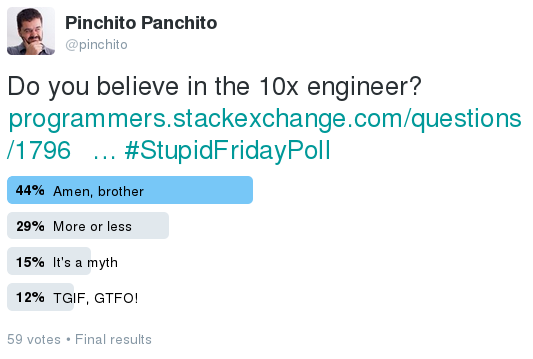

", Oil on canvas, 1872](pics/rtfm.jpg "Read The Fine Manual")

So you want to become a better developer?
No matter what your current status is,
this guide will give you a few tips to help you improve,
shown **in bold**.

Now, instead of a bland set of recommendations we have all read 1000 times by now,
I will try to make original points backed by data,
or at least by my own experience.

I will include my personal experiences in colored boxes like this one.
I will speak a lot about
[my current company](https://mediasmart.io/).

## Contents

This is a looong article,
so I suggest you go straight to the section you feel more identifed with,
from less to more experienced.

* [Start Me Up](#start-me-up).
* [Advice For The Novice](#advice-for-the-novice).
* [Get Ahead Of The Curve](#get-ahead-of-the-curve).
* [Top Of The Cream Of The Crop](#top-of-the-cream-of-the-crop).
* [Conclusion](#conclusion).

### TL;DR

If you want a short fix,
you have
[my presentation for
[Developers.nl](http://developers.nl/)
](http://slides.com/alexfernandez/better-dev#/)
online.

## Start Me Up

You want to try out the profession of software developer
for the fame and riches.
You have heard that recruiters are offering very well paid jobs,
and that all of the cool girls and boys are working in the field.
So how can you get in?

### Vocation And Devotion

First let us do some soul-searching.
Do you really want to spend your days (and some nights)
crouched upon a computer keyboard,
letting a screen (however large)
be your only contact with the world?
Do you have in you the will power to spend countless hours tracking a bug?

Software development is not an easy career to follow.
Many people have found that there are other profitable career paths,
some of them related to software development:
marketing, UX design, sales.

### Is University Worth It?

The profession of software developer here in Spain is taught in "ingeniería informática",
which is an adaptation of the french term
["ingénierie informatique"](https://fr.wikipedia.org/wiki/G%C3%A9nie_informatique).
In the US there are several universities offering "computer engineering",
whatever it is;
and some even offer [software engineering](http://computingcareers.acm.org/?page_id=12).

But honestly, any other science-related degree can be good enough.

Not even a degree may be necessary.
Many fine developers have just studied secondary school,
and maybe earned a title in vocational education and training.
Not that University is worthless;
but its value depends a lot of what you do with it.

I studied physics,
under the notion that I could learn how to program by myself,
but I would never get to learn science properly if I studied computers.
I believe I was basically right:
it was one of the few good decisions I made as a teenager.
I don't think that studying software engineering is useless;
it's probably fine for most people.

And University is not necessarily the best way to work as a developer.
So if you are doing it as an investment and getting into an enormous debt,
please reconsider.

### Bootcamps

There is an easier way to acquire some education and access our noble profession.
It is a great day for software development:
our skills are in such high demand that many cool companies are willing to take in
people that have learned the basics of our profession in 8 to 12 weeks.
They are not cheap though.
Prepare to pay about a thousand dollars per week.

Bootcamps are not just for outsiders.
I have met quite a few people that were already working as developers,
and just wanted to recycle themselves in a different field.

How can you know if a bootcamp is any good?
It depends a lot on how exigent they are.
If they are ready to accept anyone then the level is probably not very high.
If there is a selection process just to get in,
and many people are rejected,
then you can trust that it will be worth it.
Keep in mind that only hopeless cases fail to finish the bootcamp,
so any selection needs to be done *before* it starts.

### Pet Project

By far, the best way to learn a new language, framework or environment
is doing a pet project using it.
That way, the project supplies the motivation
and you only need to fill in the details.

This is also a great presentation card for a prospective employer.

I was writing a book that never materialized,
in an obscure editor called [LyX](https://www.lyx.org/).
I started [eLyXer](https://github.com/alexfernandez/elyxer)
to help me convert it to HTML;
it was very useful to learn Python.
Later on I wrote
[milliearth](https://github.com/alexfernandez/milliearth),
and then [loadtest](https://github.com/alexfernandez/loadtest).
I have learned a lot of Node.js with these two projects.

Even if your pet project gets nowhere near your original objective,
the learning experience will probably compensate for it.

**Pet projects are not just for job seekers;
they are great for developers of all levels.**

### Getting That Job

So you have decided you want a job.
How can you get it?
Julia Grace, engineering director at Slack,
[says](http://www.juliahgrace.com/blog/2015/4/9/an-unconventional-guide-for-getting-a-software-engineering-job):

> [...] find someone at the company (search their About pages, which often have links to employees’ LinkedIn, Twitter accounts, etc.) and email that person asking about the company.
> I’m not saying you should harass them, just politely reach out, indicate you’re interested in the company, ask for advice on how to apply.
> Most people want to help.

The whole article is very interesting as it reframes a lot of common points of view.

Do not throw CVs around like it's Christmas;
instead, focus on places where you _really_ want to work.
Prepare for them, check what they like,
what they looking for,
the kind of interviews that they do.
Keep in mind that it is better to apply to 5 places thoughtfully
than to 100 random companies.

Many companies will feature coding tests:
give you an assignment to complete in a set time.
From the point of view of the employer,
it's only natural that you should show how you build software
if that is what you will be doing at work!
The best tests should not take longer than a couple of hours.

At <a href="https://mediasmart.io/">mediasmart</a>
we create a coding test with five or six stages.
Several of our developers will do it beforehand to gauge how long it should take,
and keep only enough stages for an hour or so.
We send the first one by email the morning before to all candidates,
so they can do it at their leisure;
if they do not perform well under pressure,
at least they have something to show.
The rest of the stages are done under our supervision,
and they have to complete as many as possible in an hour.
It is an excellent way to test the abilities of a candidate.
There is a certain pressure on candidates,
but knowing how they perform under stress is also valuable.

Once we had a candidate that said that he had completed the first stage the night before.
When asked to produce the code, he said that he had solved it "in his head".
Bad sign!
Afterwards he was not able to complete even the first stage,
which supposedly he had finished at home.

**Do your research.
Prepare to show your work,
and how you work.**

Other companies like to place you in front of a whiteboard
and ask questions about algorithms and theoretical problems.
I distrust these tests;
they are nothing like the work you will later do.
But hey, if Google do it, then it cannot be wrong,
[right](http://www.nytimes.com/2013/06/20/business/in-head-hunting-big-data-may-not-be-such-a-big-deal.html?_r=0)?

## Advice For The Novice

So you are starting in our noble and worthy profession.
What do you need to know to survive?

### Life As A Junior

If you are a junior developer at a company,
you want to be sure that there are really good people you can learn from.
Most importantly, you want to actually learn from them.
Ask to work with someone you respect.

Be prepared to receive criticism.
It is not always easy to have someone rip through your code
and be cool about it.
Most people get emotional.
Keep in mind that knowing what you are doing wrong
is the best way to improve.

My colleague Sergio García started as a junior at 
[mediasmart](https://mediasmart.io/)
at the same time I did;
he had no professional experience.
When I started commenting on his pull requests
he probably felt that I hated him
(and that I was a cold bastard);
he got disheartened by all the negative feedback.
Nowadays he takes criticism of his code as a pro!

### Learn Strategies

While observing junior developers in the workplace,
I realized that there was a crucial difference with their more senior peers.
Faced with a hard problem,
they tend to reach a point where they say:

> I have tried everything but it doesn't work.
> I don't know what is happening.

And they give up.
While more senior people *never* give up.

It helps a lot to know that *the problem has a solution*.
All bugs can be detected and eventually corrected.
It may lie in the place that you least expect,
it may require lots of changes,
but in the end you will solve it.
Or someone else if you give up!

**Every bug has a fix, and it is within your grasp.**

As you learn to use more tools,
you will have more arrows in your quiver,
and this will help you try different approaches for problem solving.
For instance, if you want to find and fix a bug,
you can:

* follow the code,
* add traces to the code,
* google any error messages,
* use a debugger,
* comment out parts of the code,
* write an example that fails in a similar way,
* google for people with the same problem,

If it's a performance bug the strategies vary:

* add traces with time measurements,
* profile the code,
* isolate the slow part and benchmark it,
* find a micro-benchmark with the same problem,

and so on.
If you can't figure out a new strategy ask someone else.

**There is always another strategy to try out.
Don't be discouraged.**

### Ask For Help

A junior asking continuously for help is not the worst that can happen.
Oh no.
Far worse is a junior *never asking for help*.

At [my current company](https://mediasmart.io/) we are all busy people,
so we tend to let juniors on their own,
and "let them float".
This strategy does not always work.
A big, strategic development was assigned to
[Fran Barea](https://twitter.com/MandisBack),
one of the junior engineers,
to complement his work in tech support.
The project did not progress as expected;
in fact it missed all of its milestones.
I offered help with it,
and did a few joint design sessions.
But still the junior engineer was overwhelmed,
mostly by his tech support workload.
After less than a year he was offered an attractive position at University and left.
Since then, we try to keep a closer eye on juniors,
and encourage them to ask for help.

**Always ask for help if you feel lost.**

When asking for help,
quite often you don't need someone to handhold you,
or find the problem for you.
Just asking what other strategy can be tried can be enough.

### Find A Mentor

You probably know someone who is a senior developer,
and you may learn something from them.
So, why not ask them to mentor you?

I have had a few people ask me to mentor them over the last few years.
I usually say yes, of course!
However they seldom ask for anything.
That is not how mentoring is supposed to work!

A mentor is someone to ask questions to.
Or at least to tell them your plans,
and let them speak their opinion.

**Look for a good mentor, and then use them!**

By the way, you can contact me at [alexfernandeznpm@gmail.com](alexfernandeznpm@gmail.com),
if you need anything from me.
I don't know if I'm senior, but at least I'm old.

## Get Ahead Of The Curve

Now let us consider the next step.
You have been in the industry for a few years,
you want to become a better developer.

### Devotion

At this delicate juncture we must search our souls once more.
Do you have the level of devotion needed to be,
not just a regular software developer,
but a really good one?
Do you want to be at the top of your profession?
Because honestly, you do not need to be:
there are many people with an honest development job
that are happy to punch a clock and do their time.

And then there are these people who do a lot of extra effort
to look beyond what is asked from them,
and learn new things every day.

**Never despise great developers;
never despise good developers;
never despise regular workers.**

I guess you can say it shorter:
never despise other people for doing their work as best they can.

### Impostor Syndrome

Perhaps you think you are mediocre.
Let me introduce you to this little concept called
[impostor syndrome](https://counseling.caltech.edu/general/InfoandResources/Impostor),
which some say is
[not even a syndrome](http://www.slate.com/articles/business/the_ladder/2016/04/is_impostor_syndrome_real_and_does_it_affect_women_more_than_men.html).

Basically it means that you feel that you are not adequate at your work,
even though external measures say you should.
It is often felt by people of all conditions,
especially high achievers.
Albert Einstein [famously said](http://therebegiants.com/overcoming-impostor-syndrome/):

> The exaggerated esteem in which my lifework is held makes me very ill at ease.
> I feel compelled to think of myself as an involuntary swindler.

If the most celebrated physicist in the 20th century was not immune to impostor syndrome,
how can you expect to overcome it?
I recommend focusing on two things:

* First, you don't have to tell others how good or bad you *think* you are;
just tell them what you have accomplished and let them draw their own conclusions.
In time this will allow you to focus on results instead of on how good you are or are not.
* And then you can just work hard.
Don't give yourself a heart attack or spend your life on the keyboard;
just do your best at whatever you do.

Well, what if you really are mediocre?
Even if you feel you are below average,
you can improve a lot in our profession just by working hard and focusing on results.

**Give a chance to mediocre people.
Especially to yourself.**

### So Are You Good Already?

According to a popular notion,
one half of everything is below average.
Wrong!
This is only true if:

* quality can be measured,
* and it follows a Gaussian distribution.

Let us put aside the first condition for a moment.
The second condition is not just a fine point:
many important variables follow highly skewed distributions.

Let me give you just one example.
Household income is one of these highly skewed quantities.

.](pics/income-median.png "Distribution is highly skewed to the left.")

According to the quoted report by the
[UK Department for Work and Pensions](https://www.gov.uk/government/statistics/households-below-average-income-199495-to-201415),

> In 2014/15 just under two-thirds of individuals had a household income less than the
> national mean average (£581 per week).

Surprise!
Not one half below average, but two-thirds!
Perhaps developer quality is similarly skewed.

Going back to the first condition brings us to an uncomfortable question:
can we even measure developer quality?

### The 10x Engineer

Fred Brooks writes in the classic "The Mythical Man-Month":

> In one of their studies, Sackman, Erikson, and Grant were measuring  performances of a group of experienced programmers.
> Within just this  group the ratios between best and worst performances averaged about 10:1  on productivity measurements
> and an amazing 5:1 on program speed and space measurements!

This is [the original study](http://www.dtic.mil/cgi-bin/GetTRDoc?AD=AD0645438).

DeMarco and Lister found huge differences in productivity in an inter-company competition.

.](pics/demarcolistertimetocomplete.gif "Minimum is 100 minutes, average 200, maximum 900.")

See how most people are below the average?
Gradually people realized that there were huge differences in productivity between developers.

From this emerged the figure of the 10x engineer:
a person which is able to do 10 times as much work as the regular developer.

### Your "Comfort Zone"

> Why the #@&! would I want to leave my comfort zone?
> Do these people even know what "comfort" means?

Translated from [\@zezenzuska](https://twitter.com/zezenzuska/status/639350587730100225?lang=es).

There are a lot of excellent resources
about how to become an excellent developer.
I particularly like
[Angelina Fabbro's talk](https://www.youtube.com/watch?v=v0TFmdO4ZP0).
It contains excellent concrete advice, like:

* learn a new language,
* use a new framework for your next pet project,
* or read books about your profession.

A common request from workers at most companies I know is: "we want more training".
It has always amazed me:
how come companies are not willing to train their workers?
That is a cheap request to make;
in exchange they would get a better and more motivated workforce.
But quite often those requests are not met.

If your company is not giving you training,
look for it yourself.
Get them to pay for interesting courses and conferences,
or at least to give you time off so you can attend.
If they don't, consider other jobs.
But while you are there,
consider taking holidays for these activities.

**Your career is your responsibility, not your company's.**

### Trust Me, I'm An Engineer

"Engineer" is in many countries a prestigious title,
[derived](https://en.wiktionary.org/wiki/engineer#Etymology)
from latin _ingenium_ (cleverness).

* A *programmer* is tasked with writing a program,
supposedly starting with a detailed specification.
* A *developer* has wider responsibilities:
create a software system that solves a certain problem.
* An *engineer* is tasked with devising a solution to a necessity.

Not all solutions involve writing code.
Sometimes it is better to adapt an existing package,
or just to hack up a simple console script that does 80% of what we want.
And sometimes the best solution is to write some code.

But other times the best course is to delete code.
As Ken Thompson [once said](http://quotes.cat-v.org/programming/),

> One of my most productive days was throwing away 1000 lines of code.

Always remember: writing software is a means to an end,
not a goal in itself.

**Strive to create value, not just to write software.**

### Find Your Specialty

You cannot be a top developer by just being a generalist.
Luckily there are many disciplines inside software engineering.
A few of them are:

* UX,
* data science,
* security,
* scalability,
* management,
* development methodology,
* gaming,
* DevOps,
* embedded systems,
* physics simulation,
* visualization,
* quality assurance,
* mobile apps,
* machine learning,
* analytics.

Getting thrown into the wrong specialty can be very damaging.

In 2007 I joined ING Direct Spain as an analyst,
which involved a lot of technical work and some programming.
As I have told [elsewhere](2016/mib-five-years-later.md),
a couple of years later I was made a project manager,
which means that I was supposed to use an office suite
as my tool of choice,
and not code anymore.
My life was not easy from that point on.
While it is nice to know how to manage people,
resources and projects,
I'm not comfortable in a 100% managerial position.
After a couple of years I left and have done technical work since.

**Find what discipline you you would like to specialize in,
and strive to work in it.**

Your knowledge should be T-shaped:
a shallow familiarity with many disciplines,
and deep understanding of one or two.

### Get Involved In The Community

Finally, a really good way to improve as a software engineer
is to find a local community,
and get involved.
Just showing up is a great first step!
Then you can stay for a couple of drinks afterwards.
It is very rewarding to know more people that work in your field and exchange stories from the trenches.
Talking with your colleagues from work is nice,
but since you breeze the same environment it is not as interesting.

The next step is to attend a few conferences,
both at the national and international level.
This way you can broaden your circle of acquaintances:
most people are quite open at conferences
and are usually willing to speak to anyone during breaks.

Then you can try giving a talk at a local group,
and seeing if people like it.

In 2012 I approached the organizers of MadridJS to propose a talk
about Node.js and Websockets,
something I had been working on in my spare time
as part of the
[milliearth](https://github.com/alexfernandez/milliearth)
project I mentioned before.
We finally scheduled it in 2013.
All the 70 available places in Meetup were gone in about four minutes,
which goes to show how popular the subject was.
It was
[unfortunately taped (in Spanish)](https://vimeo.com/62771422).
You can see how nervous I was.
Even though I was very nervous,
it was a great experience!

## Top Of The Cream Of The Crop

Now we come to the most delicate part.
So you are finally what we may call
"a good developer".
How can you really shine?

### The Myth Of The 10x Engineer

The idea of 10x engineers is alive and well,
as shown in
[this informal Twitter poll](https://twitter.com/pinchito/status/779374657984159744).

However, there is a [huge controversy](http://www.ybrikman.com/writing/2013/09/29/the-10x-developer-is-not-myth/)
surrounding the concept.
The problem is not with the studies themselves.
The first study quoted by Fred Brooks had serious problems,
a very small sample to start with.
But those initial studies quoted above have been complemented by
[a few more](http://www.construx.com/10x_Software_Development/Origins_of_10X_%E2%80%93_How_Valid_is_the_Underlying_Research_/),
and they all point to the same direction:
there are 10x differences between the best and the worst developers.

No, the trouble lies in the new implicit interpretation:
that some engineers are *10 times more productive than the average*.
This is not upheld by any studies.
Perhaps two or three times as productive?
That is fine, and would be expected on any field.
But from there to ten times is a long stretch.

In the words of Betsy Haibel in
[Hacker Mythologies and Mismanagement](https://modelviewculture.com/pieces/hacker-mythologies-and-mismanagement):

> [The myth of the 10x engineer] plays to the hacker ego.
> Real True Hackers —
> the kind of Real True Hackers who think of themselves as some day inventing radically new tech
> — naturally identify themselves as 10x engineers amidst a sea of unimaginative clock-punching proles.

It is a great article and I cannot recommend it more.

The most interesting point in Peopleware is not that some developers perform better than others.
There is a deep conclusion in there that eludes most commentarists.
Their war games were done with couples of developers from the same company.
The performance of both devs in each team was highly correlated.

.](pics/demarcolisterteammates.gif "Teammates are highly correlated.")

But *couples in a team were not working together; they were rather competing one against the other*.
The conclusions in [the study that contains these scans](http://blog.webfoot.com/2007/02/16/demarco-and-lister/)
are interesting:

> Over and over, I keep seeing that the median time to complete a single task is on the order of 2x to 4x times the fastest, not 100x.
> This study seems to imply that a great deal of that difference is due not to the individual’s inherent capabilities,
> but rather the environment where they work.

The advice comes naturally from this refined argument about the "3x engineer":

**Look for a company where your skills can really shine.**

This includes: comfortable working space,
probably telecommuting at least part of the time,
a comfortable environment where you can take risks,
and great colleagues.

### Bring Me Problems, Not Solutions

Quite often engineers are characterized as problem-solvers:
bring me a problem and I will give you a solution.
But that is not how a real-world engineer usually operates.
Once you find the problem it usually easy to solve it.
The real challenge is in finding the problem.

Oh, somebody may come with a high-level business target.
For old-school engineers the business target might be:
let the people of this town cross this river,
or accomodate the incoming traffic for the next 20 years.
For a software engineer it can be:
keep costs below a certain mark,
or connect to a server within a latency number.

**Do not wait for other people to give you problems;
go after them for yourself.**

### Look For Help

Another great point by Betsy Haibel in
[the article quoted above](https://modelviewculture.com/pieces/hacker-mythologies-and-mismanagement):

> Myths about 10x engineers are used to make employees feel guilty or incompetent when they ask co-workers for help;
> truly qualified engineers don’t need help.

Needless to say, this is not true.
Even if you are the world's best engineer,
there comes a time when you need to talk a problem over with someone.
Not necessarily another senior developer:
juniors and people with less experience have a lot to offer in the way of fresh perspectives.

**When faced with a big challenge, share it.
Help may come from where you least expect it.**

Brainstorming sessions are great tools when used properly.

At [mediasmart](https://mediasmart.io/)
sometimes we have a serious problem that merits attention from the whole dev team.
For an hour we meet (virtually of course) and discuss the problem,
and propose possible solutions.
It is important to let everyone speak their minds.
Very often the best ideas will come from junior members of the team,
perhaps because they are not really 

### Be Ready to Resharpen Your Skills

Even if you are at the top of the game,
in our industry there are no guarantees.

After leaving ING Direct Spain,
I [co-founded a startup](http://alexfernandez.github.io/2016/mib-five-years-later.html)
that ultimately went nowhere,
but allowed me to recycle myself starting to program again.

Just look at what the tech landscape looked like five years ago.
In 2011 containers were the realm of VMWare:
Docker did not exist,
and Linux developers were busy merging container-related patches into the kernel.
Internet Explorer was the
[most used browser globally](http://gs.statcounter.com/#browser-ww-monthly-201101-201112),
and Chrome was just overtaking Firefox in the second place.
Mobile OSs were far below desktop operating systems:
both iOS and Android were below Mac OS in
[browser stats](http://gs.statcounter.com/#all-os-ww-monthly-201101-201112).
HTML5 was [being finalized](https://en.wikipedia.org/wiki/HTML5#2011.C2.A0.E2.80.93_Last_Call)
and was not yet a recommended standard.
jQuery was without a doubt the JavaScript framework of choice.
Node.js was at
[version 0.6.0](https://blog.risingstack.com/history-of-node-js/).
Meanwhile [Java 7 was just released](https://en.wikipedia.org/wiki/Java_%28programming_language%29#Versions)
but not widely adopted
(and [Oracle had just bought Sun](https://en.wikipedia.org/wiki/Sun_acquisition_by_Oracle) a year ago).
Golang was in [alpha state](https://golang.org/doc/devel/release.html),
and	[Elixir](https://vimeo.com/53221562)
was a glint in its creator's eye

If you want to have a long and prosperous career you can either look for some obscure niche
where there is no competition
(think COBOL programmers today),
or update your skills constantly.

One of my favorite stories is about a mainframe programmer
that appeared in a 70s picture along an old computer.
A magazine published a story about mainframes a few years ago,
and did a picture where he appeared by the old photo with a sad face,
in a cute reference to how mainframe programming was going the way of the dodo.
(I lost the reference to the story;
if you ever find it please
[let me know](https://twitter.com/pinchito).)

The interesting part was that the guy, now in his late 50s,
had successfully recycled and was now a freeancer telecommuting from his home,
and he was experimenting with Node.js, which was at an early stage at that time.

### Let The World Know

You want to get the word out about the awesome things you have done?
Just open a blog and try to write there regularly.
You may not get a lot of visits at first,
but you will feel more comfortable writing about technical stuff.

Taking the effort to articulate your thoughts is always good.
A developer has to write a lot of documents:
code and API documentation, technical specs,
user help, postmortems, grant applications,
to name a few.
Writing a blog will help you make these documents easier to read.

**Blogs are great to hone your writing skills.**

Another great option is a technical talk,
not only at local groups.
Conferences all around the world are eager to hear from people of all backgrounds.
Want to get the word out about that amazing project?
Just send proposals to a few CfPs (calls for proposals).
It is a great way to attend amazing events for free!

There are a few places that track such calls,
such as [Lanyrd.com](http://lanyrd.com/calls/).
Just be sure to speak at a [local community first](#get-involved-in-the-community),
then work your way up to national and then international conferences
when you feel comfortable.
Speaking at conferences is a great way to attend for free!
Well, there's the unpaid time for preparing the talk,
so your ticket does not really come for "free".
But you get the point.

The benefits go beyond attending conferences and meeting interesting people in the speakers dinner.

After my first talk at MadridJS I sent a few proposals.
Less than a year after that,
I gave an
[international talk](https://vimeo.com/121892726),
and [kept at it](http://lanyrd.com/profile/pinchito/sessions/).
Gradually I became better at it.
Right now I feel much more confident when presenting to prospective investors,
or selling a project to the CEO.

When you can speak in public with confidence,
it becomes much easier to do a presentation in front of a small group.

**Speaking at conferences is a great way to learn how to speak in public.**

Soft skills (writing, speaking)
are as important for a developer as writing good code.

### Sell Your Work

Maybe you dislike speaking about "selling"
as related to your work.
Good projects should sell themselves, right?
Wrong.
Honestly, you cannot expect others to buy your ideas if you don't sell them.

Perhaps you remember the famous sentence from Glengarry Glen Ross:
["Coffee is for closers only"](https://www.youtube.com/watch?v=QMFwFgG9NE8).
It is interesting that a movie that tried to show the inhumanity of salespeople
has become famed among their profession.
But we are not trying to sell real estate here,
and we don't want to use hardball tactics.

It is no good to make a fast sale and lose a customer.
We are in for the long run.
When making a deal,
keep in mind that in good deals both parties benefit.

**Always sell your work ethically and truthfully.
But do sell it.**

### Teach Others

There is a reason why a very accomplished professional is called a
["master"](https://en.wiktionary.org/wiki/master#Etymology_1),
which also happens to mean "teacher".
This goes beyond an Occidental tradition.
In martial arts movies great experts always have their own schools.

Teaching is the best way to learn.
And also can be an opportunity to do something different.
As [Freeman Dyson says](http://www.businessinsider.com/freeman-dyson-interview-2016-9):

> The key to having an interesting life is to always say "yes" to anything crazy.

In 2013 the good people at
[IronHack](https://www.ironhack.com/es)
invited me to give a seminar about Node.js
for their web development bootcamp.
A year later they proposed me to be a full-time teacher
for a couple of weeks,
so I took holidays at my regular job and did it.
The experience was good so I did another bootcamp.
I have made a good deal of friends,
and hired some ex-alumni.

**Be open to new things.**

## Conclusion

No matter where you stand in your profession,
you can always get better.
It just takes a bit of constant effort.

### Take The Reins Of Your Career

To really improve you need a long-term goal;
it will help you focus.

**Set yourself a goal for the next five years,
and then build a way to get there.**

Your goal should not be something too specific:
if you plan to master Angular,
in five years it might not be that interesting
(or it might not even exist).
Instead of a project, a framework or a company,
try focusing on a particular discipline.

### Acknowledgements

This article has benefited a lot from discussions with
[Alfredo López Moltó](http://xgalen.github.io/) ([mediasmart](http://mediasmart.io/)),
Fran Barea,
the good people at [Developers.nl](http://developers.nl/).

All errors and omissions are mine.

