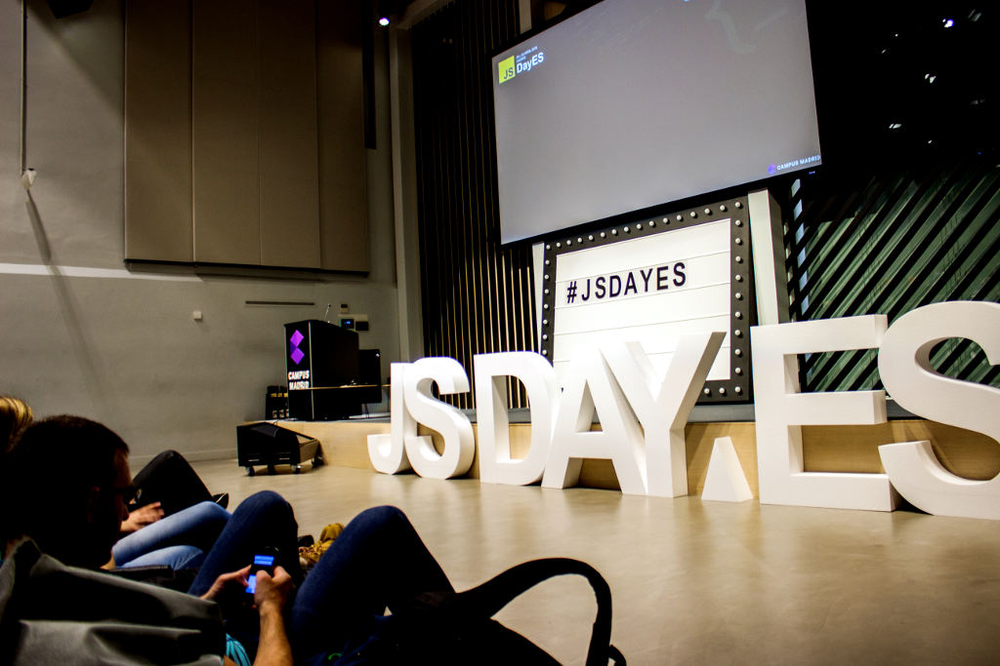

## Transparencia total

La política de las comunidades que organizamos JSDayES siempre ha sido la de **actuar con transparencia**.
No ganamos nada con ocultar datos a las comunidades a las que pertenecemos.
Por eso al organizar JSDayES 2016 publicamos lo que costaban las entradas y los patrocinios,
y por eso ahora vamos a publicar las cuentas en la web.
En este artículo quería explicar las cifras para que no queden tan frías,
además de dar algunos detalles que puedan servir a otros
que quieran lanzarse a organizar eventos de este tipo.

## ¿Nunca segundas partes fueron buenas?

Antes de nada, algunos detalles.
El año pasado organizamos la primera edición de JSDayES,
un evento comunitario que atrajo a más de 150 profesionales interesados en JavaScript a Madrid,
en mayo de 2015.

Este año algunas comunidades JavaScript de Madrid,
con ayuda de las de toda España,
nos hemos lanzado a repetir [el evento](http://jsday.es/).
Esta vez más grande: dos días, 29 y 30 de junio:
uno de unconference y otro de charlas.

Entre estas comunidades hemos llevado el peso de la organización:

* Madrid Polymer Group,
* Node.js Madrid,
* AngularJS Madrid,
* y MadridJS,

con la inestimable ayuda de Gaceta Tecnológica.

También hemos contado con
[16 patrocinadores](http://jsday.es/#sponsors),
y lo mejor: **casi 200 asistentes de toda España**.

El evento ha sido todo un éxito, al menos desde nuestro punto de vista:
hemos vendido todas las entradas,
las charlas han sido interesantes,
y los asistentes han aprendido y se lo han pasado bien.
¿Qué más se puede pedir?
Está claro: ¡cotillear los dineros!

## Cuentas

Las cuentas de cualquier evento son sencillas:
hay ingresos y gastos.
Para salir bien parados, siempre los ingresos deben estar por encima de los gastos.
Pero siempre hay detalles que explicar.

Todos los números que vamos a contar son IVA incluido salvo que se especifique lo contrario ("+ IVA").
El total con impuestos es lo que se suele ver desde fuera,
mientras que internamente se contabiliza todo sin IVA y luego se suman los impuestos.

### Ingresos

En patrocinios ingresamos €8200:

Platinum:
* [paradigma](https://www.paradigmadigital.com/): €1500 + IVA.
* [Fictizia](http://www.fictizia.com/): €1500 + IVA.
* [Kairós](http://www.kairosds.com/): €1500 + IVA.

Gold:
* [intelygenz](http://www.intelygenz.es/): €1000 + IVA,
algo más alto porque incluye presentación de empresa.
* [redradix](http://www.redradix.com/): €750 + IVA.

Silver:
* [Kaleidos](http://kaleidos.net/): €500 + IVA.

La venta de entradas nos reportó otros €5900.
En total contamos con €14100, o €14k redondeando.

### Patrocinios en especie

Así que, ¿basta con €14k para montar un JSDayES?
No tan rápido.

Algunos patrocinadores no nos dieron dinero;
en su lugar, pusieron a nuestra disposición bienes y servicios
por un valor aproximado del patrocinio publicado.
Es la mejor solución para nosotros y para ellos,
ya que nos evita tener que emitir facturas tanto a patrocinadores como a proveedores.
Fueron:

* [GFT](http://www.gft.com/): catering del evento.
* [TodoJS](http://www.todojs.com/): grabación del evento.
* [Koliseo](https://www.koliseo.com/): venta de entradas.
* [TransparentCDN](http://www.transparentcdn.com/): técnico de audio/vídeo.
* [fikstores](https://fikstores.com/es): merienda.
* [Cabify](http://www.cabify.es/): transporte.

El valor aproximado de estos patrocinios es de unos 6.000 euros.
Contando esta cantidad **los ingresos totales fueron de aproximadamente €20k**.

### Media Partners

Además de los patrocinadores contamos con unos cuantos socios que nos ayudaron en la difusión del evento:

* [Gaceta Tecnológica](http://www.gacetatecnologica.com/),
* [ticjob.es](http://www.ticjob.es/),
* [Betabeers](http://www.jsday.es/img/sponsors/betabeers.png),
* [Autentia](http://autentia.com/).

Sin ellos seguramente no habríamos podido dar la difusión adecuada al evento.
Teníamos especial interés en llegar a javascripters de toda España,
para lo que la red de Betabeers nos vino fenomenal.
Además, las aguerridas chicas de Autentia nos han legado las
[entrevistas](https://www.autentia.com/2016/04/01/jsdayes-volvemos-a-la-fiesta-de-javascript/).

### Gastos

Como asistentes tenéis todo el derecho a saber en qué nos gastamos vuestro dinero,
así que os presentamos un resumen de cuentas.
Dividido por partidas son los siguientes:

* €3300 en merchandising: entre otras cosas, el kit de asistente y las letras gigantes.
* €3600 en catering + limpieza: agua, cafés, chuches y las cerves del sábado.
* €1400 en alojamiento + transporte de ponentes.
Por suerte o por desgracia, sólo cuatro venían de fuera de Madrid.
* €1200 en comunicación: incluye notas de prensa,
y todos los gastos de difusión no cubiertos por los media partners.
* €600 en audiovisual: realización del vídeo del principio, fotos y vídeo resumen,
que usaremos el año que viene para la promoción.
* €1200 en cena + obsequio ponentes. ¡Hay que
[cuidar a los ponentes](https://twitter.com/pinchito/status/727598032074756097)!
Ponen su esfuerzo gratis, así que lo mínimo es compensarles.

El total es de €11.3k.
Añadiendo los gastos en especie sale un **total de gastos de €17k** aproximadamente.

### Beneficios

Como veis las cuentas salen con balance positivo.
¿Qué se va a hacer con estos "beneficios" de casi €3k?
En realidad las cuentas se llevan desde Aprodeweb,
una organización sin ánimo de lucro,
así que por ley **no podemos tener beneficios**.
El remanente se queda para cubrir gastos de gestión
y para uso de la organización.

Una alternativa que se nos ocurrió fue usar parte del dinero sobrante
en organizar distintos eventos desde las comunidades.
Tras pensarlo entre todos,
no nos pareció justo gastarlo en eventos que no beneficien directamente a los asistentes.
Además, tener algo de colchón nos da bastante tranquilidad a la hora de encarar futuros JSDayES,
incluso aunque no vendamos todas las entradas.

### Venta de tickets

La venta de tickets la hicimos con la plataforma
[Koliseo](https://www.koliseo.com/),
desarrollada por los organizadores de
[Codemotion](http://2016.codemotion.es/).
La pusieron a nuestra disposición a cambio de un patrocinio.
La plataforma nos hizo un gran servicio,
aunque tuvo sus problemillas debidos a la afluencia de usuarios.

La primera tanda de 20 entradas Super Early Bird,
se vendió en 2 minutos.
La segunda tanda de 40 entradas Early Bird
tardó algo más, 4 minutos.
La tercera tanda de 80 entradas normales
voló en unos 8 minutos.
Por último, la tanda final de 15 entradas cedidas por Campus Madrid
aguantaron 6 minutos.
**Un total de 20 minutos para 200 entradas**.
El _hype_ que se creó para el evento funcionó a la perfección,
ya que una de las preocupaciones de cualquier organizador es vender todas las entradas.

Pero no fue sin contrapartidas.
Como sabe cualquiera que se dedique a la escalabilidad,
la concurrencia es la pesadilla de los desarrolladores.
Eso ocurrió durante la venta de las entradas:
ante tal volumen de usuarios interesados hubo algunos problemas de concurrencia,
y muchas quejas de usuarios insatisfechos.
Podríamos pensar que la causa primera de su insatisfacción fue quedarse sin entrada,
pero también hay que cuidar los aspectos técnicos.

Los desarrolladores de Koliseo respondieron muy bien al feedback,
aunque no tuvieron tiempo de implementar las mejoras planeadas a tiempo.
Eso sí, esperamos que su plataforma esté preparada para próximos aluviones
gracias a nuestras pruebas de carga.

## Agradecimientos

Dicen que:

> De bien nacidos es ser agradecido.

Y qué mejor momento que ahora.

### Organizadores

JSDayES somos:

* Raquel Benito [@Pand_Ra](https://twitter.com/Pand_Ra) (directora del evento),
* Javier Vélez [@javiervelezreye](https://twitter.com/javiervelezreye),
* María Sánchez [@chimarys](https://twitter.com/chimarys),
* Félix Zapata [@felixzapata](https://twitter.com/felixzapata),
* Juan Fran Alcántara (juanfran.ag@gmail.com),
* Isabel Cabezas [@isabelcabezasm](https://twitter.com/isabelcabezasm),
* Alejandro Fernández [@pinchito](https://twitter.com/pinchito) (vuestro humilde servidor).

Todos somos voluntarios,
o sea que dedicamos nuestro tiempo personal a estas movidas
(contando con la buena voluntad de nuestras respectivas empresas, claro).

En una interesante charla en el Campus Madrid,
[Javier Esteban](https://twitter.com/javimonsalupe)
recomendaba entre otras cosas elegir un director de evento.
Así que entre todos elegimos a **Raquel Benito directora del evento**,
ya que desde el año pasado ha llevado el peso de la organización.
Ha sido bastante útil tener una cabeza visible,
aunque al ser todos voluntarios nos hemos tenido que llevar bien para hacer las cosas:
el modelo top-down no funciona como en una organización tradicional.

Ha sido un verdadero placer trabajar con todos ellos.

### Comunidades

Aparte de las comunidades que organizamos directamente JSDayES,
nos han ayudado muchas otras comunidades más o menos relacionadas con JavaScript de toda España:
con la difusión de la Call for Proposals,
creando _hype_ para la venta de entradas,
y por fin destacando a sus miembros a compartir con nosotros el evento.
No quiero dar una lista porque se me olvidarían un montón.

Uno de nuestros objetivos es **reunir a las diferentes comunidades de javascripters**
que hacen cosas interesantes en toda España,
conocernos entre nosotros,
y crecer juntos.
Creemos que lo hemos conseguido,
aunque en futuras ocasiones nos gustaría tener más espacio
y más visitantes de fuera de Madrid.

### Personal

En el evento hemos contado a tiempo completo con grandes profesionales:

* Pablo Almunia [@pabloalmunia](https://twitter.com/pabloalmunia) y
Jorge Cayuela [@jcayuelam](https://twitter.com/jcayuelam)
lo dieron todo en la
[mesa de sonido](https://twitter.com/pinchito/status/728510829495263233).

* Fran Moya [@Franxo06](https://twitter.com/Franxo06)
y Ana Mejón [@Anutxa](https://twitter.com/Anutxa)
fueron más allá del cumplimiento del deber en el
[audiovisual](https://twitter.com/hashtag/jsdayesfiles).

Además, no seríamos nada sin los _otros_ voluntarios:

* Fernando Sanz [@fsanzv](https://twitter.com/fsanzv) y
Borja Godoy [@gody11](https://twitter.com/gody11) nos ayudaron todo el día.
* Wilder Olmos [@WilderOlmos](https://twitter.com/WilderOlmos) y Cristina Rodríguez,
[voluntarios en la sombra](https://twitter.com/pinchito/status/728311926770569217).

También hemos contado con la ayuda en la preparación de Patricia López,
Celia Tortosa y Cristian Nirchio de Campus Madrid.
Muchas gracias a todos.

### Ponentes

Hubo nueve valientes que vinieron a contarnos su charla;
[podéis repasarlas](https://www.youtube.com/playlist?list=PLCE-eme9nf8HlYrIIM7XA1vTzxMeJ519k)
en **nuestro canal de YouTube**.
Gracias por dedicar vuestro esfuerzo.
Y esperamos que pese a todo os valiera la pena.

En total recibimos 80 propuestas, de entre las que tuvimos que elegir sólo ocho.
(Enrique Amodeo vino por invitación a dar la _keynote_, o charla de inauguración.)
Entre las 72 restantes hemos rescatado unas cuantas propuestas muy interesantes para los Meetups locales,
y al resto os animamos a presentar las charlas en un un grupo local y pulirlas.

Los que no habéis enviado nunca una propuesta,
¡animaos!
Pese al esfuerzo que representa,
es una gran oportunidad.

Quiero añadir una nota especial sobre la **ausencia de ponentes femeninos**.
Somos muy conscientes de este problema en nuestra comunidad:
No en vano tres de los siete organizadores son mujeres.
Intentamos difundir el Call for Papers entre la mayor cantidad posible de organizaciones femeninas,
entre ellas
[Women Tech Makers](http://wtm.gdgmadrid.es/) o
[adaJS](http://ada.barcelonajs.org/).
Conseguimos unas cuantas propuestas femeninas, de las que seleccionamos una,
que finalmente hubo que cancelar por problemas de agenda.
El año que viene lo intentaremos de nuevo;
y volveremos a intentar liar a las estupendas javascripters que hay por ahí a que compartan lo mucho que saben.

### Asistentes

A todos los que nos habéis ayudado comprando una entrada y viniendo a nuestro evento,
ya sabéis en qué nos hemos gastado vuestra pasta.
Hemos tomado nota de lo que funcionó bien para repetirlo y ampliarlo,
y lo que no fue tan bien
(por ejemplo la venta de entradas)
para mejorarlo en próximas ediciones.
Esperamos contar con vosotros.

Entre los asistentes tuvimos un **16% de representación femenina**,
que no está mal si lo comparamos con otras conferencias parecidas,
pero sigue siendo penoso.
Es otro aspecto donde tendremos que seguir trabajando.
Hay que decir que, por lo que nos ha llegado,
el trato a todo el mundo (hombres y mujeres) fue respetuoso
y no tuvimos que poner en práctica el
[código de conducta](http://www.jsday.es/codigodeconducta.html).
Así que, ¡chicas, animaos! Os trataremos bien :)

## 2017: más y mejor

Para el año que viene ya estamos maquinando qué hacer.
Claramente el Campus Madrid se nos ha quedado pequeño,
y nos gustaría llegar a 400 o 500 asistentes.
También nos gustaría contar con un **track de ponentes internacionales**,
junto al tradicional en español.
[¿Qué te parece?](https://twitter.com/pinchito/status/739957161242021888)

La _unconference_ fue una experiencia muy positiva,
y a título personal yo me lo pasé genial.
¡Para el año que viene se queda!

Seguro que tienes alguna idea al respecto.
Envíanos tus sugerencias a [hola@jsday.es](mailto:hola@jsday.es).

