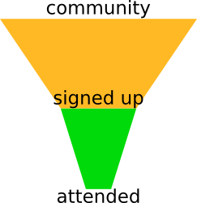

](pics/attendance.jpg "View of Attendance at a Movie in Permanent Recreation Building")

## The Problem Statement

A common issue you hear from community organizers is:
a lot of people will sign up for an event,
but when the day comes, very few of them actually show up.

As co-organizer of [MadridJS](http://www.meetup.com/es-ES/madridjs/),
one of the largest tech communities in Spain,
I know what they are talking about.
A couple of times
([1st](http://www.meetup.com/es-ES/madridjs/events/225252829/) and
[2nd](http://www.meetup.com/es-ES/madridjs/events/226037202/))
we have had more than 250 people sign up,
but then less than 80 have showed up.
At [Node.js Madrid](http://www.meetup.com/es-ES/Node-js-Madrid/)
which I also help organize,
we have pretty much the same story.
Attendance figures for us are usually between 30~50%,
although some communities report going as high as 80%.

### Negative Motivations

When asked, people give multiple excuses for not showing up:
too much work, last-minute meetings, family obligations are the most common.
But just about the same happens when events are organized on a weekend
when there are no work-related pressures.
In the best case, going to an event means devoting a lot of energy to an activity
which is not directly a money generator.
In the worst case, many people in tech communities are introverts (me included),
so meeting other people in person can be stressful and not a general experience.
A talk is more or less anonymous, but for some,
being in the same room with a lot of people is not nice.

What are your personal experiences?
I have personally signed up for events in other communities
and then when the day comes, laziness has got the best of me.

### Proposals

During the last [Community Leadership Summit Madrid](http://clsxmadrid.es/index.en.html),
many proposals were discussed by community organizers.
Among them:

* Announce meetups as late as possible, so there is less chance of unexpected issues.
* Do not stream or record the event, so people are forced to go.
* Make people pay a token amount (e.g. €1) when signing up, then spend the proceedings in drinks after the event.
* Make people pay some money (from €1 to €5), but give it back to those that actually show up; spend the rest in drinks.
* Take attendance at every event, and expel from the community people that fail to come more than three times.

Notice a common pattern?
Most of the proposals are negative;
many have the common theme of punishing people that sign up but don't come.
In other words: use the stick instead of the carrot.

There are also practical issues with certain ideas.
Having people pay for events means that Meetup.com (or any other payment processor) will keep a percent of the proceedings.
It will also exclude those without a suitable payment option,
apart from people for which €1 is relevant;
for professionals it may not be much,
but for e.g. students it can be a big deterrent.

Taking attendance is something that we in MadridJS used to do,
because our regular venue at the time forced us to;
but have now changed to a new place where they don't require us to check a list of names.
We have had many offers from nice venues where they required strict attendance,
and it has always been a dealbreaker.
Devoting time to things that do not benefit the community is not how we want to spend our efforts.

## A New Point of View

Let us approach the situation as an Internet-era issue.

So, let us a

Recuerdo en el CLSxMadrid cómo la gente insistía en penalizar a los que se apuntaran y no vinieran. Yo tengo una visión un tanto distinta del asunto (que por cierto, a ver si escribo en el blog un día de éstos). Yo lo veo como un funnel de conversion: primero consigues que la gente se apunte, y luego tienes que conseguir que vengan. Si se quedan en el primer paso, es que algo estás haciendo mal y tendrás que intentar mejorar la conversión. Penalizar a los que vienen me parece tan útil como penalizar a los usuarios que entran en tu web, meten algo en el carrito y luego no compran. "¡Les cobramos un euro!" es lo que diría un jefe de planta del Corte Inglés, pero en ningún caso un iluminado del comercio electrónico.

Por eso no soy partidario de cortar la asistencia en ningún caso, y si hay que limitarla, hacerlo en el acto. No sé si os habré convencido; por si acaso vamos a aplicar las otras dos medidas.

### Attendance Funnel

You have a pool of possible users,
you want them to do two successive tasks:
first sign up, and then attend your event.
Therefore you set up a _funnel_ and count the number of users that go from each step to the next,
measuring the _conversion ratio_.

The situation is very similar to an e-commerce shopping cart:
users come to your site,
some of them add things to the cart,
and then a few actually buy anything.

The problem now becomes: how do you increase the conversion ratio?

### Proposals Revisited

Now let us review the proposals from CLSxMadrid with this new mindset.
Imagine that to increase your sales,
you decide to charge €1 to everyone that uses your shopping cart,
and then give it back to those that actually buy anything.
Do you think it would be successful?

That is the kind of strategy that a stuffy department-store manager
might come up with,
but to anyone with half a clue looks really poorly thought.

### Dying From Success

So, what happens if your event is so successful that the venue fills up?

Nosotros no vamos a controlar asistencia, ¿y vosotros? Me imagino que tampoco, así que en el peor de los casos tendremos que dejar pasar a todo el que venga hasta contar 204. Si cortamos asistencia quiere decir que la gente no va a poder apuntarse y no vamos a controlar cuántos hay apuntados, no que luego no vengan: si son un poco avispados se presentarán igual. No me parece justo dejar pasar a un espabilao y no a uno más previsor.

Ahora vamos a pensar qué pasa con los que vengan de más y se quejen porque estaban apuntados de los primeros, bla bla. Se les avisa de que vengan pronto, por si las moscas, y listo: estar apuntado no garantiza plaza. ¿Y si se enfadan? Bueno, si vienen más de 204, yo personalmente les devolveré a todos los que vengan de más el doble de lo que hayan pagado por la entrada. Ah, que es gratis; entonces ¿qué exigís, criaturas?

No creo que me agredan, al menos en nuestra comunidad son muy majos y comprenden las cosas bien. Si los javeros suelen ir a los Meetups con puños americanos entonces me comprometo a pagarles una birra a todos los que se queden fuera, si no me pegan.

