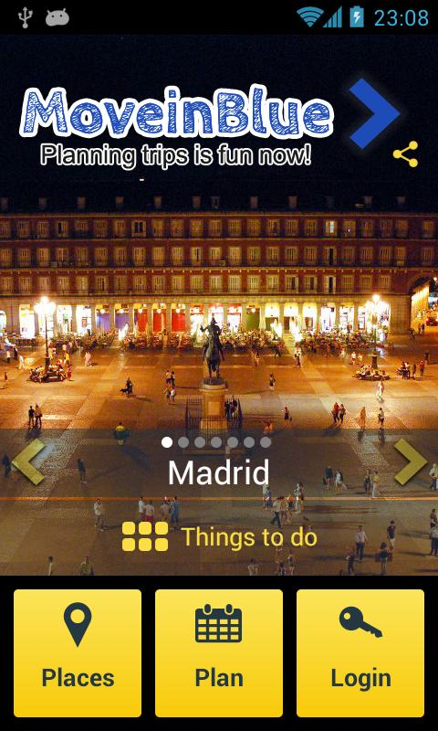

Five years ago I was working as a project manager at ING Direct, a largish Spanish bank.
In the worst of the mortgage crisis the bank decided to dispense with my services,
and things were not looking good.
This is the story of how I founded a company,
did not get rich,
and in the process got to be much happier.

Allow me to condense it in a few lesons along the way,
and I promise to avoid the common place.

## Breaking the Bank

When in 2007 I was hired at ING Direct as an analyst
it felt as something of a success.
Since 2005 I had worked as a "consultant" for the banking sector in a few different projects.
The financial sector in Spain has long employed "consultants",
which are actually employees in disguise,
to avoid bloating their workforce with lowly technicians.
Now I held a technical position that was more or less like a coordinator.

A couple of years later I was told that I was now a project manager,
so I finally needed not touch any code any more.
This, needless to say, made me very unhappy.
The Spanish IT sector has long clung to a fantasy hierarchy
which was perhaps used somewhere in the 60s,
but which has nothing to do with the realities of software development.
It goes like this:

* programmer,
* analyst-programmer,
* organic analyst,
* functional analyst,
* project manager,
* and finally manager.

Whatever "organic analysis" is outside of Chemistry is beyond me,
despite having held the title for about six years;
at one company it was hilariously shortened to "Anal. Organ.",
which might have been a Freudian slip but for their utter ignorance of the English language.
Separating analysis from programming was always a bad idea,
and now it is suicide.
These absurd titles still infest job boards in Spain and elsewhere, however.

Around that moment the bank, in its infinite wisdom,
decided to externalize all development work.
There was no way to continue being an analyst since that position was being phased out.
In retrospect, I could have realized at that point that my future would not be very bright,
and look for greener pastures.
But I plodded on as a project manager,
juggling an ever increasing number of projects as the technical manager for financial cards.

In 2010 I was commended by the bosses after a very successful integration.
My 2011 Q1 review was "good enough";
that was the literal result on a sliding scale from "bad" to "excellent".
But alas, at a large company you are never safe;
if [Zach Holman is not irreplaceable](https://zachholman.com/posts/fired/),
who is?
Certainly not me.
I had never been able to keep my big mouth shut about things I did not like,
and the boss of my boss did not appreciate it.
Oh, I had many bosses:
the company was supposed to have a flat hierarchy,
while in practice there were 8 steps in the ladder
from the humble bottom feeder (me) up to the CEO.
Not bad for a company with around 1000 employees.

Particularly I did not like the long hours,
the long faces when I left for home after only 9 hours,
the half-hour lunch breaks at my table eating a sandwich
(in the vain hope of leaving earlier),
the unpaid on-call perennial duty
or the also unpaid visits to the company to deploy a project at 4 AM.
Having a two-year-old daughter somehow seemed more important than all that,
and yet I could only see her during dinner and just before she went to bed
(some days not even that).
Esther, my partner and mother of our daughter,
was also exhausted after taking care of her all day long.

In mid-2011 I had the gall of requesting reduced working hours,
as was my right as the father of child under 8.
That same week I received a disastrous Q2 review by my direct boss.
Right after that the head of IT and operations (seven steps above myself)
called me to his office and let me know that I no longer had a future at the bank.
Parents with reduced working hours are part of a protected class in Spain,
so they could not fire me directly.
I negotiated a generous severance package
(one year salary)
and left the bank.

This happened almost exactly five years ago.
At that point I had a little child,
a mortgage and no job.
But it tasted like freedom.
Once again I could pursue a career as a software developer!

There was a serious problem, though.
After four years at the bank,
mostly dealing with obsolete technologies and managing projects,
any development skills that I might have once possessed were blunt and rusty.
Luckily I had run an interesting
[Python side project](https://github.com/alexfernandez/elyxer)
and had kept reading technical books.
But still there was a significant gap with the state of the art.
There is a lesson here, a perverse version of technical debt.

> If you want to follow a career as a developer,
> your pay as a manager needs to compensate for the obsolescence
> that you are incurring.

## Minding My Own Business

Around that time my good friend
[Diego Lafuente](https://twitter.com/tufosa)
had told me about a little project of his:
a travel startup he wanted to create
together with a few of his colleagues at
[Fedit](http://fedit.com/):
[Mauricio García Corredor](https://es.linkedin.com/in/mauriciogarciacorredor/es)
and
[Íñigo Segura](https://es.linkedin.com/in/inigosegura),
and with funding provided by Íñigo and by our business angel Juan Carlos Merino.
After a few meetings they convinced me to join as CTO.
Our mission: revolutionize how we all plan our holidays.
Simple enough, right?

I conferred with Esther and told her that I really, really wanted to join MoveinBlue
as the full-time, unpaid CTO.
She handled it like a champion.
The severance package provided for a nice cushion that bought me one year time to make it work.
So I set to it.

The idea was to build a planner tool where users could plan tourist activities.
With travel agencies and travel guides in decline,
where will all those people learn what to do once they arrive to their destination?
How will they find and book all the fun things they can do?
We had the solution:
we would build a holiday planner to find and track their activities.
We had the silly idea that travelling once in a while
meant we could enter this market knowingly.
I think we have learned this lesson.

> Knowing about travel does not mean you know about the business of travel.
> Or put another way, buying a product does not mean you know how to sell it.

At its peak, MoveinBlue had more than 10 people employed full time,
most of them as freelancers.
This included five developers.
The stack was not revolutionary,
but it was not bad either for its time:
a single-page application (or SPA) and two mobile apps,
all of them using a PHP backend.
We successfully experimented with things like:

* an all-cloud solution with Amazon AWS;
* modern development practices,
including having several test suites;
* continuous deployment,
which has become a prerequisite for all my development work.

During my time as CTO at MoveinBlue I learned PHP and JavaScript,
and soon afterwards I was working in our Android app.
I was not earning any money,
but my job ended up being quite valuable professionally.
There is another lesson there,
a corollary of the first one.

> Be sure to work in valuable stuff,
> or be sure to make enough money to compensate.

### What Marketing Is About

Although development work did not proceed as fast as we would have liked,
we did not have stability issues.
The trouble was elsewhere.

Having never developed a product,
I believed that "marketing" was synonymous with "advertising".
Nothing farther from the truth.

The closest we were to actual marketing at MoveinBlue was the bland segmentation
we received from a consulting company that helped us define our product:
both genders, aged 25 to 40, heavy Internet users.
No wonder, Sherlock!

Properly done marketing is something else.
Our capitalist partner Merino is a successful businessman in several profitable ventures.
He gave us a master class in early 2012:
first you find a niche market where your product works,
and where people is eager to give you money.
Then you make yourself known in that market,
get people there to use your product,
and then convince them to give you money.
If necessary, you tailor your product to that particular use.
Then you find another niche market and repeat.

But alas, his advice came in too late.
We were too busy building our product so we did none of that.
Actually we tried to contact some niche markets that might have found our planner useful:
divers, conference organizers, or bikers.
With zero success.
It was too little, too late.
There is a lesson there.

> Good technology does not a good product make.
> If your product does not serve the needs of its intended users,
> what technologies it employs will not matter.

### Bad Business

This brings us to the second broken leg of our strategy.

US entrepreneurship lore states that successful startups need both an inventor and a businessman:
Hewlett and Packard, Wozniak and Jobs, Gates and Allen.
In our case the four founders were engineers,
either by training or by trade.
As it happened we were all very busy creating a product and building a platform.
Despite the advice of Merino, nobody was minding the business.

I studied Physics but have always worked as a developer.
Being the person with most experience I was leading the development.
We were all worrying about the functionality and the design of our website,
and not with actually selling anything to anybody.
We never worried about earning our first €10.
This is an important lesson.

> Focus on earning your first €10,
> instead of just increasing your user base blindly.

The urge to get users quickly has worked for some high-profile cases,
but is not how most companies make their money.

One thing we did right was keeping tabs at the competition.
Yes, even in the niche non-existing market of holiday planners there was competition,
and plenty of it:
we kept track of at least ten different companies
building similar products to ours.
If I needed convincing for the next lesson, 
this experience provided for it amply.

> Ideas are not worth a dime.

Several groups around the globe had the same idea as we,
and a few of them built products very similar to ours.
Some even got millions of dollars of financing,
whereas we had some pocket money and much enthusiasm.
But none succeeded at the holiday planner.
I am not sure why;
maybe people dislike planning their holidays after all.

To this day there is a huge untapped market there waiting for the picking:
tourist activities are a disorganized mess which lives for the most part offline,
and which would benefit greatly from a broker that helped small providers sell to strangers.
But nobody has cracked this golden nut yet.

### A Good Ride

During the first half of 2012 we were busy writing and releasing our mobile apps,
which again failed to revolutionize the way we travel.
We had an external company to help us build the Android version,
and Diego did the iOS port.
They were nicely done but were not widely used.

At some point in the summer of 2012 we ceased operations.
There have been many studies about the reasons for startup failures.
Do not be fooled;
the main cause is that the team simply gets bored of trying to make it work,
and so it was in our case.

I still think that,
had we continued iterating in our product design,
we might have eventually gained traction.
After all we did that work on the website,
and our final design was miles ahead of our first try.
But sadly we did not have the resources to iterate our mobile apps,
which are a natural fit for a holiday planner:
how many of you take your laptops to your holidays?

Since then Íñigo has tried several times to pivot and make our little venture work out of his own pocket.
He has even sold several travel activities,
but failed to gain enough traction.
In the next few months we are ceasing operations completely.

### Founding or Funding

When I told people about the fate of our little company,
many people were relieved to learn
(in typical Spanish fashion)
that I had invested "only time", and not fronted any money.
How they think that money is more important than time is beyond me.
The lesson I learned is:

> A year of your limited time on Earth is worth more than any money.

Unless of course you end heavily in debt and having to repay it for several years,
in which case you are again wasting huge amounts of your life.

### Meeting People

I have mentioned that we worked with several freelancers,
and many of them are great professionals that I remember fondly.

* [Jesús Díaz](http://leals.com/) did a splendid job with us several months.
* Edoardo Batini worked for us less time but just as intensely.
* [Juan Searle](https://twitter.com/jsearle)
and [Jonathan Martín](https://twitter.com/mibarbaroja)
helped us build a kick-ass website.
* [César Domínguez](https://twitter.com/csar4231)
worked with us on two really cool Android and iOS apps.

I had very interesting conversations with all of them.
In fact, a big part of my freelancing work has been done for people I met while at MoveinBlue.
On several occasions I have worked for people I had previously hired.
This is an important lesson for me.

> Working at a company makes you money,
> but being an entrepreneur allows you to meet interesting people.
> Interesting work often comes from interesting people you know.

## Freelancing

After we gave up on MoveinBlue I sent my CV to a few big companies like Amazon or Google,
and was promptly ignored.
I have to recognize that I felt something akin to a vindication
when I was recently contacted by Amazon to join them in their new Madrid dev center.
As I tell recruiters,
right now I am not interested in a job change,
but it is nice to know that my skills are appreciated.

So I started interviewing for several job offers:
a few startups and consulting companies.
I actually got two job offers,
but ultimately both involved working at a bank as consultant,
which felt like a step back.
Again I conferred with Esther and told here that I was not interested in those jobs.
She encouraged me to wait for something better,
since we were not yet (too) pressed for money.
That is exactly what I did.

Diego and myself started freelancing for
[Kimia](https://kimia.mobi/es),
a marketing company,
doing web and mobile development.
Reprising our roles in MoveinBlue,
I wrote an Android SDK while Diego did the iOS port.
Due to our limited experience we had to charge them a pitiful fee of €25/hour each.

This lasted for only two months.
Our client was quite satisfied with our job,
but we could not take another project.
Diego soon found a job at
[Tui Travel](http://www.tui.com/),
where his experience at MoveinBlue was quite valuable.

I have never stopped doing freelance work:
when I signed a full-time contract with MediaSmart Mobile
a few months later we agreed that I could do work on the side.
Right now I do not depend on it and can pick interesting projects.
Also, I now charge a fee of at least €80/hour,
which is not bad for Spain.

## High Scalability

As an avid reader of
[High Scalability](http://highscalability.com/),
I yearned to work at a company that actually had something to scale.

In September 2012 I attended
[DeNormalised NoSQL](https://skillsmatter.com/conferences/1252-denormalised-nosql-roadshow-2012#program),
organized by the excellent
[skills matter](https://skillsmatter.com/),
out of my own pocket.
Many speakers told us how they used NoSQL databases
to serve an ever-increasing number of requests per second.
[Theo Hultberg](https://twitter.com/iconara)
explained how his organization processed 25 thousand requests per second,
or 25 krps.
Then
[Malcolm Box](https://twitter.com/malcolmbox)
told us how his tiny company had won the contract
for the UK version of the X Factor,
where users had to vote using their mobile phones
for their favorite artist.
During a two-hour window every week they had to deal with peaks of 50 krps,
and then take down all servers again;
this would not have been possible without Amazon AWS.
The venue came down in applause.
I was hooked.

Around that time I had started using Node.js for a side project,
and it was lots of fun.
Soon after my stint doing mobile apps at Kimia
I was peddling my freelance business for Node.js,
and was being relentlessly turned down.
Then I went to an interview at MediaSmart Mobile with the same intention;
surprisingly I was offered a full-time job.
The company was using Node.js to process an astounding 2 krps!
And thus I joined the company in January 2013.

Since then we have doubled our revenue every year.
This year I had the privilege of giving
[a talk at FullStack London](https://skillsmatter.com/skillscasts/8156-fullstack-devops),
also at
[skills matter](https://skillsmatter.com/),
where I told the audience how we have scaled up to 325 krps,
written critical parts of our infrastructure in
[Erlang](http://alexfernandez.github.io/2016/nginx-balancer.html)
and [Go](http://alexfernandez.github.io/2016/golang-adventures.html),
and in general have had a blast.

Before MoveinBlue I was highly allergic to JavaScript.
After using jQuery to build our website I realized there was something
to this strange little language,
and with time I have come to appreciate it.
In March 2013 I gave [a talk at MadridJS](http://www.meetup.com/es-ES/madridjs/events/105582592/)
which was attended heavily.
A few years later I am the organizer of both
[MadridJS](http://www.meetup.com/es-ES/madridjs/)
and
[Node.js Madrid](http://www.meetup.com/Node-js-Madrid/),
have helped organize
[two editions of JSDay](http://jsday.es/),
have got to teach JavaScript at
[a bootcamp](https://www.ironhack.com/es/curso-programacion-web),
have given talks
[in a few countries](http://lanyrd.com/profile/pinchito/),
and have got to meet many interesting people in the JavaScript community.

## Conclusion

I learned a lot during our run at MoveinBlue.
I wanted to tell the story as I remember it,
before I forget it any further.

Recently I deleted my LinkedIn account,
tired of continuous spam and
(let us say it this way)
their careless handling of passwords.
Let this article serve as a CV of sorts
for this stage of my career as an entrepreneur.

### Acknowledgements

Many thanks to Íñigo, Mauricio and Diego
for reading a draft of this document
and making many valuable suggestions.
Three of the lessons come straight from Diego.

