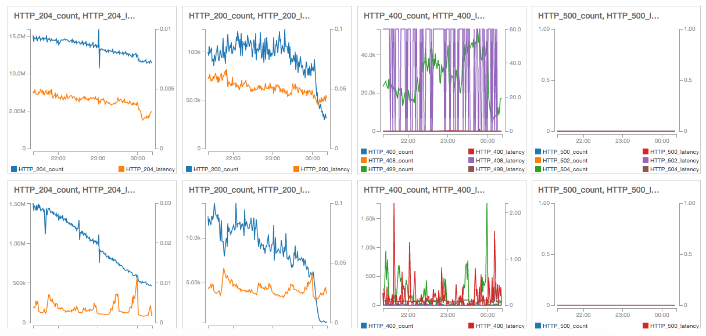

](pics/balancer.jpg "Maria Spelterini at Suspension Bridge")

## ELBs Can Be Too Expensive

Amazon Balancers (or Elastic Load Balancers, in their terminology)
are awesome things:
they are able to process many thousands of requests per second
without issues for weeks on end.
If you have used Amazon AWS with some kind of high availability setup,
you have probably used an ELB.

At
[MediaSmart Mobile](http://mediasmart.es/)
we have had peaks of over 300 krps
(300 thousand requests per second),
and all have gone through an ELB.
Without a hitch.
Continuously (at night, traffic never goes below 100 krps).
But they were increasing our costs too much:
it got to the point where 25% of our total Amazon bill
went to pay the ELBs.

### How We Got Here

Our business at
[MediaSmart Mobile](http://mediasmart.es/)
is very peculiar:
we receive an insane amount of traffic from several ad exchanges,
and use about 1% of it to make bids for the marketing campaigns of our clients,
using the [OpenRTB protocol](http://www.iab.com/guidelines/real-time-bidding-rtb-project/).
The remaining 99% is discarded.
We _need_ this amount of unused traffic because our customers tend to have peculiar campaigns:
campaigns marketed at a smallish number of user IDs,
geolocalized to several areas of a country,
or trying to get clicks and downloads from targeted users.
We use increasingly sophisticated algorithms to sift through this traffic
and find where our campaigns work best.

About a year ago we were using 40 frontend servers
(large c3.2xlarge machines with 8 processors),
and the cost was killing us.
So we came up with a clever solution:
write an Erlang filter which decides which requests are more likely to be used by the frontends,
and filters out the rest.

This resulted in a dual architecture with two ELBs:
one to receive traffic from exchanges and deliver it to the Erlang filters,
and another to receive the filtered traffic and send it to the frontends.


### ELB Costs Out of Control

This was working great for a long time,
until our costs started to skyrocket.
The good folks at Amazon helped us analyze our monthly bill,
with a surprising result:
we were being charged twice for our ELBs!

Amazon [helpfully states](https://aws.amazon.com/ec2/pricing/#Data_Transfer):

> Data processed by Amazon Elastic Load Balancing will incur charges in addition to Amazon EC2 data transfer charges.

Let us see what that really means.

The first charge is
[assigned to the ELB](https://aws.amazon.com/elasticloadbalancing/pricing/)
itself: currently it is $0.008 per GB of data processed in US East.
The second is [hidden inside Data Transfer](https://aws.amazon.com/ec2/pricing/#Data_Transfer):
$0.01 per GB received.
Why is this small charge of less than two cents per GB relevant?

See, Amazon advertises that traffic _into_ EC2 is free,
which is important when you are receiving a lot of requests per second;
while traffic _out of_ EC2 costs a small amount.
But this is not the case for ELBs.
The OpenRTB protocol is optimized to minimize traffic when you do not bid:
an HTTP response of 204 No Content is usually enough,
which means sending just a few bytes.
But requests are largish (a request size of 1.5 KB can be normal),
and combined with 18 billion requests per day it results in
over 27 TB per day, or more than 0.8 petabytes per month.
At $0.018 per GB the total cost is about $15K.
Going from free to $15K just in ELB-related traffic costs is not nice.

The solution was obvious:
remove the first ELB handling the majority of the traffic,
and connect the exchanges directly with our filters.
So we got approval from our boss to go for it.
This time for real!

### Previous Experiences

This was not the first time that we had tried removing the first ELB;
in fact I had wanted to do it for a very long time.
See, ELBs are awesome in what they do,
but you are a bit blind about what they are actually doing.
For starters, it is not easy to get access logs;
you can request that they be sent to S3,
but it is cumbersome and you have little control about the log format.

A nice feature of ELBs is that you get a lot of shiny graphs for traffic, latency, etcetera in Cloudwatch.
They are distributed by [HTTP status code](https://www.w3.org/Protocols/rfc2616/rfc2616-sec10.html).
However, there is not enough granularity:
there is only 2XX, 3XX, 4XX and 5XX.
In our business a 200 OK is very different from a 204 No Content:
the first means we are bidding, the second that we pass on that bid offer.
Therefore we did not know how many bids we were making
unless we looked it up in the exchanges themselves,
or did a lot of fudging around.
Same for 400 Bad Request, 401 Unauthorized or 404 Not Found:
they have very different semantics,
and are the symptoms of disparate problems.


There are other minor annoyances with Cloudwatch:
for instance, you cannot mix latency and number of requests in the same graph.
The reason is that you cannot show the sum of one metric mixed with the average of another.
Default behavior is to show the average of each metric,
which is not helpful with number of requests since they need to be summed.
But the worst part was the sensation of losing control of your own systems.

Together with our CTO Guillermo Fernández
we had done a few experiments to remove the main ELB,
with mixed success.
The immediate question is:
how do you balance traffic without an ELB?
The trick is to have an entry in the DNS registry that points to a set of different IP addresses
corresponding to your servers.
The DNS registry will reorder them randomly so that every client sees an arbitrary server first.
Since each client is supposed to contact the first IP address in the list,
the load is distributed between your servers. 
This is known as [Round-robin DNS](https://en.wikipedia.org/wiki/Round-robin_DNS)
and is very easy to do with Route53 (or indeed any DNS provider):
just enter a list of IP addresses as an A record.
Combined with a short TTL (time to live) of a minute,
exchanges should start sending traffic to the filters quite fast.

That part was easy.
The hard part was getting the filter servers to handle the load directly.
Apparently the ELB was doing some kind of "smoothing" the connections,
and dealing with some misbehaving exchanges that opened and closed connections very fast.
Our Erlang filters would handle the load for a few seconds,
then start losing traffic and finally collapse altogether.

To smooth the traffic we set up an HAProxy in each filter server.
It is an amazing product that works very well for some large Internet services
such as Stack Overflow.
It would then redirect the traffic to the Erlang server.
But this scheme did not work well:
the filter servers worked for a minute or two
before collapsing in a miserable pile.

We increased the number of open files/sockets,
enabled TIME_WAIT connection reuse and a few other tricks,
to no avail.
Guillermo (who now is an Erlang wizard) even implemented a connection pool,
in case the servers were running out of connections.
Nothing worked.
Also, tests were a bit disruptive since we had to run them directly on production,
so at the time we just waited to have a bigger motivation.
That moment had now come.

## Nginx to the Rescue

This time we had a new strategy:
use Nginx as a reverse proxy.

### About Nginx

Nginx needs little presentation.
According to the
[Netcraft web server survey](http://news.netcraft.com/archives/2016/03/18/march-2016-web-server-survey.html)
it is the second most popular web server for active sites,
and it may eventually overtake Apache on the top million busiest sites.

What many people ignore is that it is also a top-notch
[reverse proxy](https://help.ubuntu.com/community/Nginx/ReverseProxy):
a server which redirects requests to other servers,
or to other ports inside the same server.
It handles HTTPS beautifully (something which HAProxy did not do until recently),
and the configuration is even simpler.

### Experimenting Live

We set up our filter servers with Nginx and our custom Erlang code.
We could reuse our existing filters with a small change:
instead of Erlang listening on port 80 directly,
Nginx would listen on port 80 and redirect to Erlang listening on a different port.

One issue with our experiments is that ELBs
need to be "preheated" when receiving a lot of traffic.
Otherwise it stutters and rejects most of the requests,
and this can go on indefinitely under heavy load.
If you have many krps you need to ask AWS to "preheat" the ELB.
Our fear was that the ELB would "cool down" if we diverted all requests
for a long time.
Our AWS technical contacts assured us that our ELBs would not "cool down"
at least for five minutes,
so this is the time frame that we had for our experiments.

Each individual experiment went as follows:
change the DNS,
wait for some seconds until exchanges start sending traffic,
see if it breaks,
revert the DNS to point to the ELB.
Then start hunting in the logs to find out where it broke and why.

We had to fine-tune a few parameters in Nginx
because we were running out of file descriptors so fast:
set
[`worker_rlimit_nofile`](http://nginx.org/en/docs/ngx_core_module.html#worker_rlimit_nofile)
to about 10k, and
[`worker_connections`](http://nginx.org/en/docs/ngx_core_module.html#worker_connections)
to 9k.
Then we had to set
[`multi_accept`](http://nginx.org/en/docs/ngx_core_module.html#multi_accept)
to `on`; and make sure to
[`use`](http://nginx.org/en/docs/ngx_core_module.html#use).
[`epoll`](http://nginx.org/en/docs/events.html).

But still our Erlang servers were dying after a few minutes.
The final touch was enabling the old connection pool in Erlang;
after that point everything was running smoothly.
Success!
We now had our own balancer capable of handling 300 krps and more,
at a fraction of the cost.
But there were a few details that needed some polishing.

### Orchestration

Amazon offers Auto Scaling Groups to create or destroy servers as needed.
With a custom DNS-based load balancer you will need to orchestrate your servers yourself.
Fortunately we have been using a custom orchestrator for a few years.
The reason is that the default Auto Scaling algorithm sucks.

Auto Scaling decides whether to create or destroy instances based solely on their _current_ load:
if the average load is above the high watermark (e.g. 90%) then a new instance is created,
and if it is below the low watermark (e.g. 80%) then an existing instance is destroyed.
Nice, right?
The problem is that, when removing instances,
we do not want to use their _current_ load,
but the _projected load_ that they would have with one less instance to hold the traffic.
Otherwise the remaining instances may go above the high watermark instantly,
so we would need to create a new one,
which would again set the load below the low watermark,
and so on.
This kind of ping-pong is very bad for the servers and for the bottom line.

Example: we have two servers at 50% load.
Removing one would leave us with a 100% load for just one server,
which means that a new server is soon created.
After a while the two servers go back to 50% load,
and so on.

This is assuming that servers are perfectly linear,
which is often not the case, so the situation can be a bit better.
Still, the only solution is to set a ridiculously low watermark such as 40%.
With 20 servers, going as low as 40% means that we could do the job
with just half of them at 80% load.
The result is a lot of wasted CPU time.

Our custom orchestrator reads the instances present in an ELB,
checks their load and decides if it has to create a new server or destroy one.
In the first case an instance is created and then added to the ELB;
in the second the last instance is destroyed,
which automatically removes it from the ELB.
The high watermark is checked against the _median_ server load,
which by the way works better than the average load.
The low watermark is checked against the median server load
*with one less server*.
This allows us to use a low watermark of 80%.

Example: now we have three servers at 65% load.
The orchestrator shares a load of 3*65%=195% between two servers,
computes that each would have to handle a 97.5% load
which is above the low watermark,
and decides against destroying one.

For the new Round-robin DNS balancer,
We just had to adjust our orchestrator to read the instances from the DNS,
add the IPs of any new instances to the DNS registry,
and remove the IPs of terminated instances.

### Nice Graphs

Along the path we had lost those nice Cloudwatch graphs.
Even if we had the statistics for each server,
and we could show them on a nice graph,
we now had a variable number of servers.
But we did not even have statistics for each server.
So there were in fact three challenges:

* get statistics for each server,
* aggregate them across all servers,
* and show them on a nice graph.

### Lua Logging

The first part can be done with a bit of [Lua](https://www.nginx.com/resources/wiki/modules/lua/)
magic.
To use Lua with Nginx you can install the
[OpenResty](https://openresty.org/en/) full package.
Since we are using Ubuntu I preferred to use the package `nginx-extras`,
which is a version of Nginx with all plugins compiled in.
I used this
[three-year-old post](https://blog.cloudflare.com/pushing-nginx-to-its-limit-with-lua/)
by Matthieu Tourne (then at CloudFlare) as a guide,
modifying it heavily.
For every HTTP status code Nginx now reports the number of requests it has received
and the sum of the time it took to answer all those requests.

In Nginx a bit of Lua code needs to be added to log everything using Lua,
and then a page that returns the aggregated results.
It is a good idea to add a random nonce to the logging URL
to obfuscate it slightly,
although there is probably no harm in exposing it.
In our case this results page is `log_2l8J2yjy1ofgZQOj`.
You can create your own nonce on Unix with this simple command:

    $ head -c 12 /dev/urandom | base64

The relevant excerpts of the `site.conf` file are:

```
upstream filter {
        server 127.0.0.1:8787 max_fails=3 fail_timeout=1s;
        keepalive 1024;
}
server {
    listen 80 default_server;

    access_log off;

    default_type text/plain;
    lua_use_default_type on;

    location / {
        proxy_pass http://filter;
        log_by_lua '
            local logging = require("logging")
            local request_time = ngx.now() - ngx.req.start_time()
            local status = ngx.status
            logging.add_plot(ngx.shared.log_dict, status, request_time)
            ';
    }
    location /log_2l8J2yjy1ofgZQOj {
        error_log /var/log/nginx/lua.log warn;
        content_by_lua '
            local logging = require("logging")
            ngx.say("{")
            local all = logging.get_all(ngx.shared.log_dict)
            for key, value in pairs(all) do
                ngx.say("  \\"", key, "\\": ", value, ",")
            end
            ngx.say("  \\"end\\": 0")
            ngx.say("}")
            ';
    }
}
```

[//a]: # (This just to pair quotes")

And the logging library used here is an adaptation of
[Matthieu Tourne's](https://github.com/mtourne/nginx_log_by_lua/blob/master/logging.lua),
[accessible here](logging.lua).

[//b]: # (This just to pair quotes')

The result of accessing the server at `http://[ip]/log_2l8J2yjy1ofgZQOj` is something like this:

```
{
  "200-count": 546862089,
  "200-sum": 24516089.094544,
  "204-count": 73303303847,
  "204-sum": 400708215.84511,
  "400-count": 4281,
  "400-sum": 1585.2189953327,
  "408-count": 10223,
  "408-sum": 613933.97300029,
  "499-count": 299392002,
  "499-sum": 80143503.20016,
  "500-count": 16746,
  "500-sum": 183.11798548698,
  "502-count": 32735207,
  "502-sum": 4441155.2488055,
  "504-count": 96454,
  "504-sum": 5815348.7010462
}
```

This particular server has served up to now more than 73 billion requests,
most of them 204 as expected.
Given that the server has been up for 38 days,
it has served almost two billion requests per day.
Just the 204 requests have collectively taken 400 million seconds to process,
or 12.7 years;
it results in a little over 5 ms per request.

Note that these timings are for _latency_, not for total processing time.
The filter server consumes almost no CPU time itself on each request,
or Nginx would not be able to serve so many requests.
The same happens with the Erlang filter or the eventual frontend servers.
That is the magic of event-driven processing!
(Note: while both Nginx and Node.js are event-driven by default,
in Erlang it is just an option;
the prevailing paradigm for concurrent programming is
[message passing](http://erlang.org/doc/getting_started/conc_prog.html).)

With logging in place,
the load on our filters goes about 30% to Nginx and 70% to the filter.
This means that we are using about 43% more filter servers,
which is not a bad tradeoff: it represents much less than $2k,
for a functionality that used to cost more than $10k.

### Monitoring

Then we had to aggregate data across all servers.
No problem:
just take the list of IPs from the DNS registry using the Route53 API,
then invoke each one and get the number of requests per status code,
and aggregate them.
With a little Node.js code it was done in a breeze.

The next challenge was storing the data somewhere to graph it.
There was really no reason to ditch Cloudwatch:
it is a very reasonable time-series database
with nice graphing capabilities.
We could just aggregate the stats from all servers every minute
and write them to Cloudwatch,
just adding a line of Node.js code to the existing logging code.

One advantage of aggregating number of requests and latency every minute
is that now we can show both on a graph at the same time.
Combined with the new Cloudwatch dashboards we now get this nice page.



Apart from global monitoring,
all servers have to be individually monitored.
In this case we had to check if they were still alive
and otherwise remove them from balancing.
The best way is to publish a NOP (_No OPeration_) URL
that can be called from the outside and returns a 200 OK if the server is 100% operative.

If the server does not answer in time,
it is removed from the DNS registry.
This can be nicely integrated with the global monitoring code
and use the removal from the orchestrator.

### Other Modifications

We have also had to move our HTTPS certificates to Nginx,
which deals with encryption beautifully.

### Cost Reduction

With all these modifications we reduced our costs about 20%.
So Amazon has lost a chunk of cash;
you might think that our account manager would be sad.
But in reality he has helped us a lot in the process,
and our technical contacts at Amazon have followed through.

You see, when costs are out of control
you usually start shopping around if some other provider
can sell you the same stuff cheaper.
It is not as if Amazon AWS is the only game in town.
A happy customer is much less likely to look at the alternatives.

This cost reduction has allowed us to open more traffic in the US
and grow our business,
which is what a healthy company usually does.

## Conclusion

ELBs are amazing.
If you are handling a moderate-to-high amount of traffic,
say below 100 krps,
they are easy to set up and great to operate.

But Nginx is equally amazing,
very configurable and cheap to operate.
If you are willing to replicate some components,
the result may be even more impressive than the original ELB.

