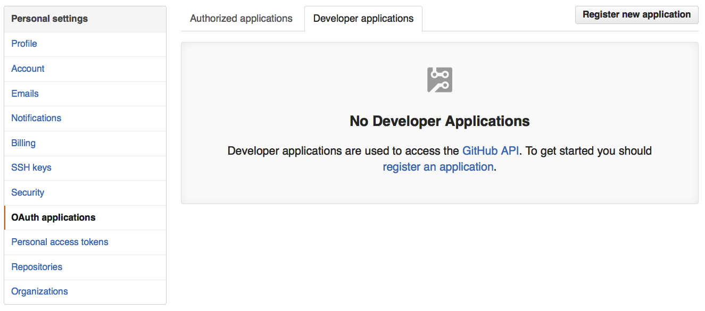

](pics/deployment.jpg "Vintage Franz Zajizek Astronomical Clock machinery")

As you may know I work full time for MediaSmart Mobile,
but I also work as a freelancer for other organizations.
Usually as a scalability consultant,
although I also work in other areas
such as continuous deployment.
This gives me the opportunity to know other interesting projects,
and quite often to use cool new products.

If you are new to continuous deployment
you may want to get
[some background](http://alexfernandez.github.io/2012/continuous-deployment.html)
before you read this article.

## The Project

My friend [Diego Lafuente](https://twitter.com/tufosa)
asked me to help him in
[TaxiTime](http://taxitime.com),
an ambitious global taxicab aggregator from
[HotelBeds](http://www.hotelbeds.com/home).

### Continuous Deployment

As always, the first and most important part of a software project for me
is to set up continuous deployment,
which ensures that the developers can just do their thing,
while the tools worry about testing and integration.
(Of course you have to set up testing and integration yourself at least once;
but then you let the tools repeat as needed.)

In general, when we are writing code we want to see the result of our work
as soon as possible.
There are a few strategies to achieve this goal:
we may deploy to an integration environment where we test everything,
or (only for the brave) deploy straight to production.
In our case there is a team of developers writing code in GitHub,
and creating pull requests against a development branch.
When a pull request is accepted it must be integrated into the branch,
then tested locally and finally deployed to the integration environment.
Deployment to production only happens when there is a new release ready.

In general I am a fan of deploying straight to production,
since it gives the team an agility that is both exhilarating
and rewarding.
But I admit that it carries a burden that not all organizations
are prepared to accept.
In particular, breakages of a web interface must be dealt with urgency.
Many people are more comfortable deploying to an integration environment,
doing a manual revision and then deploying to production.
This was the case in TaxiTime.

The tool has to notify the team how the tests and the deployment went.
On a breakage, it must allow re-running the tests.
As a plus, it should run the tests not only on the main branch,
but also on any proposed pull requests.

### Choosing our Tools

What choices did we have?

I am the author of a humble
[deployment package](https://www.npmjs.com/package/deployment),
which we use in MediaSmart Mobile with certain success.
But alas, it lacks a GUI:
every new project therefore needs to be setup from the command line,
which can be cumbersome.

I had a serious case of GUI envy.
But the options were not attractive.
Travis-CI for private companies is
[expensive](https://travis-ci.com/plans),
and installing a
[Ruby](https://github.com/travis-ci/travis-ci)
package locally was not in the plans.
Plus, I am bothered beyond measure by terminology;
Travis has "Continuous Integration" in the title,
which is little more than
[an intermediate step](http://alexfernandez.github.io/2012/continuous-deployment.html)
on the way to CD.

And now for the elephant in the room.
I have long followed [Jenkins](https://jenkins-ci.org/)
from a distance,
but it is a
[Java](https://github.com/jenkinsci/jenkins) mastodon,
probably more suited to heavier workflows.
And again there is that CI in the title.

### Meet StriderCD

Some time before, Juan Carlos Delgado (CTO of llollo.com)
told me in a private conversation that he was using
[StriderCD](http://stridercd.com).
I liked two things about it very much.
First, that it had "Continuous Deployment" in the title.
Second, it is written in Node.js.
It is thus that it won my heart even before I saw it in practice.
I am glad to say that it has not disappointed in practice.

Diego was kind enough to let me play with this new toy for his project,
and of course I (being a responsible freelancer)
would only bill the project for these hours if we found that StriderCD was a good fit.
So I started installing and configuring it.

## StriderCD Overview

I am not going to write a guide on how to install and use Strider;
there are
[very good resources](https://futurestud.io/blog/strider-getting-started-platform-overview)
out there,
starting with
[the Strider homepage](https://github.com/Strider-CD/strider#overview).
I will just give a very broad overview of how Strider works,
and then tell you about our experience.

### Continuous Deployment, the Strider Way

Strider integrates closely with many code repositories:
[GitHub, Bitbucket and Gitlab](https://github.com/Strider-CD/strider#additional-configurations).
Every time there is a change in a watched repo,
it can be configured to run a test suite,
and if everything goes well carry out a deployment.

There is a very nice dashboard, shown below,
to control multiple projects.


For every project a number of
[plugins](https://github.com/Strider-CD/strider/wiki/List-of-Plugins)
may be enabled,
which carry different tasks:
deployment for different languages,
sending email,
running a local or remote deployment
are a few of them.

](https://futurestud.io/blog/content/images/2015/06/strider-plugin-1.png)

The part of the deployment is not really solved by Strider,
especially for a sophisticated distributed deployment.
It just allows configuring a local task (using the Custom Scripts plugin),
or a remote deployment (with the SSH plugin).
If you want to deploy on a dynamic set of machines
you have first to create a script to select the relevant servers and contact them,
and then invoke that script from Strider.
Since you probably have such a script somewhere,
even if you are doing manual deployments,
it is a nice lightweight approach.

## StriderCD in Practice

The immediate goal is to set up an integration environment,
where code is deployed every time that a change is made on the repository.

### Install Strider

The [installation](https://github.com/Strider-CD/strider#running-on-infrastructure)
was a breeze:
basically download StriderCD from the [repo](https://github.com/Strider-CD/strider)
and use `npm`:

    npm install

To run in a local server it is best to configure a native task,
be it Upstart or systemd.
And now the fun begins!

### Use a Cute Server Name

For a local server, the
[defaults](https://github.com/Strider-CD/strider-github#required-configuration)
are probably fine.
But you want a server everyone can access,
like with Travis.

First you have to expose your Strider server using a DNS name,
e.g. stridercd.taxitime.com.
You can also use an IP address and the default port 3000,
but that is ugly;
with little effort you can use
[Apache](https://www.digitalocean.com/community/tutorials/how-to-use-apache-http-server-as-reverse-proxy-using-mod_proxy-extension)
or
[Nginx](https://www.nginx.com/resources/admin-guide/reverse-proxy/)
to redirect connections for the Strider DNS name to port 3000 of the same machine.
As you can see in this Nginx configuration,
it is very easy:

```
server {
    listen 80;
    server_name stridercd.taxitime.com;
    location / {
        proxy_pass http://127.0.0.1:3000;
    }
}
```

From that point on,
you can access your Strider server as
[http://stridercd.taxitime.com/](http://stridercd.taxitime.com/).

### GitHub Integration

In our case we are using GitHub private repositories.
StriderCD uses [webhooks](https://developer.github.com/webhooks/)
to be notified when there are changes on the repository.
This [GitHub integration](https://github.com/Strider-CD/strider-github)
is thus a vital point,
and it was the first issue that I met.

The idea is, like in Travis-CI,
to authenticate using OAuth2 so that Strider
can set up the webhooks for you.
With a third party server they have already done the integration for you.
But for a private application you have to do the integration yourself,
and it is not trivial.
The idea is that once you authenticate with GitHub,
you have to be redirected to your local Strider server.
So you need to create the app in GitHub.

This is done in the settings page:


And click on "OAuth Applications", then go to the tab "Developer applications":



When you click on "Register application" you should see a screen similar to this:


When you use your personal settings,
Strider will only be visible to you.
If you want everyone in an organization to be able to authorize Strider
then you will need to use the "Organization settings"
that can be found below your "Personal settings":


Enter a custom name (say, stridercd-taxitime)
and the URL
(in this case [http://stridercd.taxitime.com/](http://stridercd.taxitime.com/))
you will get an application ID and an application secret,
which are then used to
[configure StriderCD](https://github.com/Strider-CD/strider-github#required-configuration).
Also be sure to tell Strider what its URL is with the `SEVER_NAME`.
The environment variables should look something like this:

```
export SERVER_NAME="http://stridercd.taxitime.com"
export PLUGIN_GITHUB_APP_ID="abcdabcdabcd"
export PLUGIN_GITHUB_APP_SECRET="defgdefgdefgdefgdefgdefgdefgdefgdefgdefg"
export PLUGIN_GITHUB_API_DOMAIN="https://github.com"
export PLUGIN_GITHUB_API_ENDPOINT="https://github.com/api"
```

Finally, pay attention to the
[list of known issues](https://github.com/Strider-CD/strider-github#known-issues-with-githubcom).

## Weird Stuff

But the road was not all smooth.

### Variables

I first opened
[a pull request](https://github.com/Strider-CD/strider-github/pull/59)
to use the server name.
This was not used, just a misunderstanding on my part.
But the truth is that I had to go look at the source code to understand how it worked,
and how it was supposed to work.

### Being Admin

Of course you need to be an admin of the projects you want to deploy,
because otherwise Strider cannot add webhooks to it.
But when you are not admin you were greeted by an odd message.

I opened a
[GitHub issue](https://github.com/Strider-CD/strider-github/issues/60)
which was answered almost immediately,
and then offered a
[pull request](https://github.com/Strider-CD/strider-github/pull/61)
to improve the error message,
which was accepted also immediately.

### A Poltergeist

The weirdest issue of them all was when we could not access
the server.
Fernando Sanz solved it by using Node Inspector on the Strider process,
which left us all flabbergasted.
In the end it was just an environment variable that was shadowing another.

## MediaSmart

The experience was in general quite good,
given that continuous deployment is an advanced technique
that requires a lot of integrations between spinning wheels.
And what is even more important,
the customer (in this case Diego and his company)
were happy with it.

So we are replicating it in MediaSmart,
with a bigger, more complex set of projects.
This task is being done by our new recruit Alfredo López Moltó.
So far we have set up a few projects,
and are on the way to full Strider integration within the next few weeks.

## Conclusion

StriderCD has all of the advantages of modern continuous deployment tools,
but without the baggage that some of them carry.
It also has a few sharp corners,
so be careful!

This project would not have been possible without Diego Lafuente,
Juan Carlos Delgado or Fernando Sanz;
my gratitude goes to them all.

