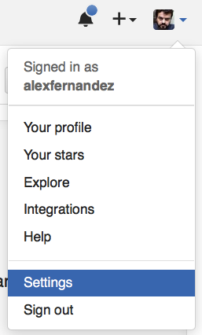
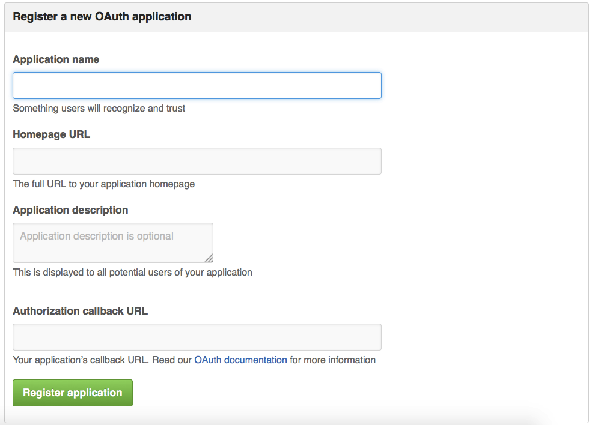

](pics/attendance.jpg "View of Attendance at a Movie in Permanent Recreation Building")

As you may know I work full time for MediaSmart Mobile,
but I also work as a freelancer for other people.
Usually as a scalability consultant,
although I also work in other areas
such as continuous deployment.
This gives me the opportunity to know other interesting projects,
and quite often to use cool new products.

If you are new to continuous deployment
you may want to get
[some background](http://alexfernandez.github.io/2012/continuous-deployment.html)
before you read this article.

## The Project

My friend [Diego Lafuente](https://twitter.com/tufosa)
asked me to help him in
[TaxiTime](http://taxitime.com),
an ambitious global taxicab aggregator from
[HotelBeds](http://www.hotelbeds.com/home).

### Continuous Deployment

As always, the first and most important part of a software project for me
is to set up continuous deployment,
which ensures that the developers can just do their thing
and see the results in almost real time.
I am the author of the humble npm package
[deployment](https://www.npmjs.com/package/deployment),
which is used in MediaSmart Mobile with certain success.
But alas, it lacks a GUI and has therefore to be setup from the command line,
which can be cumbersome.

I had a serious case of GUI envy.
But the options were not attractive.
Travis-CI for private companies is
[expensive](https://travis-ci.com/plans),
and installing a
[Ruby](https://github.com/travis-ci/travis-ci)
package locally was not in the plans.
Plus, I am bothered beyond measure by terminology;
Travis has "Continuous Integration" in the title,
which I consider to be
[an intermediate step](http://alexfernandez.github.io/2012/continuous-deployment.html)
on the way to CD.
I have long followed [Jenkins](https://jenkins-ci.org/)
from a distance,
but it is a
[Java](https://github.com/jenkinsci/jenkins) monster.
And again there is the CI in the title.

### Meet StriderCD

Some time before, Juan Carlos Delgado (CTO of llollo.com)
mentioned to me in a private conversation that he was using
[StriderCD](http://stridercd.com).
I liked two things about it very much.
First, that it had "Continuous Deployment" in the title.
Second, and this won my heart, it is written in Node.js.

Diego was kind enough to let me play with this new toy for his project,
and of course I (being a responsible freelancer)
would only bill for these hours if StriderCD fit the need.
So I started installing and configuring it.

I am not going to write a guide on how to install and use Strider;
there are
[very good resources](https://futurestud.io/blog/strider-getting-started-platform-overview)
out there,
starting with
[the Strider homepage](https://github.com/Strider-CD/strider#overview).
I will just give a very broad overview of how Strider works,
and then tell you about our experience.

## StriderCD Overview

Our first question should be:
what concrete problem is Strider supposed to solve for us?

### Continuous Deployment, the Strider Way

In general, when we are writing code we want to see the result of our work
as soon as possible.
In our case there is a team of developers writing code in GitHub,
and creating pull requests against a development branch.
When a pull request is accepted it must be integrated into the branch,
then tested and finally deployed.

### GitHub Integration

StriderCD uses [webhooks](https://developer.github.com/webhooks/)
to be notified when there are changes on the repository.
This [GitHub integration](https://github.com/Strider-CD/strider-github)
is thus a vital point.
There are also guides for integration with
[other git services](https://github.com/Strider-CD/strider#additional-configurations).

The idea is, like in Travis-CI,
to authenticate using OAuth2 so that Strider
can set up the webhooks for you.
But in this case you have to do the integration yourself,
and it is not trivial.
See, the idea is that once you authenticate with GitHub,
you have to be redirected to your local Strider server,
and this is where things get hairy.
With a third party server they have already done the integration for you.
Here you need to create the app in GitHub,
and if you are creating a private server
you do not want to make it public and appear in the directory.

## StriderCD in Practice

The immediate goal is to set up an integration environment,
where code is deployed every time that a change is made on the repository.

### Install Strider

### Use a Cute Server Name

For a local server, the
[defaults](https://github.com/Strider-CD/strider-github#required-configuration)
are probably fine.
But you want a server everyone can access,
like with Travis.

First you have to expose your Strider server using a DNS name,
e.g. strider.myproject.com.
You can also use an IP address and the default port 3000,
but that is ugly;
with little effort you can use
[Apache](https://www.digitalocean.com/community/tutorials/how-to-use-apache-http-server-as-reverse-proxy-using-mod_proxy-extension)
or
[Nginx](https://www.nginx.com/resources/admin-guide/reverse-proxy/)
to redirect connections for the Strider DNS name to port 3000 of the same machine.
As you can see in this Nginx configuration,
it is very easy:

```
server {
    listen 80;
    server_name strider.myproject.com;
    location / {
        proxy_pass http://127.0.0.1:3000;
    }
}
```

From that point on,
you can access your Strider server as
[http://strider.myproject.com/](http://strider.myproject.com/).

### GitHub Developer Application

Now you have to make GitHub know that there is an OAuth2 application there.
So you go to your settings:



And click on "OAuth Applications", then go to the tab "Developer applications":


When you click on "Register application" you should see a screen similar to this:



When you use your personal settings,
Strider will only be visible to you.
If you want everyone in an organization to be able to authorize Strider
then you will need to use the "Organization settings"
that can be found below your "Personal settings":


Enter a custom name (say, strider-myproject)
and the URL
(in this case [http://strider.myproject.com/](http://strider.myproject.com/))
you will get an application ID and an application secret,
which are then used to
[configure StriderCD](https://github.com/Strider-CD/strider-github#required-configuration).
Also be sure to tell Strider what its URL is with the `SEVER_NAME`.
The environment variables should be something like this:

```
export SERVER_NAME="http://strider.myproject.com"
export PLUGIN_GITHUB_APP_ID="abcdabcdabcd"
export PLUGIN_GITHUB_APP_SECRET="defgdefgdefgdefgdefgdefgdefgdefgdefgdefg"
export PLUGIN_GITHUB_API_DOMAIN="https://github.com"
export PLUGIN_GITHUB_API_ENDPOINT="https://github.com/api"
```

Then you need to start S

Finally, pay attention to the
[list of known issues](https://github.com/Strider-CD/strider-github#known-issues-with-githubcom).

## Weird Stuff

### Variables

I first opened
[a pull request](https://github.com/Strider-CD/strider-github/pull/59)
to use the server name.
This was not used, just a misunderstanding on my part.
But the truth is that I had to go look at the source code to understand how it worked,
and how it was supposed to work.

### Being Admin

Of course you need to be an admin of the projects you want to deploy,
because otherwise Strider cannot add webhooks to it.
I opened a
[GitHub issue](https://github.com/Strider-CD/strider-github/issues/60)
which was answered almost immediately,
and then offered a
[pull request](https://github.com/Strider-CD/strider-github/pull/61)
to improve the error message,
which was accepted also immediately.

### A Poltergeist

The weirdest issue of them all was when we could not access
the server.
Fernando Sanz solved it by using Node Inspector on the Strider process,
which left us all flabbergasted.
In the end it was just an environment variable that was shadowing another.

## Conclusion

StriderCD has all of the advantages of modern continuous deployment tools,
but without the baggage that some of them carry.
It also has a few sharp corners,
so be careful!

This project would not have been possible without Diego Lafuente,
Juan Carlos Delgado or Fernando Sanz;
my gratitude goes to them all.

