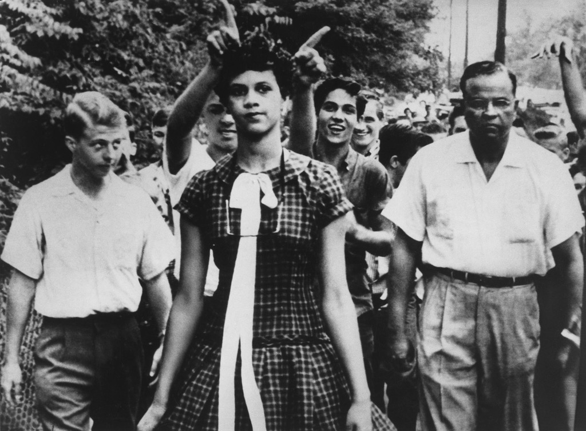

## The Moneys

After finishing an exhausting third edition of
[JSDayES](http://2017.jsday.es),
it is time to publish the books so that they can be audited by you,
the community.

### Tickets

This last edition was a resounding success,
with more than 600 attendees.
Paid tickets were distributed as follows:

* 225 paid the full price of €80,
* 56 more used a 20% off discount for a total of €64,
* 96 bought reduced tickets (€20/€16),
* 51 super early bird (€25),
* 100 early bird (€50).

The remaining attendants did not pay directly:

* 60 sponsor tickets,
* 34 speakers,
* 18 volunteers,
* and 4 organizers.

For a grand total of 644 attendants.

Total income from tickets is almost €30k,
which comes out as €28k + €1800 commission.

### Sponsorships

All in all we counted with 22 sponsors,
that have provided a total of €23,950
(which we will round and abbreviate as €24k).

Many sponsors also paid in kind.
For instance paying for speaker trips

The estimated combined value of these payments is €11.5k.

for a grand total of €35.5k.

### Venue

### Speakers

### Final Balance

So in the end we thought.

An effort of this magnitude has many variables,
and not all of them are known until after it has ended.
Our internal spreadsheet has more than 60 different concepts,
and the total budget was around €65k.
A difference of €1000 is less than 2% of the total.
Keep in mind that many concepts are not known in advance:
speaker flights,
speaker dinner,
number of sponsors
(the last one entered in the week before the conference).

We kept 
party (we kept this one open so we could 

## Some Notes

Beyond money,
a 600+ people conference has many interesting aspects.

### Talks And Speakers

We cannot be more satisfied with the talks for this year.
You can see the scores given by attendants in the
[schedule](http://2017.jsday.es/#schedule).
Average score is around 4.5,
while in 2015 it was 3.5.
Therefore we have improved a lot!

### Code Of Conduct

We have been notified of a couple of violations of the
[code of conduct](http://2017.jsday.es/codeofconduct.html),
both related to a couple of speakers that made lewd comments.
They were both notified,
and both immediately apologized.

We are happy to report that there were no incidents reported among attendants.
Next year we will have to translate the code of conduct to English!

### Diversity

This year we had around 25% female speakers:
8 out of a total of 32 talks were by women,
alone or in tandem.
Better than last year (0 female speakers!),
but still below what we would like.

These brave women were not chosen just because they were women;
their talks were in general as well received as the rest.
The [average talk score](http://2017.jsday.es/#schedule)
was 4.3,
slightly below the global average of 4.5
but well within the margin of error.

We have not quantified the percentage of female attendants,
but it should be well above 10%.

We had a lot of foreign speakers in the international track.
There were also at least two South American engineers in Spanish talks,
which were well received.
Next year we would also like to increase the number of talks by foreign-born engineers,
also in the national tracks.

The aspect that we are most proud of is geographical diversity.
Only 12 out of 32 talks (37%) were Madrid-based;
another 13 were from international speakers;
and the remaining 7 were from Spanish speakers coming from outside Madrid.
Next year we will strive to reach out even more.

Wait, it gets better.
In a quick show of hands,
more than half the attendees were coming from outside Madrid.
So we succeeded in making a lot of communities gather around JSDayES,
strenghten our ties and learn together.
This helps us dispel the culture of
"doing just a big one-day meetup".

### Volunteers

We received applications from 13 volunteers;
in the end only 12 were able to make it,
2/3 of which were women.
They did an excellent job throughout the conference.

Corus volunteers were also present in all rooms recording the audio and video.

### Venue

This is perhaps the single issue that has generated more complaints.
We were well aware that the Pablo VI conference center is outdated and in need of reformation;
but even the brand new room upstairs (where the international track was held)
was a big disappointment,
as sound was very deficient and there were very few electric plugs.
WiFi was also not working well.
Its biggest advantage was price: for less than €11k we had 1.5 days.

A good conference center in downtown Madrid is around €20k/day.
Since people are demanding it.
It is more than €9k above what we paid this year.

### Catering

The second most disappointing aspect of the conference was food.
Not everyone complained:

In our defense, we used the same provider as last year,
which was plentiful and very well valued by attendees.

### Organization

This was not a generalized complaint,
but some commenters felt that we the organizers were overwhelmed.
They don't know half of it.

For next year,
professional conference management is a must.
This means at least €6k.

### Community

We speak a lot about "community".
What is it exactly?

For the first year the "community" was just a gathering of communities from Madrid.
In 2016 we reached around and attracted many people from all Spain.
Finally, this year local attendees were less than half.

## JSDayES 2018

So, we have our homework set for the next edition.

### Increased Budget

The numbers are clear cut:
€9k for a better venue,
€3k for better catering,
and at least €6k for professional organization.
So next year the total budget would increase to at least
€64k + €18k = €82k.

### Ticket Price

To support these improvements we will probably have to increase ticket prices,
from €80 to an estimated €120.
Total: €18k, which divided by 600 attendees comes out at €30 per attendee,
right?

Wrong!
We will strive to keep reduce tickets at €20.
A bit less than half the audience (~280) paid full or discounted price,
and of the rest about half paid (super) early bird (~145).
100 reduced and 75 sponsor tickets complete the 600 tickets.
If we keep reduced and early bird tickets prices,
then the increase is at least €70,
considering discounts.
We might be able to increase sponsorship income,
so hopefully tickets would only increase about €40.
This means an increase in €12k.

We have run a couple of polls among the audience,
just to gauge if there would be interest at this new price.
Most of the responders voted for ridiculous amounts such as €50,
perhaps in the vain hope that we will not increase them.
We are taking those with a grain of salt:
after 2015 we run a similar poll that indicated that people would pay at most €25,
and yet in 2016 we outsold our €50 tickets in a grand total time of 10 minutes.

There is no going around the price hike:
if you want better venue, management and catering
the conference needs to be professionalized,
and ticket prices will increase.
We would rather not do anything than keep like this.

### Sponsors

Most sponsors wanted to have stands,
and some attendees requested it too.
This year it was sadly not possible due to space constraints.
With a larger venue we might have perhaps 10 stands,
which would increase sponsorship income.
We should have to attract at least €6k more this way.
This would help pay for the better venue, management and catering.

### Other Models

This is not the only option that we have considered.
Below are some alternatives with discussion.

* The _immobilist_ option:
Keep everything just as this year.
Unfortunately there is only one team of organizers;
once we are burnt out **JSDayES is over**.
I assure you that another year with this level of involvement
is not sustainable for any of the current team of organizers.

* The _grassroots_ option:
Go back to one day, one track, local speakers,
200 attendees,
everything cheap conference.
As attractive as this may seem,
it does not fit our stated goal of improving the national JavaScript community,
as stated under
[diversity](#diversity) and [community](#community).
Plus, we would once again go back to having
*no international JavaScript conferences in Madrid*.

* The _professional_ option:
Some other people have suggested that we charge for our time,
and start making money out of JSDayES.
This is not a bad idea,
and we are not against it.
Many other conferences in Spain and abroad follow this model successfully,
to name a few: TarugoConf, AngularCamp, FullStack Fest.
But this is definitely not what we want to do with JSDayES:
for us it is a work of love,
not a money-maker.

We want to provide attendees with the best possible value for their money,
and we feel that there is only one way forward;
and it is not definitely to go backwards.

## FAQ

To save you time we summarize some suggestions and criticisms we have already received,
with our answers.

> Tickets at so-and-so are cheaper than yours!

We are happy to hear.
Our tickets should be affordable for any professionals;
and we have reduced tickets for students and unemployed.

> Why do the opening and closing in English,
when 99% of the audience were Spanish speakers?

Out of courtesy to the remaining 1%, of course.
That is what happens at international conferences:
there are people that do not speak Spanish!

> Why was the
[last talk](http://2017.jsday.es/#5740078466859008/99964005)
in the international track in Spanish?

This was a mess-up from our part.
The title was in English,
Alejandro Oviedo offered to do it in English or Spanish,
but we did not confirm with Alejandro that it should be in English.

> With all this talk about professionalization,
will you lose the community focus?

Not at all.
JSDayES is and will be a community non-profit event,
run by communities for communities.

> Why did you not square the books so that the conference has €0 net losses?

See above under
[final balance](#final-balance):
it is unrealistic to balance 60+ concepts on a €65k budget to 1%.
We should strive to achieve a surplus,
but if it means a lesser conference we will risk a small deficit.

### Acknowledgements

Thanks to 

JSDayES is the work of love of
[Raquel Benito],
[María Sánchez],
[Juanfran Alcántara]
and [Alex Fernández].

