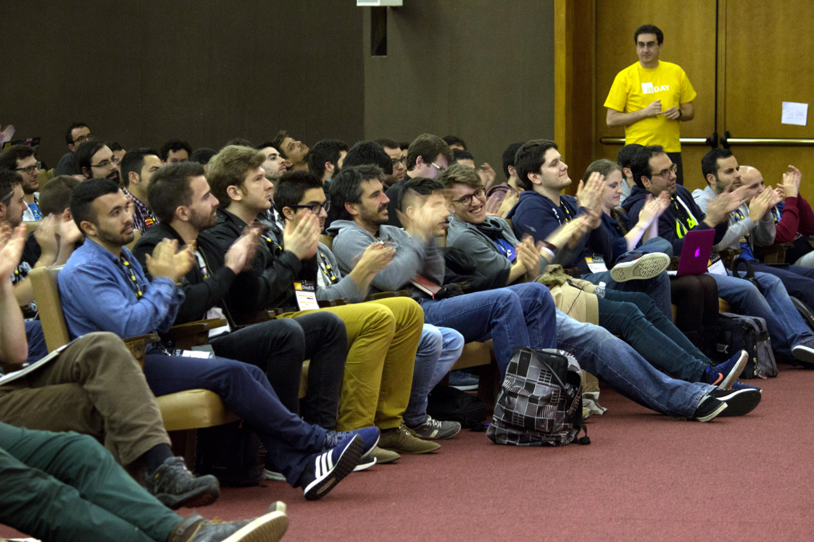

## The Moneys

After finishing an exhausting third edition of
[JSDayES](http://2017.jsday.es),
it is time to publish the books so that they can be audited by you,
the community.

### Tickets

This last edition was a resounding success,
with more than 600 attendees.
Paid tickets were distributed as follows:

* 225 paid the full price of €80,
* 56 more used a 20% off discount for a total of €64,
* 96 bought reduced tickets (€20/€16),
* 51 super early bird (€25),
* 100 early bird (€50).

The remaining attendants did not pay directly:

* 60 sponsor tickets,
* 34 speakers,
* 18 volunteers,
* and 4 organizers.

For a grand total of 644 attendants.
A few of them only came to the workshop by @substack,
so on Saturday we were just above 600 people.

Total income from tickets is €29.9k, which we will round as €30k.
We used
[Koliseo]
as a payment platform, which was a very good choice:
support was excellent,
and the €1800 commission is quite low.
All in all, we earned very close to €28k from tickets.

### Taxes

There was a painful mixup with taxes:
we sold the first tickets with 21% VAT,
but later learned that
[non-profit conferences are VAT exempt](http://www.asesoriayempresas.es/doctrinaadministrativa/JURIDICO/73494/consulta-vinculante-dgt-de-3-de-febrero-de-2010-iva-exenciones-asociaciones-sin-animo-de-lucro).
We changed it to 0% on the Koliseo interface,
but there were already many invoices that had been generated already,
and which had already been reported to the tax authority
on the previous quarter.

This resulted in €5k paid on unnecessary taxes.
The upside is that this money will surely be used to improve the lives of the citizenry
and never squandered by dishonest politicians,
so there's that.

### Sponsorships

All in all we counted with 22 sponsors,
that have provided a total of €23,950
(which we will round and abbreviate as €24k).

A good number of sponsors also paid in kind.
Many payed for transportation for their speakers,
and Cabify provided for transportation within the city.
This is an excellent formula for us,
since it reduces the accounting on both parts.

The estimated combined value of these in-kind payments is €11.5k.
This brings the total of revenue in this section to €35.5k.

### Venue

The venue chosen by the team was the conference center Pablo VI,
the same used for SpainJS '13 (which I happened to attend).
Price was €10.8k, discounted from €12k
(€8k per day for 1.5 days).

We also spent €1.5k in furniture for the sponsor stands and 50 additional chairs;
plus €1k in roll ups, banners and giant white letters.
All in all we spent €13.5k in the venue.

### Speakers

We covered transport and accommodation for our speakers from outside Madrid:
flights, taxis and two hotel nights.
It is the least we can do for people who spend a lot of their free time
crafting a presentation to share some of their expertise.
And believe me, it is _a lot_ of work.

There were six speakers coming from America
(one from Canada, four from the US, another from Argentina),
seven from different parts of Europe
and eight from the rest of Spain.
Luckily many of them were covered by their respective companies.
It all came to €6k in travels
and €3k in hotel rooms.

Other assorted costs:

* The workshop by @substack cost us almost €2k. Luckily it paid for itself
with tickets.
* The speakers' dinner was €2.3k.
* A small present for all speakers was €700.

All in all we spent €14k in our most precious asset.

### Catering And Attendants

There were a lot of meals to provide for:

* Tea for both days was €3k.
* Breakfast on Saturday (churros) was €2k.
* Lunch on Saturday was €6.5k.
* The final party was €1k.

All amounts have been rounded to the closest half €k.
All in all, catering was €12.5k.

The other cost related to attendants was lanyard and bag,
which cost €2.5k together.

All in all, costs related to the audience added up to €15k,
or €25 per attendant.
That is how much we spent on each of you directly!

Reduced tickets were priced at €20,
which means they were not even paying for their direct costs.
But we were happy because this probably allowed a lot of people to come to JSDayES
which would otherwise not have been able to attend.

### Communication

A large part of the success of a conference depends on communication:
marketing, broadcasting, streaming, audio/visuals.

This year we have counted with
[OK Comunicación],
publishers of
[Gaceta tecnológica],
to help us with communication.
They have published press releases,
managed our interactions with sponsors
and saved us a ton of work.

We released an ad on
[JavaScript Daily] that cost about €400.

We spent €500 on video and streaming fees,
but the biggest part was covered by Corus Consulting
(the old M4V)
and
[TodoJS].
We also spent €400 on the photographers.

All in all communication accounted for about €4.5k.

### Final Balance

So in the end we had a pretty tight budget.

| concept		| income (€k)	| expense (€k)	|
|--------------	|-------------	|--------------	|
| tickets		| 28			|				|
| sponsors		| 24			|				|
| taxes			| 				| 5				|
| venue			|				| 13.5			|
| speakers		|				| 14			|
| attendants	|				| 15			|
| communication	|				| 4.5			|
| **total**		| 52			| 52			|

Taking into account payments in kind the total would go up to €64k,
which is what you should at least budget for a conference of this size.
All figures have been rounded,
and in fact there is a deficit of less than €500

How did we balance the budget so tighly?
Basically through sheer luck.
An effort of this magnitude has many variables,
and not all of them are known until after it has ended.
Our internal spreadsheet has more than 60 different concepts,
and the total budget was around €65k.
A difference of €1000 is less than 2% of the total.
Keep in mind that many concepts are not known in advance:
speaker flights,
speaker dinner,
number of sponsors
(the last one entered in the week before the conference).

We kept the party open until the last minute so we could spend more or less money
depending on how the accounting looked.
Unfortunately this meant that we could not tell everyone in time,
and anyway we did not have money for a larger party.

## Some Notes

Beyond money,
a 600+ people conference has many interesting aspects.

### Talks And Speakers

We cannot be more satisfied with the talks for this year.
You can see the scores given by attendants in the
[schedule](http://2017.jsday.es/#schedule).
Average score is around 4.5,
while in 2015 it was 3.5.
Therefore we have improved a lot!

We opened a Call for Proposals,
and it has been an essential tool for attracting speakers.
We also had an advisory committee that helped us select the best talks,
for the main and international tracks.
But a large part of our mission is to attract new talent.
So we hand-picked many of the talks that would have been discarded otherwise,
mostly from speakers with less experience;
and did a "Rising Stars" track with it.
Was it a success?
Well, here are the average scores for each track:

* Main track: 4.45.
* International track: 4.3.
* Rising stars: 4.45.
* Workshops: 4.9.

### Code Of Conduct

We have been notified of a couple of violations of the
[code of conduct](http://2017.jsday.es/codeofconduct.html),
both related to a couple of speakers that made lewd comments.
They were both notified,
and both immediately apologized.

We are happy to report that there were no incidents reported among attendants.
Next year we will have to translate the code of conduct to English!

### Diversity

This year we had around 25% female speakers:
8 out of a total of 32 talks were by women,
alone or in tandem.
Better than last year (0 female speakers!),
but still below what we would like.

These brave women were not chosen just because they were women;
their talks were in general as well received as the rest.
The [average talk score](http://2017.jsday.es/#schedule)
was 4.3,
slightly below the global average of 4.5
but well within the margin of error.

We have not quantified the percentage of female attendants,
but it should be well above 10%.

We had a lot of foreign speakers in the international track.
There were also at least two South American engineers in Spanish talks,
which were well received.
Next year we would also like to increase the number of talks by foreign-born engineers,
also in the national tracks.

The aspect that we are most proud of is geographical diversity.
Only 12 out of 32 talks (37%) were Madrid-based;
another 13 (40%) were from international speakers;
and the remaining 7 were from Spanish speakers coming from outside Madrid.
Next year we will strive to reach out even more.

Wait, it gets better.
In a quick show of hands,
more than half the attendees were coming from outside Madrid.
So we succeeded in making a lot of communities gather around JSDayES,
strenghten our ties and learn together.
This helps us dispel the culture of
"doing just a big one-day meetup".

### Volunteers

We received applications from 13 volunteers;
in the end only 12 were able to make it,
2/3 of which were women.
They did an excellent job throughout the conference.

Corus (the old M4V) volunteers were also present in all rooms recording the audio and video.

### Venue

This is perhaps the single issue that has generated more complaints.
We were well aware that the Pablo VI conference center is outdated and in need of reformation;
but even the brand new room upstairs (where the international track was held)
was a big disappointment,
as sound was very deficient and there were very few electric plugs.
WiFi was also not working well.
Its biggest advantage was price: for less than €11k we had 1.5 days.

A good conference center in downtown Madrid is around €20k/day.
Since people are demanding it.
It is more than €9k above what we paid this year.

### Catering

The second most disappointing aspect of the conference was food.
Not everyone complained:
apparently lunch was not all bad,
but the best part was really scarce and was over quickly,
leaving us with the infamous "white buns from hell".

In our defense, we used the same provider as last year,
which was plentiful and very well valued by attendees.

The remaining meals were OK,
in quality and quantity,
and saved us from utter shame.

You may think that with a budget of around €20 per person
you can do much better than we did.
Think again.
Providing catering for 600 people is a completely different problem than for 6.
There's three meals a day
Don't forget vegan and gluten-free options.

### Organization

This was not a generalized complaint,
but some commenters felt that we the organizers were overwhelmed.
They don't know half of it.

We are four organizers.
Each has devoted countless hours in our spare time
to organizing JSDayES.
We are unpaid volunteers,
and do this out of our spare time:
we all have jobs,
but participate here independently as individuals.
The idea is that we stay close to our community roots.

Even with the help of OK Comunicación,
organizing an event of this magnitude has taken a toll on us.
And we have spent a lot of time on tasks that do not really provide much value,
such as renting chairs or ordering Cabifys.
For next year professional conference management is a must.
This means at least €6k,
perhaps more.
They will ideally take care of those aspects that are not specific to JSDayES:

* sponsors,
* catering,
* speaker accommodation and transportation,
* signage,
* accounting,

and thus help make JSDayES sustainable for upcoming editions.

### Community

We speak a lot about "community".
What is it exactly?

For the first year the "community" was just a gathering of communities from Madrid.
In 2016 we reached around and attracted many people from all Spain.
Finally, this year local attendees were less than half.

We want to help all interested JavaScript developers from Spain meet in one place,
see some good talks,
share a few meals and a roof for a day,
and go back to our daily routine with renewed ideas.
Our sore spot is Barcelona:
it has a vibrant startup scene,
but hardly any developers came from there this year.

This year we have tried to attract an international audience,
or at least foreigners working in Madrid,
without much success.
Next year we will make sure that the international track
provides for a consistent experience for non-Spanish speakers.

We would love to also strengthen ties with South and Central American developers,
but there are practical issues:
each speaker travel from across the ocean costs us more than €1k,
so costs rapidly add up.

## JSDayES 2018

So, we have our homework set for the next edition.

### Increased Budget

The numbers are clear cut:
€9k for a better venue,
€3k for better catering,
and at least €6k for professional organization.
So next year the total budget would increase to at least
€64k + €18k = €82k.
This is a lot of money!

### Ticket Price

To support these improvements we will probably have to increase ticket prices,
from €80 to an estimated €120.
Total: €18k, which divided by 600 attendees comes out at €30 per attendee,
right?

Wrong!
We will strive to keep reduce tickets at €20.
A bit less than half the audience (~280) paid full or discounted price,
and of the rest about half paid (super) early bird (~145).
100 reduced and 75 sponsor tickets complete the 600 tickets.
If we keep reduced and early bird tickets prices,
then the increase is at least €70,
considering discounts.
We might be able to increase sponsorship income,
so hopefully tickets would only increase about €40.
This means an increase in €12k.

We have run a couple of polls among the audience,
just to gauge if there would be interest at this new price.
Most of the responders voted for ridiculous amounts such as €50,
perhaps in the vain hope that we will not increase them.
We are taking those with a grain of salt:
after 2015 we run a similar poll that indicated that people would pay at most €25,
and yet in 2016 we outsold our €50 tickets in a grand total time of 10 minutes.

There is no going around the price hike:
if you want better venue, management and catering
the conference needs to be professionalized,
and ticket prices will increase.
We would rather not do anything than keep like this.

### Sponsors

Most sponsors wanted to have stands,
and some attendees requested it too.
This year it was sadly not possible due to space constraints.
With a larger venue we might have perhaps 10 stands,
which would increase sponsorship income.
We should have to attract at least €6k more this way.
This would help pay for the better venue, management and catering.

Many people seem to think that just adding more sponsors is a magic bullet
that will solve all of our financial problems.
There is a problem when sponsors provide for most of the conference budget:
they start to dictate what you can do!
For instance, it is a very common model to have sponsored talks.
At JSDayES we will never compromise the quality of the event;
at most you get five-minute introductions by top sponsors
(four of them altogether this year),
which is only fair since most of them are looking for talent.

So we would like sponsors to provide for part of the income,
but not most of it,
as this year.
We believe that we provide the most value to you this way.

### Other Models

This is not the only option that we have considered.
Below are some alternatives with discussion.

* The _immobilist_ option:
Keep everything just as this year.
Unfortunately there is only one team of organizers;
once we are burnt out **JSDayES is over**.
I assure you that another year with this level of involvement
is not sustainable for any of the current team of organizers.

* The _grassroots_ option:
Go back to one day, one track, local speakers,
200 attendees,
everything cheap conference.
As attractive as this may seem,
it does not fit our stated goal of improving the national JavaScript community,
as stated under
[diversity](#diversity) and [community](#community).
Plus, we would once again go back to having
*no international JavaScript conferences in Madrid*.
That sucked.

* The _professional_ option:
Some other people have suggested that we charge for our time,
and start making money out of JSDayES.
This is not a bad idea,
and we are not against it.
Many other conferences in Spain and abroad follow this model successfully,
to name a few: TarugoConf, AngularCamp, FullStack Fest.
But this is definitely not what we want to do with JSDayES:
for us it is a work of love,
not a money-maker.

We want to provide attendees with the best possible value for their money,
and we feel that there is only one way forward;
and it is definitely not backwards.

## FAQ

To save you time we summarize some suggestions and criticisms we have already received,
with our answers.

> Tickets at so-and-so are cheaper than yours!

We are happy to hear.
Our tickets should be affordable for any professionals;
and we have reduced tickets for students and unemployed.

> Why do the opening and closing in English,
when 99% of the audience were Spanish speakers?

Out of courtesy to the remaining 1%, of course.
That is what happens at international conferences:
there are people that do not speak Spanish!

> Why was the
[last talk](http://2017.jsday.es/#5740078466859008/99964005)
in the international track in Spanish?

This was a mess-up from our part.
The title was in English,
Alejandro Oviedo offered to do it in English or Spanish,
but we did not confirm with Alejandro that it should be in English.

> With all this talk about professionalization,
will you lose the community focus?

Not at all.
JSDayES is and will be a community non-profit event,
run by communities for communities.

> Why did you not square the books so that the conference has €0 net losses?

See above under
[final balance](#final-balance):
it is unrealistic to balance 60+ concepts on a €65k budget to 1%.
We should strive to achieve a surplus,
but if it means a worse conference we will risk a small deficit.

> Why not skip the "Rising Stars" track?

[See above](#talks-and-speakers):
it was even liked better than the international track
and as well liked as the main track.

> Why not skip the international track then?

For international attendees.
And for national attendees also:
We want to present an opportunity to see some of the best speakers from around the world
without leaving Spain.

> Really, I liked one single track;
I feel like I'm missing out.

The good thing about multi-track conferences is that you can choose.
The problem is that you have to choose.
Tough luck; better choose between two good things than just have the one.

### Acknowledgements

Thanks to all volunteers and sponsors.

JSDayES is the work of love of
[Raquel Benito],
[María Sánchez],
[Juanfran Alcántara]
and [Alex Fernández].

