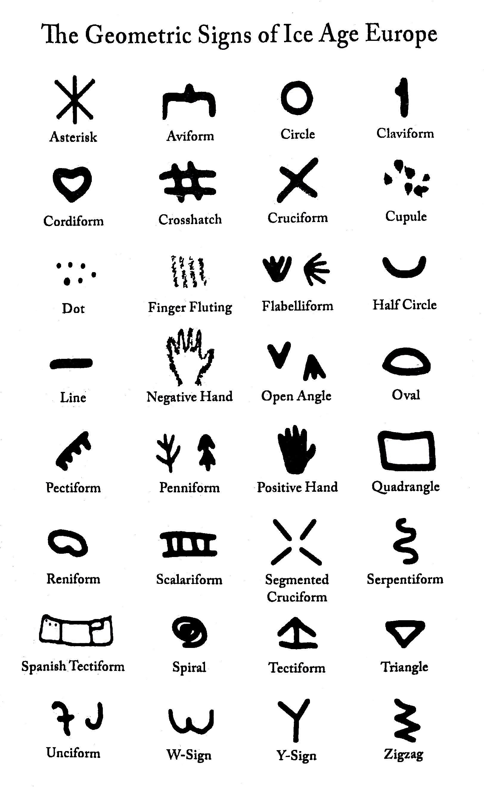

The relative scarcity of modern speculation about prehistoric languages is surprising,
given how much interest there is both in academia and among the general public
about other aspects of prehistoric life.
The most likely reason is lack of direct evidence,
which in these often unimaginative times can be a showstopper.
But there are many indirect approaches that can give interesting answers.

In this article we will explore how language originated and developed in prehistoric times,
combining language reconstruction and information theory
with generous amounts of conjecture
to arrive at a consistent view of language evolution.
From beyond the mysts of time we will try to build a few defensible positions,
or at the very least lay a path to future discovery.

## Language Evolution

It is not reasonable to expect that language appeared at some point in the past,
perfectly formed with all the elements that it has today.

### Back In Time

Furthermore, in historic times there have been significant improvements.
As [Bakker _et al_ (2002)](#ref05) hint,
subordinate sentences were an innovation to Herodotus
roughly 2,500 years ago (2.5 kya),
who wrote endless sentences and often forgot to finish them
(technically called [anacoluthon](https://en.wikipedia.org/wiki/Anacoluthon)).

Going further back into the past,
partial reconstructions such as the enlightening work done with Indoeuropean
shows that many elements of language that we take for granted are relatively recent additions.
For instance, Proto-Indo-European (PIE) developed gender gradually,
as explained by [Luraghi (2011)](#ref06).

How far back can we go with reconstructions?
[García Calvo (2003)](#ref03)
was able to reconstruct an even earlier prehistoric language,
as we will see below.
Some researchers have even posited a
[Proto-Human language](https://en.wikipedia.org/wiki/Proto-Human_language),
with little success and even less credibility.
Past a certain point reconstructions are no use:
our interest is not in tracing common roots for all languages,
but to investigate how broad language features evolved.

We need some other tools to delve into the darkness of time.

### Information Density

A very basic criteria that describes a language era is
how many different words can be uttered.
The number of possible words in a given language
correlates strongly with how much information can be conveyed.
First we will compute the information carried by a single word.
Using the classic Shannon formula,
see e.g. [Lombardi (2016)](#ref27):

> I = -Σ pi log2(pi)

If there are _N_ words, all equally likely, the resulting information is

> I = log2(N)

But we can do better using
[Zipf's law](https://en.wikipedia.org/wiki/Zipf%27s_law),
as characterized in
[Yang (2013)](#ref15):
it is the empirical distribution followed by all known languages.
The resulting information content in bits per word,
generated by 
[this script](origins-script.js),
is shown in the table below.

|Vocabulary	size|Bits per word	|
|---	|---	|
|12	|3.1	|
|100	|5.3	|
|200	|6.0	|
|400	|6.6	|
|1000	|7.5	|
|10k	|9.5	|
|20k	|10.1	|

Adding more possiblities to the vocabulary
increases the information carried by each word.
Another way to convey more information is to combine words together;
[below](#information-content)
we will see a couple of attempts at quantification.

Modern languages can be seen as open-ended:
the number of productions is unlimited,
as explained in
[Trask (2003)](#ref16).
This however needs not be the case in the past.

We have to suppose that [hominin](https://en.wikipedia.org/wiki/Hominini)
languages started somewhere,
by assigning meaning to a few sounds.
As the number of possible utterances increased,
some methods to combine them appeared,
thus also increasing the amount of information conveyed.
The process must have conferred a distinct advantage to speakers,
and so it has continued until the present time.

## A Timeline Proposal

With this preliminary analysis in mind we can create the following timeline,
dividing language evolution into a few distinct stages.

### Individual Sounds

Our most remote ancestors probably communicated using simple sounds.
Many animals use distinct vocal utterances to express different meanings.
Elements include: pitch, volume and articulation
(the shape of the mouth to generate the sound).

At this point we cannot yet speak about words,
since there is no language system.
Each sound is uttered individually making its own "sentence".
Where there are no words there can be no proper sentences.
And without words or sentences there is no "language" to speak about.

Do animals have a grammar,
i.e. do they combine different signs into a coherent whole?
More specifically,
[can chimpanzees talk](http://www.alphadictionary.com/articles/ling002.html)?
[Yang (2013)](#ref15)
compares the relative frequency of words uttered by a chimpanzee
with those from human language,
and concludes that chimpanzees do not have a grammar.

We can suppose that early hominins had a way to augment their communication
beyond what other primates can do,
even without a grammar:
perhaps by emitting a bigger range of sounds,
or by adding context information with their hands.
As [Tomasello (2008)](#ref18) refers,
pointing is a very human activity.
This humble activity requires having a model of someone else's mind,
and is therefore the basis for
[deixis](https://en.wikipedia.org/wiki/Deixis).

This era is therefore the "ground zero" of language:
the common base with animals,
with deictic information added on top.

### Single Consonants

The first stage of language may have involved single consonants.
At this point the sounds from the previous step can be combined into sentences,
making them basic building elements in very simplistic sentences.
These simple elements to combine might be thought to have been
[content words](https://en.wikipedia.org/wiki/Content_word):
nouns, adjectives or verbs,
as proposed by [Hurford (2003)](#ref08).
Instead we will work from the opposite assumption,
that these simple elements were only
[function words](https://en.wikipedia.org/wiki/Function_word):
prepositions, negations, pronouns, quantifiers and adverbs.
Why? Simply because of sheer numbers.

The problem of single consonants is that there are not many of them.
The number of simple, distinct sounds that can be uttered separately,
without combining with others and without significant mixing,
is limited.
Modern languages can have as much as
87 consonants for [Taa](https://en.wikipedia.org/wiki/Taa_language),
about 80 for
[Ubykh](https://en.wikipedia.org/wiki/Ubykh_language).
A single consonant word is thus limited to less than 100 words
in the best of cases,
and probably no further than 30 or so,
since many of these consonants can be viewed as combinations of simpler sounds.
These combinations may have evolved from consonant groupings,
and be therefore modern constructions.

The number of consonants has likely increased with time.
We can choose any number from 10 to 20 or so,
with the reasonable assurance
that at some point in time humans could only profer that number of words.
A value of 12 seems certainly achievable,
so it will serve as archetypical.
We will use the symbol _K_ (cursive 'K') to represent any single consonant.

Using content words would have limited utterances greatly,
and specially the ability to combine them.
Function words on the other hand can be combined readily,
creating the first sentences.
There are other reasons such as the use of pronouns
('I' and 'you') as deictic words in a sentence,
without which conversations would be really inane
and would be limited to point out that there are
an entity from one of 12 possible categories out there,
at any given time.
Also, function words are always in a finite supply anyway,
so they seem like a more natural fit for a very restricted set of words.

It is easy to defend a definite advantage for hominins
that can combine simple meanings into one coherent whole,
as compared with those that could only emit separate sounds.
Group coordination becomes possible without having to see each other.
Still, it is hard to see how a language of this kind could work.
For illustration purposes,
in the appendix we have an example of a
[single-consonant language](#singlecon).

At which point in time did the era of single consonants start?
The determination of the era of single consonants will have to involve
considerable guesswork, being so far back in time.
The advantage of group coordination would definitely have been greater
when hominins started to hunt in groups,
which may have been
[around two million years ago](http://www.nature.com/news/homo-erectus-footprints-hint-at-ancient-hunting-party-1.17346).
(2 Mya).
According to [Roach (2016)](#ref28),
around this point _Homo erectus_ started to hunt and scavenge animals,
increasing its meat consumption.
But even such a simple language would also have been useful in foraging.
An educated guess might thus be that around 1 Mya
hominins could profer single consonants and combine them into simple sentences.
We can thus identify the rise of _Homo Erectus_ with the appearance of proper language.

### Double Consonant Syllables

At some point early humans learned to combine several sounds into one syllable.
This great advance extends the range of possible words at least by an order of magnitude.
Considering the simplest structure of two consonants,
or _KK_,
the number of words would be the square of the number of consonants.
Adding a second consonant without a vowel may seem a strange choice.
It is however a logical extension of the single-consonant words seen above,
which does not require additional phonetic entities.

How do languages without vowels work?
The
[rhotic](https://en.wikipedia.org/wiki/Rhoticity_in_English)
pronunciation of English omits vowels in many words.
[Nuxalk or Bella Coola](https://en.wikipedia.org/wiki/Nuxalk_language)
is an example of a contemporary language without vowels;
you can
[hear a sample](https://www.youtube.com/watch?v=dFnrp-cUTLQ).
From our modern perspective,
not having vowels does not mean that all consonants are stuck together
in an unpronunceable blob.
It just means that vowels are not part of the language.
Some kind of vocalic sound must still link the two consonants together,
and mark syllable boundaries.
This allows listeners to distinguish a double-consonant word _KK_
from two single-consonant words in succession _K-K_.

We will use the italic _Ə_
([uppercase schwa](https://en.wikipedia.org/wiki/%C6%8F))
to represent a vocalic separator.
Biconsonant syllables will therefore be rendered as _KƏK_.
The evolution so far can be represented as:

> K → KƏK

In practice, Ə can be a neutral vowel or
[schwa](https://en.wikipedia.org/wiki/Schwa).
It can also be a more definite vowel sound,
either automatically assigned by
[prosodic rules](https://en.wikipedia.org/wiki/Prosody_(linguistics)).
or chosen at random.
This would mean that e.g. the variants
'SAN', 'SIN' or 'SUN'
are in fact different renditions of the same word 'SƏN'.
Technically it is an
[epenthetic vowel](https://en.wikipedia.org/wiki/Epenthesis),
only present to link both consonants.

A two-consonant language might still preserve the original one-consonant functions words _K_,
and add content words combining two consonants: _KƏK_.
A word during this era can therefore be either _K_ or _KƏK_.
12 consonants would thus yield 144 + 12 = 156 combinations.

What brought forward this improvement?
Calling syllables an _invention_ may very well misleading:
it is very likely that both proferring and parsing syllables require
adaptations in the brains of speakers and listeners to handle the increased complexity.
Probably the first words with two consonants were formed by
common linguistic mechanisms:
[compounding](https://en.wikipedia.org/wiki/Compound_(linguistics))
and
[reduplication](https://en.wikipedia.org/wiki/Reduplication)
of function words.
The appendix has a
[hypothetical double-consonant language](#doublecon).

Our reasonable guess for the double consonant era is that
it overlapped largely with the emergence of _Homo Sapiens_,
at around 200–100 kya.
At this point modern hominins were evolving fast,
with large brains and impressive
[advances in technology](https://en.wikipedia.org/wiki/Middle_Paleolithic#Technology).
An exponential increase in the complexity of their communications
would have suited perfectly their new activities,
and would be a great help for the the new challenges they were facing.

A note on the European branch of the family is in order.
Neanderthals are usually classified as a distinct species from _Homo Sapiens_.
Given the now ample evidence that both groups could and did interbred,
as reviewed in [Groucutt _et al_ (2015)](#ref23),
it does not seem unreasonable to classify them as two different subspecies inside _Homo Sapiens_,
as many scientists have advocated for decades.
The degree of shared evolution is far from clear,
but there may have been only minute differences between African and Neanderthal language evolution.

### Vowels

At some point in time vowels become first-class citizens,
just as meaningful as consonants.
A proper vowel is represented by _A_ (cursive 'A').

> K → KƏK → KAK

With vowels the number of possible syllables grows a bit.
Let us suppose that there are three possible vowels at some point in time,
along with the original 12 consonants.
The number of combinations is now:
consonant + vowel + consonant, or _KAK_, with 432 combinations;
adding the original 12 single-consonant function words _K_
yields a total of 444 combinations.
Note that function words may also acquire vowels to yield simple structures like _KA_,
in order to increase their number to 36;
in this case yielding 468 possible words.

The process of vowel acquisition may require larynx, ear and brain adaptations
to generate, distinguish and process the new grammatical elements.
The incorporation of vowels into consonantic languages may happen similarly to the
[Indo-European ablaut](https://en.wikipedia.org/wiki/Indo-European_ablaut)
or more generally as
[vowel apophony](https://en.wikipedia.org/wiki/Apophony):
vowels enter the system as modifiers for existing roots.

Tracing the appearance of vowels in all languages
is again a hard issue.
At what point did this happen?
Vowels may in fact have appeared several times throughout prehistory.
Almost all known languages have at least a few vowels,
so that we can infer that their appearance happened before the last diaspora
at around 70–50 kya.
We will suppose that it did not happen much earlier than that.

### Monosyllabic Expansion

In this next period the number of words grows in a couple of different ways
while they remain monosyllables.
The basic problem of a monosyllabic language is how to cram
a large number of words into a single syllable.
There are a couple of expansions that may have happened at this point in time.

The first strategy is to increase the number of consonants and vowels.
The basic inventory of consonants may have grown in time.
As a modern example,
[Khoisan click languages](https://en.wikipedia.org/wiki/Khoisan_languages)
([sample](https://www.youtube.com/watch?v=W6WO5XabD-s))
have added clicks as regular consonants.
The phoneme inventory may have grown from 12 consonants and 3 vowels
to e.g. 20 consonants and 5 vowels,
which yields yields 2000 combinations while following the same _KAK_ structure.

The second strategy is to add tones.
At this stage speakers may start distinguishing words by
[tone](https://en.wikipedia.org/wiki/Tone_(linguistics))
as many modern languages
such as [Bantu](https://en.wikipedia.org/wiki/Bantu_languages)
([sample](https://www.youtube.com/watch?v=ZXAnrqkt_yM))
do nowadays.
Adding four tones per vowel for the original structure _KAK_ yields 1728 combinations.

Of course both of these innovations may have been used in conjunction
to achieve even greater vocabularies.
This increase of combinations may have enabled the separation of word forms
for verbs, nouns and adjectives,
effectively establishing word classes as we know them.

As we will see below,
tones are a prerequisite to polysyllables,
and therefore had to be acquired at this stage.

It is not unreasonable to suppose that all languages were monosyllabic
at least until 50 kya,
probably later.
The new techniques to expand vocabulary sizes
were likely there for the transition to the
[Upper Paleolithic](https://en.wikipedia.org/wiki/Upper_Paleolithic)
as described by
[Bar-Yosef (2002)](#ref19),
which must have required a broader lexicon of plants, animals, materials, tools and techniques.

### Polysyllables

An immediate extension of two consonant words are three consonant words.

> K → KƏK → KAK → KAKAK

Continuing with the basic structure of 12 consonants and three vowels,
there are now the following combinations:
12 _K_, 444 _KAK_, and 15552 _KAKAK_,
for a total of 16008 combinations.
A gain of an order of magnitude over monosyllabic words,
even after the expansion period.

However, and a bit surprisingly,
it does not look as if this extension has happened early in prehistoric times.
For starters, tones had to be developed first.
To see why we need to consider how the listener can tell apart words.

All polysyllabic languages use tones as a distinctive feature.
E.g. in English, the only difference in pronunciation between
'insight' /ˈɪnsaɪt/, 'incite' /ɪnˈsaɪt/ and 'inn sight' /ˈɪn ˈsaɪt/
is intonation.
Tones allow us to distinguish between function words
(which usually have no word accent)
and content words,
and in many languages also between different content words
which have developed different word accents.

In the case of a monosyllabic language,
if a function word is 'KA' and a content word is 'KAK',
a new polysyllabic 'KAKAK' will sound identical to the combination 'KA KAK',
unless it develops an accent first 'Á' which makes it 'KAKÁK' or 'KÁKAK',
or perhaps even 'KÁKÁK' with double word accent.

At what point did polysyllabic words arise?
Arab and other semitic languages have
[triliteral roots](https://en.wikipedia.org/wiki/Semitic_root)
consisting of three consonants.
It looks like a straightforward extension
of the two-consonant syllables seen above.
[Agmon (2010)](#ref17)
shows that for Semitic languages,
the transition from two- to three-consonant roots
happened during the transition to the Neolithic period,
or 15–10 kya.

[García Calvo (2003, pp. 90–97)](#ref03)
reconstructed a prehistoric language ancestral to Indo-European
and Proto-Indo-European
with just two consonants per syllable and without vowels.
In constrast,
[Proto-Indo-European (PIE)](https://en.wikipedia.org/wiki/Proto-Indo-European_language)
already has polysyllabic words and vowels;
it is in fact a mostly modern language
with suffixes, pronouns and conjugation.
PIE was supposedly spoken
[around 7 kya](http://www.archaeology.org/exclusives/articles/1302-proto-indo-european-schleichers-fable),
which is very close to historic times in many places of the world.
A timescale was not given by García Calvo,
but we may again deduce that the transition from monosyllabic language to PIE
may have happened near the transition to the Neolithic period.

The Sino-Tibetan family might seem a perfect example
of the transition to polysyllabic languages in near-historical times,
since many languages have monosyllabic morphemes.
But [Michaud (2012)](#ref14)
refers that these monosyllables are often the result of compacting longer words,
and therefore not a direct descendent of monosyllabic languages.
In the reconstruction of [Baxter & Sagart (2014)](#ref12),
[Old Chinese](https://en.wikipedia.org/wiki/Old_Chinese)
was already polysyllabic.
There are however some hints at monosyllabic Sino-Tibetan ancestors as in
[Lama (2012)](#ref13),
as recently as 4 kya.

Languages probably adopted polysyllabic forms as the necessity arose,
given their particular information density configurations.
In combination with other monosyllabic techniques
they may have easily achieved vocabularies of tens of thousands of words.
These newfound combinatorial riches allow for
[conjugations](https://en.wikipedia.org/wiki/Grammatical_conjugation),
[declensions](https://en.wikipedia.org/wiki/Declension)
and other modern language features.
This leaves us just right before the invention of writing,
which is the point where Prehistory ends along with our journey.

### Time Scales

Figure 1 shows several time scales for language eras as discussed.

. Prepared by the author.](pics/origins-time-scales.svg "Different time scales for language eras")

Figure 1-a shows how the period under study looks when represented linearly.
Hardly anything can be shown since most of the period is occupied
by the single consonant era.

Figure 1-b shows the main eras along with the hominin species
that was thriving at the moment.
The single consonant era has been compressed for easier visualization.
Note that Neanderthals are included in _Homo Sapiens_.

Figure 1-c shows an alternate time scale with logarithmic axis.
The scale has been expanded to include the apparition of the first hominins,
about 5 Mya.
The graph ends at the beginning of history around 5 kya.
Note that it would not be particularly hard 
(and it may be tempting)
to make all eras approximately equal in the logarithmic axis,
which would give a nice picture of constantly accelerating linguistic progress.
But the change would break all the known boundaries of cultures and species.

## Alternative Timelines

There are many possible objections that can be raised about this timeline.
In this section we will examine a few.

### Recent Origin

Many scholars support a much later date for the appearance of language,
around 100 kya,
as reported by [Dediu _et al_ (2013)](#ref07).
This is not supported by evidence.

The [hyoid bone](https://en.wikipedia.org/wiki/Hyoid_bone)
 is a critical part of our capacity to speak;
more specifically it is used for articulation.
[Martínez _et al_ (2008)](#ref25)
report that a couple of hyoid bones of hominins from 530 kya
are very similar to samples from modern humans.
[D'Anastasio _et al_ (2013)](#ref24)
find the hyoid bone in Neanderthals to be structurally very similar to modern samples.
Even further,
[Martínez _et al_ (2013)](#ref26)
find that 530 kya hominins had a similar auditory range to modern humans.

Barring some theory that explains why non-speaking hominins
had similar bones as we use today for speech,
these findings are probably enough to discard this timeline.
Furthermore, a sample from 3.3 Mya ago is very similar to the hyoid bone of modern chimpanzees,
which seems to imply that speech capabilities were developed between
3.3 Mya and 530 kya.

### Much Earlier Origin

There is also the opposite belief:
that language was already fully formed at least 100 kya.
A good review can be found in
[von Petzinger (2017, pp. 70–71)](#ref31).
The supporting evidence is intriguing but certainly not bulletproof:
geometric patterns engraved on common items and personal adornment
during the Middle Paleolithic.

We have however reviewed how
[polysyllables](#polysyllables)
appeared much later in the game in some lanaguage families,
right before or during the Neolithic period.
Monosyllabic languages simply do not have the necessary breadth of vocabulary
to incorporate features such as gender, declination or even tense.
Even in highly analytic languages such as English,
a restricted number of words would make it hard to construct a modern language.
We have also seen reliable reconstructions of the appearance of such features as
gender or declination in proto-languages.

A more gradual appearance of modern language,
in accordance with other signs of human progress such as art or technology,
appears to be more in line with the existing evidence.
Still, this area will need much more study before it can be reliably clarified.

### Earlier Introduction Of Vowels

The choice of early words consisting of two consonants
may seem arbitrary.
It is very well possible that vowels were introduced earlier,
perhaps with the first syllables.
Words might consist of one consonant plus one vowel;
just adding three vowels to a 12-consonant language
would extend the number of words from 12 to 36.

But there is some evidence supporting the late appearance of vowels.
[García Calvo (2003, pp. 87–89)](#ref03)
made the argument that prehistoric Indo-European
in its earliest incarnation had no vowels:
just function words with a single consonant,
and content words consisting of two juxtaposed consonants.
As we saw before there is no timescale for this language.

On the other hand,
there are languages with very different syllable structures,
such as
[Upper Arrernte](https://en.wikipedia.org/wiki/Upper_Arrernte_language)
([sample](https://www.youtube.com/watch?v=aiBnZjOahhM)).
Interestingly enough,
almost all languages with
[simple syllable structures](http://wals.info/chapter/12).
(V or CV) are
[almost exclusively found](http://wals.info/feature/12A#2/19.3/152.9)
in Africa, South America or Pacific Islands,
suggesting some ancestral clustering.

Ultimately this question is hard to answer
and not terribly significant.
It is possible that certain proto-languages have developed vocals first,
and they may have added a second consonant to syllables later.

> K → KA → KAK.

Compare this path with the one described above:

> K → KƏK → KAK.

More complex paths are possible:
developing vocals first,
losing them later in favor of biconsonant words,
and regaining them later.

> K → KA → KƏK → KAK.

In any case, the number of words grows monotonically.

### Earlier Monosyllabic Expansion

Our estimation for the monosyllabic expansion is from 50 to 15 kya,
due to the divergence of schemes to augment monosyllables found across the world.
There is a small problem with this argument.
When _Homo Sapiens_ left Africa,
there was already a sizeable population of Neanderthals
occupying Europe and Asia.
So it is reasonable to think that these same Neanderthals
might have their own languages,
which influenced any newcomers.
In this case the monosyllabic expansion might have happened much earlier.

It may be an interesting avenue of enquiry.
Its first obstacle is again to reconcile the earlier monosyllabic expansion
with the late appearance of polysyllables that we have seen
in many language families.
What happened in between?
Unless a satisfactory answer for the extended era is found,
this point of view should be put on hold.

### Broader Monosyllabic Expansion

For the monosyllabic expansion a number of mechanisms have been proposed above.
There are many others that can be seen in modern use,
but that are not likely to have been a part of this era.
We will review them along with the reason to have discarded them.

The first strategy is to increase the number of consonants.

* [Gemination](https://en.wikipedia.org/wiki/Gemination),
or reduplication of consonants.
These longer versions are usually derived from intermediate consonants,
and therefore cannot appear from monosyllables alone.

* Compound consonants:
when a combination of consonants becomes a single phoneme.
The idea of compound phonemes in
[Clair (1972)](#ref29)
can be expanded to many other consonants.
An example can be how the
[modern sound for 'ch'](https://en.wikipedia.org/wiki/Voiceless_palato-alveolar_affricate),
is tellingly shown in IPA as ⟨tʃ⟩,
suggesting it was originated by the combination of ⟨t⟩ and ⟨ʃ⟩.

* [Prenasalized](https://en.wikipedia.org/wiki/Prenasalized_consonant)
or
[palatalized](https://en.wikipedia.org/wiki/Palatalization_(phonetics))
consonants.
These seem to come from assimilation of intermediate consonants,
although further study is needed to assert it generally.

The second strategy is to add more phonemes per syllable.

* [Consonant clusters](https://en.wikipedia.org/wiki/Consonant_cluster),
or sequences of consonants without vowels.
It is possible that the basic _KAK_ scheme was supplemented at this point
by adding consonants at the beginning or the end,
using the same mechanism of
[compounding](https://en.wikipedia.org/wiki/Compound_(linguistics))
that we saw for two-consonant words.
These new syllable structures _KKAK_ or _KAKK_ would yield 5184 combinations each.
But as we saw [above](#polysyllables),
there is evidence of languages keeping the old two-consonant words at a later phase,
so these structures would be anachronical at this point.

* [Diphthongs](https://en.wikipedia.org/wiki/Diphthong)
allow combinations of vowels in a single syllable.
Again, probably come from collapsing two separate syllables,
in this case with an intermediate aspirant consonant,
later lost.

The last strategy is to add modifiers for vowels and consonants.

* Add different contours, as in Chinese
([sample](https://www.youtube.com/watch?v=wkMbSWwS3FA)).
They are a special kind of tone that may vary within a syllable.
As [Michaud (2012)](#ref14) refers,
tones evolved from consonant depletion.

* Add nasalized vowels as in
[French](https://en.wikipedia.org/wiki/French_language)
([sample](https://www.youtube.com/watch?v=j_Qs75dfpko)).
As [Hombert (1986)](#ref30) explains,
nasalized vowels come from assimilation of a nasal consonant
into its preceding (or occasionally anteceding) vowel.

All of these innovations,
if originated from polysyllabic words as seems likely,
would not have increase the range of possible words
but just have followed the natural paths of languages.

It is interesting to note that tonal languages have developed mostly
[in Africa and Southern Asia](http://wals.info/feature/13A#2/19.3/152.9),
while more complex syllable structures are more abundant
[in Europe and North America](http://wals.info/feature/12A#2/19.3/152.9).
But it does not seem to bear any effect on prehistoric langauges.

## Language As A Tool

Language has many uses.
There can be no doubt that it has gained utility with time.

### Information Content

A very basic criteria that describes a language era is
how many different words can be uttered.
The information content of a sentence depends largely
on the number of different meanings that can be conveyed,
and therefore on the number of words per sentence.

We can estimate the average number of words per sentence using MLU,
[Mean Length of Utterance](https://en.wikipedia.org/wiki/Mean_length_of_utterance).
[Kemper & Sumner (2001)](#ref01) estimate that young adults have a MLU of around 12 ± 4.
With a vocabulary of around
[20k words](http://www.lextutor.ca/research/nation_waring_97.html)
following a Zipf distribution,
each word would carry around 10 bits of information,
as we saw [above](#information-density).
Therefore a typical adult sentence might carry 120 bits of information,
if all words were independent.

. From Devescovi _et al_ (2005).](pics/origins-mlu.jpg "MLU correlated with vocabulary size")

What happens with smaller vocabularies?
[Devescovi _et al_ (2005)](#ref02) estimate that children with a vocabulary of 101-200 words
have a MLU of around 3.5 words.
200 words following a Zipf distribution would carry around 6 bits per word,
yielding a total of 21 bits per sentence.
Similarly, 400 words would have a MLU of around 4 words,
which at 6.5 bits per word would yield 26 bits per sentence.
1000 words are outside their range of study,
but a MLU of 10 words seems a reasonable extrapolation;
at 7.5 bits per word each sentence would reach 75 bits.
100 words correspond to a MLU of 3
and 5.3 bits per word, or 16 bits per sentence.
On the lower range, a vocabulary of 12 words might have a MLU of 2,
which combined with 3 bits per word yields 6 bits per sentence.

Data from both studies is not necessarily compatible,
as they use different definitions for MLU.
Yet it is reasonable to expect that after a point,
increasing the vocabulary does not entail a corresponding increase in sentence size.
The following table summarizes these estimations.

|Vocabulary	size|MLU	|Bits per word	|Bits per sentence	|
|---	|---	|---	|---	|
|12	|2	|3	|6	|
|100	|3	|5.3	|16	|
|200	|3.5	|6	|21	|
|400	|4	|6.5	|26	|
|1000	|10	|7.5	|75	|
|20k	|12	|10	|120	|

This gross approximation is enough to show that that increasing vocabulary size
initially yields large advances in communication,
and then tapers off.
After around 1000 words gains are incrementally smaller.
In fact, information content would grow even more slowly with vocabulary size
when considering redundancy in sentences.
In general words in a sentence are not independent:
'house' is much more likely to follow 'the' than 'far'.
Particles and other function words are highly redundant.
The actual number of bits per sentence is thus much lower than represented.
The values above can only be considered bounding limits.

We will now delve into how different uses for language
are enabled by increasing information content.

### Description

The most primitive use of language is related to the present situation.
It is used to _remove ambiguity_.
Say that two hominins _A_ and _B_ are in a certain setting.
_A_ sees an animal, and wants to communicate it to _B_.
Perhaps their common language has an utterance for 'warning',
not necessarily a word:
it may be a simpler sound like a shout,
probably combined with a prosodic mark such as an intonation.
It will be _A_'s first utterance.
Combined with a pointing hand it may be enough
to make _B_ look and appraise the situation on their own.
But then _A_ may want to give _B_ a more precise idea of the situation,
even if _B_ is not currently able to see the animal:
let us suppose it just fled,
or maybe _B_ is far away.
At some other situation there may be a group of listeners:
a shout that lets them know there is a bear nearby
will be much more effective than waiting for them to look for it.
Their reaction if there is a rabbit instead
should be equally swift but completely different.

If their language only has a single word for all animals
_A_ will utter 'animal',
which is not very precise: there is a lot of ambiguity.
It could be a wolf or a sheep,
and both situations will probably call for very different actions.
Perhaps there will be words for 'big' and 'small',
so some of the ambiguity can be removed by saying
'animal small' or 'animal big'.
But a small wolf and a big sheep still call for different actions.
A language with different words for 'wolf' and 'sheep'
will have a distinct advantage for its speakers.
Given the number of different animal species,
a large vocabulary is required to accurately represent even
the most common animal families
(i.e. a single word for 'wolf', 'dog' and 'fox').
Increasing the number of possible words is thus crucial to remove all ambiguity.

More information can be added by adding a plural form:
'one wolf' is a very different situation from 'wolves'
for our hypothetical hominins.
Again, this requires increasing the number of possible words.

### Training

Another important use is training.
Here too language can help to _remove ambiguity_.
Complex techniques require very precise movements,
be they used for tool making, gathering food or hunting game.
Language can be a powerful teaching aid.

Composite materials used for hafting stones to handles
require precise combinations of materials,
each in turn gathered from the correct environment.
[Wadley _et al_ (2009)](#ref04)
explain how red ochre and tree gum must be mixed in precise proportions
and heated near a fire at between 250 °C and 300 °C
to obtain a composite glue for hafting stone points to wooden handles.
There is only one species _Acacia karroo_ which is ideally suited for the process,
and the proportion of ochre must be adjusted depending on its iron content.
This complex process carries a lot of ambiguity
that has to be removed in the teaching process;
it is easy to imagine how training time would have been reduced substantially
with verbal aids guiding the process.
Given that there are archeological samples of such composite materials from at least 70 kya
it seems that language must have been quite advanced by then.

### Telling Stories

A more elaborate use of language is storytelling.
In this setting the speakers are recounting previous events.
Here too _removing ambiguity_ is essential.

Storytelling is useful as training:
someone listening to hunting stories may learn tips and tricks.
But it goes much deeper than that.
Stories carry with them mythology,
world view, family tree, ethics;
in short, the essentials of human culture.
A complex language and vocabulary
allow for better transmission of information
among groups and between generations.
Groups with strong oral culture have an advantage over those without,
especially in a crisis as described by [Minc (1985)](#ref21).

The fact that [oral traditions](https://en.wikipedia.org/wiki/Oral_tradition)
have existed for so long,
and even now are still maintained by certain groups,
points to some innate capability in humans.
Our fascination with hearing stories is present today
thinly disguised as books or movies.
We still get most of our morals in the form of exemplifying stories.

Stories are possible with a limited set of words:
Dr Seuss' [The Cat in the Hat](https://en.wikipedia.org/wiki/The_Cat_in_the_Hat)
contains only 236 different words,
and [Green Eggs and Ham](https://en.wikipedia.org/wiki/Green_Eggs_and_Ham)
is limited to 50.
But these were stories tailored to suit the limited number of words.
Experiments like
[Basic English](https://en.wikipedia.org/wiki/Basic_English)
with a limited vocabulary (850 words) and simplified grammar rules
have had some success among foreign speakers.
It would be enlightening to learn if a complex story can be told
with an even more limited vocabulary.

## Sources Of Evidence

Language does not fossilize.
This well-known fact means that all of our knowledge
about how language evolved before the invention of writing is pure speculation.
Or is it?
As a matter of fact,
there are several sources of evidence about prehistoric languages.

### Physical Remains

Archeological remains are the first and foremost source of evidence
about all things prehistoric.
We know the lifestyle and capabilities of our ancestors
thanks to the remains that they left behind.

We have seen [above](#recent-origin)
how hyoid bones seem to imply that hominins
could already articulate 530 kya
(and no sooner than 3.3 Mya).
More samples might help us pinpoint these dates more exactly.

There is also symbolic evidence which might prove even more valuable.
[Von Petzinger (2009)](#ref20)
has found that the same set of symbols is repeated in Upper Paleolithic cave paintings
across much of France, and then
[around the world](https://www.newscientist.com/article/mg23230990-700-in-search-of-the-very-first-coded-symbols/).

. From von Petzinger (2017), used with permission.](pics/origins-first-signs.jpg "32 abstract signs including crosshatch, .")

There are also
[cup and ring marks](https://en.wikipedia.org/wiki/Cup_and_ring_mark)
from later periods,
and probably many more overlooked marks.

Do they represent concepts of some kind,
or are they just pretty designs?
Are marks more likely to represent functions words,
or are they content words?
With a more concrete language description in mind
it is conceivable that these inscriptions might be decyphered,
or at least put in context.

### Modern Languages

Today there are about
[7,099 languages](https://www.ethnologue.com/guides/how-many-languages).
spoken around the world.
It is to be expected that any features before these languages separated
would be shared.

Watching the distribution of certain features can be very instructive.
[The World Atlas of Language Structures Online (WALS)](http://wals.info/)
is a great resource organized by language features.
It is entirely possible that the distribution of some features
is the direct result of prehistoric migrations.

### Language Reconstructions

Indoeuropean is the most widely known and studied archaic language,
but many others have been reconstructed.
A few protolanguages (like Proto-Indo-European or PIE)
have also been postulated with varied success.

Rate of linguistic change is hard to estimate.
[Nettle (1999)](#ref22)
argues that languages change faster in small populations.
It remains to be seen how ancient languages can be reconstructed
to such a high degree of precision if they were spoken
by relatively few people for many centuries.

Reconstructions rarely go back beyond the
[Neolithic revolution](https://en.wikipedia.org/wiki/Neolithic_Revolution),
around 12 kya.
Except glorious exceptions like the study by
[García Calvo (2003)](#ref03),
they are of limited value to infer
how or when language features evolved.
It remains to be seen if the veils of time can be pierced any further.

### Genetics

There are many genes responsible for speech.
[FOXP2](https://en.wikipedia.org/wiki/FOXP2)
is the most famous and studied of all.
This gene has the same expression in humans and Neanderthals,
from which [Dediu _et al_ (2013)](#ref07)
deduce that both groups had mostly equivalent language capabilities.
It is likely that we will be able to trace evolution of speech even further back in time
by following how this and other genes have evolved.

Another important area of study is speech disorders.
The best way to learn how a machine works is often watching how it malfunctions.
Similarly, it is now possible to study how defects in individual genes
affect individuals that carry them.
So e.g. if a gene that enables polysyllabic speech can be identified,
it should be possible to study how people without it
(or with a non-functional variant) can communicate.
For instance,
[Vargha-Khadem _et al_ (1995)](#ref10)
study the implications of a genetic problem in FOXP2
on a large family.
Would it be possible to find variants of this and other genes
that limit for instance polysyllabic communication?

Genetics may thus serve as empirical test of the timeline
that has been sketched in this article.

### Previous Studies

While not direct evidence,
there is a growing amount of literature about the origins of language.
[Smillie (1985)](#ref09) models the evolution of early languages
on the acquisition of language by children.
[Hurford (2003)](#ref08) offers a limited view of proto-languages,
where at the beginning they would have no function words.
In the same volume,
[Newmeyer (2003)](#ref11)
gives an overview of other theories.

It is my sincere hope that I have overlooked a mountain of literature
specifying how languages came to be the complex wonders that we know,
feature by feature and with even more fantastical timelines.
If it does not exist, it definitely should.

## Conclusion

Unraveling the origins of language is a particularly hard task,
which was once famously
[banned by the Linguistic Society of Paris](https://en.wikipedia.org/wiki/Origin_of_language).
In this article we have seen a possible evolution path
that takes us from animal sounds to the written word.
We have also explored briefly how it fits with known evidence
and how to refine or refute it with more research.

The whole endeavour may seem idle speculation.
After all it may seem impossible to refute most of what has been said here.
But it is my belief that there is fruitful research to be done.
A theory only needs to be consistent with the known facts,
and it is partially validated when it can explain new phenomena.

Learned discussion about very early phonetics,
[phonotactics](https://en.wikipedia.org/wiki/Phonotactics)
and grammar may take us a long way towards a deeper understanding of our ancestors.

## Appendix

It becomes much easier to visualize language types with an example.
In the appendix we will explore several hypothetical languages
to illustrate the different eras of language evolution.

### Singlecon

The first language has just words that consist of a single consonant.
We will call this hypothetical primitive language 'Singlecon'.

#### Vocabulary

In Singlecon we only have 12 words,
that correspond to the 12 consonants:

* one preposition: 'to' ('R'),
* one negation: 'no' ('P'),
* two non-numeral quantifiers: 'much' ('K') and 'little' ('D'),
* two numerals that double as pronouns: 'one' or 'me' ('V') and 'two' or 'you' ('N'),
* and six adverbs: 'down' ('L'), 'up' ('S'), 'here' ('M'),
'near' ('T'), 'out' ('H') and 'far' ('F').

Note that the language consists only of function words.
There are no content words: nouns, verbs or adjectives.

#### Samples

A few sentences in Singlecon follow.
They show the value of combining words for a group of foragers or hunters.

* 'T L.'
means 'near down.':
the objective is near but they need to go down.
* 'K K'.
means 'much much.':
there is a lot of what the speaker is interested in.
* 'V M. N H.'
means 'one here. two out.':
the speaker will remain here while the listener goes away.
* 'V R. N M.'
means 'one to. two here.':
the speaker will go to the objective;
the listener must stay here.
* 'K S. D M.'
means 'much up. little here.':
there is a large quantity of what the speaker is seeking going up,
while there is little to be found here.

#### Grammar

Even with such a simple language a grammar would be needed,
to convey different meanings depending on the combination.
For instance, 'near much' would mean that the objective is very near,
while 'much near' would mean that there is a lot of what the speaker is seeking nearby.

## Doublecon

Our next language is an evolution of Singlecon
that allows for monosyllabic words with two consonants and a schwa,
represented as _KƏK_.
It keeps the same set of single-consonant function words,
while the new combinations are all content words.
We will call it Doublecon.

### Vocabulary

Doublecon has a maximum of 144 content words,
that can work as nouns, verbs or adjectives depending on the situation.
Content words are formed with two consonants by
[reduplication](https://en.wikipedia.org/wiki/Reduplication)
and
[compounding](https://en.wikipedia.org/wiki/Compound_(linguistics))
of function words.

* The combination of 'down' ('L') and 'to' ('R') is 'LƏR'
and refers to something that moves on the ground
such as a small animal.
* 'up' ('S') + 'to' ('R') is 'SƏR': a big animal.
* 'near' ('T') + 'much' ('K'), 'TƏK': family.
* 'near' ('T') combined with itself is 'TƏT'
which means 'good'.
* 'to' + 'down', 'RƏL': trail.
* 'to' + 'near', 'RƏT': run.

Not all combinations are used by actual words;
of the 144 possibilities for _KƏK_ only about 100 are valid.

Even when words are formed as compounds
there is considerable arbitrariness in the process.
The combination of 'down' with 'to' ('LƏR') is small animal,
while 'to' + 'down' ('RƏL') is trail.
It might perfectly be the other way around,
so it is purely a matter of convention.

### Prosody

There are three possible sentence intonations,
indicated here by the sentence ending sign:

* neutral, marked with a dot '.',
* interrogative: marked with an interrogation mark '?',
* and exclamative: marked with an exclamation mark '!'.

There are no other possible intonations such as our comma ','.
Sentences may follow each other closely,
with a pause between them.

### Samples

A few sentences in Doublecon follow.

* 'TƏK M. TƏK TƏT.': 'family here. family good',
the good family has arrived.
* 'V R SƏR. N M.':
'me to big animal. you here.',
I will go to the big animals, you stay here.
* 'SƏR K S.': 'big animal much up',
there is much big game going up.

Note that it is very important to distinguish between
two single-consonant words and one syllable:
'S R' from 'SƏR'.
In the first case there is a small pause between 'S' and 'R',
similar to the intersyllabic transition in modern languages,
as in English 'pos·ter'.
In the case of 'SƏR' the schwa provides vocal continuity.

### Grammar

Even at this level,
a simplistic grammar is needed to combine content and function words.

The [copula](https://en.wikipedia.org/wiki/Copula_(linguistics))
is straightforward juxtaposition:
'V TƏK' means 'I am family'.

Some words can be both nouns or verbs, such as 'RƏT': run, or 'RƏL': trail.
Nouns are always the first word,
followed by verbs or adjectives:
'SƏR RƏT' means 'big animal runs'. 
Another possibility is juxtaposition of two nouns:
'RƏL SƏR' means 'trail of a big animal'.
Verbs can also appear on their own or with function words:
'RƏT K!' means 'run a lot!'
(remember that 'K' means 'much'),
and so with adjectives:
'TƏT K' means 'very good'.

## References

* 
Kemper, S. & Sumner, A. (2001). The structure of verbal abilities in young and older adults.
_Psychology and Aging_, 16, 312-322.
[Ref](https://kuscholarworks.ku.edu/handle/1808/8619?show=full),
[PDF](https://kuscholarworks.ku.edu/bitstream/handle/1808/8619/Kemper%20Verbal%20Abilities%20author%20final.pdf;sequence=1).
* 
Devescovi, A., Caselli, M. C., Marchione, D., Pasqualetti, P., Reilly, J., & Bates, E. (2005).
A crosslinguistic study of the relationship between grammar and lexical development.
_Journal of Child Language_, 32(4), 759-786.
[PDF](https://www.researchgate.net/profile/Antonella_Devescovi/publication/262683112_J_Child_Lang2005/links/0deec5386f74cb8ce0000000/J-Child-Lang2005.pdf).
* 
García Calvo, A (2003).
\~Es\~ Estudio de Gramática Prehistórica (Spanish).
Ed. Lucina.
[Ref](http://www.editoriallucina.es/articulo/es-estudio-de-gramatica-prehistorica_21.html).
* 
Wadley, L., Hodgskiss, T., & Grant, M. (2009).
Implications for complex cognition from the hafting of tools with compound adhesives in the Middle Stone Age, South Africa.
_Proceedings of the National Academy of Sciences_, 106(24), 9590-9594.
[Web](https://www.ncbi.nlm.nih.gov/pmc/articles/PMC2700998/).
* 
Bakker, E. J., de Jong, I. J., & van Wees, H. (Eds.). (2002).
_Brill's companion to Herodotus_. Brill.
[Ref](https://books.google.es/books?id=z38tDgAAQBAJ&pg=PA59&lpg=PA59&dq=anacoluthon+herodotus&source=bl&ots=ZPXd7-JOFu&sig=g4VGD3p-IhLycomf-xDgp2SHPH8&hl=es&sa=X&ved=0ahUKEwj_vM6mptXVAhUkAsAKHfC_DcMQ6AEIJjAA#v=onepage&q=anacoluthon%20herodotus&f=false)
* 
Luraghi, S. (2011).
The origin of the Proto-Indo-European gender system: Typological considerations.
_Folia linguistica_, 45(2), 435-463.
[PDF](http://www.academia.edu/download/30873708/Gender_FoL.pdf).
* 
Dediu, D., & Levinson, S. C. (2013).
On the antiquity of language: the reinterpretation of Neandertal linguistic capacities and its consequences.
_Frontiers in psychology_, 4.
[Web](https://www.ncbi.nlm.nih.gov/pmc/articles/PMC3701805/).
* 
Hurford, J. R. (2003).
The language mosaic and its evolution.
_Studies in the Evolution of Language, 3_, 38-57.
[Web](http://www.lel.ed.ac.uk/~jim/nustates.htm).
* 
Smillie, D. (1985).
Sociobiology and human culture.
In _Sociobiology and epistemology_ (pp. 75-95). Springer Netherlands.
[Book](https://books.google.es/books?hl=es&lr=&id=4AM9VoCtH_EC&oi=fnd&pg=PA75&ots=QKa6OlCe8S&sig=SAbV4_ALqPIPSvlimgwaNmrKoFc#v=onepage&q&f=false).
* 
Vargha-Khadem, F., Watkins, K., Alcock, K., Fletcher, P., & Passingham, R. (1995).
Praxic and nonverbal cognitive deficits in a large family with a genetically transmitted speech and language disorder.
_Proceedings of the National Academy of Sciences_, 92(3), 930-933.
[PDF](https://www.ncbi.nlm.nih.gov/pmc/articles/PMC42734/pdf/pnas01481-0291.pdf).
* 
Newmeyer, F. J. (2003).
What can the field of linguistics tell us about the origins of language?.
_Studies In The Evolution Of Language, 3_, 58-76.
[Ref](https://books.google.es/books?hl=es&lr=&id=OeN2Rhvfdn4C&oi=fnd&pg=PA58&dq=What+can+the+field+of+linguistics&ots=tuUVjyFPeL&sig=pgYVxdtUfd-R-WmcvS6_f5bKDC0#v=onepage&q=What%20can%20the%20field%20of%20linguistics&f=false).
* 
Baxter, W. H., & Sagart, L. (2014).
_Old Chinese: a new reconstruction_, 318. Oxford University Press.
[Ref](https://books.google.es/books?id=K6Q-BAAAQBAJ&printsec=frontcover&dq=isbn:9780199945375&hl=es&sa=X&ved=0ahUKEwip-qb-hdnVAhUIKsAKHVqvAp0Q6AEIJjAA#v=onepage&q=monosyllabic&f=false).
* 
Lama, Z. Q. F. (2012).
Subgrouping of Nisoic (Yi) languages: A study from the perspectives of shared innovation and phylogenetic estimation.
[PDF](https://uta-ir.tdl.org/uta-ir/bitstream/handle/10106/11161/Lama_uta_2502D_11591.pdf?sequence=1).
* 
Michaud, A. (2012).
Monosyllabicization: patterns of evolution in Asian languages.
_Monosyllables: from phonology to typology_, 115-130.
[PDF](https://hal.archives-ouvertes.fr/docs/00/43/64/32/PDF/Monosyllabicization_In_Asia_Michaud_preprint_Nov2009.pdf).
* 
Yang, C. (2013).
Ontogeny and phylogeny of language.
_Proceedings of the National Academy of Sciences_, 110(16), 6324-6327.
[Web](http://www.pnas.org/content/110/16/6324.full).
* 
Trask, R. L. (2003).
_Language: the basics_, 5. Routledge.
[Ref](https://books.google.es/books?hl=es&lr=&id=0oQJPHJjCSAC&oi=fnd&pg=PR13&ots=qhJpW-NuXR&sig=ka4GGYM3kKkorX69iLC955vBexg#v=onepage&q=ended&f=false).
* 
Agmon, N. (2010).
Materials and Language: Pre-Semitic Root Structure Change Concomitant with Transition to Agriculture.
_Brill's Journal of Afroasiatic Languages and Linguistics_, 2(1), 23-79.
[PDF](https://pdfs.semanticscholar.org/4ab2/a50c183404df4a4e8eab93dedc3bf0c707b5.pdf).
* 
Tomasello, M. (2008).
Why don't apes point?.
_Trends In Linguistics Studies And Monographs_, 197, 375.
[PDF](http://lnx.lacosapsy.com/wp-content/uploads/2012/02/why-dont-apes-point1.pdf).
* 
Bar-Yosef, O. (2002).
The Upper Paleolithic revolution.
_Annual Review of Anthropology_, 31(1), 363-393.
[PDF](http://www.cameronmsmith.com/courses/EuropeanPrehistory2007/TheUpperPalaeolithicRevolution.pdf).
* 
Von Petzinger, G. (2009).
_Making the abstract concrete: The place of geometric signs in French Upper Paleolithic parietal art_
(Doctoral dissertation).
[PDF](https://dspace.library.uvic.ca/handle/1828/1402).
* 
Minc, L. D. (1986).
Scarcity and survival: the role of oral tradition in mediating subsistence crises.
_Journal of Anthropological Archaeology_, 5(1), 39-113.
[PDF](https://deepblue.lib.umich.edu/bitstream/handle/2027.42/26239/0000319.pdf?sequence=1&isAllowed=y).
* 
Nettle, D. (1999).
Is the rate of linguistic change constant?
_Lingua_, 108(2-3), 119-136.
[PDF](http://citeseerx.ist.psu.edu/viewdoc/download?doi=10.1.1.500.4848&rep=rep1&type=pdf).
* 
Groucutt, H. S., Petraglia, M. D., Bailey, G., Scerri, E. M., Parton, A., Clark‐Balzan, L., ... & Breeze, P. S. (2015).
Rethinking the dispersal of Homo sapiens out of Africa.
_Evolutionary Anthropology: Issues, News, and Reviews_, 24(4), 149-164.
[PDF](https://www.researchgate.net/profile/Huw_Groucutt/publication/280941810_Rethinking_the_Dispersal_of_Homo_sapiens_out_of_Africa/links/55cda22e08aeeaab209b5680/Rethinking-the-Dispersal-of-Homo-sapiens-out-of-Africa.pdf).
* 
D’Anastasio, R., Wroe, S., Tuniz, C., Mancini, L., Cesana, D. T., Dreossi, D., ... & Capasso, L. (2013).
Micro-biomechanics of the Kebara 2 hyoid and its implications for speech in Neanderthals.
_PloS one_, 8(12), e82261.
[Web](http://journals.plos.org/plosone/article?id=10.1371/journal.pone.0082261).
* 
Martínez, I., Arsuaga, J. L., Quam, R., Carretero, J. M., Gracia, A., & Rodríguez, L. (2008).
Human hyoid bones from the middle Pleistocene site of the Sima de los Huesos (Sierra de Atapuerca, Spain).
_Journal of human evolution_, 54(1), 118-124.
[PDF](https://www.researchgate.net/profile/Ignacio_Martinez8/publication/6036504_Human_hyoid_bones_from_the_Middle_Pleistocene_site_of_the_Sima_de_los_Huesos_(Sierra_de_Atapuerca_Spain)/links/0912f50fa6213181b3000000.pdf).
* 
Martínez, I., Rosa, M., Quam, R., Jarabo, P., Lorenzo, C., Bonmatí, A., ... & Arsuaga, J. L. (2013).
Communicative capacities in Middle Pleistocene humans from the Sierra de Atapuerca in Spain.
_Quaternary International_, 295, 94-101.
[PDF](http://www.academia.edu/download/31250860/A016b-Martinez_et_al._Communicative_capacities-Author.pdf).
* 
Lombardi, O., Holik, F., & Vanni, L. (2016).
What is Shannon information? _Synthese_, 193(7), 1983-2012.
[PDF](http://philsci-archive.pitt.edu/10911/1/What_is_Shannon_Information.pdf).
* 
Roach, N. T., Hatala, K. G., Ostrofsky, K. R., Villmoare, B., Reeves, J. S., Du, A., ... & Richmond, B. G. (2016).
Pleistocene footprints show intensive use of lake margin habitats by Homo erectus groups.
_Scientific reports_, 6.
[Web](https://www.ncbi.nlm.nih.gov/pmc/articles/PMC4873780/).
* 
Clair, R. N. S. (1972).
Compound phonological segments.
_Lingua_, 29, 120-127.
[Web](http://www.academia.edu/30366473/Compound_phonological_segments).
* 
Hombert, J. M. (1986).
The development of nasalized vowels in the Teke language group (Bantu).
_The phonological representation of suprasegmentals: Studies on African languages offered to John M. Stewart on his 60th birthday_, 359-379.
[PDF](http://www.ddl.ish-lyon.cnrs.fr/fulltext/Hombert/Hombert_1986_TekeLanguage.pdf).
* 
Von Petzinger, G. (2017).
_The First Signs: Unlocking the Mysteries of the World's Oldest Symbols_.
Simon and Schuster.
[Ref](https://books.google.es/books?hl=es&lr=&id=HptvDgAAQBAJ&oi=fnd&pg=PA1&dq=the+first+signs+von+petzinger&ots=2XvfrCJFjq&sig=0tk0ZLaRt9RX78DEhw9Ut8S3F70#v=onepage&q=the%20first%20signs%20von%20petzinger&f=false).

