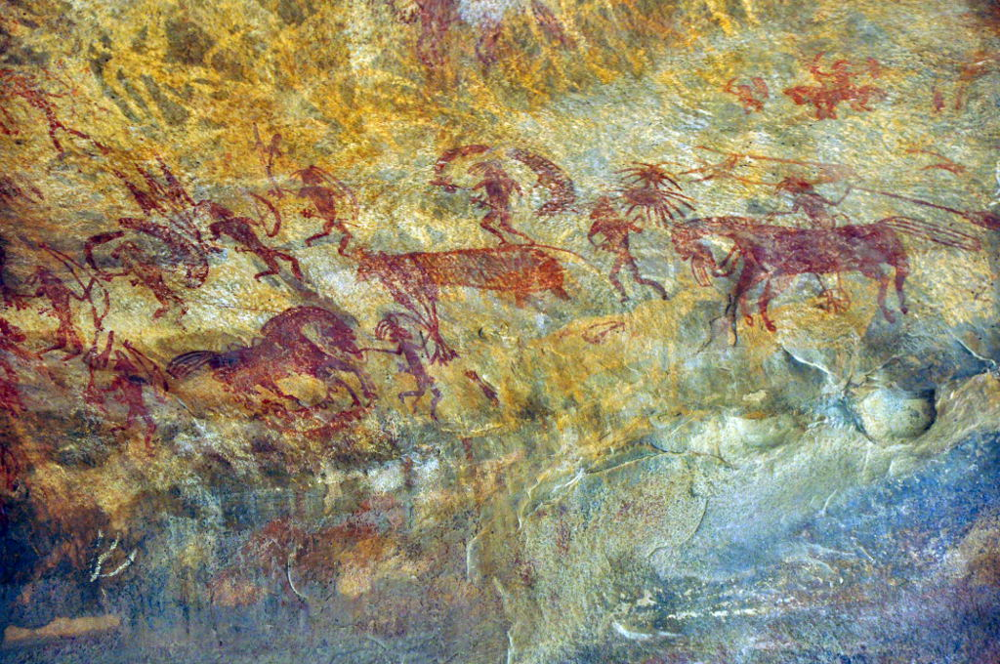

The lack of modern speculation about prehistoric language is surprising,
given how much interest there is both academia and the general public
about other aspects of prehistoric life.
In this article we will explore how language originated and developed
from beyond the mysts of time.

## The Eras Of Language

### 

## Sources Of Evidence

Language does not fossilize.
This sad fact means that all of our knowledge
about how language evolved before the invention of writing
are pure speculation.
Or is it?

There are several sources of evidence about prehistoric languages.

### Physical Remains

There are the mysterious dots in prehistoric paintings
that nobody has been able to decode.
Do they represent concepts of some kind,
or are they just pretty arrangements?

### Language Reconstruction

Indoeuropean is the most famous and studied archaic language.

