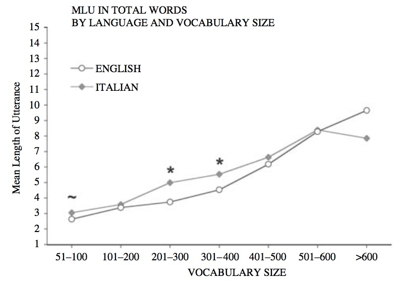

The scarcity of modern speculation about prehistoric languages is surprising,
given how much interest there is both academia and the general public
about other aspects of prehistoric life.
The most likely reason is lack of direct evidence,
which in these unimaginative times is often a showstopper.
But there are many indirect approaches that can give interesting answers.

In this article we will explore how language originated and developed in prehistoric times,
combining language reconstruction and information theory
to arrive at a consistent view of language evolution.
From beyond the mysts of time we will try to make reasoned conjectures and verify them,
or at least lay a path to future discovery.

Note: I am neither a paleontologist nor a linguist,
so treat this humble blog post as part of a hopefully interesting discussion.

## The Eras Of Language

It is not reasonable to expect that language appeared at some point in the past,
perfectly formed with all the elements that it has today.

### Evolution Of Language

Furthermore, in historic times there have been significant improvements.
As [Bakker _et al_ (2002)](#ref05) hint,
subordinate sentences were an innovation to Herodotus
roughly 2,500 years ago (2.5 kya),
who wrote endless sentences and often forgot to finish them
(technically called [anacoluthon](https://en.wikipedia.org/wiki/Anacoluthon)).

Going further back in the past,
partial reconstructions such as the enlightening work done with Indo-European
shows that many elements of language that we take for granted are relatively recent additions.
Proto-Indo-European developed gender gradually,
as explained by [Luraghi (2011)](#ref06).

How far back can we go?
[García Calvo (2003)](#ref03)
is able to reconstruct an even earlier prehistoric language.
Some researchers have even posited a
[Proto-Human language](https://en.wikipedia.org/wiki/Proto-Human_language),
with little credibility.
This is not what we are doing here;
we are not tracing common roots for all languages,
but trying to establish how language features evolved.

We need some other tools to delve into the darkness of time.

### Information Density

The number of possible words in a given language
correlates strongly with how much information can be conveyed:
see [below](#information-content)
for a couple of attempts at quantification.
Modern languages can be seen as open:
the number of productions is unbounded.
This however need not be the case in the past.

Let us start by computing the information carried by a single word.
Using the classic Shannon formula for entropy:

> I = - Σ pi log2(pi)

If all words are equally likely the resulting entropy is

> I = log2(N)

where _N_ is the total number of words or
vocabulary size.
But we can do better using
[Zipf's law](https://en.wikipedia.org/wiki/Zipf%27s_law),
as characterized in
[Yang (2013)](#ref15):
it is the empirical distribution followed by all known languages.
The resulting information content in bits per word
is shown in the table below.

|Vocabulary	size|Bits per word	|
|---	|---	|
|12	|3.1	|
|100	|5.3	|
|200	|6.0	|
|400	|6.6	|
|1000	|7.5	|
|10k	|9.5	|
|20k	|10.1	|

[This script](origins-script.js)
has been used to generate the table.

## A Timeline Proposal

With this data in mind we can create the following timeline.

### Individual Sounds

Our most remote ancestors must have communicated using simple sounds.
Many animals use distinct vocal utterances to express different meanings.
Elements include: pitch, volume and articulation
(the shape of the mouth to generate the sound).

At this point we cannot yet speak about words,
since there is no language system.
Each sound is uttered individually,
making its own "sentence".
Where there are no words there can be no proper sentences.
And without words or sentences there is no "language" to speak about.

Do animals have a grammar,
i.e. do they combine different signs in a coherent whole?
More specifically,
[can chimpanzees talk](http://www.alphadictionary.com/articles/ling002.html)?
[Yang (2013)](#ref15)
compares the relative frequency of words uttered by a chimpanzee
with those from human language,
and concludes that chimpanzees do not have a grammar.

### Single Consonants

The first stage of language must have involved single consonants.
At this point the noises from the fi se consonants can be combined into sentences,
making them basic building elements in a very simplistic sentences.
To combine simple elements they must have been only function words:
prepositions, negations, pronouns, quantifiers and adverbs.
There can be no content words: nouns, adjectives or verbs.

The problem of single consonants is that there are not many of them.
The number of simple, distinct sounds that can be uttered separately,
without combining with others and without significant mixing,
is limited.
Modern languages can have as much as
87 consonants for [Taa](https://en.wikipedia.org/wiki/Taa_language),
about 80 for
[Ubykh](https://en.wikipedia.org/wiki/Ubykh_language).
A single consonant word is thus limited to less than 100 words
in the best of cases,
and probably no further than 30 or so,
since many of these modern consonants are combinations of simple sounds.
These combinations are most probably evolved from groupings,
and are therefore modern constructions.

The number of consonants has probably increased with time.
We can choose any number from 10 to 20 or so,
with the reasonable assurance
that at some point in time humans could only profer that number of words.
A value of 12 seems certainly achievable.
We will use the symbol 𝛫 (math Kappa) to represent a single consonant.

There must have been a definite advantage for hominins that can combine simple meanings
into one coherent whole,
as compared with those that could only emit separate sounds.
Group coordination become possible without having to see each other.
Still, it is hard to see how a language of this kind could work.
For illustration purposes,
in the appendix we have an example of a
[single-consonant language](#singlecon).

At which point in time did the era of single consonants start?
Being so far back in time it is not easy to pinpoint.
The advantage of group coordination would definitely have been greater
when hominins started to hunt in groups,
which may have been
[around two million years ago](http://www.nature.com/news/homo-erectus-footprints-hint-at-ancient-hunting-party-1.17346).
But even such a simple language would also have been useful in foraging.
An educated guess might thus be that a million years ago
(i.e. during the reign of _Homo Erectus_)
hominins could profer single consonants and combine them into simple sentences.

### The Monosyllabic Era

At some point early humans must have learned to combine several sounds
into one syllable.
This great advance extends the range of possible words at least by an order of magnitude.
Considering the simplest structure of two consonants,
or 𝛫𝛫,
the number of words would be the square of the number of consonants.

The evolution so far can be represented as:

> 𝛫 → 𝛫𝛫

Adding a second consonant without a vowel may seem a strange choice.
It is however a logical extension of the single-consonant words seen above,
which does not require additional phonetic categories.

How do languages without vowels work?
The
[rhotic](https://en.wikipedia.org/wiki/Rhoticity_in_English)
pronunciation of English omits vowels in many words.
[Nuxalk or Bella Coola](https://en.wikipedia.org/wiki/Nuxalk_language)
is an example of a contemporary language without vowels;
you can
[hear a sample](https://www.youtube.com/watch?v=dFnrp-cUTLQ).
From our modern perspective,
not having vowels does not mean that all consonants are stuck together
in an unpronunceable blob.
It just means that vowels are not part of the language.
Some kind of vocalic sound must link the two consonants together,
to mark syllable boundaries.
This allows listeners to distinguish a double-consonant word 𝛫𝛫
from two single-consonant words 𝛫-𝛫.

We will use the symbol ∅ (empty set) to represent a vocalic separator.
Biconsonant syllables will therefore be rendered as 𝛫∅𝛫.

In practice, the ∅ can be a neutral vowel or
[schwa](https://en.wikipedia.org/wiki/Schwa).
It can also be a more definite vowel sound,
either automatically assigned by
[prosodic rules](https://en.wikipedia.org/wiki/Prosody_(linguistics)).
or chosen at random.
Technically it is an
[epenthetic vowel](https://en.wikipedia.org/wiki/Epenthesis),
only present to link both consonants.
This would mean that the variants
'SAN', 'SIN' or 'SUN'
are in fact different renditions of the same word 'S∅N'.

A two-consonant language might preserve the original one-consonant functions words 𝛫,
adding 144 content words combining two consonants: 𝛫∅𝛫.
A syllable during this era can therefore be either
𝛫 or 𝛫∅𝛫.
12 consonants would thus yield 144 + 12 = 156 combinations.

What brought forward this advance?
Calling syllables an _invention_ may very well misleading:
it is very likely that both proferring and parsing syllables require adaptations in the brain.
Probably the first words with two consonants were formed by
common linguistic mechanisms:
[compounding](https://en.wikipedia.org/wiki/Compound_(linguistics))
and
[reduplication](https://en.wikipedia.org/wiki/Reduplication)
of function words.
The appendix has a
[hypothetical monosyllabic language](#doublecon).

The monosyllabic era is still alive and well in many languages.
Sino-Tibetan languages in particular have monosyllabic morphemes.
[Michaud (2012)](#ref14)
refers that these monosyllables are often the result of compacting longer words,
and therefore not a direct descendent of monosyllabic languages.

Our reasonable guess for the monosyllabic era is that
it overlapped largely with the emergence of _Homo Sapiens_,
with only minute differences between African and Neanderthal variations.

### Vowels

Consonants cannot properly exist until vowels become
first-class citizens.

With vowels the number of possible syllables grows a bit.
A proper vowel is represented by the symbol 𝛢 (math Alpha).
Let us suppose that there are three possible vowels.
The number of combinations is now:
consonant + vowel + consonant, or 𝛫𝛢𝛫, with 432 combinations,
plus the original 12 single-consonant function words 𝛫,
for a total of 444 combinations.

Vowels may have appeared several times throughout prehistory.
Many of the first written languages only wrote consonants (?).
But almost all languages in the world have vowels,
so that we can infer that their appearance happened before the last diaspora
between 100k and 50k years ago.

[Indo-European ablaut](https://en.wikipedia.org/wiki/Indo-European_ablaut)
[Vowel apophony](https://en.wikipedia.org/wiki/Apophony)

Tracing the appearance of vowels in all languages
is again a hard issue.
At what point in prehistory did this happen?

[García Calvo (2003)](#ref03) notes that Proto-Indoeuropean
(PIE) already has vowels,
while its archaic ancestor (called here AIE for short) didn't.
Keep in mind that PIE is already a modern language
with suffixes, pronouns and conjugation.
It was supposedly spoken around 7 kya,
which is very close to historic times in many places of the world.
A guess about rate of language change would perhaps allow dating
AIE.

### Syllable Extension

The basic problem of a monosyllabic language is how to cram
a large number of words into a single syllable.
There are many possible solutions,
all of which can be seen in modern use.
They fall broadly into three strategies.

The first strategy is to increase the number of consonants and vowels.

* Add clicks.
[Khoisan click languages](https://en.wikipedia.org/wiki/Khoisan_languages)
([sample](https://www.youtube.com/watch?v=W6WO5XabD-s)).
* Consonant combinations,
such as the mix of ⟨t⟩ and ⟨ʃ⟩
to form the
[modern sound for 'ch'](https://en.wikipedia.org/wiki/Voiceless_palato-alveolar_affricate),
tellingly shown in IPA as ⟨tʃ⟩.

The second strategy is to add more phonemes per syllable.

* [Consonant clusters](https://en.wikipedia.org/wiki/Consonant_cluster):
sequences of consonants without vowels.
* [Diphthongs](https://en.wikipedia.org/wiki/Diphthong)
allow combinations of vowels in a single syllable.

The last strategy is to add modifiers for vowels.

* Add different tones, as in
[tonal languages](https://en.wikipedia.org/wiki/Tone_(linguistics))
such as [Bantu](https://en.wikipedia.org/wiki/Bantu_languages)
([sample](https://www.youtube.com/watch?v=ZXAnrqkt_yM))
* Add different contours, as in Chinese
([sample](https://www.youtube.com/watch?v=wkMbSWwS3FA)).
They are a special kind of tone that vary within a syllable.

The fact that all of these mechanisms are so different
are a testimony that they must have been developed separately.
This is only possible if they happened after _Homo Sapiens_ left Africa,
around 70 kya.
After that point these mechanisms developed regionally:
tonal languages in Africa,
contours in Southern Asia,
clusters in Europe,
and so on.

There are few languages on Earth
that have 

We can therefore conclude that all languages were monosyllabic
at least until 50 kya.

### Polysyllabic Words

An immediate extension of two consonant words are three consonant words.
However, it does not look as if this extension has happened always in prehistoric times.

Arab and other semitic languages have
[triliteral roots](https://en.wikipedia.org/wiki/Semitic_root)
consisting of three consonants.
It looks like a straightforward extension
of the two-consonant syllables seen above.

A language with 12 consonants and three vowels
allows combinations:
12 𝛫, 444 𝛫𝛢𝛫, and 15552 𝛫𝛢𝛫𝛢𝛫,
for a total of 16008 combinations.
A gain of more than an order of magnitude over monosyllabic words.

At what point did polysyllabic words arise?
[Agmon](https://en.wikipedia.org/wiki/Semitic_root#CITEREFAgmon2010)
appearanc during the transition to the Neolithic period,
or 15 ~ 10 kya.

[Chinese not monosyllabic](http://www.pinyin.info/readings/texts/east_asian_languages.html#monosyllabic).
[Became polysyllabic about 3000 years ago](https://en.wikipedia.org/wiki/Old_Chinese).
In the reconstruction of [Baxter & Sagart (2014)](#ref12),
Old Chinese was already polysyllabic.
There are some hints at monosyllabic Sino-Tibetan ancestors as in
[Lama (2012)](#ref13),
as recently as 4 kya.

Probably as the necessity arose.

## Alternative Timelines

There are a number of possible objections
that can be raised about this timeline.

### Recent Origin

Many scholars support a much later date for the appearance of language,
around 100 kya.
See [Dediu _et al_ (2013)](#ref07).
It is known that
[Neanderthals had a similar hyoid bone to ours](https://phys.org/news/2013-12-hyoid-bone-analysis-hypothesis-complex.html),
which is probably enough to discard this timeline:
this curious bone is used in speech for articulation.

### Earlier Monosyllabic Era

Our estimation for the monosyllabic era
is from 200k to 100k years ago,
due to the divergence of schemes to extend it
across the world.

There is a small problem with these dates.
When _Homo Sapiens_ left Africa,
there was already a large population of Neanderthals
occupying Europe and Asia.
So it is reasonable to think that these same Neanderthals
might have their own languages,
which influenced the newcomers.

Neanderthals are usually classified as a distinct species from _Homo Sapiens_,
even if there is now ample evidence that both groups could and did interbred.
They should thus be classified as two different subspecies inside _Homo Sapiens_,
as many scientists have advocated for decades.

It has been proposed that languages in North America and Siberia
[share a common ancestry](https://en.wikipedia.org/wiki/Den%C3%A9%E2%80%93Yeniseian_languages);
the separation happened 15,000 years ago.

### Earlier Introduction Of Vowels

The choice of early words consisting of two consonants
may seem arbitrary.
It is very well possible that vowels were introduced earlier,
perhaps with the first syllables.
Words might consist of one consonant plus one vowel;
just adding three vowels to a 12-consonant language
would extend the number of words from 12 to 36.

But there is some evidence supporting the late appearance of vowels.
[García Calvo (2003)](#ref03) makes the argument that prehistoric Indo-European
in its earliest incarnation had no vowels:
just non-content words with a single consonant,
and content words consisting of two juxtaposed consonants.

On the other hand,
there are languages with very different syllable structures,
such as
[Upper Arrernte](https://en.wikipedia.org/wiki/Upper_Arrernte_language)
([sample](https://www.youtube.com/watch?v=aiBnZjOahhM)).

Languages with only simple syllable structures
(V or CV) are 61 out of a total of 486 in
[WALS](http://wals.info/chapter/12).
Interestingly enough,
almost all of them are either in Africa,
Pacific Islands or South America,
suggesting some ancestral clustering.

Ultimately this question is hard to answer
and not terribly significant.
It is possible that certain proto-languages have developed vocals first,
and they may have added a second consonant to syllables later.

> 𝛫 → 𝛫𝛢 → 𝛫𝛢𝛫.

Compare this path with the one described above:

> 𝛫 → 𝛫∅𝛫 → 𝛫𝛢𝛫.

More complex paths are possible:
developing vocals first,
losing them later in favor of biconsonant words,
and regaining them later.

> 𝛫 → 𝛫𝛢 → 𝛫∅𝛫 → 𝛫𝛢𝛫.

In any case, the number of words grows monotonically.

### Hand Signs

It is very tempting to imagine how populations geographically separated
and speaking different languages
might communicate between them.
There is a growing corpus of literature about sign languages.

## Sources Of Evidence

Language does not fossilize.
This sad fact means that all of our knowledge
about how language evolved before the invention of writing
is pure speculation.
Or is it?

There are several sources of evidence about prehistoric languages.

### Physical Remains

There are the mysterious dots in prehistoric paintings
that nobody has been able to decode.
Do they represent concepts of some kind,
or are they just pretty arrangements?

### Modern Languages

Today there are about
[7,099 languages](https://www.ethnologue.com/guides/how-many-languages).
spoken around the world.
It is to be expected that any features before these languages separated
would be shared.

### Language Reconstruction

Indoeuropean is the most famous and studied archaic language.

Rate of linguistic change is hard to estimate.
In historical times languages have varied 
[Nettle](http://citeseerx.ist.psu.edu/viewdoc/download?doi=10.1.1.500.4848&rep=rep1&type=pdf)
argues that languages change faster in small populations.
Here we argue exactly the opposite view:
that languages with few speakers evolve slowly.

### Genetics

There are many genes responsible for speech.
[?]()
[FOXP2](https://en.wikipedia.org/wiki/FOXP2).
This gene has the same expression in humans and Neanderthals,
from which [Dediu _et al_ (2013)](#ref07)
deduce that both groups had mostly equivalent language capabilities.
It is likely that we will be able to trace evolution of speech even further back in time
by following how this and other genes have evolved.

Another important area of study is speech disorders.
The best way to learn how a machine works is often watching how it malfunctions.
Similarly, it is now possible to study how defects in individual genes
affect individuals that carry them.
So if gene that enables syllabic speech can be identified,
it will be possible to study how people without it
(or with a non-functional variant) communicate.
[Vargha-Khadem _et al_ (1995)](#ref10)
study the implications of a genetic issue
on a large family.

Genetics may thus serve as empirical proof of the timeline
that has been sketched in this article.

### Previous Studies

While not direct evidence,
there is a sizeable volume of literature about the origins of language.
[Smillie (1985)](#ref09) models the evolution of early languages
on the acquisition of language by children.
[Hurford (2003)](#ref08) offers a limited view of proto-languages,
without function words.
In the same volume,
[Newmeyer (2003)](#ref11)
gives an overview of other theories.

## Information Theory

Language has many uses.
There can be no doubt that it has gained utility with time.

### Information Content

A very basic criteria that describes a language era is
how many different words can be uttered.
The information content of a sentence depends largely
on the number of different meanings that can be conveyed,
and therefore on the number of words per sentence.

We can estimate the average number of words per sentence using MLU,
[Mean Length of Utterance](https://en.wikipedia.org/wiki/Mean_length_of_utterance).
[Kemper & Sumner (2001)](#ref01) estimate that young adults have a MLU of around 12 ± 4.
With a vocabulary of around
[20k words](http://www.lextutor.ca/research/nation_waring_97.html)
following a Zipf distribution,
each word would carry around 10 bits of information.
Therefore a typical adult sentence might carry 120 bits of information,
if all words were independent.

What happens with smaller vocabularies?
[Devescovi _et al_ (2005)](#ref02) estimate that children with a vocabulary of 101-200 words
have a MLU of around 3.5 words.
200 words following a Zipf distribution would carry around 6 bits per word,
yielding a total of 21 bits per sentence.
Similarly, 400 words would have a MLU of around 4 words,
which at 6.5 bits per word would yield 26 bits per sentence.
1000 words are outside their range of study,
but a MLU of 10 words seems a reasonable extrapolation;
at 7.5 bits per word each sentence would reach 75 bits.
100 words correspond to a MLU of 3
and 5.3 bits per word, or 16 bits per sentence.
On the lower range, a vocabulary of 12 words might have a MLU of 2,
which combined with 3 bits per word yields 6 bits per sentence.

Data from both studies is not necessarily compatible,
as they use different definitions for MLU.
Yet it is reasonable to expect that after a point,
increasing the vocabulary does not entail a corresponding increase in sentence size.
The following table summarizes these estimations.

|Vocabulary	size|MLU	|Bits per word	|Bits per sentence	|
|---	|---	|---	|---	|
|12	|2	|3	|6	|
|100	|3	|5.3	|16	|
|200	|3.5	|6	|21	|
|400	|4	|6.5	|26	|
|1000	|10	|7.5	|75	|
|20k	|12	|10	|120	|

Of course words in a sentence are not independent:
'house' is much more likely to follow 'the' than 'far'.
The actual number of bits per sentence is thus much lower than represented.
But this gross approximation is enough to show that that increasing vocabulary size
initially yields large advances in communication,
and then tapers off.
After around 1000 words gains are incrementally smaller.

In fact, information content would grow even more slowly with vocabulary size,
when considering redundancy in sentences.
Particles and other function words are highly redundant.

### Description

The most primitive use of language is related to the present situation.
It is used to **remove ambiguity**.
Say that two hominins _A_ and _B_ are in a certain setting.
_A_ sees an animal, and wants to communicate it to _B_.
Perhaps their common language has an utterance for 'warning',
not necessarily a word:
it may be a simpler sound like a shout,
or a prosodic change such as an intonation.
It will be _A_'s first utterance.
Combined with a pointing hand it may be enough
to make _B_ look and appraise the situation on their own.
But then _A_ may want to give _B_ a more precise idea of the situation,
even if _B_ is not currently able to see the animal:
let us suppose it just ran away.
Maybe _B_ is far away.
Or maybe even there is a group of listeners:
a shout that lets them know there is a bear nearby
will be much more effective than waiting for them to look for it.
Their reaction if there is a rabbit instead
should be equally swift but completely different.

If their language only has a single word for all animals
_A_ will utter 'animal',
which is not very precise: there is a lot of ambiguity.
It could be a wolf or a sheep,
and both situations will probably call for very different actions.
Perhaps there will be words for 'big' and 'small',
so some of the ambiguity can be removed by saying
'animal small' or 'animal big'.
But a small wolf and a big sheep still call for different actions.
A language with different words for 'wolf' and 'sheep'
will have a distinct advantage for its speakers.
Given the number of different animal species,
a large vocabulary is required to accurately represent even
the most common animal families
(i.e. a single word for 'wolf', 'dog' and 'fox').
Increasing the number of possible words is thus crucial to remove all ambiguity.

More information can be added by adding a plural form:
'one wolf' is a very different situation from 'wolves'
for our hypothetical hominins.
Again, this requires increasing the number of possible words.

### Training

Another important use is training.
Here too language can help to **remove ambiguity**.
Complex techniques require very precise movements,
be they used for tool making, gathering food or hunting game.
Language can be a powerful teaching aid.

Composite materials used for hafting stones to handles
require precise combinations of materials,
each in turn gathered from the correct environment.
[Wadley _et al_ (2009)](#ref04)
explain how red ochre and tree gum must be mixed in precise proportions
and heated near a fire at between 250 °C and 300 °C
to obtain a composite glue for hafting stone points to wooden handles.
There is only one species _Acacia karroo_ which is ideally suited,
and the proportion of ochre must be adjusted depending on its iron content.
This complex process carries a lot of ambiguity
that has to be removed in the teaching process;
it is easy to imagine how training time would have been reduced substantially
with verbal aids guiding the process.
Given that there are archeological samples from at least 70 kya
it seems that language must have been quite advanced by then.

### Telling Stories

A more modern use of language is storytelling.
In this setting the speakers are recounting previous events.
Here too removing ambiguity is essential.

Storytelling is useful as training:
someone listening to hunting stories may learn tips and tricks.
But it goes much deeper than that.
Stories carry with them mythology,
world view, family tree, ethics;
in short, the essentials of human culture.
A complex language and vocabulary
allow for better transmission of information
among groups and between generations.
There is a clear advantage for groups with strong oral culture.

The fact that oral traditions have existed for so long,
and even now are still maintained by certain groups,
points to some innate capability in humans.

## Appendix

It becomes much easier to visualize language types with examples.
In the appendix we will explore several hypothetical languages
to illustrate the different eras of language evolution.

### Singlecon

The first language has just words that consist of a single consonant.
We will call this hypothetical primitive language 'Singlecon'.

#### Vocabulary

In Singlecon we only have 12 words,
that correspond with the 12 consonants:

* one preposition: 'to' ('R'),
* one negation: 'no' ('P'),
* two non-numeral quantifiers: 'much' ('K') and 'little' ('D'),
* two numerals that double as pronouns: 'one' or 'me' ('V') and 'two' or 'you' ('N'),
* and six adverbs: 'down' ('L'), 'up' ('S'), 'here' ('M'),
'near' ('T'), 'out' ('H') and 'far' ('F').

Note that the language consists only of function words.
There are no content words: nouns, verbs or adjectives.

#### Samples

A few sentences in Singlecon follow.
They show the value of combining words for a group of foragers or hunters.

* 'V M. N H.'
Means 'one here. two out.':
the speaker will remain here while the listener goes away.
* 'V R. N M.'
Means 'one to. two here.':
the speaker will go to the objective;
the listener must stay here.
* 'K S. D M.'
Means 'much up. little here.':
there is a large quantity of what the speaker is seeking going up,
while there is little to be found here.
* 'T L.'
'near down.':
the objective is near but they need to go down.
* 'K K'.
Means 'much much.':
there is a lot of what the speaker is seeking.

#### Grammar

Even with such a simple language a grammar would be needed,
to convey different meanings depending on the combination.
For instance, 'near much' would mean that the objective is very near,
while 'much near' would mean that there is a lot of what the speaker is seeking nearby.

## Doublecon

Our next language is an evolution of Singlecon
that allows for monosyllabic words with two consonants and a schwa.
It still keeps single-consonant function words,
while the new combinations are content words.
We will call it Doublecon.

### Vocabulary

Doublecon has a maximum of 144 content words,
that can work as nouns, verbs or adjectives depending on the situation.
Words are formed with two consonants by
reduplication and composition.

* The combination of 'down' ('L') and 'to' ('R') is 'L∅R'
and refers to something that moves on the ground
such as a small animal.
* 'up' ('S') + 'to' ('S∅R') is a big animal.
* The combination of 'near' ('T') with 'much' ('K'), 'T∅K',
represents 'family'.
* 'near' ('T') combined with itself is 'T∅T'
which means 'good'.
* 'to' + 'down': 'R∅L', trail.

Even when words are formed as compounds
there is considerable arbitrariness in the process.
The combination of 'down' with 'to' ('L∅R') is small animal,
while 'to' + 'down' ('R∅L') is trail.
It might perfectly be the other way around.

### Samples

A few sentences in Doublecon follow.

* 'T∅K M': 'family here',
the family has arrived.
* 'V R S∅R. N M.':
'me to big animal. you here.',
I will go to the big animals, you stay here.
* 'S∅R K S.': 'big animal much up',
there is much big game going up.

Note that it is very important to distinguish between
two single-consonant words and one syllable:
'S R' from 'S∅R'.
In the first case there is a small pause between
both utterances, while in the second the schwa provides vocal continuity.

### Grammar

A simplistic grammar is needed to combine content and function words.

## References

* 
Kemper, S. & Sumner, A. (2001). The structure of verbal abilities in young and older adults.
_Psychology and Aging_, 16, 312-322.
[Ref](https://kuscholarworks.ku.edu/handle/1808/8619?show=full),
[PDF](https://kuscholarworks.ku.edu/bitstream/handle/1808/8619/Kemper%20Verbal%20Abilities%20author%20final.pdf;sequence=1).
* 
Devescovi, A., Caselli, M. C., Marchione, D., Pasqualetti, P., Reilly, J., & Bates, E. (2005).
A crosslinguistic study of the relationship between grammar and lexical development.
_Journal of Child Language_, 32(4), 759-786.
[PDF](https://www.researchgate.net/profile/Antonella_Devescovi/publication/262683112_J_Child_Lang2005/links/0deec5386f74cb8ce0000000/J-Child-Lang2005.pdf).
* 
García Calvo, A (2003).
~Es~ Estudio de Gramática Prehistórica (Spanish).
Ed. Lucina.
[Ref](http://www.editoriallucina.es/articulo/es-estudio-de-gramatica-prehistorica_21.html).
* 
Wadley, L., Hodgskiss, T., & Grant, M. (2009).
Implications for complex cognition from the hafting of tools with compound adhesives in the Middle Stone Age, South Africa.
_Proceedings of the National Academy of Sciences_, 106(24), 9590-9594.
[Ref](https://www.ncbi.nlm.nih.gov/pmc/articles/PMC2700998/).
* 
Bakker, E. J., de Jong, I. J., & van Wees, H. (Eds.). (2002).
_Brill's companion to Herodotus_. Brill.
[Ref](https://books.google.es/books?id=z38tDgAAQBAJ&pg=PA59&lpg=PA59&dq=anacoluthon+herodotus&source=bl&ots=ZPXd7-JOFu&sig=g4VGD3p-IhLycomf-xDgp2SHPH8&hl=es&sa=X&ved=0ahUKEwj_vM6mptXVAhUkAsAKHfC_DcMQ6AEIJjAA#v=onepage&q=anacoluthon%20herodotus&f=false)
* 
Luraghi, S. (2011).
The origin of the Proto-Indo-European gender system: Typological considerations.
_Folia linguistica_, 45(2), 435-463.
[PDF](http://www.academia.edu/download/30873708/Gender_FoL.pdf).
* 
Dediu, D., & Levinson, S. C. (2013).
On the antiquity of language: the reinterpretation of Neandertal linguistic capacities and its consequences.
_Frontiers in psychology_, 4.
[Ref](https://www.ncbi.nlm.nih.gov/pmc/articles/PMC3701805/).
* 
Hurford, J. R. (2003).
The language mosaic and its evolution.
_Studies in the Evolution of Language, 3_, 38-57.
[Ref](http://www.lel.ed.ac.uk/~jim/nustates.htm).
* 
Smillie, D. (1985).
Sociobiology and human culture.
In _Sociobiology and epistemology_ (pp. 75-95). Springer Netherlands.
[Book](https://books.google.es/books?hl=es&lr=&id=4AM9VoCtH_EC&oi=fnd&pg=PA75&ots=QKa6OlCe8S&sig=SAbV4_ALqPIPSvlimgwaNmrKoFc#v=onepage&q&f=false).
* 
Vargha-Khadem, F., Watkins, K., Alcock, K., Fletcher, P., & Passingham, R. (1995).
Praxic and nonverbal cognitive deficits in a large family with a genetically transmitted speech and language disorder.
_Proceedings of the National Academy of Sciences_, 92(3), 930-933.
[PDF](https://www.ncbi.nlm.nih.gov/pmc/articles/PMC42734/pdf/pnas01481-0291.pdf).
* 
Newmeyer, F. J. (2003).
What can the field of linguistics tell us about the origins of language?.
_Studies In The Evolution Of Language, 3_, 58-76.
[Ref](https://books.google.es/books?hl=es&lr=&id=OeN2Rhvfdn4C&oi=fnd&pg=PA58&dq=What+can+the+field+of+linguistics&ots=tuUVjyFPeL&sig=pgYVxdtUfd-R-WmcvS6_f5bKDC0#v=onepage&q=What%20can%20the%20field%20of%20linguistics&f=false).
* 
Baxter, W. H., & Sagart, L. (2014).
_Old Chinese: a new reconstruction_, 318. Oxford University Press.
[Ref](https://books.google.es/books?id=K6Q-BAAAQBAJ&printsec=frontcover&dq=isbn:9780199945375&hl=es&sa=X&ved=0ahUKEwip-qb-hdnVAhUIKsAKHVqvAp0Q6AEIJjAA#v=onepage&q=monosyllabic&f=false).
* 
Lama, Z. Q. F. (2012).
Subgrouping of Nisoic (Yi) languages: A study from the perspectives of shared innovation and phylogenetic estimation.
[PDF](https://uta-ir.tdl.org/uta-ir/bitstream/handle/10106/11161/Lama_uta_2502D_11591.pdf?sequence=1).
* 
Michaud, A. (2012).
Monosyllabicization: patterns of evolution in Asian languages.
_Monosyllables: from phonology to typology_, 115-130.
[PDF](https://hal.archives-ouvertes.fr/docs/00/43/64/32/PDF/Monosyllabicization_In_Asia_Michaud_preprint_Nov2009.pdf).
* 
Yang, C. (2013).
Ontogeny and phylogeny of language.
_Proceedings of the National Academy of Sciences_, 110(16), 6324-6327.
[Ref](http://www.pnas.org/content/110/16/6324.full).

