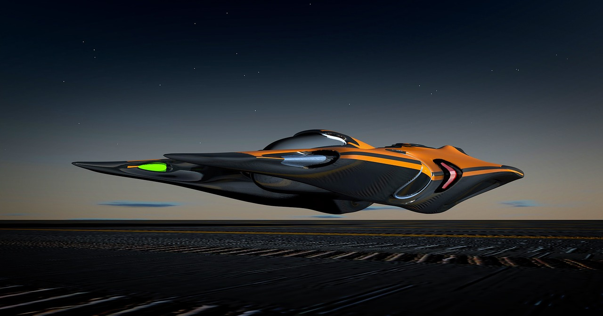

Space launchers, and more specifically
[mass drivers](https://en.wikipedia.org/wiki/Mass_driver),
are a long-standing alternative to rockets for reaching space.
For instance,
[Angel (2006)](https://www.ncbi.nlm.nih.gov/pmc/articles/PMC1859907/) proposes an electromagnetic launcher to cool the Earth.
In this article we will explore how to build one today.

## The Space Gun

We present a plan to build a space gun with existing technologies.
It is easy to envision futuristic means of transportation,
as we will see in the next sections;
but a space gun is well within the state of the art,
and can be realistically built in the next decade.

In essence it is just a long
[coilgun](https://en.wikipedia.org/wiki/Coilgun)
in a vacuum:
electromagnetic forces push a vehicle up a tunnel,
until it enters the atmosphere and hopefully reaches space with the impulse.
Our aim is to reach low earth orbit (LEO),
and more specifically 400 km,
which happens to be the altitude of the
[International Space Station](https://en.wikipedia.org/wiki/International_Space_Station).
The speed required is 7.7 km/s (27,600 km/h; 17,200 mph).

We will use a reference speed of 9 km/s at the moment of leaving the coilgun,
allowing for speed losses due to drag.
Our reference vehicle weight will be 10 tons.
How can we get it to space?

### Location

The ideal place for launch is a very high mountain,
which reduces air density and therefore drag on the vehicle after leaving the tunnel.
But construction at very high altitudes is complex.
Also, remote locations are hard to reach:
mountains above 8000 m high can only be found in the Himalayas and the nearby Karakoram.

A compromise location is a relatively high mountain near Europe.
Here we will build our space launcher at
[Pico del Teide](https://en.wikipedia.org/wiki/Teide),
a 3718 m peak in Spain.
It has the ideal curvature: it raises 3.7 km in 28 km,
with a steeper slope near the peak.

Pico del Teide is part of Teide National Park,
which means that it is protected:
in particular, exploitation of natural resources is forbidden.
An exemption can be made in this case,
since a mass driver will largely preserve the environment.
There is precedent: it has been used
(appropriately enough)
as a Mars testbed due to its
[similar conditions](http://news.bbc.co.uk/2/hi/science/nature/4767403.stm).

There are also a few complications.
Teide is an active volcano;
apart from volcanic eruptions,
[tectonic movements](https://www.express.co.uk/news/science/717563/Canary-Islands-earthquake-tremors-Tenerife-Mount-Teide-volcano)
are common in the area and may damage the tunnel.
To make it a feasible location comprehensive geological studies need to be performed
to avoid any hot spots of volcanic activity.

To prevent accidents the precise location must be chosen carefully:
there need to be no villages on the slope opposite the tunnel entrance.
Any failed launches will probably fall in the sea,
but if post-lauch speed is below 500 m/s they might fall on the island.
Also, a wide area near the tunnel exit and along the intended trajectory
will need to be evacuated whenever launches are scheduled.

I contend that a space launcher will also be a major tourist attraction,
both for the mountain and the island.
The entry point can be visited all year round.
Together with the influx of high quality jobs
the space launcher should be a major boom for the island.

### Big Tunnel

The space gun is based on a long tunnel in which a near vacuum has been created.
It spans 28 km from sea level to the top of the Teide.
Such a large tunnel with a near vacuum may seem crazy,
but it is not outside the realm of possibility at all.
Think of
[CERN LHC](https://en.wikipedia.org/wiki/Large_Hadron_Collider):
a 27 km long circular tunnel with a perfect vacuum.
It was originally built in 1988,
and completely refurbished in 2006 for
[approximately 200 million USD](https://tunneltalk.com/CERN-Aug01-Construction-of-great-excavations2.php).

Can this tunnel make us reach our target speed of 9 km/s?
As it happens a constant acceleration of 150g applied for about 6 seconds
along 28 km will do the trick.
Computations are
[detailed below](#Computations).

Construction will proceed in stages.
Entries at least every kilometer should allow easy access to the tunnel for repairs.

A regular
[Tunnel boring machine](https://en.wikipedia.org/wiki/Tunnel_boring_machine)
or TBM should do the job,
and keep costs low.

The coilgun consists of a big number of wire loops,
each with a current passing through it at the exact moment that the vehicle reaches it.
Each coil is a section of wire loops that is connected to a large capacitor
at the exact time that the vehicle passes through it.
Energy is therefore stored in the capacitors,
and released at a precise moment.

The tunnel must have a near vacuum to avoid friction with the vehicle,
so it needs high performance pumps and seals.

### Launch

Before each launch all coils must be charged.
When the vehicle passes through them they will release their energy,
imparting it onto the vehicle.
Synchronization of the coils is essential.

At the precise moment of launch the vehicle lies at rest
at the foot of the tunnel.
The tunnel passage would be very swift:
it will take around 6 seconds to reach our target speed of 9 km/s.

After firing all coils the projectile should reach our reference speed of 9 km/s.
With a mass of 10 tons the kinetic energy would be 400 Gigajoules,
or 110 Megawatt-hour.
At a standard price of €0.10 per KWh,
and assuming an efficiency of 80%,
the total cost per launch is €14k.
An efficiency of 90%
[has been estimated](http://www.dtic.mil/cgi-bin/GetTRDoc?AD=ADA426465&Location=U2&doc=GetTRDoc.pdf).
Even with lower efficiencies the cost is not dramatic.

The whole power needs to be released in 6 seconds,
and so result in an insane power release of 67 Gigawatt.
But electrical power can be generated slowly and stored in the coils themselves
if they are superconducting,
or in batteries otherwise.
Assuming the coils can be charged in 24h only 4 megawatt are needed,
which can be achieved with a
[small solar farm](http://www.macon.com/news/business/article30238353.html).

The top of the tunnel should open automatically.
A [plasma window](https://en.wikipedia.org/wiki/Plasma_window)
has been proposed,
but it is not necessary:
a regular diaphragm is enough to keep air out of the tunnel
and open in a few seconds.

### Efficiency and Dissipation

We now come to the most complex part of the project:
efficiency, heat and dissipation.
[Davis (2004) says in "Advanced Propulsion Study", p. 22](http://www.dtic.mil/cgi-bin/GetTRDoc?AD=ADA426465&Location=U2&doc=GetTRDoc.pdf):

> There is no practical technical limit to the launch velocity and length of the barrel in coilguns, but
performance is ultimately limited by thermal and mechanical failure of the drive coils, along with the
voltage and current limitations of the silicon-controlled rectifiers used for switching.
[...]
The quenched coils in a superconducting coilgun
generate a great deal of heat, and thus a cryogenic refrigerator to remove the heat would have to be scaled
so large that such a gun cannot be applied to space transportation.

Some insights can be found in papers by
[Cravey _et al_ (1995)](http://www.eecs.ucf.edu/seniordesign/sp2014su2014/g10/research/other_sources/00599800.pdf)
and
[Williamson & Smith (1997)](https://www.coilgun.info/theorymath/ieee/pulse_limits_1997.pdf).
According to
[Marder (1993)](https://www.coilgun.info/theorymath/ieee/coilgun_primer.pdf)
it is possible.
And
[Balikci _et al_ (2007)](https://www.researchgate.net/profile/Abdulkadir_Balikci/publication/3112247_On_the_Design_of_Coilguns_for_Super-Velocity_Launchers/links/53ea343f0cf2fb1b9b676bdf.pdf)
only add more stages.

#### Water Coolant and Propellant

There is an interesting variant:
carry a ton of water as coolant.
[Specific heat of water is ten times bigger than copper](https://en.wikipedia.org/wiki/Heat_capacity).

Also 2 MJ/Kg are needed to
[vaporize water]() [replace](https://answers.yahoo.com/question/index?qid=20110315071128AAynL0r).

So 2 GJ would be used just to vaporize the ton of water.
As it boils,
water vapor can be directed through a nozzle and propel the vehicle even further.
Explosive heating would be a problem, since water would be heated in just 6 seconds.
But the pressures involved should not be too terrible.

#### Superconductors

Superconducting wires can store current without loss.
They have been successfully used in several maglev projects;
the low temperatures required can be reached relatively easily in a sealed tunnel.

#### Alternative Propulsion

Tanks built to withstand
[1000 atmospheres](https://wikivisually.com/wiki/Hydrogen_tank)
are used for storing hydrogen.

### Atmospheric Passage

When reaching the atmosphere the vehicle will be moving at a very high speed.
Since the vehicle is launched from a relatively low altitude,
aerodynamics must be considered.
To reach low earth orbit (LEO)
it should fly at at least 7.8 km/s;
and considerably more if we take drag into account.

We can take as reference a post-launch speed of 9 km/s;
this is almost Mach 30,
and the vehicle would instantly be hypersonic.
Impact with air would result in a tremendous deceleration.

[This simulation](http://pinchito.es/mass-driver/drag.html)
allows you to change several parameters
and simulate the flight.

### Vehicle

Having a heavy vehicle is important to withstand drag forces
upon entering the atmosphere:
a light vehicle would lose too much speed as to reach LEO.
A 10-ton vehicle would be similar in weight to an
[Eurofighter Typhoon](https://en.wikipedia.org/wiki/Eurofighter_Typhoon).

A [waverider design](http://www.aerospaceweb.org/design/waverider/main.shtml)
should allow the vehicle to reduce drag,
and therefore reach LEO with our design speed.
Note that several hypersonic vehicles have been designed and operated to date.

Construction of this vehicle may seem like a big task,
but what we have is basically a glider with no motors.
It should be much cheaper to build than hypersonic planes.

The vehicle can be made to reenter the atmosphere and be reused multiple times.
An ablation shield must then be used to absorb the heat of reentry.
Another option is to build cheap disposable vehicles.

Magnetic levitation might be impractical for an aerodynamic vehicle.
An interesting option is to embed the vehicle in a cylindrical
[sabot](https://en.wikipedia.org/wiki/Sabot)
with optimal magnetic properties,
and then discard it at exit.
This is the technique used for military railguns.
As a bonus the sabot might absorb part of the shock when entering the atmosphere.

The vehicle itself can be used for unmanned exploration.

### Cargo

Cargo is limited to what the vehicle can carry aboard.
The kind of cargo bay that can be fit in the vehicle is not large,
but it can carry a sizeable weight:
of the 10 tons for the complete vehicle around half might be cargo.
But even one ton would be a great help to space exploration.
Obviously the space launcher would not be able to send large payloads to LEO,
so it would not be a substitute to rockets, for now.
But it is very useful to send supplies to orbiting spaceships,
such as the International Space Station (ISS).

Certifying the cargo for an acceleration of 150 g should not be hard.

### Human Tripulated Ship

The problem of transporting humans is entirely different.
We are squishy and do not tolerate well accelerations beyond 4 g.
On a 28 km tunnel the exit speed would be of at most 1500 m/s.
The vehicle should carry enough fuel to reach LEO after that.

This launch speed would be no small feat.

That is, unless we visit more exotic options.
Fighter pilots regularly withstand
[more than 10g](https://ntrs.nasa.gov/archive/nasa/casi.ntrs.nasa.gov/19980223621.pdf),
which would give us 2366 m/s.
This speed is almost as much as the delta-v generated by the first stage of the
[Saturn V](https://en.wikipedia.org/wiki/Saturn_V),
and can be used to launch a small rocket to LEO.
This acceleration would be sustained for only 12 seconds:
with a proper suit a trained subject would remain conscious.

A human in a liquid tank should resist higher accelerations.

## Going to Mars… and Back

Rockets have dominated interplanetary exploration since the beginning of the space age.
They have served us well for reaching the Moon,
first with probes and then by a few select astronauts.
Mars however is a different story.

Travelling to Mars is quite easy:
many probes have been sent there.
The problems start when you want to return afterwards.
With only 0.16g launching from the Moon was easy enough,
and could be done with a
[relatively low-powered system](https://en.wikipedia.org/wiki/Ascent_Propulsion_System).
But Mars gravity is more than twice at 0.38g,
and also there is an atmosphere.
A proportionally big rocket is required to leave the Martian surface.

### SpaceX

Elon Musk often speaks about reaching Mars.
His plan is quite complex,
depending on several launches and in-orbit refuelling.
It is also quite expensive:
[around 10 billion dollars](https://www.nytimes.com/2016/09/28/science/elon-musk-spacex-mars-exploration.html).

The problem of reusable rockets is that they have not been proven in practice.
The Space Shuttle program used reusable boosters and a reusable vehicle;
it was
[quite more expensive](https://en.wikipedia.org/wiki/Criticism_of_the_Space_Shuttle_program)
than expendable alternatives which are still in operation.

SpaceX currently has the most powerful
[operational rocket](https://en.wikipedia.org/wiki/Comparison_of_orbital_launch_systems),
the recently launched
[Falcon Heavy](https://en.wikipedia.org/wiki/Falcon_Heavy).
Going to Mars requires a large ship,
with a lot of fuel if they intend to get back.

A practical means of sending cargo up to Earth orbit would help lowering costs.
Only the (mostly empty) spaceship and the tripulants needs to be sent up in a rocket;
everything else including fuel can be sent up using a space launcher.

### NASA

NASA has sent a few very successful robotic probes to Mars.
But a manned (or should we say, "peopled") rocket is a different story:
they always seem to be a decade away from sending the first human expedition.

Funding is one issue:
[diminishing budgets](https://en.wikipedia.org/wiki/Budget_of_NASA)
have affected NASA's ability to embark in complex missions,
and Mars is very far away and quite inhospitable.
The lack of suitable vehicles is another important factor.

There is currently no vehicle capable of launching a big payload.
Since the demise of the Space Shuttle NASA has had no powerful rockets of its own.
It is planning to build the
[Space Launch System](https://en.wikipedia.org/wiki/Space_Launch_System)
in the next years,
at a very high cost.

### Other Systems

Blue Origin has plans for space exploration.
The company is
[not yet ready](https://www.geekwire.com/2016/jeff-bezos-lifts-curtain-blue-origin-rocket-factory-vision-space/)
to reach Mars.
China is also planning missions to Mars,
but the outlook is
[still very uncertain](https://www.chinaspaceflight.com/rocket/Heavy-Lift-Launch-Vehicle/Heavy-Lift-Launch-Vehicle.html).

## Other Options

Mass drivers are not the only alternative to rockets.
Wikipedia has a
[few ideas](https://en.wikipedia.org/wiki/Non-rocket_spacelaunch),
some of which we will consider here.

### Star Tram

The
[Star Tram](https://en.wikipedia.org/wiki/StarTram)
concept is very similar to the space launcher considered here.
Gen-1 is cargo-only;
acceleration is slower than here (30 g),
and therefore exit speeds are smaller.
Gen-2 relies on 20 km high launch and is not feasible yet.

### Space Elevator

Dramatically illustrated by Arthur C. Clarke in
[The Fountains of Paradise](https://en.wikipedia.org/wiki/The_Fountains_of_Paradise),
a space elevator consists of a very long tether reaching from LEO to Earth surface.
It is not yet a practical concept.

### Launch Loop

Another great idea that is well outside the realm of possibility right now.

## Computations

Detailed computations are presented here.

### Kinetic Parameters

We have to accelerate a 10-ton vehicle to 9 km/s in 28 km:
$$v = 9\frac{\mathrm{km}}{\mathrm{s}}$$
$$\Delta x = 28\mathrm{km}$$
Assume constant acceleration $a$.
The motion is described by these well known two equations:
$$v = a \cdot t$$
$$\Delta x = \frac{1}{2} \cdot a \cdot t^2.$$
Passage time can be computed as:
$$ t = \frac{2 \cdot \Delta x}{v} = 2 \cdot \frac{28 \cdot 10^3 \mathrm{m}}{9 \cdot 10^3 \frac{\mathrm{m}}{\mathrm{s}}} \approx 6.2 s.$$

Acceleration is thus:

$$a = v / t = 9 \cdot 10^3 m/s / 6.2 s \approx 1.45 \cdot 10^3 m/s^2.$$

Or 145 g, where g is the acceleration of gravity on Earth.

### Energy and Power

Kinetic energy can computed as:

$$E = m \cdot v^2 / 2.$$

At 9 km/s a 10-ton vehicle will have:

$$E = 1/2 \cdot 10^4 kg \cdot (9 \cdot 10^3 m/s)^2 \approx 400 \cdot 10^9 J = 400 GJ$$

Or 400 gigajoules. That is
[111 megawatts-hour](http://online.unitconverterpro.com/conversion-tables/convert-group/factors.php?cat=energy&unit=0&val=400).

[Electricity prices](https://en.wikipedia.org/wiki/Electricity_pricing)
vary wildly across Europe;
we can use an industrial price of around €0.10 per KWh.
With 80% efficiency, total cost $C$ is:

$$C = 111\mathrm{MW}\cdot\mathrm{h} \cdot €0.10 / \mathrm{KW}\cdot\mathrm{h}/ 0.80 = €13875.$$

or around €14K.

Power required depends on charging time.
Assuming the tunnel can be charged over a 24h period:

P = E / t = 400 GJ / 86400 s = 4.63 MW

or around 4 megawatt.

### Efficiency and Dissipation

As explained in
[Zabar _et al_ (1989)](https://coilgun.info/theorymath/ieee/design_power_condition.pdf),
efficiency depends on the slip at each coil,
which is computed using the difference between the vehicle speed $V$
and the speed of the travelling wave $V_s$:
$$S = \frac{V_s - V}{V_s}$$
Efficiency will thus be:

[Davis (2004)](http://www.dtic.mil/cgi-bin/GetTRDoc?AD=ADA426465&Location=U2&doc=GetTRDoc.pdf)
mentions an efficiency of > 90% as a great achievement.
A 10-ton vehicle at 9 km/s has a kinetic energy of 400 GJ,
which can not be overstated as a tremendous amount of energy.
With such an efficiency of 90%,
energy losses would amount to 40 GJ,
and would be directly converted into heat.

Let us suppose a copper sabot weighing a ton,
which should maximize conductivity and heat capacity.
The specific heat of copper is:

$$Cp = 430 J/(Kg\cdot K).$$

We will consider a maximum temperature of

$$T_max = 1000\mathrm{K},$$

a bit below the fusion temperature of copper,
then thermal energy $E_t$ will be:

$$Et = Cp \cdot m \cdot T \implies T = Et / (Cp \cdot m).$$

With $40\mathrm{GJ}$ we would raise $10^3\mathrm{Kg}$ to

$$T = 40 GJ / (430 J/(Kg\cdot K) \cdot 10^3 Kg) \approx 10^5 K.$$

Such a temperature would instantly vaporize all known materials.

Even working with an efficiency of 99%, we would still have to dissipate $4\mathrm{GJ}$, enough to heat the sabot to $10^4\mathrm{K}$.
An efficiency of 99.9% would be needed to lower the temperature to $T_max$.
Is such an efficiency even possible?
According to [Zabar _et al_ (1989)](https://coilgun.info/theorymath/ieee/design_power_condition.pdf),
it requires increasing the number of coils as desired.

It also depends on what part of the heat will be generated in the coils and which in the vehicle.
Heat in the coils is much less critical since it would be spread among many tons of copper.
Even with only 90% efficiency, $4\mathrm{GJ}$ can be spread among 100 tons of copper
and avoid reaching $T_max$.

Energy is proportional to mass.
Since kinetic energy is also proportional to mass,
reducing the vehicle's mass will not change the temperatures involved.
But lowering the exit speed would make a big change:
$$Et = Cp \cdot m \cdot T \approx (1 - η) \cdot E_k = (1 - η) \cdot m \cdot v^2 \implies T = (1 - η) \cdot v^2 / Cp.$$
$$v = 3 km/s \implies T = 0.1 \cdot 9 \cdot 10^6 / 430 \approx 2000 K,$$
if all heat is generated in the sabot.
If it is spread between sabot and coils,
temperature might be reduced to half that and be within parameters.

Of course,
$1000\mathrm{K}$ is still a considerable temperature that would cause significant plastic deformations.

Water dissipation would help with a specific heat of
$4\frac{\mathrm{KJ}}{\mathrm{Kg}\cdot{K}}$.

## Conclusion

A space launcher can be a great help for space exploration,
enabling the supply of larger ships at a very low cost.

Nothing revolutionary has been proposed in this article;
everything is based on existing technologies.

### Acknowledgements

Thanks to [Carlos Santisteban](https://twitter.com/zuiko21)
for his help.

