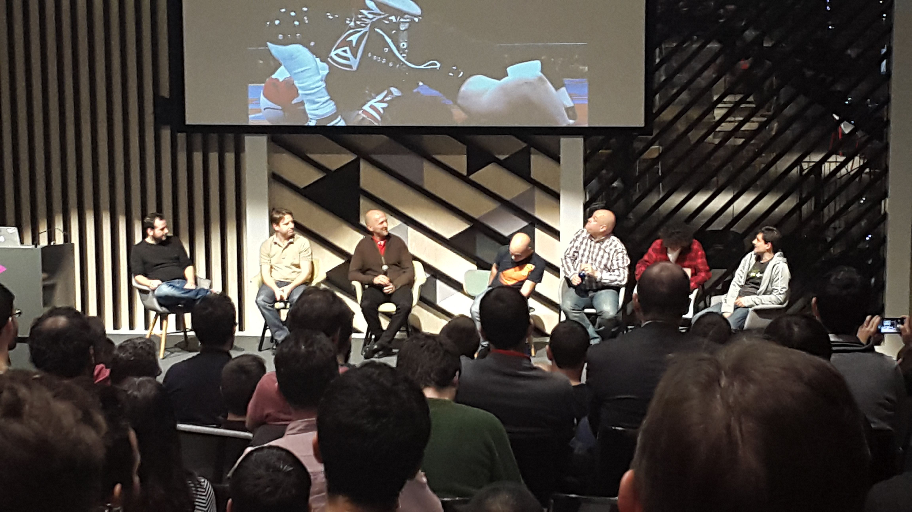

A estas alturas igual ya has oído la noticia,
bien en algún Meetup o por [Twitter](https://twitter.com/pinchito):
en julio dejo la organización de 
[MadridJS](https://www.meetup.com/es-ES/madridjs/)
y
[Node.js Madrid](https://www.meetup.com/es-ES/Node-js-Madrid/).

## ¿Y eso por qué?

Tengo dos motivos principales para dejar el grupo.
Hace poco, en marzo, he entrado en
[Influencity](https://influencity.com/en)
para liderar el desarrollo
de la mejor plataforma de _influencer marketing_ que el mundo jamás ha conocido.

Además, el año que viene voy a irme a vivir a Viena con mi familia
para que mi hija aprenda alemán.
Si todo va bien seguiré trabajando para Influencity en remoto
y viniendo a Madriz cada cierto tiempo.

## Un poco de historia

Allá por marzo de 2013, recién entrado como desarrollador backend en Mediasmart,
me atreví a presentar una charla a un grupo local llamado MadridJS.
Llevaba desarrollando profesionalmente desde 1998;
aunque durante esos 15 años me había sentido tentado por ir a los grupos locales,
nunca me había decidido.
Ya que estaba currando en una startup molona tenía ganas de contar cosas.

La charla iba sobre [Node.js y websockets](https://www.meetup.com/es-ES/madridjs/events/105582592/),
tema que me interesaba especialmente.
Con más de 700 miembros, era todo un reto.
Así que, más nervioso que valiente,
me planté delante de casi 70 personas
con mucha espectación:
Isra me contó que había récord de gente en lista de espera.

Por suerte para mí el vídeo ya no está online,
aunque lo he buscado, no os creáis:
Vimeo, en su infinita sabiduría,
ha decidido borrarlo del [grupo](https://vimeo.com/search?q=madridjs).

Lo que pasó después te sorprenderá: me picó el gusanillo.
En septiembre de 2013 presenté otra charla,
esta vez sobre [despliegue automático](https://www.meetup.com/es-ES/madridjs/events/139309612/).
En 2014 empecé a ayudar a la organización,
que en aquel momento era básicamente Israel Alonso:
el otro cofundador del grupo, Enrique Amodeo,
se mudaba a Berlín.

También en 2014 me hice cargo de un grupo creado recientemente por Iván Pérez,
a quien quiero agradecerle su confianza.
Hicimos el primer encuentro en [Medialab Prado](https://www.medialab-prado.es/actividades/taller-de-nodejs).

En 2015 Isra se estaba centrando en metodologías ágiles,
así que me hice cargo del grupo.
Por suerte rápidamente llegaron Manu Fosela y Javi Vélez para ayudar a organizar,
sobre todo para presentar eventos.

## Balance

¿Qué cosas valoro más (y menos) de este tiempo?

### Lo bueno

El grupo ha crecido de forma 

 hablan por sí solas.](pics/adios-madridjs-stats.png "Seguimos creciendo a buen ritmo.")

### Lo malo

Considero un fracaso personal no haber conseguido 

## Conclusión

Estos cinco años han sido un viaje alucinante.

### Agradecimientos

Thanks to my daughter Lucía for being so curious about speeds.
Thanks to [Carlos Santisteban](https://twitter.com/zuiko21)
for [the reference to the 2009 satellite collision](https://twitter.com/zuiko21/status/1137271254635950081).

