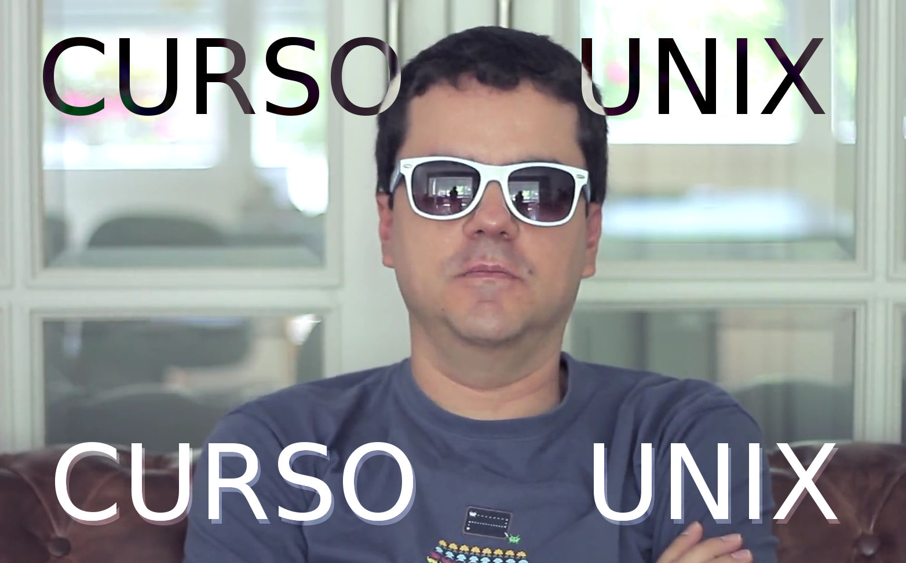

En 2014 grabé para Floqq, una plataforma de cursos online,
un curso de Unix bastante completo.
Ya era hora de publicarlo en YouTube como curso gratuito,
así que ¡ahí va!

## Contenido

Puedes seguir las [diapos](https://slides.com/alexfernandez/unix-floqq).

### Trailer

<iframe width="560" height="315" src="https://www.youtube-nocookie.com/embed/hsnTBBYlcU4" frameborder="0" allow="accelerometer; autoplay; encrypted-media; gyroscope; picture-in-picture" allowfullscreen></iframe>

### Capítulo 0: Introducción

<iframe width="560" height="315" src="https://www.youtube-nocookie.com/embed/9WkjCgU6VbI" frameborder="0" allow="accelerometer; autoplay; encrypted-media; gyroscope; picture-in-picture" allowfullscreen></iframe>

### Capítulo 1: ¡Hola, mundo!

<iframe width="560" height="315" src="https://www.youtube-nocookie.com/embed/EtZlMg9irXs" frameborder="0" allow="accelerometer; autoplay; encrypted-media; gyroscope; picture-in-picture" allowfullscreen></iframe>

### Capítulo 2: Introducción a Unix

<iframe width="560" height="315" src="https://www.youtube-nocookie.com/embed/9aAK8sLdEAs" frameborder="0" allow="accelerometer; autoplay; encrypted-media; gyroscope; picture-in-picture" allowfullscreen></iframe>

### Capítulo 3: Todo son ficheros

<iframe width="560" height="315" src="https://www.youtube-nocookie.com/embed/uHBOty_Q7TM" frameborder="0" allow="accelerometer; autoplay; encrypted-media; gyroscope; picture-in-picture" allowfullscreen></iframe>

### Capítulo 4: Texto, la interfaz universal

<iframe width="560" height="315" src="https://www.youtube-nocookie.com/embed/6MisKBXaMkc" frameborder="0" allow="accelerometer; autoplay; encrypted-media; gyroscope; picture-in-picture" allowfullscreen></iframe>

### Capítulo 5: Procesos

### Tomas falsas

Y si te has quedado con ganas de más: ¡las tomas falsas!

## Conclusión

Si te ha gustado, ¡dale al like y al suscribe! O algo.

### Agradecimientos

Muchas gracias a [Marta Fonda](https://twitter.com/MartaFonda)
por animarme a hacer el curso,
y a ella y a [Álvaro Sanmartín](https://twitter.com/AlvaroSanmartin)
por las risas que nos echamos grabando las intros.

