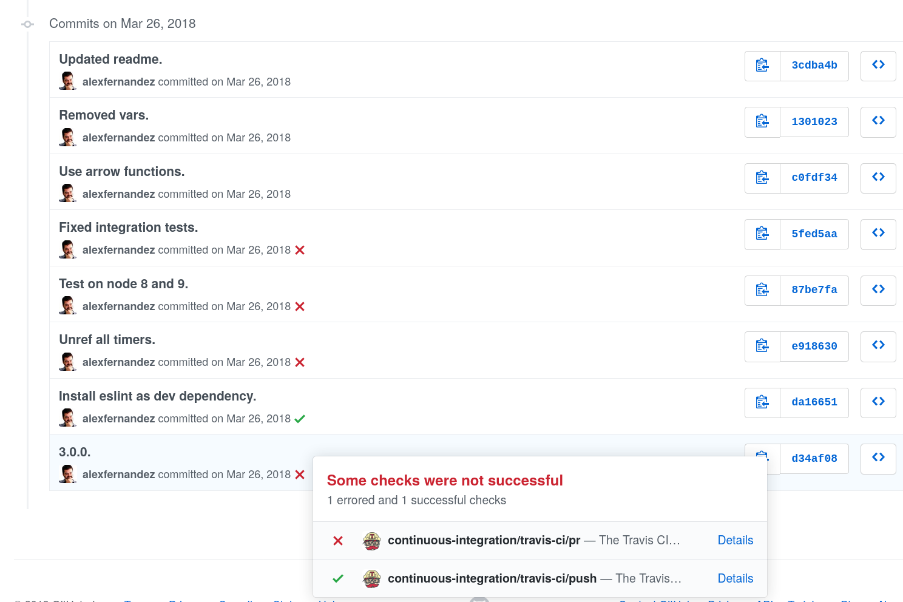

.jpg")

## TL;DR

Before adopting any existing tool always consider building a custom tool.
It may be a better fit for your particular needs;
you will learn a lot and have fun too!

## What Is Continuous Deployment

For many years I have advocated for continuous deployment (CD),
in fact since I learned about the technique in 2011
on the wonderful [Web Operations](http://shop.oreilly.com/product/0636920000136.do) by Allspaw & Robins.

Essentially it means deploying each change the moment it is ready,
instead of waiting until many changes are piled up and tested.
Tests run automatically and verify that the code is fit for production.

### Benefits

For me CD is the most relevant practice in the hot pot known as "DevOps".
CD encompasses many important disciplines: testing, integration and deployment,
with a layer of automation to make it as agile as possible.

Practitioners that have tried this practice have found that the number of errors is
reduced as the number of daily deployments increases.
The clueless manager would contend that increasing the number of deployments will
increase exponentially the number of errors in production, but this is not the case.
One reason is that changes are deployed individually,
which reduces the possibility of compound errors.
Also automatic test suites become quite important and they are cared for on a daily basis,
which creates a virtuous cycle of improvement and stability.

When an error does actually appear in production
it is usually easy to confine to the latest deployment,
instead of having to browse endless lists of changes to find out what went wrong.
Small changes are trivial to roll back:
just go back to the previous commit.

### Its Lesser Relatives

It is unfortunate that the acronym CD has been co-opted by a much less powerful version.
With continuous delivery changes are tested but not deployed until there is a manual intervention step.
In essence we are back to piling up changes, which makes our job much harder.

Continuous delivery is well suited for environments where a manual step is hard to avoid,
such as regulatory audits or manual frontend tests.
In my experience it is usually worth the effort to try to automate even these hard situations,
but it is indeed harder to do.

There is also continuous integration (CI), where code is tested after each commit
and possibly deployed to an integration server.

## The Adventure

In March 2019 I joined [Influencity](https://influencity.com/),
an influencer marketing company,
as CTO.
I had the chance to set technology priorities,
and of course my first priority was to set up continuous deployment.

### Preconditions

When a system has been built without regard for technical concerns
it is not trivial to set up continuous deployment
and we should proceed incrementally.
First we should strive for continuous integration.

The right approach to automation is usually to start with a well-understood manual task,
and then automate every bit.
Afterwards you can keep on improving until your automatic process is better than the manual task ever was.

Ask yourself: how easy is it to do integration of changes manually?
At first it will probably involve a lot of manual work,
so we should always start with automation of these manual steps
until integration can be done with the push of a button.

It does not really need to be a literal button:
running a script should be enough.
As long as you don't need to remember a lot of arcane options or manual steps;
integration needs to be started with one simple step.
Our first task was therefore to streamline and clean up the integration environment.

Another precondition is to have a solid test suite.
Without it your integrations will probably be quite brittle and hard to fix,
since you will lose track of which specific commit broke a given functionality.
Errors should surface as fast as possible,
and your test suite is your best friend.

You don't really need to test everything:
unit tests at this point will probably yield little benefit,
while integration tests are a much more solid investment.
Given that the backend was essentially a GraphQL API,
we only needed to test that the controllers were working properly.
For every entity that we had in the system
a good test should check that it can be created, edited, queried and deleted properly.
E.g. for users:

* create a new user,
* query the user,
* edit user data,
* and finally delete the user.

This basic structure gives us the skeleton for every integration test,
and it can usually be adapted for most situations.
Resulting tests are also nicely idempotent:
they can be run as often as needed without polluting the database.

In a few weeks my team created a robust automated test suite for the backend,
and also set up a nice culture of writing tests along with every new development.

### Package Selection

Now it was time to choose a tool for continuous deployment.
There are a few well established services to do it like [Travis-CI](https://travis-ci.org/). or [CircleCI](https://circleci.com/).
As for on-premise [Jenkins](https://jenkins.io/) is the best known tool,
along with its more modern cousin [Jenkins X](https://jenkins-x.io/).
There are also other smaller contenders such as [Strider CD](https://github.com/Strider-CD/strider),
which I have [used in the past](../2016/stridercd.html).
So it should be an easy decision to just evaluate the most promising options
and either hire or install the best one.

I did just that and came back a bit disappointed.
None of the services or products were really a good fit for us:

* Travis-CI needs access to your repos and your infrastructure,
which is a further point of failure.
It can be set up with webhooks.
Also the price for companies is not exactly cheap,
at [$63/month](https://travis-ci.com/plans).

* CircleCI is cheaper
at [$0/month](https://circleci.com/pricing/)
for one concurrent build,
which is a great option.
There is again the issue of giving access to repos and infrastructure.
Also it seems to require some kind of Docker image (or other VMs),
and it is not trivial to configure if your infrastructure is not geared towards Docker.

* Jenkins is a monster.
With [more than 1500 plugins](https://plugins.jenkins.io/)
I am sure that it covers all necessities that anyone may have,
but it is a bit overwhelming.
I have used it at my previous job, Devo, and configuration was a mess.
If at all possible I would like to avoid it for the rest of my professional career.

* Jenkins X is an unknown, and also seems to require Docker.
Not that I have anything against Docker as a technology,
but at Influencity it would have meant another roadblock towards adoption of CD.
That is exactly what I wanted to avoid.

* Finally, I have a lot of love for Strider.
First it has "CD" in the title instead of the more common "CI".
I have used it for a couple of projects during the last few years and it worked great!
At mediasmart we even contributed a little bit to it.
But development seemed spotty:
[commits](https://github.com/Strider-CD/strider/commits/master) are erratic,
and at that point there had been few in the last months.

### The Custom Option

I thought to myself that the task could not be that hard.
In essence what I wanted was simple enough:
something that run a build each time a commit was pushed.
More bells and whistles could be added later.

I have used Node.js for DevOps work for many years now.
I have to say I am quite happy with it:
it runs reliably,
code can be written very quickly and there are libraries for everything.

So with the help of my colleagues at Influencity
we started building a prototype.

## Development Phases

The following work was mostly done in my spare time in a couple of months,
with invaluable help and advice from the rest of the team.
I will use the present tense to make it closer to the reader.

### Phase 1: Automated Integration

In the first phase we create an HTTP server (a "web app" in standard terminology),
running in a directory and listening on a given port on the integration server.
It can be accessed simply by pointing a web browser at

    http://[control-server]:[port]/build

When this URL is accessed it should download the current branch of a repo, run a build and restart the server;
and show all the output from these commands.
When the process finishes it should print an error message if anything was broken.
The web app can also be run locally to debug any possible issues.

Internally it is a very simplistic HTTP server
using the [HTTP system library](https://nodejs.org/api/http.html);
nothing fancy like restify or fastify is really needed.
It invokes a single command similar to this:

    cd [repo-name] && git pull && npm install && pm2 reload all

where `[repo-name]` is the name of the repo and `pm2` is used to restart the service.

The only "clever" bit is a library to run a command and redirect its output to a stream,
so that it can be shown on the build page as it is happening.

### Phase 2: Attach Webhook

When the web app is up and running it is easy to connect it to GitHub using a
[webhook](https://developer.github.com/webhooks/).
Every time there is a push to the repo GitHub will send us an event,
informing us of the branch that has been pushed
[among other things](https://developer.github.com/v3/activity/events/types/#pushevent).
Let us see a real-life example from the [loadtest repo](https://github.com/alexfernandez/loadtest/),
showing only the most relevant info received in a push event:

``` json
{
  "ref": "refs/heads/master",
  "before": "0b15b4a860ddc7a4e5f860792504fa2e307be8d6",
  "after": "d2ea0f41692fc1c69e7905ecca477f0c6e29692d",
  "repository": {
    "name": "loadtest",
    "url": "https://github.com/alexfernandez/loadtest",
    [...]
  },
  "pusher": {
    "email": "alexfernandeznpm@gmail.com"
  },
  [...]
}
```

We can read the branch from the `ref`, which is either `refs/heads/[branch]`
or `refs/tags/[tag]`; we are only interested in "heads" at the moment.
Then we can read the latest commit from `after` if we want to download just that.
The repository object contains name, URL and a lot of additional info.
Finally we have the `pusher` with an email of the person doing the push,
which we can use to send an email notification with either success or failure.

At this point we only want to read the branch to check if it's equal to the current branch (usually `master`),
which we can read using the command:

    git rev-parse --abbrev-ref HEAD

Otherwise we will stop and do nothing.
So the web app now needs to read and understand push events from GitHub.
At this point we need to read the request sent by the server,
and we might be tempted to use some web framework like Fastify.
But thanks to the magic of promises it takes around 8 lines of code:

``` js
function readBody(request) {
  return new Promise((resolve, reject) => {
    const buffers = []
    request.on('data', data => buffers.push(data))
    request.on('end', () => resolve(Buffer.concat(buffers)))
    request.on('error', error => reject(error))
  })
}
```

and then a couple to parse the result:

```js
const body = await readBody(request)
const json = JSON.parse(body)
```

Another modification is necessary:
GitHub expects the webhook to return as soon as possible or it will time out.
Therefore instead of showing all command output on the web page we need a new endpoint to just return
HTTP code 200 "OK" and finish.
Since we are not displaying the result we need to know how it went:
we add email notifications using Amazon Simple Email Service (AWS SES).
Command output is now stored in a buffer
and sent in the email body.

To recapitulate:
with every push to `master` the code would be built and tested.
download the given branch on the server,
run build and restart the service,
and send an email with the results.
This will allow the dev team to learn that the latest push needs fixing as soon as possible.
The old endpoint that shows the output as a web page is still maintained for debugging purposes.

### Phase 3: Multi Repo

Our little prototype was listening just for a single repo.
In this new phase we would like to expand it for multiple repos.
As we saw before we can read the repo and branch from the GitHub push event info.

We will need a new control server where we can run reliable builds without contaminating our integration server.
The idea now is to run a build for **every branch** that is pushed to Github.
We start with a copy of the integration server
and create a structure of directories where we will download each branch:

    repos/[branch]/[repo]

We will place the branch first so the repo is downloaded into a directory with its own name,
something which npm tends to like better.

Now we can add a testing step to the build:
* for the backend we already have a test suite which we can partially trust,
* in some other repos we just want to check syntax with `eslint .`,
* for a library without tests it may be relevant to just run `node index.js` to see that nothing explodes,
* and if there is no testing at all we can just `echo "THIS IS FINE"`.

Any of these can be mapped to the standard npm command `npm test`.
Now our build consists of the command

    cd repos/[branch]/[repo] && git pull && npm install && npm test

With this additional step we now have a measure of quality validation.
For some repos we may want to deploy to the integration server after a success.
Again we can use a simple SSH command:

    ssh [integration-server] "cd [repo] && git pull && npm install && pm2 reload all"

For other repos we want to use a different command,
or even skip this deployment step at all.
So we add a deployment command if the branch is `master`,
configurable by repository.

_Et voilà!_  Continuous integration on the cheap.

### Phase 4: Let the World Know

This was cool.
At this point our little deployment script was close to 200 lines.
For the next phase we want to learn about builds using something different than email,
which gets tiresome after a few dozen pushes.

First we want to send the result of the build to AWS CloudWatch.
This way we can set alarms when a build for to a particular branch (usually `master`) and repo (e.g. backend) is broken.
We can also compute metrics for our builds.

The package [aws-sdk](https://aws.amazon.com/sdk-for-node-js/)
makes it quite easy to integrate with CloudWatch:
it just takes a single call to
[`putMetricData`](https://docs.aws.amazon.com/AWSJavaScriptSDK/latest/AWS/CloudWatch.html#putMetricData-property),
using the branchd and repo as "dimensions" with a custom metric.

We now get to one of the life-changing moments of the project.
Look at these super-cool icons besides each commit:



For each commit Travis is informed and it runs the automated test suite,
letting us know if the build worked (✅) or failed (❌).

Can we do that with our multi-deployment script?
Of course!
We just need to connect our server with GitHub in the opposite direction,
using the [GitHub API](https://developer.github.com/v3/).

With Node.js it is in fact quite easy thanks to the official npm package
[@octokit/rest](https://www.npmjs.com/package/@octokit/rest).
Essentially you just need to
[create a status](https://octokit.github.io/rest.js/#octokit-routes-repos-create-status):
first the status is set as `pending`,
then when finished you set it to either `failure` or `success`.

You can also add detailed information about the build and it will be shown in a box as in the figure above.
At this point we get accurate feedback about our changes for every push to the repo.
We can also look if tests pass before approving or rejecting a pull request.
Essentially we have most of the functionality of full featured packages out there.

### Phase 5: Store Each Build

But there is a piece missing.
While we learn if tests pass,
it is not simple to cram all of the output (e.g. which tests fail)
into the detailed information.

The right answer is to store all the build output in a database.
We use MongoDB since it is already installed on our servers.
All we need is to create a unique key for each build:
one option is to use commit id, but it can also be composed e.g. of repo+branch+timestamp.
Build output is then stored in MongoDB using that key.

How is it read from GitHub? Easy!
A new endpoint is created to access any particular build,
accessible from the outside as the URL:

    http://[server]/read/[key],

When accessed it reads the build output with the given key and shows it on a web page.

The missing link is how to access this build info from GitHub.
When the status is created this URL is added as
[target URL](https://developer.github.com/v3/repos/statuses/#create-a-status),
which will be shown as a link to "Details" in the drop down box.

At this point we have a complete solution for continuous integration,
with limited deployments and GitHub integration.
The system takes less than 300 lines,
with around 300 more of auxiliary code.

## Future Improvements

Our little project might be extended in many directions;
here are some of the most promising.
Since I don't work at Influencity any longer it will have to be done by my colleagues.

### Frontend Testing

We had a similar setup for frontend code,
but unfortunately the test suite was very fragile and broke all the time.
One of our pending items was to make the frontend test suite more robust,
and complete enough to have the same confidence as with backend code.

### Continuous Deployment

The system might be easily expanded to deploy directly to production.
In fact, as long as all changes are backwards compatible it is straightforward to do:
just deploy to integration and to production at the same time.
It was really more of a confidence thing:
the team did not feel comfortable pushing to production,
so I left it as a future improvement.

Of course it would be great to have further guarantees before enabling continuous deployment.
Automated rollbacks would also be a very useful addition.

## Assessment

Our little system had close to 600 lines of code,
and four dependencies:
* `@octokit/rest`: to access the GitHub API.
* `aws-sdk`: to store deployment success or failure in AWs CloudWatch.
* `mongodb`: to store deployment info in MongoDB.
* `stdio`: to read the directory to run into from the command line.

It could do everything that we needed for continuous integration.

Time spent creating it was more or less equivalent to installing and configuring something like Jenkins or StriderCD.
The system worked much more reliably than Jenkins ever did for me,
and knowing its inner workings made it quite simpler to repair.

I have confidence that my colleagues will be able to work with (and improve) our little script,
since it is all Node.js code.
The biggest hurdle is to understand all of the different concepts involved in its operation.

### Code Release

I am not at liberty to publish the code which was all proprietary.
The ideas however are quite easy to reimplement independently,
and may be of use to other people.

If there is enough interest I will think about creating a clone.
In my opinion it will be more of a didactic tool than for production,
since configuring this thing may be a bit hard,
but who knows?

## Conclusion

By all means consider also the downsides of non-standard tooling:
* steep learning curve,
* hard training.

But also consider the downsides of standard tooling:
* complex configuration,
* mindless adoption,
* hard maintenance.

Too often we treat our tooling like black boxes which solve our problems magically.
But I have found that it is always a good idea to invest some time to think about what we really need,
and then look for a solution.

When it comes to maintaining the tooling,
everyone in the team should know what it is doing behind the scenes.
That way they will be able to take over and even expand as needed,
either with standard tools or custom solutions.

### Acknowledgements

Thanks to my colleagues
[Alfonso](https://twitter.com/alfonh),
[Bea](https://twitter.com/BeatrizDGL),
[Charlie](https://twitter.com/jimeno0),
[JC](https://twitter.com/abbitxuelo) and
[Will](https://twitter.com/WilderOlmos)
for their coopoeration in this awesome project.

