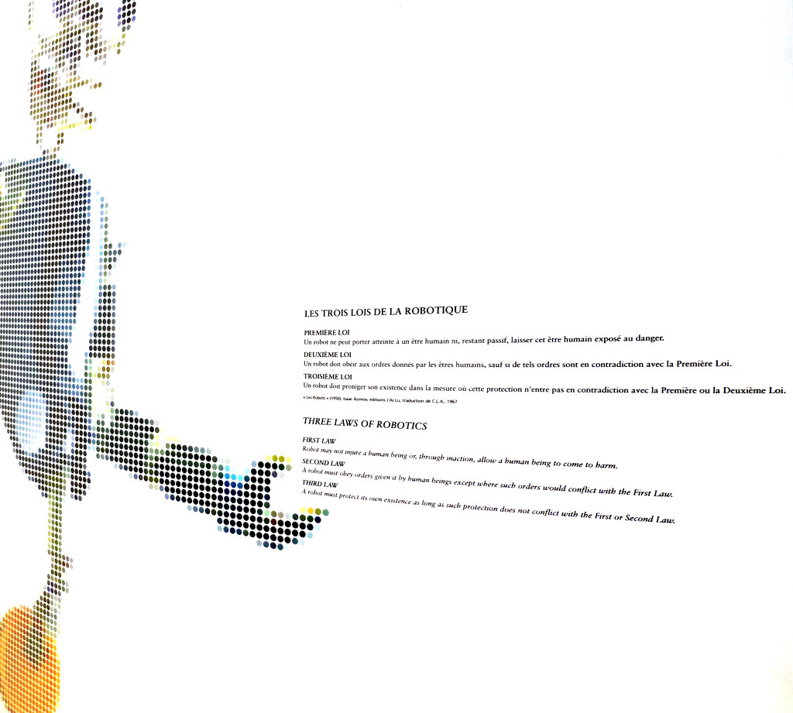

In these turbulent times of troubled leftist principles and worrying fascist risings
it is too easy to lose track of our moral principles.
In this article I will try to 

## Right and Wrong

Let us start at the very beginning.
What is "right" and what is "wrong"?
How can we tell the difference?

## Generalizing

The core of the moral problem lies at the center of language,
and it is that of generalization.

### Objectivity

### Laws

The problem of having written laws

## Religion

Given that it is hard to get our own ideas about what is right and wrong,
it is tempting to give in and let someone else define our moral principles.
But such a path is not free of conflict; on the contrary,
it is probably even more fraught with contradictions.

In the Bible, [Exodus 32](https://www.biblegateway.com/passage/?search=Exodus+32&version=NIV),
Moses comes down from the mountain with the ten commandments written in stone.
One of them is, of course, ["You shall not murder"](https://www.biblegateway.com/passage/?search=Exodus+20:13&version=NIV).
Then he finds his people worshipping the Golden Calf,
gathers a few loyals and murders the whole lot.

About rich people,
[Jesus says in the Bible](https://www.biblegateway.com/passage/?search=Mark+10%3A25&version=NIV):

> It is easier for a camel to go through the eye of a needle than for someone who is rich to enter the kingdom of God.

I don't think there is any ambiguity here.
And yet it is easy to spot rich people calling them Christians;
they have to contort the meaning of "rich" in their own heads
or else be complete hypocrites.

## Conclusion

### Acknowledgements

