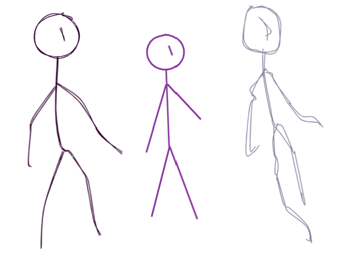
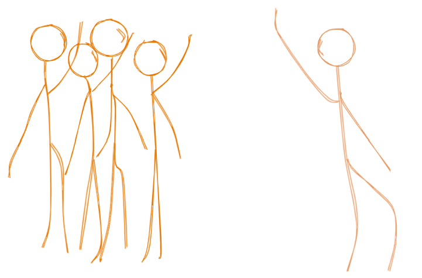

Durante los últimos seis meses he participado con [LeanMind](https://leanmind.es/)
en un proyecto para [Alterna](https://alternaonline.es/),
una comercializadora de electricidad y otros suministros domésticos.
Ha sido un auténtico placer trabajar con tantos buenos profesionales
(incluyendo por supuesto estupendas profesionales)
y estar en un equipo con gente como
Carlos Blé,
[Ulises Santana](https://twitter.com/ulisesantana)
o [Sam de Vega](https://twitter.com/SamdeVega).
Los resultados han sido bastante satisfactorios para todos,
y también para el cliente que es lo más importante.

Es bastante habitual ver artículos sobre detalles técnicos de un proyecto.
Para variar hoy vamos a centrarnos en _soft skills_ o "habilidades blandas".
En la última retrospectiva hemos identificado cinco de estas **habilidades
menos técnicas y más humanas** que nos han ayudado a trabajar juntos.
Como todos empiezan por "co" vamos a usarlo como regla nemotécnica para acordarnos mejor.

A estas alturas un artículo que simplemente dijera "tal y tal cosa son importantes"
tendría una utilidad muy limitada,
así que para cada uno veremos unas cuantas **técnicas concretas** que nos ayudan a aplicar estas habilidades.
Sin más dilación os dejo con los cinco "Co"s (más una de propina).

## Comunicación

Con la primera "Co" empezamos sobre seguro.
La elección no os descubrirá nada nuevo:
obviamente la comunicación es crucial para cualquier proyecto,
sea de software o no.
Vamos a centrarnos en algunas técnicas para mejorar nuestra forma de comunicarnos.

### _Daily meeting_

Muchos equipos han hecho de la _daily meeting_ o reunión diaria una religión.
En el pasado he visto cómo estas _dailies_ se prolongan durante una hora o más,
quitando un 12% de la jornada de trabajo.
De ahí que me produjeran angustia vital.

En este proyecto hemos tomado como costumbre reunirnos a diario con el equipo de Alterna a una hora fija,
pero **sólo cuando teníamos algo de qué hablar**.
A menudo nos las hemos saltado cuando parte del equipo tenía qué hacer,
las hemos eliminado los viernes,
y otras veces en que no teníamos qué hablar han durado cinco minutos.

Cuando nos ha hecho falta han sido muy útiles.
Tener este punto de contacto diario con Alterna nos ha permitido resolver dudas de un día para otro.
Hemos podido rectificar rápidamente cuando han cambiado las prioridades,
y en general han sido muy positivas.

Tampoco podemos despreciar el contacto humano,
que en estos tiempos de pandemia son esenciales para nuestra salud mental:
así nos obligamos a recordar que **trabajamos con gente y no sólo con máquinas**.
Yo considero que dedicar al menos cinco o diez minutos al día a "charla de café" es muy positivo.

### _Mob Programming_

Una técnica nueva para mí y que me ha sorprendido es el _mob programming_.
Si pensabas que la programación en pareja o _pair programming_ era poco productiva,
espera a que te cuente cómo funciona la **programación en grupo**:
todo o parte del equipo [se reúne para escribir código](https://podcast.carlosble.com/podcast/e9-mob-programming/).
Una persona toma el teclado, el _driver_ o conductor.
El resto hacen de _navigators_ o copilotos,
y van mapeando el terreno,
cual [Luis Moya a Carlos Sáinz](https://youtu.be/bbtUJ4CpybA?t=298),
los legendarios pilotos de _rally_ españoles:

> Ojo nieve, a ras, a ras.
> Ojo curva.
> [Carlos, ¡Trata de arrancarlo, por Dios!](https://www.youtube.com/watch?v=Sd_gj-3kz7A)

Programar de esta manera es sorprendentemente efectivo,
sobre todo para conseguir que el conocimiento se difunda en el equipo.
También hemos probado a hacer _mob programming_ con gente del cliente,
lo que les ha servido para comprobar en directo cómo trabajamos
e incluso para adoptar ciertas prácticas de desarrollo en sus proyectos propios.

Es cierto que se consume mucho tiempo programando así,
pero también se ahorra después en formación, explicaciones
y revisión de código.
El resultado suele ser bastante más robusto que la programación en solitario.
Es más, la dinámica del [proceso de revisión](https://pinchito.es/2018/has-anyone-else-seen-your-code)
cambia completamente:
ya no es necesario lanzar _pull request_,
revisar, aprobar y mezclar.
Ahora podemos directamente revisar el código que se ha programado en directo
y mezclarlo directamente.

Eso sí,
yo sigo pensando que parte del trabajo debe hacerse en privado,
que es mucho más productiva en aspectos más mecánicos.
Pero una sesión al día de _mob programming_ es una práctica excelente.

### Comunicación escrita

En estos tiempos de pandemia lo que antes era crucial ahora es indispensable:
**todo lo que se hable debe quedar reflejado por escrito**
y estar publicado para que todo el equipo sepa a qué atenerse.

En un proyecto en remoto tendemos a comunicarnos muy a menudo por escrito,
pero usamos medios conversacionales (Slack, Whatsapp)
donde cada elemento queda enterrado entre conversaciones cruzadas.

Puede que sintamos la tentación de escribir minutas para cada reunión,
elaborar listas de features,
y demás tareas ingratas y muy trabajosas.
No vale con eso; tenemos que elaborar **documentos que destilen el conocimiento adquirido**
en forma que sea fácil de digerir por cualquier persona ajena al equipo.

Es cierto que la mayoría de gestores documentales son laberínticos
y no ayudan demasiado a organizar la información;
en nuestro caso tenemos una cuenta en Confluence con una mínima estructura para ayudarnos a organizar los documentos.

### Línea base

Tengo pendiente escribir un artículo sobre conocimientos desconocidos.
Por ahora baste con reflejar que la información asimétrica
(lo que sólo conoce parte del equipo)
puede llevar a serios problemas en el desarrollo.
El **documento escrito y público** permite que todo el mundo adquiera,
compare y contraste su conocimiento con el del resto del equipo.

Hace más de veinte años recibí un estupendo curso de [Kyle Rone](https://www.linkedin.com/in/kyle-rone-3545451/),
un manager de IBM que trabajó en el proyecto del transbordador espacial.
Insistía mucho en lo de tener una o varias _baseline_,
que el equipo en el que estaba interpretaba de forma jocosa como "vaseline".
A decir verdad yo tampoco entendía bien a qué se refería,
pero creo que ahora tengo alguna idea de por qué tener líneas base es tan importante.

El documento escrito forma la **base sobre la que se desarrollará el conocimiento del equipo**.
Debe estar todo detallado y especificado hasta el nivel de detalle que sea necesario,
como vamos a ver en el siguiente apartado.

Cuando se avanza en el conocimiento se vuelve a elaborar una nueva línea base,
que se verá reflejada en un nuevo documento.
De esta forma mantenemos siempre actualizado el conocimiento del equipo.
De esta forma vamos elaborando una base de conocimiento
o _knowledge base_ que nos sirva de referencia.

### El arte de la especificación técnica

Para cada elemento del sistema que tenga sentido por sí solo
(subsistema, script, pestaña de la web…)
elaboraremos un **documento maestro** que recoja todos los detalles de la implementación.
No podemos esperar que otra persona nos saque las castañas del fuego:
en lugar de esperar a que el cliente elabore los requisitos,
los obtendremos en forma de entrevistas y los escribiremos dentro del propio equipo.

Siempre tendemos a dar por supuestas ciertas ideas que parecen obvias.
En este caso es mal; en un documento técnico tenemos que **explicarlo todo desde cero**.
El objetivo debe ser que una persona inteligente totalmente ajena a nuestro proyecto
pueda entenderlo todo sólo leyendo la especificación.

Hay más hábitos que cambiar.
En un texto literario
(una novela, una égloga, o incluso una entrada de blog como ésta)
la repetición es veneno:
usar la misma palabra varias veces en una frase o un párrafo
demuestra falta de estilo y aturde al lector.
No digamos ya usar la misma frase varias veces.

En un documento técnico tendremos que ir contra esta educación:
**no temas repetirte las veces que haga falta** para evitar ambigüedades.
Es importante que cada párrafo sea autocontenido:
no siempre tendrás el lujo de que tus lectoras empiecen por el principio y terminen por el final.
Así el documento será valioso como referencia técnica,
que se pueda consultar para averiguar cómo debe funcionar un aspecto dado de la implementación.

El mayor valor de una especificación suele ser encontrar los **casos raros**
o _corner cases_:
esos pequeños detalles que afectan sólo a algunos clientes,
en condiciones inusuales,
cuando hay tormenta.
Pregúntate siempre si estás listo para lo peor:
¿hemos contemplado el día de cambio de hora?
¿Qué pasa si un cliente no tiene datos un día, o un mes?
¿Sabemos cómo tratar esos contratos _legacy_ que siempre se nos olvidan?

Finalmente, **la especificación debe ser lo suficientemente completa**
como para que el equipo pueda usarla de _checklist_:
una vez que se cumplan todos los requisitos marcados el trabajo estará listo.
No olvides actualizar la especificación cada vez que cambie la implementación.
Si encontramos nuevos casos raros (_corner cases_) no contemplados,
los añadiremos a la especificación.

## Compatibilidad hacia atrás

Para la segunda "Co" vamos a arriesgar algo más.
Un proyecto desde cero siempre es agradable porque no hay
ninguna herencia (el temible _legacy_) que mantener.
En nuestro caso teníamos que construir un sistema nuevo,
pero lidiando con una MySQL ya creada,
con las peculiaridades habituales de cualquier base de datos creada por agregación:
datos repetidos,
inconsistencias,
estructuras duplicadas.

### Resistiendo la tentación

Es muy tentador querer mezclar nuestro proyecto con **mejoras en los sistemas heredados**,
también llamados "legados" o _legacy_,
en nuestro caso la base de datos.
¿Y si añadimos este campo a esta tabla,
o unificamos estas dos tablas?
Así simplificamos el desarrollo porque podemos hacerlo todo más eficiente.

Pero nos encontraríamos con un pequeño gran problema:
habrá que cambiar también el código _legacy_ para que acceda al nuevo campo o la nueva tabla.
Y peor todavía, tendríamos que sincronizar nuestras mejoras con las de la base de datos y el sistema heredado,
complicando el proyecto exponencialmente.

Así que optamos por simplemente **considerar la base de datos como inmutable**,
y trabajar con lo que teníamos.
De esta forma evitamos la tentación de meternos en guerras con varios frentes.
La compatibilidad hacia atrás se vuelve extremadamente importante:
¿cómo hacía cada proceso el sistema existente?

A cambio las mejoras en el proceso han valido la pena.

### Chequeo de datos

Como parte de nuestras pruebas,
y para comprobar que estamos obteniendo los resultados correctos,
podemos recorrer el histórico en la base de datos e intentar replicar los resultados existentes.
Así hemos podido calcular la mejora nuestro proceso,
calculando el tanto por ciento de resultados iguales:
primero un 5%, luego un 80%,
después un 95.5%, un 98%…
hasta llegar al ansiado 100%.

En realidad siempre nos han quedado unos pocos registros que se nos resistían,
en algunos casos por haber identificado resultados mal calculados por el sistema _legacy_.
Pero no hay problema mientras seamos capaces de explicar **hasta la última discrepancia**.
El trabajo que parece ingrato de ir persiguiendo casos raros
se nos devolverá mil veces cuando nos evitemos incidencias en producción con estos mismos casos raros.

### Reemplazo parcial

Otra gran ventaja de mantener la compatibilidad hacia atrás
es que no tenemos que reemplazar todas las piezas del sistema a la vez:
podemos ir cambiándolas una a una,
manteniendo el resto del sistema _legacy_.

Supongamos un proceso de facturación con unos cuantos pasos:

* crear factura,
* calcular costes,
* agregar costes en la factura,
* generar PDF,
* pasar cargos al banco…

La tentación inmediata es crear unas facturas hipervitaminadas
que incorporen todas esas mejoras que el cliente ha pensado durante años.
¡Craso error!
Tendremos que reemplazar todo el proceso de cabo a rabo antes de poder usarlo en producción.

Si las facturas son idénticas a las existentes,
podemos reemplazar el primer paso dejando el resto del sistema existente.
O mejor todavía:
**trabajar primero en el paso que más guerra nos esté dando**.
Así nos aseguramos un proceso más continuo y con menos dramas.

Esta técnica resulta que tiene un nombre:
la [aplicación del árbol estrangulador](https://martinfowler.com/bliki/StranglerFigApplication.html),
como podemos leer en el blog de Martin Fowler.
Vamos reemplazando un sistema pieza a pieza
hasta que al final podamos dejar morir el sistema principal por falta de uso.
¡Muy recomendable!
El único problema que le veo al artículo de Fowler es que
no pone el suficiente énfasis en la compatibilidad hacia atrás,
que tendremos que mantener a rajatabla.

## Conflicto

Este punto puede ser algo más sorprendente que los anteriores,
así que vamos a expresarlo de la forma más llamativa posible:

**El conflicto es crucial para el éxito de un proyecto**.

Es posible que pienses:

> Pero, Pinchito, ¿por qué nos dices que los conflictos son esenciales para el éxito de un proyecto?
> Resolverlos cuando aparecen, claro que sí, pero
> ¿la propia existencia del conflicto es necesaria?
> ¿No será mejor que en el proyecto no haya conflictos?

El conflicto tiene mucho que enseñarnos.
En un equipo ideal hay diversidad de experiencias,
de capacidades,
y también de trasfondo sociocultural:
edad, sexo, educación, procedencia.
Esto llevará inevitablemente a que los problemas se encaren de forma diferente.
Muy a menudo hay soluciones (por ejemplo partes del código)
que no convencen a parte del equipo,
que puede proponer otras soluciones alternativas.

El conflicto hace aflorar estas discrepancias,
estos puntos débiles del código que no terminan de convencernos.
En resumen, **el conflicto nos ayuda a guiar las mejoras del sistema**.

### Solución C

Ya tenemos el conflicto planteado:
¿elegimos la solución A que convence a una parte del equipo,
o la solución B que convence a otra parte?
Sigamos buceando en el problema.
Si rascamos un poco veremos que seguramente la solución A
**tampoco convence del todo** a los proponentes,
y lo mismo ocurre con la solución B.
Y es lógico: en general los miembros del equipo saben de lo que hablan.
Los inconvenientes de cada solución son también visibles para quienes la ven como la mejor,
aunque consideren que la otra solución es peor.

Así que sigamos buscando.
Nuestro objetivo debe ser encontrar una solución C sin los inconvenientes de A ni los de B.
En mi experiencia vale la pena dedicar cierto tiempo a explorar esta solución alternativa.
Como mínimo podremos justificar con razones por qué las posibles soluciones no nos valen.

Es buena idea detallar estas decisiones de diseño en la especificación técnica,
en forma de **nota técnica**.

### Mediación

También es posible que no exista solución buena,
o al menos que no sepamos encontrarla.
¿Qué hacemos en este caso?

En situaciones de conflicto,
contar con una **figura de mediación externa al problema** puede ser muy interesante.
Al no estar implicada directamente,
esta persona puede actuar de juez imparcial
y acompañarnos por el camino hacia la solución que satisface a todo el mundo;
en otros casos nos puede ayudar a entender por qué se adopta una solución concreta.

También la figura de mediación puede ayudar a investigar el coste de pasar de una solución a otra
cuando las circunstancias cambien.
Esto nos lleva directamente al siguiente punto.

### La solución reversible

En [Linux kernel management style](https://lwn.net/Articles/105375/),
[traducido al castellano](http://www.escomposlinux.org/egkl/),
Linus Torvalds nos cuenta cómo alcanzar la solución ideal:

> Hay que darse cuenta de que la diferencia crucial entre una decisión
> gorda y una pequeña es que puedas cambiar de decisión más adelante.
> Cualquier decisión puede hacerse pequeña si te aseguras de que si te
> equivocas (y te vas a equivocar _seguro_), siempre puedes deshacer el
> daño más tarde volviendo sobre tus pasos. De repente, eres el doble de
> gestor por tomar _dos_ decisiones sin importancia: la errónea _y_ la
> correcta.

Una buena forma de minimizar el daño de una decisión subóptima es
asegurarte de que puedes **corregirla sin demasiado problema**.
En este sentido el desarrollo de software es una gran disciplina:
normalmente basta con realizar un cambio de código _et voilà!_,
ya tenemos la solución buena en marcha.

Por tanto al investigar varias soluciones al problema nos interesa también estudiar
el coste de pasar de una a otra.
Es posible que la solución A sea más legible, y la solución B aporte mejor rendimiento;
sería interesante adoptar A ahora mismo pero poder migrar a B
cuando el tráfico llegue a cierto volumen.
¿Cuál es el coste de migrar de A a B?
¿Tenemos identificados todos los puntos del código donde tendremos que tocar?
En ese caso es posible que nos interese adoptar ahora mismo A y dejar anotado cómo migrar a B;
en caso contrario, y según nuestras previsiones de tráfico,
es posible que prefiramos directamente adoptar la solución B.
Y lo mismo si tenemos una solución de compromiso C.

## Constructividad

Cuando hay un incidente,
y siempre habrá incidentes,
es muy importante que las críticas sean siempre **orientadas a la mejora**;
nunca para apuntar dedos.
Si queremos reforzar el espíritu de mejora continua
es esencial que se puedan abordar los cambios sin temor.
De otra forma adoptaremos siempre la solución más conservadora,
evitaremos mejorar el sistema una vez que esté más o menos listo,
y llegaremos a un software rígido y difícil de cambiar.

### Postmortem sin culpa

Un _postmortem_ es un análisis realizado tras un incidente.
Aunque suene macabro es el término estándar que se usa para el informe final.
Una incidencia es el momento perfecto para analizar causas
y llegar al fondo que ha permitido que ocurra un error en producción.

Si os interesa el tema,
este año he dado un par de charlas sobre análisis de incidencias,
en [madScalability](https://www.youtube.com/watch?v=g274h7w0TTk)
y en [Benidorm Tech](https://www.youtube.com/watch?v=CTcKuZ2gcHQ),
y una específicamente sobre
[la catástrofe de Chernóbil](https://www.youtube.com/watch?v=nQksMZRqvRw).

Para nuestros propósitos actuales nos centraremos en el
**_postmortem_ sin culpa** o
[_blameless postmortem_](https://codeascraft.com/2012/05/22/blameless-postmortems/).
Se trata de una técnica que se basa en abandonar el error humano como causa del error;
en su lugar, investigar qué conjunción de circunstancias ha permitido
que una persona pueda tener la responsabilidad sobre sus hombros.

También como parte del análisis de incidencias
tenemos que alejarnos de actitudes poco productivas
como buscar el error humano,
y acercarnos más a entender a la otra persona.
¿Por qué en su momento pensamos que era buena idea hacer lo que hicimos,
aunque terminara siendo un problema en producción?

El informe final debe estar **centrado las recomendaciones
para evitar incidentes similares** en el futuro,
y el equipo debe tener muy en cuenta estas recomendaciones.
Idealmente se debe publicar a los clientes afectados,
lo que les ayudará a confiar en que nos tomamos los problemas en serio.

### El _postmortem_ en integración

Una técnica que hemos explorado en este proyecto,
y que en cierta manera es original (o al menos yo no la he visto descrita)
es hacer **análisis de fallos que ni siquiera llegan a producción**.
Analizar los problemas de nuestro proceso de desarrollo en integración nos permite refinarlos y aprender
sin necesidad de darnos un batacazo en producción.

Es mucho más fácil actuar de forma constructiva cuando las apuestas no son tan altas:
un fallo en un entorno de integración es a lo sumo una molestia,
y es casi imposible que afecte a clientes o a las cuentas de la empresa
más allá de lo que cueste arreglarla.
También es más fácil tomarse un fallo en integración como un éxito más que como un fracaso:
al fin y al cabo hemos conseguido evitar que el problema llegue a producción.

## Confianza

Dejamos para el final esta "Co" que se destila de los anteriores.
La confianza no se puede conseguir por sí sola;
es consecuencia del trabajo continuado.
Pero también se puede mejorar deliberadamente.

A continuación vamos a revisar algunas técnicas que ayudan a conseguir
que un equipo trabaje con confianza.

### Confianza del cliente

La primera parte es lógicamente la confianza del cliente,
que se gana a lo largo de años de trabajo.
En nuestro caso teníamos la suerte de que Carlos Blé ya había trabajado anteriormente con Alterna,
y con su buen hacer se habían ganado su confianza.

En este proyecto he aprendido que **hay que mirar en el interés del cliente**,
pero no en un sentido estricto sino con cierta amplitud de miras.
En mi caso la cosa se podría haber complicado por trabajar con LeanMind a un lado y a Alterna a otro,
lo que podría causar conflictos.
La clave para desenredar este problema a tres bandas fue tener como objetivo
mejorar la relación mutua entre LeanMind y Alterna.

En general puede ser importante localizar los puntos de beneficio mutuo y trabajar sobre ellos,
y no ahondar en los que suponen sólo beneficio para una de las partes.

### TDD

La tecnología puede ayudarnos a tener confianza en nuestro trabajo,
y en nuestro trabajo es obviamente muy importante.
Conseguir esta confianza suele requerir aportar nosotros confianza en la tecnología,
que se nos devolverá en forma de confianza en el equipo.

Los tests nos aportan confianza en nuestro código:
con su ayuda podemos encarar cualquier
[refactorización](https://podcast.carlosble.com/podcast/e14-refactoring/)
sin tener que hacer pruebas manuales exhaustivas.
Hace ya dos décadas que vengo haciendo tests extensivos en el código.

El desarrollo guiado por tests, o
[_test-driven development_](http://wiki.c2.com/?TestDrivenDevelopment),
es una técnica bastante conocida:
empezar a escribir tests antes de tirar una línea de código.
La he probado de vez en cuando en mis propios proyectos,
pero nunca me ha convencido.
Ahora en el equipo había varios proponentes de la técnica,
por lo que era el momento de volver a intentarlo.

A decir verdad no lo hemos aplicado a rajatabla;
a veces hemos empezado por escribir código,
a veces por escribir tests.
Los resultados para mí no han sido concluyentes,
aunque a Ulises y Sam sí les convence.
Desde luego no estoy de acuerdo con el principio de
[escribir el código mínimo que pasa el test](http://wiki.c2.com/?CodeUnitTestFirst),
porque nos puede llevar a hacernos trampa a nosotros mismos.

Creo que escribir tests a posteriori puede ser tan válido como escribirlos antes.
Pero si te ayuda a escribir más tests, ¡aplica TDD!
Lo importante es llegar a tener **confianza en la tecnología**
que el propio equipo está creando.

### Despliegue continuo

La prueba última de la confianza en la tecnología
es dejar que ésta se encargue de los **despliegues en producción**,
sin supervisión humana.

Llevo bastantes años siendo un gran fan del
[despliegue continuo](https://pinchito.es/2012/continuous-deployment).
En este tiempo he usado una decena de sistemas diferentes,
la mayoría orientados a la integración continua.
En contadas ocasiones hemos tenido la suficiente confianza en la tecnología
como para hacer [despliegue continuo de verdad](https://pinchito.es/2016/stridercd):
cada cambio hecho en la rama principal del repo se prueba y llega a producción en unos pocos minutos.

En [nuestra última aventura](https://pinchito.es/2019/devops-on-the-cheap)
vimos cómo hacer despliegue continuo en 600 líneas de código.
Ahora, gracias a las
[Bitbucket _pipelines_](https://support.atlassian.com/bitbucket-cloud/docs/get-started-with-bitbucket-pipelines/)
es perfectamente posible hacer integración continua con un script en Bash de 30 líneas,
más 10 líneas de YAML.
(Lo mismo se puede hacer con
[GitHub Actions](https://github.com/features/actions)
o con [GitLab Pipelines](https://docs.gitlab.com/ee/ci/pipelines/)).

En nuestro proyecto no hemos llegado al despliegue continuo;
al ser en su mayoría una serie de procesos _batch_
tampoco tiene el mismo sentido que en una aplicación web.
Pero está todo preparado y es cuestión de seguir en la misma línea.
Ya usamos la [metodología TPP](https://pinchito.es/2020/tpp)
así que en los procesos batch sólo necesitamos correr un par de comandos antes de lanzarlos:

    $ git pull && npm install && ...

En un proceso de servidor es un poco más involucrado, pero las piezas están ahí.

### Confianza en el equipo

En un equipo la cosa debe ir más allá de simplemente confiar en el trabajo ajeno
o en la tecnología.
Algo más importante todavía es que cualquiera pueda contar los problemas que ve,
y que puedan comentarlos en grupo.

Tengo que reconocer que en alguna ocasión no he sabido **entender las preocupaciones del equipo**,
sobre todo a la hora de rematar el trabajo.
Pero gracias a la mediación de Carlos Blé hemos podido hablarlo en grupo
y llegar a un acuerdo satisfactorio para todos.

Otro aspecto en el que he trabajado pero donde tengo que mejorar todavía
(y esto lo anoto aquí como reto personal)
es **dejar que el equipo cometa errores**.
Como Blé me ha contado,
a veces es necesario dejar que el equipo siga un rumbo distinto al que nos gusta,
pese a que tengamos claro que sea un error.
Para empezar todo el mundo tiene que poder aprender de sus errores.
Y para seguir,
es posible que en ocasiones
(como me ha pasado a mí repetidamente)
los miembros con menos experiencia tengan razón.
En cualquier caso el equipo aprenderá algo,
y por el camino se reforzará la confianza del equipo.

## Conclusión

Esta sexta "Co" va por cuenta de la casa.
Es muy fácil dejarse llevar por la inercia tan común en nuestro gremio
y considerar que todo lo que no sea programar es _bullshit_.
Es también un error garrafal.
Más allá de los aspectos técnicos de un proyecto hay todo un mundo de elementos más "blanditos",
pero que son cruciales para el éxito y que además **pueden trabajarse**.

Para ver la importancia real sólo hay que imaginarse un proyecto donde falten estos cinco "Co"s.
¿Qué te parecería trabajar en un equipo:

* con mala comunicación,
* donde no se respete la compatibilidad hacia atrás,
* donde el conflicto no se maneje bien,
* donde las críticas no constructivas sean la norma,
* y donde no exista la confianza?

Si bien hay gente que consigue las _soft skills_ de forma intuitiva y sin esforzarse,
para el resto de nosotros hemos visto unas cuantas técnicas sencillas que nos permiten mejorar nuestras habilidades.
Si tienes otras técnicas pásamelas
[por correo](mailto:alexfernandeznpm@gmail.com)
o [por Twitter](https://twitter.com/pinchito)
para añadirlas.

### Viento en popa a toda vela

Me voy con la tranquilidad de dejar una base de código bien trabajada y **sin magia oscura**,
una documentación bastante completa
y un equipazo que estoy seguro de que va a hacer un trabajo estupendo.

Ahora el proyecto sigue a toda máquina,
y aunque tienen muchos retos por delante también tienen las herramientas para afrontarlos.
Además la forma de trabajo ha calado en el equipo del cliente,
que están empezando a usarla en sus proyectos propios.
Eso es, en cierto sentido, el mejor resultado posible del proyecto:
**aportar a la cultura de una empresa** joven como Alterna.

### Agradecimientos

Muchas gracias a Carlos Blé, fundador de [LeanMind](https://leanmind.es/),
por haber hecho posible este gran proyecto con este gran cliente.
Si tienes un proyecto de software y necesitas una ayuda hay poca gente mejor a la que acudir.
Gracias a todo el equipo de LeanMind incluyendo de forma especial a Ulises y Sam.
Gracias a Ulises por sus comentarios.

Muchas gracias a Antonio Peral de Alterna por habernos proporcionado todo lo que hemos necesitado,
y haber estado abierto a sugerencias y cambios.
Gracias también a todo el equipo de Alterna por haber participado con nosotros.

Gráficos elaborados con [Excalidraw](https://excalidraw.com/).

