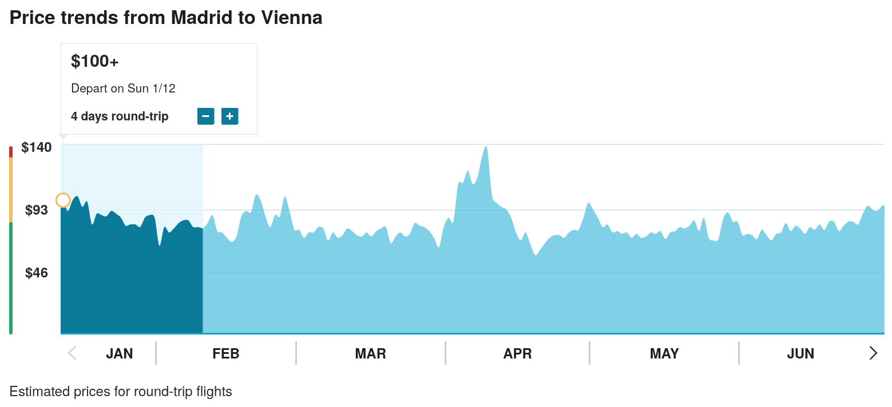
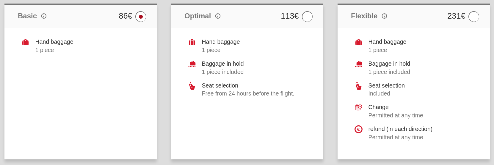
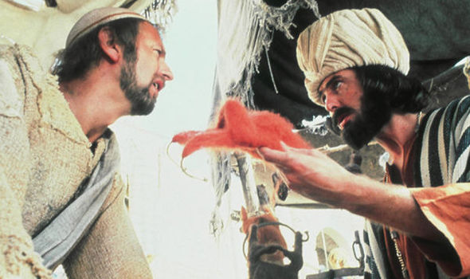

If you have ever travelled by plane you have probably suffered some form of insane pricing scheme:
cheaper tickets if you fly with several stopovers,
different prices depending on where and how you buy your ticket,
crazy price hikes if the flight is close in time,
and in general a Kafkaesque world that induces more nausea than a windy landing.
Why is this? And how can it be avoided?

In this article I will review why and how does the industry get away with this,
and make a humble (+ a bold) proposal.
It is written from a subjective perspective and therefore I will not add careful references.
But I would love it if we would take collective action and improve the situation for future generations.

## So What is the Problem, Dear?

Simple.
Go to your favorite airline website and check the price of a plane ticket for any destination and time frame.
Then go back the next day and do the same again: chances are prices will have fluctuated.
Do the same for a few times for the sake of it,
and you will have a nice curve that has nothing whatsoever to do with actual value
or any other aspect of the real world.

### Previous Visits

But there is more, oh so much more.
If you visit the same place twice with the same browser in the same day
you will receive a second, different price which will probably be higher.
The airline wants you to think that tickets are in high demand,
and make you buy in a surge of adrenaline and cold sweat.

For some time this annoying behaviour could be thwarted with private browsing modes.
But then web servers got smarter and started to detect users with browser fingerprinting.
After a while they would even check when the source IP address was the same,
and try to overcharge with their artificial demand trick.
Abandon all hope now, human.

### Some History

At some point in the past airlines stopped charging a fixed price for plane seats;
instead they implemented weird price schemes that charge everyone on the plane a different amount,
depending on what seat it is, at what time the ticket was purchased,
the intermediary selling the ticket,
and stupid things like how often they visited the website (!).
Such practices are completely opaque and unfair to buyers.

According to the Wikipedia article on
[Dynamic pricing](https://en.wikipedia.org/wiki/Dynamic_pricing#Dynamic_pricing_in_air_transportation)
this happened sometime in the 1980s in the US,
and I have to assume that it was imported to Europe in the 1990s,
like all good things.
During the 2000s this madness was fully implemented everywhere,
making airlines some of the least loved organizations in the world,
right after criminal syndicates but perhaps a bit before tobacco purveyors.
They were so obviously trying to squeeze customers dry,
and for some reason we customers tend to not like that.

Around this time low cost airlines would announce cheap flights
"starting at €1/$1/£1".
Apparently they had lots of empty seats on their planes
and would start selling them at ridiculous prices.
Most of us would never get those tickets though,
since they corresponded to off-off-season flights.

### Arms Race

It was also during the early 2000s that flight comparison sites started to appear:
technology was now available to collect information from airlines and compare prices,
skipping all the protections and allowing customers to really know how badly we were being scammed.
What used to take a seasoned travel agent five or ten minutes was now done in seconds.

Nowadays flight aggregators like eDreams or Expedia do the whole comparison,
but also allow users to book flights and a host of other services.
They have a patent conflict of interest,
since they are now part of the problem when they take a commission off the ticket price.
They can no longer be trusted to act as a pure comparison site,
in case anyone trusts comparison sites.

### Last Minute

Late plane tickets are quite contradictory in nature.
They have a fixed expiry date:
when boarding is closed they lose all their value.

Whenever flight time is approaching prices should therefore drop.
This is the foundation of sites like lastminute.com
that offered cheap ticket prices close to the flight.
Originally you were supposed to go to the airport,
go to the last minute booth and just let fortune take you to wherever was cheapest that day.
I am guessing that a lot of visits to Norway in February were done in that fashion.

But then there are people with emergencies that just have to travel.
Airlines will probably speak of a sudden business oportunity when they want to whiten this practice.
But there are also personal tragedies like health crises or the death of a loved one
which force people to travel as soon as humanly possible.
Surge pricing when the flight nears often means making money off bereaved people:
airlines behave like vultures with total impunity.

So should late tickets be cheap or expensive?
For mere mortals they are now very expensive;
I guess there must be some outlets where they are sold cheap when there is little demand,
but I have not found it yet.

## Bizarrities and Excentrologies

There are some phenomena that just defy what little common sense we may have left
after this visit to the madhouse of plane ticket pricing.

### Stopovers

At some point airlines just seem to want to screw you,
burning the planet in the process.
If you go to your favorite plane comparison site and look for any flight
it is quite likely that the cheapest ticket is not a direct route;
instead it has one or sometimes even two stopovers,
lenghtening flight time considerably.

Now I like to think of myself as a reasonable person,
but there is no way you will ever convince me that flying from Madrid to Palma
and then to Vienna can be made cheaper than going straight to Vienna.
The only explanation I can think of is that airlines are charging a premium for flying comfortably,
or equivalently they are discounting the annoyances of having to change planes and spend all day travelling.
We might also think that those two flights are less in demand than the straight route,
but something tells me that if I wanted to fly from Palma to Vienna I would be offered
Palma → Madrid → Vienna as a cheaper option.

So, everyone else is trying to lower their carbon footprint,
but airlines are just happy to burn the planet so that they can charge more for a direct flight?

### Unused Return Tickets

When I started working on European projects in 2001 I had to travel frequently.
Our department secretary would book the planes for us at a travel agency.
She was kind of a wizard at finding cheap options in combination with the agency.

Now, airlines at the time wanted to rip off business travellers such as ourselves
even harder than regular customers.
Plane tickets during the week were much more expensive than when one of the trips happened on a weekend.
Sometimes they would propose a cheaper alternative:
instead of e.g. Madrid → Cologne on Monday with return ticket Cologne → Madrid on Thursday,
they would buy Madrid → Cologne on Monday with a fake return ticket on Sunday,
and then buy Cologne → Madrid on Thursday again with a fake return ticket on Sunday.
We would of course only use the first leg of the first ticket +
the second leg of the second ticket.
Messy, huh?

But that is not all.
Quite often direct flights would be too expensive and we would be routed through some big hub like Frankfurt.
so we would need to book Madrid → Frankfurt and Frankfurt → Cologne (and back).
And quite often the same restrictions would apply to tickets during the week to all four tickets.
Therefore we would be travelling with **eight plane tickets** of which we would only use four:

* Madrid → Frankfurt,
* Frankfurt → Madrid (fake, on the next weekend),
* Frankfurt → Cologne,
* Cologne → Frankfurt (fake, on the next weekend),
* Cologne → Frankfurt (for real now),
* Frankfurt → Cologne (fake, on the next weekend),
* Frankfurt → Madrid (finally),
* and Madrid → Frankfurt (again fake on the next weekend).

Somehow all this mess was cheaper than buying regular Madrid → Cologne tickets.

Luckily at some point airlines seemed to stop this madness
But I don't want to naïvely assume that this is not happening right now under our noses,
since it would make too much sense.

### Changes and Cancellations

Another source of annoyances that would make old Franz Kafka proud
is the issue of flight modifications.
A couple of decades ago you would go to the airport some hours or even days earlier,
ask on the company counter, and change your flight to an earlier one,
perhaps paying a nominal fee; often for free.
Ah, those were the days.

Now airlines have something called "flexible rates"
that allow travellers to change dates freely.
Problem is they cost at least twice than a regular ticket,
and it is not unusual to find some that cost around five times the regular price.
In what world is this a good deal?

Some airlines allow you to change regular tickets.
The other day I wanted to change a plane ticket on Iberia
for a later date.
They have this funny "administration fee" (something like €30),
which is coupled with an even funnier "cancellation fee" (€80? I forget)
plus the difference in price for the ticket itself,
for a total of €145. Neat!
The agent himself told me on the phone:
"You can purchase a new ticket for just €85 on our website".

Somehow it is cheaper to just leave an empty seat on the plane.
I had already made the call and wasted the agent's time,
so I have to guess that the €110 of administrative fees were for changing a few bytes on some datacenter.

### Overbooking

All this mess of fake and unused tickets used to leave a lot of empty seats on planes.
So airlines cleverly started to sell more tickets than seats.
The downside is that sometimes everyone wanted to fly after all,
resulting in "overbooking" a plane:
some people had to be moved to later flights,
in the process losing a day or two of their precious holidays.

This practice is now heavily regulated:
in the EU companies must pay hefty fines to overbooked passengers,
and it has correspondingly gone out of fashion.
But it can still be seen from time to time.

## A Modest (+ a Bold) Proposal

Is there any way to fix this madness?

### Fixed Pricing

One of the great improvements in commerce is **the price tag**,
a little label that displays the price of an item next to it.
This allowed buyers to stop bargaining for every purchase,
saving countless hours of time both for the buyer and for the seller.
If you have gone shopping in a country where prices are not fixed
you know the nightmare of wasting time haggling when everyone already has an idea of how much things should cost.
Or even worse, the regrets of overpaying because you are in a hurry or just not in the mood.

Fixed pricing solved all of this and allowed commerce to blossom,
with inventions like the supermarket or the mall flourishing.

So the modest proposal is this:
**Attach a fixed price to every seat on a plane**.
It can be a different price for each seat,
but it cannot change over the sale of the plane ticket.
Every price should be displayed on a neat map of the plane,
just like seats on a concert.

You see, dynamic pricing tends to favor the wealthy:
they can overpay you out because they are, ahem, wealthy.
As we saw before it also burdens people in emergency situations,
when they are most vulnerable.
So for me it is clear that governments should protect their citizens
and stop this madness.
Each government should be free to regulate its own domestic flights,
and then some kind of transnational cooperation might do the same for international flights.
In the EU it would be relatively simple to keep airlines in check
and stop doing the macabre pricing dance across its member countries.
Then the rest of the world would see the goodness of the new scheme and…

Haha, just kidding!
It would probably be tried in some Nordic country first
(if they are not already doing it for their domestic flights),
seen to be good and then ignored by everyone else.
But hey, a boy can dream.

### Fees, Taxes, Surcharges and Other Scams

For a similar situation that was solved with regulation,
the seasoned travellers among you will remember that in the late 2000s
airlines began feeling the heat of low cost and started applying a host of price supplements
that took the advertised €30 per ticket to €100 or more:
handling fees,
airport fees,
fuel surcharges and many other surreptitious ripoffs.

At some point it got so bad that authorities had to intervene and forbid all those surcharges.
Surprise!
Airlines did not collapse and planes did not start falling off the skies.

### The Bold Proposal

We are almost finished,
and it's about time to tell you the bold proposal.
In fact it is even simpler:
**attach the same price tag to every seat on the plane**.

This radical idea comes from a related industry.
When you ride a bus there just a single price:
no haggling, no looking around, no comparison shopping.
Everyone is happy and gets to their destination happily.

Following the redneckish theory that "planes are buses with wings",
applying the same uniform pricing scheme would mean that
we might finally stop wondering what the neighbour paid for their ticket
and instead concentrate on our innate fears of being airborne.

I am not an economist,
but setting a fair price for every seat would leave the same margin for the airline
than overcharging some people and underchanging others.
And meanwhile the amount of time now spent to just buy simple plane tickets without being robbed blind
could be used profitably by society to cure cancer in a few months,
and have many people-years to spare.

## Conclusions

The plane ticket pricing situation stinks,
but it is not unsolvable.
International regulation would probably be required to fix the situation completely.
Meanwhile countries can start fixing the issue for national flights.
Or we can just go on as usual!

### Acknowledgements

Thanks for reading!

