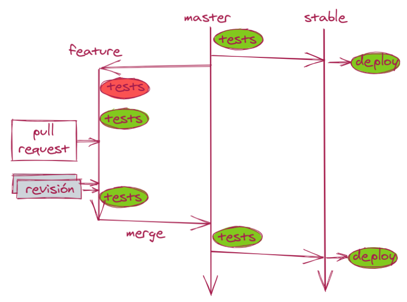
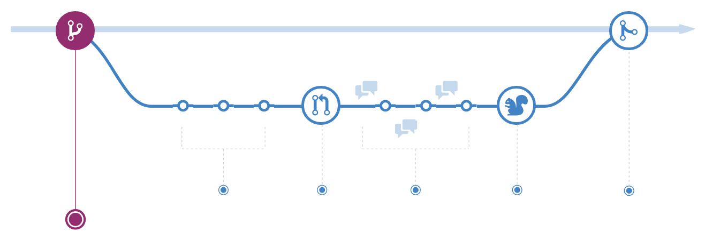

En esta sencilla metodología mantenemos sólo una rama activa,
llámese _master_ o [_main_](https://github.com/github/renaming).

* Sacamos una rama para hacer un arreglo (_fix_) o una nueva funcionalidad (_feature_).
* Añadimos cambios (_commits_) a la rama.
* Creamos una petición de mezcla (_pull request_ o _merge request_).
* Se van haciendo revisiones, añadiendo nuevos cambios y pasando los tests.
* Cuando los cambios están revisados y los tests pasan,
mezclamos los cambios (hacemos _merge_).
* De nuevo se vuelven a pasar los tests en _master_.
* Una vez que los tests pasan, desplegamos en producción.
* A continuación etiquetamos la versión (_tag_).

## ¿De dónde viene TPP?

Durante mis muchos años como desarrollador me he encontrado con muchas "metodologías" de desarrollo.
Una de las más perniciosas últimamente es
[git-flow](https://nvie.com/posts/a-successful-git-branching-model/),
en la que se mantienen múltiples ramas para diferentes versiones.
Más abajo la veremos más en detalle.

Me atrevo a proponer públicamente TPPv1:
Todo Para Producción v1, o _ToPaProd_ para los amigos.
Es una simplificación radical apta tanto para servicios online como para librerías.

### TPP para librerías

En librerías (para `npm`, `maven` o similares) las etiquetas son particularmente importantes:
identifican la versión concreta de la librería que se va a usar.

Seguiremos [Semantic Versioning](https://semver.org/) a rajatabla.
Las versiones se etiquetarán como _x.y.z_, donde:

* x: versión mayor (major). Rotura de compatibilidad ⇒ cambia x.
* y: versión menor (minor). Cambio de funcionalidad ⇒ cambia y.
* z: versión parche (patch). Arreglo de bugs ⇒ cambia z.

Cada versión debe ser **inmutable**:
está prohibidísimo publicar dos versiones diferentes con la misma etiqueta.

En caso de fallo es trivial hacer una vuelta atrás a una versión anterior:
sólo tenemos que apuntar a la última etiqueta válida.

### TPP para sistemas online

Para sistemas online no necesitamos mantener múltiples versiones;
basta con mantener una única versión viva que es la que mantenemos en _master_.

Una variante muy relevante en este caso consiste en mantener una rama adicional estable,
donde mezclamos sólo el código que pasa las pruebas.
Esta rama se puede llamar _stable_, _prod_ o similar.
Desplegaremos a producción siempre desde la rama estable.

En este caso las etiquetas o _tags_ son menos importantes e incluso se pueden omitir.
Para desplegar simplemente hacemos un `git pull`,
y si es necesario lanzamos un build.

### ¡Los tests de _master_ no pasan!

**La rama _master_ debe estar siempre desplegable.**
Si una vez mezclada una rama los tests fallan,
lo trataremos como prioridad máxima,
con casi la misma severidad que un fallo en producción.
Es cierto que una versión que no pasa las pruebas ni se etiqueta ni se despliega,
pero estaremos estorbando el trabajo de otros equipos que quieran mezclar a _master_.

## Comparación con otras metodologías de desarrollo

El sentido de metodología se ha ido refinando;
en este caso queremos decir "forma de organizar los cambios en el código",
lo que se corresponde con un _workflow_ de desarrollo.

### GitFlow

Esta metodología se liberó en 2010 y tuvo bastante éxito en múltiples ámbitos.
Combina

* ramas para cada funcionalidad o _feature braches_,
* ramas para cada versión o _release branches_,
* una rama _master_ para versiones definitivas,
* una rama _develop_ para desarrollo,
* y otra rama _hotfixes_ para arreglos rápidos.

El esfuerzo para mantener tantísimas ramas sólo es posible para grandes organizaciones
con un montón de recursos.
El propio autor aclara [al principio de la página](https://nvie.com/posts/a-successful-git-branching-model/):

<blockquote>
Si tu equipo hace entrega continua de software, os sugeriría un _workflow_ mucho más sencillo (como GitHub flow) en lugar de intentar meter git-flow con calzador en vuestro equipo.
</blockquote>

### GitHub Flow

Entonces, ¿es mejor GitHub Flow?
En esta metodología
[propuesta por GitHub](https://docs.github.com/en/free-pro-team@latest/github/collaborating-with-issues-and-pull-requests/github-flow)
se trabaja de forma similar:
se crea rama, se añaden cambios, se revisan y se mezclan.

Podemos ver en
[la guía gráfica](https://docs.github.com/en/free-pro-team@latest/github/collaborating-with-issues-and-pull-requests/github-flow)
la diferencia más radical con TPP:
en GitHub Flow **se hacen los despliegues desde la rama**,
antes de mezclar.
Esto tiene el gran problema de que es posible que haya cambios en _main_
que no se van a desplegar, ya que no están en la rama;
hay que asegurarse de hacer un `git pull origin main`
antes de desplegar y mezclar.

Me parece mucho más robusto desplegar desde _main_ una vez mezclados los cambios.

## Conclusiones

Si quieres desplegar código de forma sencilla,
mantener sólo una versión,
y optimizar los esfuerzos del equipo,
¡pásate a TPP!

### Agradecimientos

Gracias a mis compañeros en diversas empresas:
[mediasmart.io](https://mediasmart.io/),
[Devo](https://www.devo.com/),
[Influencity](https://influencity.com/)
y últimamente [LeanMind](https://leanmind.es/)
por ayudarme a probar diversas formas de desplegar código.
Gracias a todos los alumnos del
[curso de escalabilidad](/2020/curso-escalabilidad)
por ayudarme a refinar la metodología.

