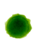

<iframe class="video" src="https://www.youtube-nocookie.com/embed/5XyNe8UESTs?start=192" frameborder="0" allow="accelerometer; autoplay; encrypted-media; gyroscope; picture-in-picture" allowfullscreen></iframe>

En esta última parte vamos a explorar el origen mismo de las bacterias,
y ya puestos de toda la vida en la Tierra.

# ¿Hasta dónde llega la biosfera?

Ya hemos visto en la
[parte 1](bacterias-bonita#en-el-medio-ambiente)
que hay abundantes bacterias en las nubes.
Vamos a seguir subiendo a ver qué nos encontramos.

## Alta atmósfera

En primer lugar tengo que citar un
[apasionante experimento](https://www.ncbi.nlm.nih.gov/pmc/articles/PMC5864199/)
en Sierra Nevada:
un equipo liderado por Isabel Reche,
[profesora de ecología en la Universidad de Granada](http://ecologia.ugr.es/pages/personal/profesorado/i_reche),
colocó dos cubos estériles a 2.5 y 3 km de altura.
Cada día recolectaron decenas de millones de bacterias
y billones de virus por metro cuadrado.
Parte de ellos llegaron con el aire húmedo,
pero otros parecían dispersarse desde grandes distancias,
favoreciendo la idea de que virus y bacterias forman una red global.

A unos 10 km de altura (donde vuelan los aviones comerciales)
se encuentra la tropopausa;
a partir de aquí empieza la estratosfera.
Y a 12 km sigue habiendo
[abundantes bacterias](https://www.ncbi.nlm.nih.gov/pmc/articles/PMC6102410/).

.](pics/bacterias-stratosphere-density.jpg "La concentración inicial a unos pocos km de altura es de 15 µg/m3. A 5 km de altura baja a 0.20 µg/m3, y se queda ahí hasta los 12 km.")

Seguimos subiendo: entre 20 y 40 km
necesitamos un globo aerostático.
También [sigue habiendo bacterias](https://www.sciencedaily.com/releases/2009/03/090318094642.htm).
A partir de aquí estamos en la mesosfera;
hay que ir en cohete meteorológico,
y [encontramos microbios hasta 77 km de altura](https://aem.asm.org/content/aem/35/1/1.full.pdf).

.](pics/bacterias-cohete-ruso.jpg "Bahía de instrumentos a la izquierda mostrando bolsas de recogida. Cono separable a la derecha.")

Sobre la siguiente capa atmosférica,
la termosfera,
no hay mucha información.
Según algunos estudios
[las procariotas pueden atravesarla sin problemas](https://arxiv.org/pdf/1711.01895.pdf).
Sabemos seguro que se ha encontrado material genético bacteriano
[en el exterior de la Estación Espacial Internacional](https://downloads.hindawi.com/journals/tswj/2018/7360147.pdf),
correspondiente a organismos terrestres.

## Resistencia a la radiación

También vimos en la
[parte 1](bacterias-bonita#los-extremófilos-no-se-tocan)
que hay bacterias que resisten el vacío del espacio.
Las esporas de la humilde _Bacillus subtilis_
[sobreviven sin problemas al vacío y a la radiación ultravioleta](https://www.ncbi.nlm.nih.gov/pubmed/11542695).
Pero en el espacio hay problemas más grandes:
la [radiación ionizante](https://www.nasa.gov/analogs/nsrl/why-space-radiation-matters)
consiste en rayos X, rayos Gamma (más energéticos todavía)
y otras partículas que pueden causar daños celulares.
En el momento en el que vamos más allá de la baja órbita terrestre
(unos 2000 km) cruzamos los cinturones de Van Allen;
a partir de aquí la exposición es constante y nociva.

.](pics/bacterias-orbitas-satelites.svg "El cinturón de Van Allen interior está entre 500 y 5000 km de altura; el exterior entre 15000 y 38000 km. La baja órbita terrestre llega a unos 2000 km.")

Vamos a investigar más en detalle qué hace falta para abandonar la Tierra con garantías.
En 1956 A. W. Anderson y su equipo intentaban esterilizar carne picada con radiación.
Pero no lo conseguían: incluso con dosis masivas la carne se echaba a perder.
¿De cuánta radiación estamos hablando?

La irradiación en seres vivos se mide en Grays (Gy).
Por comparar, 5 Gy son letales para un humano.
Las famosas cucarachas [no llegan a 1000 Grays (1 kGy)](http://morgana249.blogspot.com/2014/08/6-organisms-that-can-survive-fallout.html),
Con 5 kGy podemos freir a un tardígrado (oso de agua),
una criatura notable por su resistencia a la radiación.
Pues bien, Anderson _et al_ estaban usando dosis de **diez mil Grays** (10 kGy).

<iframe class="video" src="https://www.youtube-nocookie.com/embed/S-6cIy_s8pQ?start=84" frameborder="0" allow="accelerometer; autoplay; encrypted-media; gyroscope; picture-in-picture" allowfullscreen></iframe>

Al investigar qué podía estar creciendo con estos niveles de radiación ionizante
descubrieron a
[_Deinococcus radiodurans_](https://biochem.wisc.edu/sites/default/files/labs/cox/pdfs/38.pdf),
la bacteria antes conocida como _Micrococcus radiodurans_:
el primer extremófilo en esta nueva categoría.

A partir de entonces se descubrieron otras bacterias que también resistían tremendas dosis de radiación,
con nombres cada vez más fantásticos:
[_Rubrobacter radiotolerans_ llegaba a 11 kGy](https://www.ncbi.nlm.nih.gov/pmc/articles/PMC4148983/).
La magnífica
[_Truepera radiovictrix_](https://academic.oup.com/femsle/article/247/2/161/490993)
soportaba algo menos: 5 kGy.

El récord ahora mismo lo tiene una arquea que resiste hasta 30 kGy:
[_Thermococcus gammatolerans_](https://www.microbiologyresearch.org/content/journal/ijsem/10.1099/ijs.0.02503-0).
Podría aguantar [hasta 15 segundos en el muro interior de ITER](https://crppwww.epfl.ch/~weisen/Cours_fichiers/ITER%20DIAGNOSTICS.pdf),
el reactor de fusión más potente del mundo en plena operación.
En [un incidente tipo Fukushima con fusión del núcleo](https://www-pub.iaea.org/MTCD/Publications/PDF/TE-1818_web.pdf)
una cepa podría sobrevivir un día completo dentro del vaso de contención contaminado.

.](pics/bacterias-iter-plan.jpg "Plano del interior del reactor de fusión ITER. El muro interior es el que sufre las reacciones termonucleares. Mide unos 6 metros (dos pisos) de alto.")

Con radiación es posible conseguir _E. coli_ que aguanta
[2.5 kGy](https://jb.asm.org/content/201/8/e00784-18).
Como ya hemos visto, los tardígrados soportan
[hasta 5 kGy](https://www.researchgate.net/profile/Takahiro_Kikawada/publication/6620865_Radiation_tolerance_in_the_tardigrade_Milnesium_tardigradum/links/547fc19e0cf25b80dd703913/Radiation-tolerance-in-the-tardigrade-Milnesium-tardigradum.pdf),
aunque en realidad a partir de 1 kGy dejan de ser fértiles.

.](pics/bacterias-radiation-e-coli.gif "Con la irradiación la resistencia sube.")

Podemos establecer un ranking basándonos en el valor D10:
la dosis que mata al 90% de los ejemplares de una cepa.

|Foto carné|Especie|D10|
|---|---|---|
||_Homo sapiens_|5 Gy|
||_Blatella germanica_|900 Gy|
||_E. coli_ (+hardening)|2 kGy|
||_Milnesium tardigradum_|5 kGy|
||_Deinococcus radiodurans_|10 kGy|
||_Thermococcus gammatolerans_|30 kGy|

¿Por qué hay procariotas tan resistentes a la radiación?
Se ha sugerido que estas bacterias tan resistentes tienen su
[origen en Marte](https://web.archive.org/web/20081217033629/http://biospace.nw.ru/astrobiology/Articles2002/Astrobio_pavlov_25-34.pdf),
ya que en la Tierra no es posible que se hayan expuesto a niveles de radiación lo bastante grandes.
Pero no es la única opción:
otros estudios apuntan a que la resistencia a la radiación
usa [los mismos mecanismos](https://jb.asm.org/content/jb/178/3/633.full.pdf)
que la resistencia a la desecacion.
No hay por tanto una evidencia concluyente de que esta resistencia
se haya adquirido realmente con exposición a la radiación.
Podría ser simplemente una coincidencia,
afortunada para nuestros propósitos de encontrar vida más allá de la Tierra.

# ¿Vida en el sistema solar?

Una vez que aguantamos dosis masivas de radiación ionizante,
no hay razón para quedarnos en nuestro planeta.
¿Hay vida en otros puntos de nuestro sistema solar?
Hay toda una disciplina,
la astrobiología,
dedicada a encontrarla.

## En la Luna

En primer lugar vamos a hacer una visita rápida a la Luna.
Tras múltiples misiones tripuladas se sabe que por allí no hay vida,
ni las condiciones adecuadas para que se dé.
Pero, ¿pueden sobrevivir las bacterias terrestres?
Todo indica que sí.
En 1972 los astronautas de la misión Apollo 12
recogieron la sonda _Surveyor 3_,
y a bordo encontraron
[ejemplares vivos de _Streptococcus mitis_](https://mmbr.asm.org/content/mmbr/64/3/548.full.pdf)
en el interior de una cámara.

## ¿Vida en Marte?

Vamos a seguir al que parece el candidato más viable: Marte.
¿Qué pensaríais que pasaría si una misión al planeta rojo detectara vida?
Grandes titulares y multitud de planes para expandir los descubrimientos, como mínimo.
La realidad es (o fue) mucho más modesta.

La misión Viking llevaba a bordo cinco experimentos para detectar vida en Marte.
Carl Sagan (junto con Joshua Lederberg)
[dijo antes de la misión](https://ntrs.nasa.gov/archive/nasa/casi.ntrs.nasa.gov/19760009917.pdf):

> Tenga éxito o no la misión Viking 1976,
> las siguientes naves que aterricen en Marte deberían llevar un rango más variado de experimentos biológicos,
> capaces de buscar en un espectro más amplio de organismos marcianos concebibles.

.](pics/bacterias-sagan-viking.jpg "Carl Sagan posa con una réplica de la Viking lander, con un fondo que simula Marte.")

El 30 de julio de 1976 llegaron los resultados de los experimentos a bordo.
[Cuatro de los cinco eran positivos](https://blogs.scientificamerican.com/observations/im-convinced-we-found-evidence-of-life-on-mars-in-the-1970s/).
El quinto, diseñado para captar moléculas vivas, falló.
La NASA (y la comunidad científica)
se resignaron a aceptar que se habían detectado mecanismos inorgánicos que simulaban la actividad de seres vivos.

De vuelta en la Tierra se ha demostrado que
[la presencia de perclorato en el suelo marciano](https://www.ncbi.nlm.nih.gov/pmc/articles/PMC3691774/)
puede haber provocado el falso negativo.
¿Por qué dudar del hallazgo de vida en Marte?
¿Acaso los hombrecillos verdes controlan las instituciones terráqueas?
No es necesario buscar conspiraciones:
el principio de prudencia se debe aplicar mientras no haya resultados concluyentes.

Desde entonces se han detectado en Marte
[agua líquida](http://www.esa.int/Science_Exploration/Space_Science/Mars_Express/Water_at_Martian_south_pole),
[metano](https://pdfs.semanticscholar.org/6ba6/590c2d871a0f7db0f568e2ba1e838c4c433b.pdf)
y [compuestos orgánicos complejos](https://www.nasa.gov/press-release/nasa-finds-ancient-organic-material-mysterious-methane-on-mars).
Además se encuentra O2 que no puede explicarse sólo por fuentes inorgánicas,
y que [aumenta en primavera y verano](https://agupubs.onlinelibrary.wiley.com/doi/10.1029/2019JE006175).
¿Qué nos falta pues?

.](pics/bacterias-marte-estaciones.jpg "A la izquierda Marte a comienzos de primavera, en el centro a finales de primavera: en ambos casos un casco polar visible. A la derecha vista de finales del verano: menos gases, no hay casco polar. Imágenes del Hubble, tomadas en 1996, 1995 y 2016 respectivamente.")

¿Es posible que hayamos llevado nosotros esas bacterias?
En la NASA tienen una "oficial de protección planetaria",
Catharine "Cassie" Conley.

.](pics/bacterias-planetary-protection-officer.png "Cómic de una señora molona con espada rodeada de planetas.")

Sin embargo, de vez en cuando
[ocurren accidentes](https://www.space.com/13783-nasa-msl-curiosity-mars-rover-planetary-protection.html)
y se cuelan esporas terrestres.
Será complicado asegurarse de que las bacterias que encontremos no procedan de alguna misión espacial.

Parece que las esporas bacterianas
[sobreviven sin problemas a la transferencia entre planetas](https://mmbr.asm.org/content/mmbr/64/3/548.full.pdf).
No parece muy descabellado pensar que unas criaturas tan adaptables
sean capaces de proliferar en nuestro planeta vecino.
Si es así, sería complicado explicar su ausencia tras 4000 mil millones de años
"intercambiando babas",
como dijo el científico de la NASA
[Chris McKay](https://blogs.scientificamerican.com/observations/im-convinced-we-found-evidence-of-life-on-mars-in-the-1970s/).

Lo que es bastante incomprensible es que no se envíen nuevas misiones a Marte
con la capacidad de localizar vida,
según lo que hoy sabemos.

## Otros planetas

Por desgracia, los planetas interiores están demasiado calientes.
En Venus la temperatura media es de
[467 C](https://www.space.com/18526-venus-temperature.html),
haciéndolo estéril (al menos por lo que sabemos hoy día).

Los planetas gaseosos son un misterio,
y los satélites de Júpiter son particularmente prometedores.
Por ejemplo
[Europa tiene unas grietas bastante sospechosas](https://www.astrobio.net/news-exclusive/evidence-of-bacteria-on-europa/).
¿Qué pasa con esa
[misteriosa fuente de metano en Encélado](https://agupubs.onlinelibrary.wiley.com/doi/full/10.1002/2014GL063013)?
Desde luego parece que merece más estudio,
al menos para descartar que provenga de arqueas
(o sus equivalentes jovianas).

.](pics/bacterias-enceladus-plumes.jpg "La superficie de Encélado muestra chorros de gas que salen de la superficie.")

La misión [JUICE](http://www.bbc.com/earth/story/20150326-europa-may-be-home-to-alien-life),
prevista para 2022,
puede darnos más pistas.

# Panspermia

[Anaxágoras de Clazómene](https://cosmosmagazine.com/biology/over-our-heads-a-brief-history-of-panspermia)
habla de "semillas recorriendo el cosmos".
Sin embargo, es
[bastante común](http://checktheevidencecom.ipage.com/checktheevidence.com/pdf/Directed%20Panspermia%20F.%20H.%20C.%20CRICK%20AND%20L.%20E.%20Orgel.pdf)
atribuir la idea de panspermia a Arrhenius.
Él mismo cita a científicos anteriores en su
["Worlds in the Making: The Evolution of the Universe" (1908)](https://archive.org/details/worldsinmakingev00arrhrich/page/226/mode/2up).
En cualquier caso su visión es muy enriquecedora:

> Es por tanto probable que gérmenes de los organismos más bajos que conocemos
> se arrastren continuamente desdde la Tierra y de los otros planetas en los que existan.
> Como semillas que son, es seguro que la mayoría de estas esporas,
> arrastradas de esta forma,
> encuentrarán la muerte en el frío espacio infinito del Universo.
> Pero un pequeño número de esporas caerá en otro mundo,
> y pueden ser capaces de dispersar la vida allí si las condiciones fueran favorables.

## Ecosistema solar

La primera vez que me encontré con esta idea de que la vida se había originado en otro planeta,
o incluso en otro sistema solar,
me pareció un poco ridícula.
¿Qué se resolvía de esta manera?
Todo lo que se conseguiría es,
en todo caso,
retrasar el problema del origen de la vida a un ámbito todavía más desconocido que la Tierra primigenia.

Pero es que el origen de la vida no es lo único importante.
Si todo nuestro sistema solar está lleno de bacterias
esto nos permitiría contemplar un ecosistema gigante,
con bacterias evolucionando en otros cuerpos celestes
y volviendo a la Tierra como nuevas especies que enriquecen (o alteran) nuestros ecosistemas.

El propio Sagan, citado por nuestro
[viejo amigo Crick](bacterias-tecnologia),
expuso
[serias dudas](http://checktheevidencecom.ipage.com/checktheevidence.com/pdf/Directed%20Panspermia%20F.%20H.%20C.%20CRICK%20AND%20L.%20E.%20Orgel.pdf);
la más grave era la radiación que recibirían las esporas _en route_
entre planetas.
Ya hemos visto cómo las procariotas pueden superar este obstáculo sin problemas,
y más todavía si están insertas en rocas.

## Ecosistema galáctico

Abriendo un poco más los ojos,
y ampliando los periodos de tiempo considerados,
podríamos considerar que la vida venga de otras estrellas cercanas.
Al fin y al cabo,
todo parece indicar que ya había abundante vida en la Tierra
[hace 3700 millones de años](https://www.researchgate.net/profile/Takeshi_Kakegawa/publication/262981831_Evidence_for_biogenic_graphite_in_early_Archaean_Isua_metasedimentary_rocks/links/0046352fdb80b2cbf2000000.pdf),
poco después de que se enfriara el planeta.

¿No puede ser que la vida se originara en otra estrella que luego explotara,
y que por tanto ya estuviera en el sistema solar desde su formación?
En este caso podríamos ver nuestro entorno galáctico
como un caldo de cultivo de vida,
con [estrellas que se contaminan unas a otras](https://iopscience.iop.org/article/10.3847/2041-8213/aaef2d)
intercambiando cometas y asteroides.

## Teorías desde el borde

Según vamos ampliando horizontes hay que tener mucho cuidado con estas ideas.
A veces vienen de científicos reputados como
[Stephen Hawking](https://web.archive.org/web/20110724233755/http://www.statepress.com/archive/node/5745):

> La vida podría extenderse de planeta en planeta o incluso de sistema estelar en sistema estelar,
> llevada por meteoritos.

Pero también hay propuestas de gente más _fringe_ como las del
[Journal of Cosmology](http://journalofcosmology.com/Life100.html)
que es, digamos,
[poco](https://scienceblogs.com/pharyngula/2011/03/06/did-scientists-discover-bacter)
[escrupuloso](https://www.discovermagazine.com/the-sciences/followup-thoughts-on-the-meteorite-fossils-claim).

En particular, el astrónomo Fred Hoyle propuso que
[muchas enfermedades pueden tener su origen extraterrestre](https://www.hoyle.org.uk/resources/virusesfromspacecompressed.pdf),
incluyendo el SIDA.
Ya [hemos visto](bacterias-tecnologia)
la especifidad de los ataques contra nuestras células,
lo que siembra serias dudas en esta teoría.
En 2003 su colaborador Wickramasinghe publicó un artículo diciendo que el virus SARS
[tenía su origen en el espacio](https://linkinghub.elsevier.com/retrieve/pii/S014067360313440X);
esta teoría ha [sido](https://www.thelancet.com/journals/lancet/article/PIIS0140-6736(03)14039-1/fulltext)
[ampliamente](https://www.thelancet.com/journals/lancet/article/PIIS0140-6736(03)14041-X/fulltext)
[refutada](https://www.thelancet.com/journals/lancet/article/PIIS0140-6736(03)14040-8/fulltext).
Espero con ansiedad que Wickramasinghe
(que tiene una tendencia extraordinaria a citarse a sí mismo)
postule un origen espacial para COVID-19.

.](pics/bacterias-diseases-from-space.jpg "Unos extraños organismos salen de un planeta marronáceo.")

La intrigante idea de Sharov de que
[la vida se originó hace diez mil millones de años](https://www.ncbi.nlm.nih.gov/pmc/articles/PMC1526419/)
y que, por lo tanto, no ha habido tiempo de que evolucionara en la Tierra,
requiere de bastantes más pruebas antes de que pueda aceptarse;
una gráfica con cinco puntos y una regresión no es suficiente.
(El artículo de Sharov en general es muy cuestionable,
y las objeciones de los revisores no tienen desperdicio.)

.](pics/bacterias-sharov-genome.jpg "En la gráfica se muestran los genomas de procariotas, eucariotas, gusanos, peces y mamíferos. Los valores aparentan estar aproximadamente sobre una línea recta en una gráfica logarítmica. Se distingue entre genoma completo y genoma funcional no redundante. La recta de regresión exponencial cruzaría el origen hace unos diez mil millones de años.")

Es una lástima que haya tanto charlatán en un campo tan intrigante.
Por suerte cada vez hay más científicos serios,
como [Gerda Horneck](https://www.astrobio.net/extreme-life/the-lessons-of-exposure/).

# ¿El origen del sol?

Los elementos que componen la Tierra se fraguaron
[en supernovas](https://blogs.scientificamerican.com/basic-space/httpblogsscientificamericancombasic-space20110802on-the-origin-of-chemical-elements/)
y
[en estrellas de neutrones](https://www.ligo.org/science/Publication-GW170817Kilonova/flyer.pdf).
En palabras de [Carl Sagan](https://www.universetoday.com/119541/as-it-turns-out-we-really-are-all-starstuff/):

> El nitrógeno en nuestro ADN, el calcio de nuestros dientes,
> el hierro en nuestra sangre, el carbono en nuestras tartas se forjaron en el interior de estrellas colapsándose.
> Estamos hechos de estrellas.

.](pics/bacterias-periodic-table-nucleosynthesis.svg "Los elementos con número atómico 1 al 3 se generaron en el Big Bang; del 3 al 5 por rayos cósmicos; del 6 al 40 en supernovas; y del 41 al 94 en fusiones de estrellas de neutrones. Además hay contribuciones relevantes de estrellas poco masivas moribundas: 3, 6 y 7, 38-82; y de explosiones de enanas blancas: 14-30.")

Está claro que venimos de un medio estelar muy rico en historia.
Siempre me ha llamado la atención que no se dedique más atención a estudiar
cuáles son nuestros ancestros estelares.

A 3000 años luz del sol se encuentra el
[clúster abierto M67](https://freestarcharts.com/messier-67).
Contiene unas 200 estrellas con edad y composición
parecidas a nuestro Sol.
Esto lo hace candidato número uno a haber sido la cuna de nuestro sistema solar.
La pregunta es ¿por qué estamos tan lejos?

Contando 4500 millones de años
nos da una velocidad media de
[230 km/h](https://www.wolframalpha.com/input/?i=300+parsec+%2F+4500+million+years+to+km%2Fh),
al alcance de un coche de carreras.
¡Eso no es nada
[en términos estelares](https://pinchito.es/2019/high-speeds)!
Basta con suponer que algo sacó al Sol de su entorno y lo dejó a la deriva,
lo que nos convertiría en huérfanos estelares recorriendo la galaxia sin rumbo definido,
lejos de nuestros hermanos.

No todo el mundo está de acuerdo.
En una simulación la astrofísica Bárbara Pichardo _et al_
[descartaron este clúster como origen del sol](https://iopscience.iop.org/article/10.1088/0004-6256/143/3/73/pdf):
no consiguieron simular la salida del Sol del cluster sin destruir el incipiente sistema solar.
También reconocieron que una mejora en sus modelos podría cambiar la situación.
Pero lo cierto es que no tenemos candidatos mejores.
En un estudio más reciente se descubrió que las estrellas de este cluster
[rotan en unos 26 días](https://iopscience.iop.org/article/10.3847/0004-637X/823/1/16),
casi igual que nuestro Sol,
lo que para muchos volvió a confirmar la paternidad de M67.

Combinando la teoría de la panspermia estelar con este descubrimiento,
podríamos pensar que el origen de la vida debería de buscarse en este cluster.
Incluso que serían buenos candidatos para buscar seres vivos,
o incluso civilizaciones avanzadas.
Lástima que a 3000 años luz estén un poco lejos para ir a visitarlos,
y a ellos les quedan unos 2900 años para recibir nuestras primeras emisiones de radio.

.](pics/bacterias-m67.jpg "Fotografía en infrarrojo cercano del clúster estelar M67.")

# Fin

Este artículo es la quinta parte de la
[serie sobre bacterias](bacterias-maquinas).
Sigue a la
[parte 6: Conclusiones](bacterias-conclusiones),
donde intentaremos extraer algunas enseñanzas útiles.

← Parte 1: [🦠 Y las bacterias, bonita](/2021/bacterias-bonita).  
← Parte 2: [⚙️  Tecnología bacteriana](/2022/bacterias-tecnologia).  
← Parte 3: [🖇️ El largo camino a la simbiosis](/2022/bacterias-simbiosis).  
← Parte 4: [💉 Enfermedades autoinmunes](/2022/bacterias-autoinmunes).  
↑ Parte 5: ¿Venimos de las estrellas?  
→ Parte 6: [Conclusiones](bacterias-conclusiones).  

