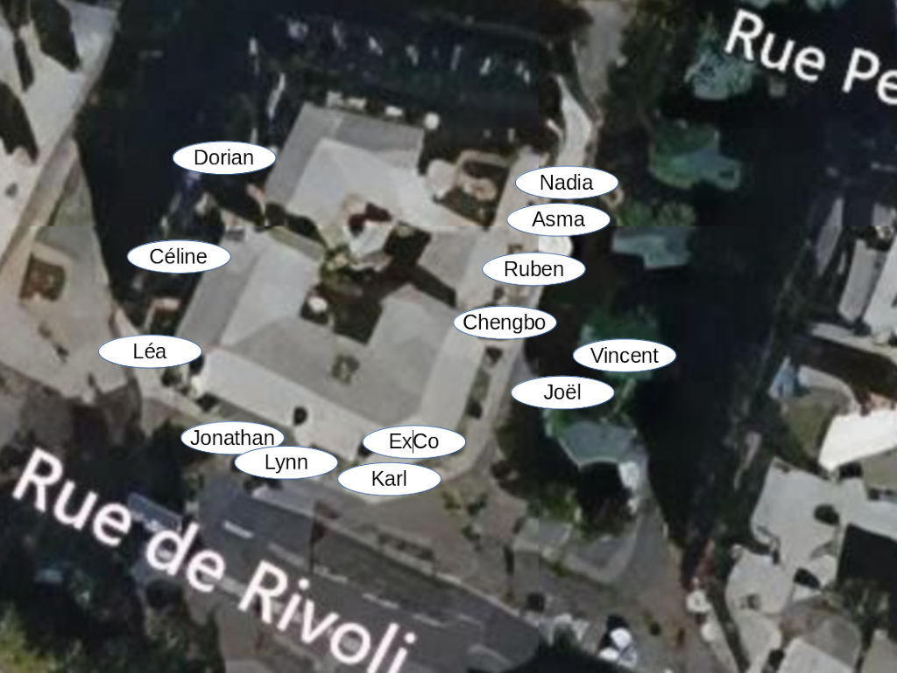
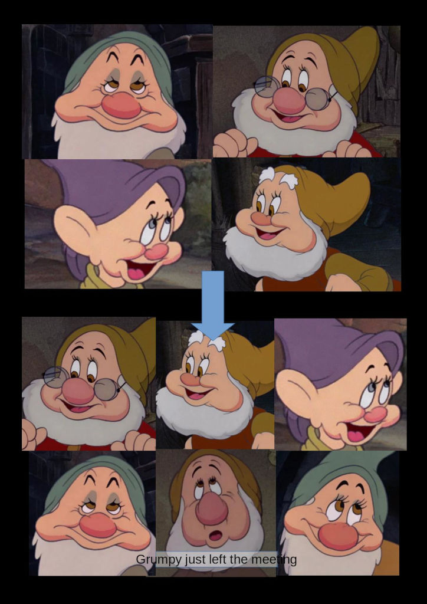

Maybe it has happened to you:
since working remotely, your day is a blurry continuum of online meetings.
There is something missing,
some _magic_ that happened at the office.
And I'm not just speaking about the free coffee and all the water cooler bad jokes.
(Which you are also allowed to miss by the way.)

So, what is it that we are lacking,
and what can we do about it?
Let's dive in!

### About the Author

But first a short note about myself.
I am Alex Fernández,
I have been CTO at Hivency since January 2021.
And I have been working for 23 years already,
which means that I'm super-old!
I am known as
[pinchito on Twitter](https://twitter.com/pinchito),
and as "Papucho" by my daughter.

I have worked mostly remotely since 2011,
so I should know what I'm speaking about!
(In fact most of the time I don't know anything,
but this will be our little secret 😉)

## Remote Meetings

OK, back to our little issue.
You know the feeling:
you are working from home for a few hours.
You have one online meeting after the other,
and after a while they start to blur into one another.

If you think about the situation, it is no mystery:
this is a very monotonous situation for the mind.
Sitting in the same place all day with little distractions
is great for deep work,
the kind that you do alone like reading a report or writing code.
But not so much for interacting with people:
we really enjoy changing settings from time to time!

Videoconferencing tools do not help either:
faces appear at seemingly random positions on the screen,
which can even change in the middle of a conversation!

### Some Clues

So why is it so hard to have memorable conversations online?
A first clue appears when you go back to the office,
and start talking to people about meetings they have had.
If they come from Southern Europe they will immediately start waving their hands,
pointing to the imaginary locations where they were standing for each encounter.
(Yes, many other cultures also do the same.)

What is going on?
And why this extemporaneous cultural stereotype?
For the second question I can be excused because I'm from Southern Europe myself;
in fact, many of my best friends are Southern Europeans.
As to the gesturing when remembering meetings,
there must be a deeply hidden reason for this.
So I started to pull the thread.
What I found will surprise you! Or not,
but it did in fact make me write this article so `¯\_(ツ)_/¯`

## Spatial Memory

It is a well known fact that memory works very well when it refers to places.
Working always from home messes with that.
In an office you are moving constantly,
meeting people in different places,
and this helps remember what everyone said and when.

### Memorable Events

Each conversation seems to be mentally affixed to the location where it takes place.
In fact, people are transported in their imagination to the _place and time_ where it happened.
When we are online we lose these valuable cues,
and can only turn back to a rough idea of the time when something happened.

A similar effect happens with important events in our life.
In old US movies everyone remembers where they were when they heard about the assassination of JFK;
in my generation something similar happens with the World Trade Center attacks.
I'm sure that millennials will have their own defining event,
like the unveiling of a new Pokemon or something.
(Those damn kids should get off my lawn, by the way!)

### The Method of Loci

A popular technique for remembering things is
to assign memories to specific locations on a route that is well known,
and then to recall them by walking back the same path.
This technique is often called "the memory palace",
or the
[method of _loci_](https://en.wikipedia.org/wiki/Method_of_loci)
if you want to show off your Latin.

This is in fact the most widely used technique by
[memory champions](https://www.smithsonianmag.com/science-nature/why-you-can-train-your-brain-memory-champion-still-forget-your-car-keys-180962496/),
and mentioned by no less than our fictional friends
[Sherlock Holmes](https://www.pastemagazine.com/science/memory/a-look-inside-a-memory-champions-mind-palace/)
and
[Hannibal Lecter](https://blogs.scientificamerican.com/illusion-chasers/hannibal-lecter/).
Plus, it is a good way to count cards and get banned at casinos! 😎

Does it also work for most of us normal people?
Well, you probably use a variation of the same technique when visiting the supermarket:
you go over the same path and remember to buy your favorite products at the same places.
You may have noticed that some supermarkets play with our feelings
by changing products often so that
[we buy new products](https://bettermarketing.pub/the-secret-brilliant-and-questionable-strategy-supermarkets-use-to-make-you-spend-more-ca553c3c6135?gi=efd9d02be71d).
I hate you, Mercadona! 😰

### Inevitable Evolutionary Argument

Why are we so good at remembering places?
The answer will surprise you:
it involves a bunch of _Australopithecus_ looking for food in the African savannah,
and...

Nah, not really.
If you have ever owned a cat
(and we love cats at Hivency Tech 😸)
you know that they are _very_ aware of their surroundings.
In fact, all kinds of animals have some kind of
[spatial cognitiion](https://en.wikipedia.org/wiki/Spatial_cognition),
from birds to cuttlefish.
It is no wonder that our memory has adapted to remembering places,
landmarks and routes.

Since we have that wonderful capability,
why not use it to our advantage?

## What Can We Do About It?

Now it's the time for me to suggest improvements.
Can we do something to improve the memorability of our meetings in these pandemic times?

### Back to the Office

A first obvious suggestion is to go to the office every once in a while to have meetings with people.
This may not be really workable if:

* you work for a company on the other side of the world,
* your company sold off their office space,
* you reject societal norms including basic personal hygiene,
* or you have some other condition that prevents you from going to the office.

For the rest of us it can be really helpful
to get our wet chassis to the office every once in a while.
In June 2021 I had a really fruitful visit to the lovely Hivency office in Paris,
as seen at the top of the article;
reposted here for your convenience:

I was lucky because many of my colleagues also went to the office that week,
and I tried to meet as many of them as possible.
For me it's quite easy to recall these conversations
because I can remember where they happened,
and then I get more easily to what was spoken.

By the way, Paris is still wonderful,
and even better without tourists.
So hurry and pay a visit!

### Move Around

Suppose you can't or won't go to the office,
no matter how many free amenities the company sets up there to entice you.
Well, there is a poor person's alternative:
at least change settings for important meetings.
If at all possible move to another room or even go to the park:
I have done a lot of fruitful meetings from a public park bench or table,
and sometimes I didn't even have to fight with families or other
[hobos](https://en.wikipedia.org/wiki/Hobo)
to get a good picnic table.

You can also just walk around.
Just be careful not to get your interlocutors dizzy with a walking camera panorama;
if you are on the move maybe it's better to switch off the camera.
By the way, did you know that the mobile network is still working OK in most countries?
Enjoy a good old _vintage_ conversation on your cellphone like our grandparents used to do!

### The Notebook

Perhaps you really, really cannot move at all:
you are confined to the one table you use,
or it disrupts your workflow.
Well, we are not here to judge, and there is still hope for you!
There is another visual aid that will be there to help us:
_The Notebook_.

It may seem a bit stupid to mention notebooks in a rant about spatial memory,
but after all the objective is to make your meetings memorable.
Writing stuff down has been proven in the last 5000 years or so to help people remember things.
Plus, there is also a spatial component to writing things down in a notebook,
which a text file on a computer does not have:
position in the page and page in the notebook.
Together they create a crumb trail that may help you trace back your thoughts later.

## Conclusions

Memory works best when it has spatial aids.
Online meetings remove many of the location cues that
help us have memorable conversations,
but we can still supplement them to help our poor brains:

* going to the office every once in a while,
* changing location to another room or even an open space,
* or writing things down on a notebook.

Hope these tips help!

### Remote Work at Hivency

At Hivency most employees have the option to work remotely,
and the company pays for a trip to the office every month to see our colleagues.
This helps immensely to cement relationships and make our meetings memorable.
Oh, and did I tell you that
[we are hiring](https://www.welcometothejungle.com/es/companies/hivency)?

### Acknowledgements

Thanks to Hivency for providing the opportunity to write this article.
Special thanks to Joël and Elise for their blog writing tips!

