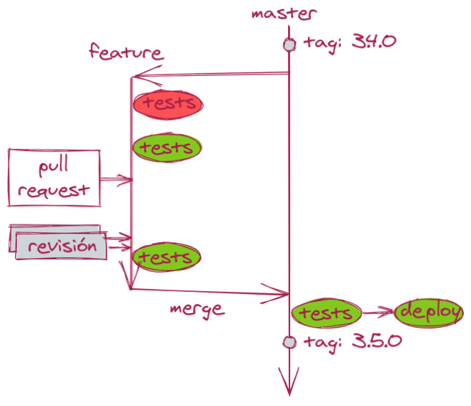

In this simplified methodology we keep a single active branch,
called `master` or [`main`](https://github.com/github/renaming).
To add modifications:

* Create a branch for a fix or a feature.
* Add changes (commits) to the branch.
* Create a pull request or merge request.
* Review, add changes and pass tests on the branch tip.
* When the changes have been reviewed and all tests pass,
merge the changes into the `main` branch.
* pass all tests again on the `main` branch.
* When this last round of testing passes, the branch is deployed to production.
* Finally, tag the version.

## Where Does TTP Come From?

During my many years as a developer I have found many development "methodologies".
One of the most pernicious of late has been
[git-flow](https://nvie.com/posts/a-successful-git-branching-model/),
where multiple branches are kept for different versions.
We will study it in more detail below.

I publicly propose TTPv1:
Through To Production v1.
It is a radical simplification valid both for online systems
and for libraries.
It is based on my work for the last ten years as a developer.
It has been specially designed for continuous deployment.
Plus, it facilitates the work of **multiple teams working in parallel**.

A first version called TPPv1
("Todo Para Producción v1") was published
[in Spanish](/2020/tpp) a few months ago.

### TTP for Libraries

In libraries (`npm`, `maven` and the like) version labels are particularly important:
they identify the specific version of the library which will be used.

We will follow [Semantic Versioning](https://semver.org/) strictly.
Versions are labeled as `x.y.z`, where:

* `x`: major version. Break compatibility ⇒ change `x`.
* `y`: minor version. Add functionality ⇒ change `y`.
* `z`: patch version. Fix bugs ⇒ change `z`.

Each version must be **immutable**:
it is forbidden to publish two different versions under the same label.

If there is a failure it is trivial to roll back to the last version:
just point production to the latest valid label.

In TTP we use `git` tags as labels:
each version is first tagged in git with a version number `x.y.z`,
and then the library is published with that same version number.

### TTP for Online Systems

In online systems we don't really need to maintain multiple versions:
it is enough to keep a single live version, which resides in the `master` branch.

A relevant variation in this case is to keep an additional stable branch,
where code is mixed only after it has passed all of our tests.
This branch can be called `stable`, `prod` or similar.
In this case we will deploy to production always from the stable branch.

In this case labels or tags are less important and can even be omitted.
To deploy we simply do a `git pull` in production,
possibly followed by a system build and/or a process restart.

### Tests on `master` are not passing!

**The `master` branch must always be deployable.**
If tests fail after merging the latest changes,
fixing the tests will be treated with maximum priority,
only slightly below a production issue.
It is true that a version that does not pass all tests will not be tagged or deployed,
but we will be blocking the work of other teams that want to merge and deploy.

### Code Reviews

Code review is a crucial part of software development.
I have [written at length about it](http://alexfernandez/2018/has-anyone-else-seen-your-code),
so I will include here just a brief summary.

Make sure to have at least two documented review processes.
The regular process should require at least two reviews from other team members.
The speedy process (for emergencies and one-liners)
can only require a single review.
Ideally everyone from the team should participate in reviews,
not only senior developers.

## Comparison with Other Development Methodologies

The meaning of "development methodology" changes wildly across teams:
from team organization to code workflow.
In this case we refer to "way to organizing and deploying changes in code",
which can also be called a development workflow.

### GitFlow

This methodology was released in 2010 and was quite successful in many organizations.
It combines:

* feature branches for each new feature,
* release branches (one for each version),
* a `develop` branch for development,
* a `master` branch for definitive versions,
* and a `hotfixes` for urgent fixes.

The effort to keep so many branches is only feasible for large organizations with plenty of resources.
The author clarifies [at the top of the page](https://nvie.com/posts/a-successful-git-branching-model/):

<blockquote>
 If your team is doing continuous delivery of software, I would suggest to adopt a much simpler workflow (like GitHub flow) instead of trying to shoehorn git-flow into your team.
</blockquote>

### GitHub Flow

So, is GitHub Flow any better?
This methodology
[proposed by GitHub](https://docs.github.com/en/free-pro-team@latest/github/collaborating-with-issues-and-pull-requests/github-flow)
organizes work in a similar fashion to TTP:
a branch is created, changes are added, then reviewed and merged.

We can see in
[the graphical guide](https://guides.github.com/introduction/flow/)
the most radical difference with TTP:
with GitHub Flow **deployments are done from the branch**,
before merging.
This can cause problems since there might be changes in `main` not merged into the branch,
and which therefore will not be deployed;
developers must make sure to bring the latest changes from `main` to the branch
(`git pull origin main`)
before deploying.

Deploying from `main` after merging is much more robust.
If you need to make sure that there is always a deployable version
just use the `stable` branch.

## Conclusions

If you want to deploy code in a straightforward manner,
maintain a single version and optimize team work,
adopt TTP now!

### Acknowledgements

Thanks to my team mates at these companies:
[mediasmart.io](https://mediasmart.io/),
[Devo](https://www.devo.com/),
[Influencity](https://influencity.com/)
and lately [LeanMind](https://leanmind.es/)
for helping me test different ways of deploying code.
Thanks to students of the
[scalability course](/2020/curso-escalabilidad)
for helping me formalize the methodology.

