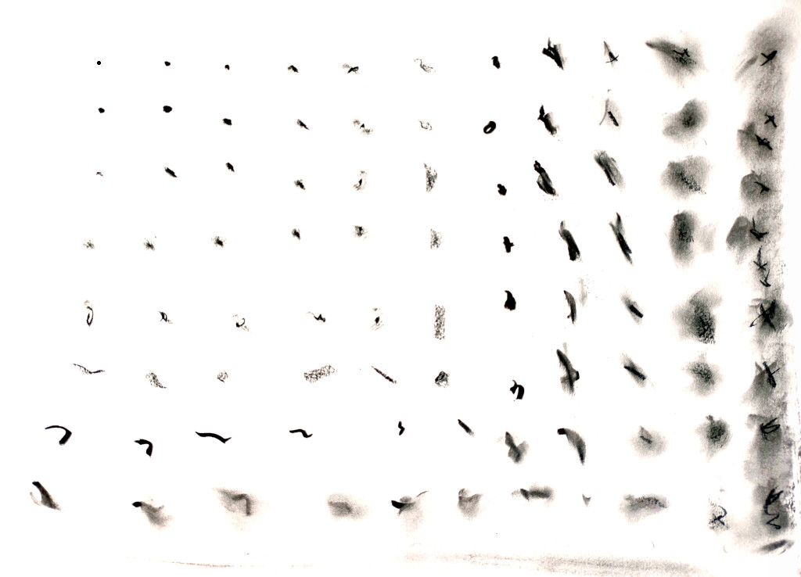
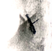

Come with me for this wondeful journey,
where we will reason together about the deepest problems known to mankind in easy to follow terms.
In the process we will try to guess the (possible) future of computing,
look into the nature of time itself,
and then we will check if rigorous, modern Physics agrees with our conclusions.

We will start our travel with something already abstract enough:
**entropy**.
What is it, and why does it matter?
Let's go into it!

## Introduction

In Philosophy there has always been a tradition of people just trying to understand the things we see around us.
The study of the physical world, then called Natural Philosophy, was no exception.
But a few centuries ago Physics became the realm of specialists,
with increasingly complex Maths that needed to be understood in depth before reaching any conclusions.
Still, there has always been a current of people just trying to understand the world,
even if their conclusions need to be validated rigorously before they can be taken seriously.

I graduated in Physics many years ago,
and got a glimpse of the delights of modern sciences.
Now I think that understanding Nature
("the pleasure of finding things out", as Feynman used to say)
should not be exclusive to specialists:
even the lay(wo)man can think with certain precision and without too much handwaving.

So I thought, why not start with something simple, such as quantum entropy?
No, really, we are doing it.
It is very interesting to imagine how entropy arises in the quantum world.
The classical version has been thoroughly studied, and is thought to be well understood;
but it leaves much to be desired as an explanation of the physical world,
when seen with quantum eyes.

## The Feared E-word

Let us start at a point which baffles many people:
what exactly is entropy, and how can it be defined?
Forget about thinking of entropy as "disorder";
this approach is highly confusing as can be seen in the Wikipedia article for
[Entropy (order and disorder)](https://en.wikipedia.org/wiki/Entropy_(order_and_disorder)).

The most striking property of entropy is that it always grows in a closed system.

Entropy is easily defined as "information" in the Shannon sense.
The Wikipedia article for
[Entropy (information theory)](https://en.wikipedia.org/wiki/Entropy_(information_theory))
has a long and erudite explanation.
Here we are going to give a sense of what it means.
In short: information always grows.

As a system evolves we need more and more information to describe it.
If you look at the picture that introduces the article you can get a sense of it:
at the top left corner we have a dot which is very easy to describe,
just by its center and radius.
The increasingly fuzzy stains as we move bottom and right need more info:
first they have a defined irregular shape,
then several strokes, and finally a fudge of varying intensity.

The information content of each spot is not something abstract;
it can be easily measured in kilobytes (KB).

This sequence is an artistic illustration of how entropy works.
And yet physical systems often follow the same pattern.
A classical example of growing entropy is a drop of fluid diffusing in another fluid inside a larger tank.
The drop is gradually smeared until it is completely mixed into the containing fluid,
which is when the entropy of the combined system drop + fluid is maximized.

As systems evolve, their entropy always grows,
and the amount of information needed to describe them also grows.
Because, remember, they are one and the same!

## Simulation Time

Now it's a good time to build a simplistic model of a system,
and to see how it evolves with time.
The following 

<h1>Diffusion simulator</h1>
<canvas id="canvas" width="768" height="300"></canvas>

<h3>Tunable parameters</h3>
<form id="params">
<label for="particles">Particles</label>
<input type="number" id="particles" value="10000">
 
<label for="speed">Speed</label>
<input type="number" id="speed" value="10">
 
<label for="visited">Visited</label>
<input type="checkbox" id="visited" value="false">
 
<button id="run" type="button">run</button>
<button id="pause" type="button">pause</button>
<button id="stop" type="button">stop</button>
</form>

## Conclusion

So, in short: **entropy is just another name for information**.

The quantum world is weird,
everyone is saying it.
Now you have a little glimpse into what makes it weird.

