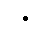
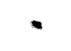
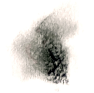
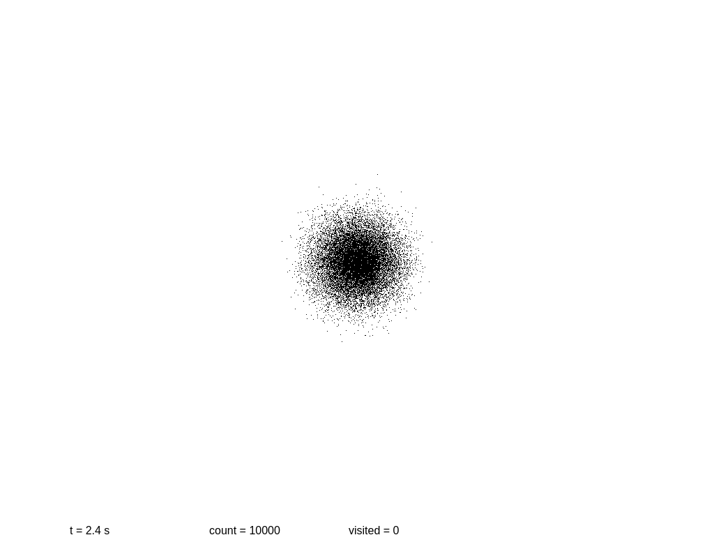

Come with me on this wondeful journey,
where we will reason together about the deepest problems known to mankind in easy to follow terms.
In the process we will try to guess the (possible) future of computing,
look into the nature of time itself,
and then we will check if rigorous, modern Physics agrees with our conclusions.

We will start our travel with something already abstract enough:
**entropy**.
What is it, and why does it matter?
Let's go into it!

## Introduction

In Philosophy there has always been a tradition of people just trying to understand the things we see around us.
The study of the physical world, then called Natural Philosophy, was no exception.
But a few centuries ago Physics became the realm of specialists,
with increasingly complex Maths that needed to be understood in depth before reaching any conclusions.
Still, there has always been a current of people just trying to understand the world,
even if their conclusions need to be validated rigorously before they can be taken seriously.

I graduated in Physics many years ago,
and got a glimpse of the delights of modern sciences.
Now I think that understanding Nature
("the pleasure of finding things out", as Feynman used to say)
should not be exclusive to specialists:
even the layperson can think with certain precision and without too much handwaving.

So I thought, why not start with something simple, such as entropy?
No, really, we are going there.
The classical version of entropy has been thoroughly studied, and is thought to be well understood;
but there is always a fresh way to look at things.

## The Feared E-word

The starting point already baffles many people _including physicists_:
what exactly is entropy, and how can it be defined?
It is unlike any other physical magnitudes.
Its most striking property is that in a closed system it always grows with time,
or at most stays constant.

Many people will tell you that entropy is "a measure of disorder".
Please forget about it;
this approach is highly confusing as can be seen in the Wikipedia article for
[Entropy (order and disorder)](https://en.wikipedia.org/wiki/Entropy_(order_and_disorder)).

Luckily there is a more fruitful approach:
entropy can also be defined as "information" in the Shannon sense.
The Wikipedia article for
[Entropy (information theory)](https://en.wikipedia.org/wiki/Entropy_(information_theory))
has a long and erudite explanation,
but it can be stated in a simple way:

> Information always grows.

Or more precisely: the information needed to fully describe a system always grows.
As a system evolves we need more and more information to describe it.
Therefore information behaves exactly like entropy,
and in fact both are equivalent.
In this article I will try to give you a sense of what this principle means.

### A Graphical Glimpse

Talk is cheap, while images feed our intuition.
Is there any way to see this information growth?

If you look at the picture that introduces the article you can get a sense of it:
at the top left corner we have a dot which is very easy to describe,
just by its center and radius.
The increasingly fuzzy stains as we move bottom and right need more info:
first they have a defined irregular shape,
then several strokes, and finally a fudge of varying intensity.

The information content of each spot is not something abstract;
it can be easily measured in kilobytes (KB).
For a quick test we will save each image as PNG and see how much information it contains
(that is, simply how big each file is).

This sequence is an artistic illustration of how entropy works;
physical systems often follow the same pattern.
A classical example of growing entropy is a drop of fluid diffusing in another fluid inside a larger tank.
The drop is gradually smeared until it is completely mixed into the containing fluid,
which is when the entropy of the combined system drop + fluid is maximized.

As systems evolve, their entropy always grows,
and the amount of information needed to describe them also grows.
Because, remember, they are one and the same!

### Diffusion Simulator

Now it's a good time to build a simplistic model of a system,
and to see how it evolves with time.
The following script will show a 2D simulation of diffusion,
where each black particle follows a random walk,
and there is a primitive collision detection.

<canvas id="canvas" width="768" height="576" style="border: solid black 1px; max-width: 100%; max-height: 100%;"></canvas>

<form id="params">
<input style="display: none;" type="number" id="particles" value="10000">
<input style="display: none;" type="number" id="speed" value="10">
<input style="display: none;" type="checkbox" id="visited">
<input style="display: none;" type="checkbox" id="autorun">
<button id="run" type="button">run</button>
<button id="pause" type="button">pause</button>
<button id="reset" type="button">reset</button>
</form>

Let us see if we can measure the information content at several steps.
At the beginning we have a mostly round shape:
points are placed near the center with a certain initial drift.
Then each point slowly moves away every 0.1 seconds,
in a random direction each time.
As before, we take a snapshot and save it.

Images are stored using the lossless format PNG,
but this does not mean that it is an accurate measurement of the information!
PNG is notoriously poor at encoding random images.
If we use the WebP format the sizes are 3.1, 6.0, 8.9 and 11.2 KB.
Any file format will be an upper limit on the real content of information,
since someone can come with an even better compression at any time.

You can play with the simulation
[here](https://pinchito.es/diffusion-simulator/).

### The Real World

Is it possible to see also this growth of information on a real system?
Let us first do a rough approximation.
How can we measure the information of a real system?
In this
[Getty image](https://www.gettyimages.es/detail/foto/diffusion-in-water-imagen-libre-de-derechos/460717093)
we can see a sequence of diffusion in a liquid.
Let us try our previous method to measure information:
if we divide each step and weigh the resulting PNG images we get
44.2, 56.2 and 65.7 KB.

This is a coarse method, no doubt,
but it is useful to show that we are on the right path.
Of course the real entropy will be 3D and depend on the positions of all molecules,
and will therefore be astronomically higher.
But in fact our silly method is not so far from real measures of entropy:
a common technique to compute entropy is to do boxing of the system
with a finer and finer grid until all the relevant information has been captured.

## So What About Order?

Why is disorder so commonly associated to entropy?
It is easy to see with our image encoding examples:
ordered images take less information to encode.
In fact, lossless encoding like PNG works by finding patterns in the image,
which helps save those valuable bytes.

Similarly, it is easy to describe a
[crystal](https://en.wikipedia.org/wiki/Crystal)
(a very ordered way of storing matter in a lattice)
as a group of atoms at regular positions in space.
Each imperfection, each atom out of place
will need to be described separately.
Even thermal movement (molecules wiggling around their places in the lattice)
can be described more efficiently as a resting place + a displacement.

## Statistical Entropy

There is another interesting approach that needs to be mentioned,
which comes from statistical mechanics and was pioneered by Boltzmann.
See the Wikipedia page for
[Entropy (statistical thermodynamics)](https://en.wikipedia.org/wiki/Entropy_(statistical_thermodynamics)
for more information.
**Warning: some maths ahead!**

Entropy is now defined as the logarithm of the number of possible states for a system Ω,
multiplid by a constant.

> _S_ = _k_B ln Ω

How do we understand the logarithm now?
Again, it is quite simple if we go back just to information.
The information required to store a number _N_ can be easily defined as the number of bits of _N_,
which can be computd as the logarithm in base two of the number:

> _I_ = log2(_N_)

Since changing logarithm base is equivalent to multiplying by a constant,
we only need to change constants to reach the information content:

> _S_ ∝ _I_

This last equation means that entropy is proportional to information.
Why? Easy!
If we have _N_ possible states for a system,
then to completely describe this system we can just number all states,
and then supply the number of the state where the system is at.
So, again, an increase in entropy is just another way of saying that
the information required to describe a system has grown.

## Conclusion

In short: **entropy is just another name for information**.
And we live in the information era,
so it is no wonder that we live in turbulent times.

We will soon continue our journey exploring quantum entropy.

### References

The book
[The Information: A History, a Theory, a Flood](https://en.wikipedia.org/wiki/The_Information:_A_History,_a_Theory,_a_Flood)
is a gentle introduction to the subject of information for everyone.

If you like reading about hard-core Physics,
the book
[The Physical Basis of The Direction of Time](https://www.springer.com/gp/book/9783540680000)
will give you endless pleasure.
Warning: full of complex equations and not for the faint of heart.

I cannot resist linking to the [supposed advice](http://www.eoht.info/page/Neumann-Shannon%20anecdote)
of von Neumann,
one of the greatest mathematicians of the 20th century,
to Shannon, the father of Information Theory:

> You should call [your measure of information] entropy:
> [...] nobody knows what entropy is,
> so in a debate you will always have the advantage.

### Acknowledgements

Your name could be here!
Just send a comment or suggestion to the address given below.

