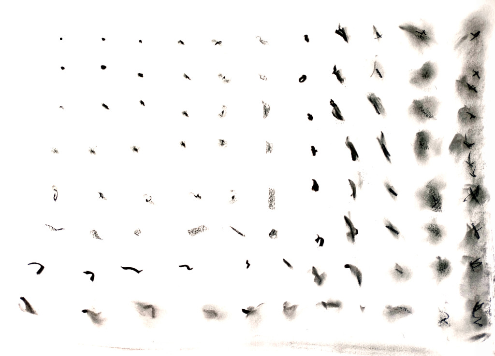

## Introduction

In Philosophy there has always been a tradition of people just trying to understand the things we see around us.
The study of the physical world, then called Natural Philosophy, was no exception.
But a few centuries ago Physics became the realm of specialists,
with increasingly complex Maths that needed to be understood in depth before reaching any conclusions.

I graduated in Physics many years ago,
and got a glimpse of the delights of modern sciences.
Now I think that understanding Nature
(the pleasure of finding things out, as Feynman used to say)
should not be exclusive to specialists:
even the lay(wo)man can think rigorously and without too much handwaving.

One very interesting aspect of quantum theory is how entropy arises.
It has been thoroughly studied, and is thought to be well understood.

## The Feared E-word

Let us start at the point which baffles many people:
what exactly is entropy, and how can it be defined?
Forget about thinking of entropy as "disorder";
entropy is easily defined as "information" in the Shannon sense.

As a system evolves we need more and more information to describe it.
If you look at the picture that introduces the article you can get a sense of it:
at the top left corner we have a dot which is very easy to describe,
just by its center and radius.
The increasingly fuzzy stains as we move bottom and right need more info:
first they have a defined irregular shape,
then several strokes, and finally a fudge of varying intensity.

This information is not something abstract;
it can be easily measured.

This sequence is an artist's representation and is just meant to illustrate how entropy works.
Still, physical systems often follow the same pattern:
a classical example of growing entropy is two different fluids of the same density mixing in a larger tank.

## Conclusions

The quantum world 

### Acknowledgements

Thanks to my team mates at these companies:
[mediasmart.io](https://mediasmart.io/),
[Devo](https://www.devo.com/),
[Influencity](https://influencity.com/)
and lately [LeanMind](https://leanmind.es/)
for helping me test different ways of deploying code.
Thanks to my students of the
[scalability course](/2020/curso-escalabilidad)
for helping me formalize the methodology.

