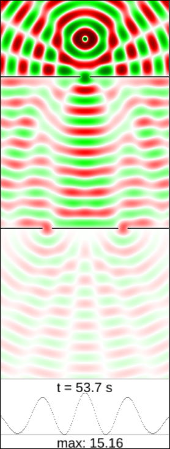

After visiting
[entropy](understanding-entropy)
and
[quantum mechanics](understanding-quantum-mechanics),
with a detour through
[simulated worlds](understanding-simulation),
we will now change gears with an article about how quantum mechanics came to be.

## History of Quantum Mechanics

Let us now explore some of the history of quantum mechanics,
which can be useful to understand it.
This article is going to be be quite different than the usual treatment,
so it may give you some food for thought even if you are familiar with it.

## Stuff Made of Stuff

Our starting point is going to be the same question that philosophers and wise people
have been asking since the beginning of time:
what are things made of?

This question may seem pointless now,
because everybody has known for centuries that things are made of atoms,
right?
Not so fast.
Hardly a hundred years ago scientists were still debating this issue for regular matter.

### The Debate that Matters

First, what is matter made of?
It is a simple enough question,
but quite hard to answer without modern instruments.
People have been worrying about it since antiquity:
in Ancient Greece
proponents of [atomism](https://en.wikipedia.org/wiki/Atomism)
like Democritus and Epicurus
thought that matter could not be infinitely divided into pieces,
so this process had to stop at some point.
Not everyone agreed,
most famously [Aristotle](https://en.wikipedia.org/wiki/Aristotle).

In modern times the debate was rekindled,
with people like Descartes or Galileo as new proponents of atomism.
This is not a stupid question:
in time it would lead to the foundation of chemistry
as the science that studied combination of atoms.

But few people remember that the debate was not really settled until the 20th century,
and in fact it would be Albert Einstein himself who settled the question:
in 1905, as part of his
[_annus mirabilis_ or wonder year](https://en.wikipedia.org/wiki/Annus_Mirabilis_papers),
he published a [paper on Brownian motion](https://en.wikipedia.org/wiki/%C3%9Cber_die_von_der_molekularkinetischen_Theorie_der_W%C3%A4rme_geforderte_Bewegung_von_in_ruhenden_Fl%C3%BCssigkeiten_suspendierten_Teilchen)
that explained why little particles of pollen
seemed to jiggle when viewed through the microscope,
using a random bombardment of water molecules.

### The Light Debate

Even more interesting is a similar but different debate that happened also since antiquity:
what is light made of?
Scientists have discussed for centuries whether light was made of particles
or it was some kind of wave or oscillation.
It can be instructive to look at it from our privileged perspective.

The field of optics has been studied since antiquity.
Epicurus already established that the speed of light ("images")
is the fastest possible in the universe in
[this wonderful paragraph](http://www.attalus.org/old/diogenes10b.html):

> It is useful, also, to retain this principle, and to know that the images have an incomparable thinness;
> which fact indeed is in no respect contradicted by sensible appearances.
> From which it follows that **their rapidity also is incomparable**;
> for they find everywhere an easy passage, and besides,
> their minuteness causes them to experience no shock,
> or at all events to experience but a very slight one,
> while a multitude of elements very soon encounter some resistance.

Around 1650 many giants were
[studying the field](https://en.wikipedia.org/wiki/Wave%E2%80%93particle_duality#Classical_particle_and_wave_theories_of_light)
with a more mathematically-oriented approach:
Huygens and Hooke formulated a wave theory,
while Newton argued for particles.
Given the tremendous weight of Newton in early Physics,
his opinion could counteract the multitude of phenomena well explained by waves.
One interesting effect in waves is
[diffraction](https://en.wikipedia.org/wiki/Diffraction):
as we saw in
[our little simulator](https://pinchito.es/physics-simulation/double-slit/wave),
waves can change direction when passing through a narrow opening.
So does light,
although its wavelength is so small that the effect is only appreciable at short distances.

The debate was not settled until 1801, when Young came up with a wonderful
[double-slit experiment](https://en.wikipedia.org/wiki/Young%27s_interference_experiment)
that clearly showed interference patterns,
convincing physicists that light was indeed a wave.
But this situation would not last for very long.

## Cracks in the Foundation

The magnificent building of Classical Physics
founded by Galileo Galilei, raised by Isaac Newton
and perfected by other giants in the following two centuries
started showing cracks in the very foundations at the end of the 19th century,
first with the
[Michelson–Morley experiment](https://en.wikipedia.org/wiki/Michelson%E2%80%93Morley_experiment)
and then by
[black body radiation](https://en.wikipedia.org/wiki/Black-body_radiation).
Both are very relevant to our debate.

### In Search of Ether

In 1887 Michelson and Morley were trying to find signs of the existence of
[ether](https://en.wikipedia.org/wiki/Luminiferous_aether),
which was supposed to be the intangible medium where waves of light propagated.
Their reasoning was that, since light was a wave,
something had to be oscillating;
this transparent substance had to permeate the whole of space so that light could propagate in the vacuum.
And since our Earth was moving through space around the sun,
they should be able to measure a different speed of light in different directions.
The experiment had to be repeated multiple times,
if by any chance our planet was moving exactly along the ether at the moment of the first measurement.

Of course their very precise measurements found none of that nonsense:
light seemed to travel at _exactly_ the same speed at all times and in all directions.
There was no ether to be found anywhere.

### Light as Particles

There was more:

In 1900 Max Planck proposed his
[quantisation of radiation](https://en.wikipedia.org/wiki/Max_Planck#Black-body_radiation)
to solve the enigma poised by radiation of hot chambers,
[ultraviolet catastrophe](https://en.wikipedia.org/wiki/Ultraviolet_catastrophe).
and in 1905 Albert Einstein used quantisation again to explain the
[photoelectric effect](https://en.wikipedia.org/wiki/Photoelectric_effect).
Apparently they were onto something.

## Conclusion

Quantum mechanics explains reality using particles that are described by a wave,
but which can still be found in just one place at a time.

We will soon continue our journey exploring quantum entropy.

### References

### Acknowledgements

Your name could be here!
Just send a comment or suggestion to the address below.

