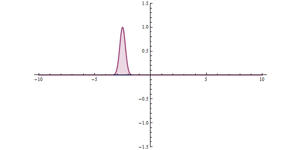

After visiting
[entropy](understanding-entropy)
and a detour through
[simulated worlds](understanding-simulation),
we continue our journey of understanding Physics with a puzzling theory:
**quantum mechanics**.
What is it, and why does it matter?

We will now see a gentle introduction without excessive maths,
and also without sacrificing rigorous thinking.
In the process we will explore some very fundamental questions in Physics
like "what is a particle?" or "can we predict how things behave?".

## ❓ The Basic Question

Since antiquity philosophers have been trying to answer the question poised by
[Democritos of Abdera](https://en.wikipedia.org/wiki/Democritus)
some 2400 years ago:
what are the smallest constituents of reality?
The goal posts have moved a lot since then.

Early attempts were just educated guesses and broad descriptions:
there simply was no way to gather observations that were accurate enough.
By the early 1900s scientists had very precise measurements of how particles behaved,
and it was really different than everything we knew until then.
In the coming years some brave pioneers would formalize what is now known as
quantum mechanics.

## 𝌂 The Double Slit Experient

We are not going to study the formalism of quantum mechanics,
but we will try to get an idea of what's so different about subatomic particles.
To that end we will explore the following situation
[proposed by Richard Feynman](https://www.youtube.com/watch?v=Ja0HSFj8Imc):
a stream of particles coming out of a hole in a somewhat random direction
propagate towards two slits in a wall.
After the two slits there is a solid wall with detectors,
so each particle will be detected once it reaches the wall at the end.

Then we make a graph of how many particles reach each detector.
What do you expect we should see?

### 🎱 Particles

First we will consider that we are dealing with particles as we usually imagine them:
little balls that bounce off walls.
Each particle can only go through one slit at a time,
and will be detected only once at the end.
Keep in mind that particles can also bounce off the separations,
which by the way are not perfectly smooth so the particles can take unexpected directions.
Below you can find a gross simulation of how the experiment might go.
The first slit at the top is just a way to focus the stream of the particles.

<canvas id="particle-canvas" width="200" height="532" style="border: solid black 1px; max-width: 100%; max-height: 100%;"></canvas>

<form>
<input id="particle-speed" style="display: none;" type="number" value="1">
<button id="particle-run" type="button">run</button>
<button id="particle-pause" type="button">pause</button>
<button id="particle-reset" type="button">reset</button>
</form>

If you click on "run" you will see that particles are detected along the whole wall,
due to random reflections.
They tend to follow a smooth pattern:
first you will see spikes where you would expect them for particles that go straight through both holes.
Then there are a smaller number of particles that have bounced off the slits
and go in different directions.
By the way, you can play with the simulation
[here](https://pinchito.es/physics-simulation/double-slit/particle).

### 🌊 Waves

Just for fun, what would happen if instead of particles we had waves?
Imagine we have a pool of water with a few partitions reproducing our experiemental setup,
and the source is now a perturbation in the water causing waves at the top of our diagram.
We will see the water oscillating with a different amplitude at each point.
Again, what would you expect to see?

We can use a simple model of wave propagation to simulate
the [wave equation](https://en.wikipedia.org/wiki/Wave_equation)
in two dimensions.
We cannot count particles at the bottom graph now,
but we can accumulate instead the square of the wave amplitude,
which by the way represents the energy of the oscillation at that point.
As before, the first slit at the top is just a way to focus the initial circular wave.

<canvas id="wave-canvas" width="200" height="532" style="border: solid black 1px; max-width: 100%; max-height: 100%;"></canvas>

<form>
<input id="wave-speed" style="display: none;" type="number" value="2">
<button id="wave-run" type="button">run</button>
<button id="wave-pause" type="button">pause</button>
<button id="wave-reset" type="button">reset</button>
</form>

Again clicking on "run" will show you how waves propagate,
first through the top slit and then through the two slits below.
This simulation is also available to play with
[here](https://pinchito.es/physics-simulation/double-slit/wave).

It is interesting to note that now there are some places in the wall
where we get no waves at all.
Correspondingly, the graph shows no energy accumulating there.
What is happening?

What we see here is
[interference](https://en.wikipedia.org/wiki/Wave_interference).
Each of the slits acts as a new source of waves,
so what reaches the bottom is the sum of both oscillations.
In some places the ridges of one wave matches exactly with the valleys of the other,
so the net effect is perfectly calm water.
At other places both waves are perfectly synchronized so the net effect is a bigger oscillation.

### 🕵️ Particles or Waves

Now we have seen both versions.
How would you expect a beam of electrons to behave,
like particles or like waves?

At this point you are probably thinking:

> But pinchito,
> what kind of nonsense is this?
> Electrons are particles,
> and they will behave like such!
> They can only pass through one hole,
> so there can be no interference between both slits at the bottom!

Well, you'd be surprised.

## 🔬 Double Slits in Practice

The best to settle the debate is probably to do the experiment.
So, what if I tell you that electrons show interference?

 to the sides (dimmer). Source:  Claus Jönsson, "Electron Diffraction at Multiple Slits", American Journal of Physics 42, 4-11 (1974) https://doi.org/10.1119/1.1987592.")

[Claus Jönsson at Universität Tübingen](http://materias.df.uba.ar/f4Aa2012c2/files/2012/08/multiple_slit.pdf)
actually did the experiment with electrons in 1973.
Guess what: he got peaks and valleys,
the true sign of interference.

Some scientists were not yet happy:
in an electron beam there can be multiple electrons going through each slit at the same time,
so they suggested that electrons going through different slits could interfere with each other.
The only way to check if there is **interference for a single electron** is to send them one at a time.
And that is exactly what an Italian team did in 1974:
[P G Merli, G F Missiroli and G Pozzi 1976 Am. J. Phys. **44** 306–7](https://www.fisica.unam.mx/personales/romero/IFC2015/Merli-Mizziroli-Pozzi-AJP-1976.pdf).
Again, lots of interference!
[This delicious film](https://www.youtube.com/watch?v=zc-iyjpzzGQ)
shows the results.

There is a very nice summary of the history of the experiment in
[John Steeds et al 2003 Phys. World **16** (5) 20](https://iopscience.iop.org/article/10.1088/2058-7058/16/5/24/pdf).
Interference for a single electron going through a double slit is well tested experimentally.

### 🔎 Which Slit?

We can make a perfectly reasonable question:
which slit does each electron go through?
Since the electron is detected only once at the bottom,
we can deduce that it must have gone through only one slit.
To settle the debate we can install detectors at each slit,
that will tell us which path each electron takes.

So we do this in our mental experiment,
and find out that we can reliably detect electrons passing through the slits.
Now that we know which slit each electron went through,
we will settle the debate!

Next we check the pattern at the bottom:
we find **no interference**.
The resulting graph will be more similar to the curve we generated above for particles,
smooth and without the typical bands generated by interference.
How can this be?

Since we are sending the electrons one at a time,
we can even correlate the slits with the clicks detected at the bottom of our graph.
Particles that went through the left slit will generate a pattern
exactly as if the right slit was closed,
and viceversa.
We can try to detect particles only in one slit.
The result will be, again:
**no interference**.
Apparently interference is so shy that just trying to pinpoint it makes it disappear.

We can also try to use a more subtle detector that will not disturb our electrons so much.
After all, the simplest detector is just a constant beam of photons that will flicker whenever an electron passes through.
So we can try to use a beam with less intensity (and thus shining less photons per second).
The result will be curious: 
some electrons will go undetected,
generating interference,
while those that are detected generate a smooth curve.

Why not try a detector that uses red light,
which is just a source of photons with less energy per particle?
Again we may be surprised by the results:
when electrons are unambiguously detected the resulting curve will show interference,
but when electrons go undisturbed by the red light there will be no bands.

So, the situation seems to be:

* No detectors → interference.
* Detectors → no interference.
* One detector → no interference.
* Weak detectors → little interference.

This is, simply put, how Nature behaves.
Now we have all the information we need to delve into quantum mechanics.

## ⚛️ The Quantum Way

When physicists were confronted with this state of affairs they had to make a difficult choice:
do we want to keep speaking about particles,
or do we describe everything as waves?

### 〰️ Quantum Wave Function

Moved by their familiarity with magnitudes such as magnetic fields,
which have a different value for each point in space,
some scientists like Schrödinger (yes, the guy that gave name to the famous cat)
had no reservations in defining a new type of field to explain this wave-like behaviour:
a _wave function_.
This is how the guy that gave name to the famous cat experiment came up with the famous
[Schrödinger equation](https://en.wikipedia.org/wiki/Schr%C3%B6dinger_equation).
The [Wikipedia article](https://en.wikipedia.org/wiki/Schr%C3%B6dinger_equation#History)
helpfully clarifies that it was Max Born who first interpreted the quantum wave function
as a _probability amplitude_, which when squared would give the _probability density_:
the probability of finding the particle at each point in space.

It is this wave function that is passing through both slits at the same time,
and which causes bands to appear in the detectors.
This is the famous _wave-particle duality_ which causes quantum objects to behave
"sometimes like particles, sometimes like waves":
**a particle is described by a wave function that determines its possible positions**.
Propagate like a wave, be detected as a single particle.

### 🧑‍🔬 Precise Simulation

The wave simulation that we saw at the beginning is not exact for quantum wave functions.
As you can see below, a more realistic simulation based on Schrödinger's equation still shows interference
after passing a double slit.

The particle has a certain probability to be reflected by the double slit,
and another probability to pass through,
with a very noticeable interference pattern shown as a number of bands.
As a footnote, I spent many days trying to make a precise quantum simulation but with little success;
luckily some can be found lying around,
such as
[this Python script from Arturo Mena](https://github.com/artmenlope/double-slit-2d-schrodinger).

### 🗣️ Explanations

Now we are ready to explain the effects that we are seeing in the double-slit experiment.
In the original experiment we have a particle moving through a first slit with a random direction,
and then through two slits which causes interference.
Our explanation is that the wave function is crossing through the slits,
and then when reaching the end wall the particle is detected at some point
that depends on how the waves have propagated through space.
That is why our measurements show interference:
the wave propagated through one slit interferes with the wave propagated through the other.

Things complicate a little bit when we add the detectors at the slits.
Why do we suddenly lose all interference?
There are three complementary explanations which can be enlightening.
First, there's the famous "the act of measurement affects the result":
when we add detectors in the slits,
the emitted photons are disturbing our electrons and causing changes in the results.

The second viewpoint adds a bit more detail.
When a particle is detected at one of the slits,
the old wave function disappears and is replaced by a new wave function,
in this case propagating from a single slit.
This is usually called the _collapse of the wave function_:
the wave function is reset as a result of a measurement.

The third viewpoint is more technical:
adding a detector causes an effect called _decoherence_.
This phenomenon is quite deep and will be studied in a separate article.

### 🎲 Playing Dice

With the quantum description we have suddenly introduced a subtle but important effect:
suddenly we are not calculating the position of a particle,
but computing a _probability_ of where the particle will be.
Same is true about the particle speed:
we get a range of probabilities that the particle will have a certain speed when measured.

Does this mean that we cannot know with precision the position or speed of a particle?
In short, yes.
The wave function fills all space:
some positions will be more likely than others,
but in principle the particle can be detected _anywhere_.
In practice the wave function only has significant values in a limited range.

This ambiguity leads to all kinds of funny phenomena,
like the
[tunneling effect](https://en.wikipedia.org/wiki/Quantum_tunnelling):
a quantum particle can be found even in places where it would be impossible according to classical mechanics.
Say that a particle is approaching an obstacle which is impenetrable:
it simply doesn't have enough energy to cross it.
In quantum mechanics there is a small but finite probability that the particle will pass the obstacle.

This tunneling effect is not just a theoretical curiosity;
it has multiple applications in today's technology such as transistors,
nuclear fission or the
[scanning tunneling microscope](https://en.wikipedia.org/wiki/Scanning_tunnelling_microscope).

In any concrete situation, will the particle be reflected or will it continue its way?
There is no way to predict what will happen exactly;
we can only compute the probabilities of each event,
which will be approximately reached if we repeat the same experiment many times.
On large scales probabilities will tend to average so we can have a pretty good idea of how things will behave;
that is why in our common world we don't need to worry too much about probability densities.
But once things start getting sufficiently small,
wave functions are the only description that makes sense.

Having probability as the basis of quantum mechanics is what led Einstein to reject it,
famously saying that
[God does not play dice with the universe](https://en.wikipedia.org/wiki/Religious_and_philosophical_views_of_Albert_Einstein#Free_will).
Nowadays most physicists have accepted it without questioning,
since experiments have failed to find any hidden theories that may give us a more deterministic picture.

## ⌛ Conclusion

The theory of quantum mechanics explains reality with particles that are described by a wave,
but which can still be found in just one place at a time.
The double-slit experiment is a particularly good interesting illustration of this pesky behaviour.

We will soon continue our journey exploring quantum entropy.
One question that we may make ourselves is:
but aren't photons also particles?
How come they are described as electromagnetic waves?
And the answer will require a deep dive in the history of quantum mechanics.

Meanwhile don't miss [Feynman's Lectures on Physics: Quantum Behavior](https://www.feynmanlectures.caltech.edu/III_01.html),
and the
[extraordinary video of the lecture](https://www.youtube.com/watch?v=Ja0HSFj8Imc).

### 🙏 Acknowledgements

I have gone through a lot of literature to make sense of the double-slit experiment.
I want to thank
[all the Wikipedia editors](https://en.wikipedia.org/w/index.php?title=Double-slit_experiment&action=history)
in that and other articles that have helped me understand the subject and track deeper references.

