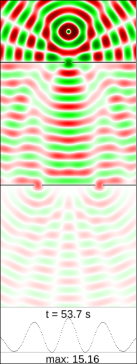

After visiting
[entropy](understanding-entropy)
and a detour through
[simulated worlds](understanding-simulation),
we continue our journey of understanding Physics with a puzzling theory:
**quantum mechanics**.
What is it, and why does it matter?

We will now see a gentle introduction without excessive maths,
and also without sacrificing rigorous thinking.
In the process we will explore some very fundamental questions in Physics
like "what is light?" or "can we predict how things behave?".

## The Basic Question

Since antiquity philosophers have been trying to answer the question that had been poised by
[Democritos of Abdera](https://en.wikipedia.org/wiki/Democritus)
some 2400 years ago:
what are the smallest constituents of reality?
The goal posts have moved a lot since then:
early attempts were just educated guesses and broad descriptions.

By the early 1900s scientists had very precise measurements of how particles behaved,
and it was really different than everything we knew until then.
In the coming years some brave pioneers would formalize what is now known as
quantum mechanics.

## The Double Slit Experient

We don't want to study the formalism,
but to get an idea of what's so different about subatomic particles.
We will explore the following situation
[proposed by Richard Feynman](https://www.youtube.com/watch?v=Ja0HSFj8Imc):
a stream of particles coming out of a hole in a somewhat random direction
propagate towards two slits in a wall.
After the two slits there is a solid wall with detectors,
so each particle will be detected once it reaches the wall at the end.

Then we make a graph of how many particles reach each detector.
What do you expect we should see?

### Particles

First we will consider that we are dealing with particles as we usually imagine them:
little balls that bounce off walls.
Each particle can only go through one slit at a time,
and will be detected only once at the end.
Keep in mind that particles can also bounce off the separations,
which by the way are not perfectly smooth so the particles can take unexpected directions.
Below you can find a gross simulation of how the experiment might go.

<canvas id="particle-canvas" width="200" height="532" style="border: solid black 1px; max-width: 100%; max-height: 100%;"></canvas>

<form>
<input id="particle-speed" style="display: none;" type="number" value="1">
<button id="particle-run" type="button">run</button>
<button id="particle-pause" type="button">pause</button>
<button id="particle-reset" type="button">reset</button>
</form>

If you click on "run" you will see that particles are detected along the whole wall.
They tend to follow a smooth pattern:
first you will see spikes where you would expect them for particles that go straight through both holes.
Then there are a smaller number of particles that have bounced off the slits
and go in different directions.
By the way, you can play with the simulation
[here](https://pinchito.es/physics-simulation/double-slit/particle).

### Waves

Just for fun, what would happen if instead of particles we had waves?
Imagine we have a pool of water with a few partitions reproducing our experiemental setup,
and the source is now a perturbation in the water causing waves at the top of our diagram.
We will see the water oscillating with a different amplitude at each point.
Again, what would you expect to see?

We can use a simple model of wave propagation to simulate
the [wave equation](https://en.wikipedia.org/wiki/Wave_equation)
in two dimensions.
We cannot count particles at the bottom graph now,
but we can accumulate instead the square of the wave amplitude,
which by the way represents the energy of the oscillation at that point.

<canvas id="wave-canvas" width="200" height="532" style="border: solid black 1px; max-width: 100%; max-height: 100%;"></canvas>

<form>
<input id="wave-speed" style="display: none;" type="number" value="2">
<button id="wave-run" type="button">run</button>
<button id="wave-pause" type="button">pause</button>
<button id="wave-reset" type="button">reset</button>
</form>

This simulation is also available to play with
[here](https://pinchito.es/physics-simulation/double-slit/wave).
It is interesting to note that now there are some places in the wall
where we get no waves at all.
Correspondingly, the graph shows no energy accumulating there.
What is happening?

What we see here is
[interference](https://en.wikipedia.org/wiki/Wave_interference).
Each of the slits acts as a new source of waves,
so what reaches the bottom is the sum of both oscillations.
In some places the ridges of one wave matches exactly with the valleys of the other,
so the net effect is perfectly calm water.
At other places both waves are perfectly synchronized so the net effect is a bigger oscillation.

### Particles or Waves

Now we have seen both versions.
How would you expect a beam of electrons to behave,
like particles or like waves?

At this point you are probably thinking:

> But pinchito,
> what kind of nonsense is this?
> Electrons are particles,
> and they will behave like such!
> They can only pass through one hole,
> so there can be no interference between both slits at the bottom!

Well, you'd be surprised.

## The Double Slit in Practice

The best to settle the debate is probably to do the experiment.
So, what if I tell you that electrons show interference?

 to the sides (dimmer). Source:  Claus Jönsson, "Electron Diffraction at Multiple Slits", American Journal of Physics 42, 4-11 (1974) https://doi.org/10.1119/1.1987592.")

[Claus Jönsson at Universität Tübingen](http://materias.df.uba.ar/f4Aa2012c2/files/2012/08/multiple_slit.pdf)
actually did the experiment with electrons in 1973.
Guess what: he got peaks and valleys,
the true sign of interference.
Some scientists were not happy:
in an electron beam there can be multiple electrons going through each slit at the same time.

The only way to check if there is interference for a single electron is to send them one at a time.
And that is exactly what an Italian team did in 1974:
[P G Merli, G F Missiroli and G Pozzi 1976 Am. J. Phys. **44** 306–7](https://www.fisica.unam.mx/personales/romero/IFC2015/Merli-Mizziroli-Pozzi-AJP-1976.pdf).
Again, lots of interference!
[This delicious film](https://www.youtube.com/watch?v=zc-iyjpzzGQ)
shows the results.

There is a very nice summary of the history of the experiment in
[John Steeds et al 2003 Phys. World **16** (5) 20](https://iopscience.iop.org/article/10.1088/2058-7058/16/5/24/pdf).

### Which Slit?

We can make a perfectly reasonable question:
which slit does each electron go through?
Since the electron is detected only once at the bottom,
we can deduce that it must have gone through only one slit.
To settle the debate we can install detectors at each slit:
just a constant beam of photons that will flicker whenever an electron passes through.

So we do this in our mental experiment,
and find out that we can reliably detect electrons passing through the slits.
Now that we know which slit each electron went through,
we will settle the debate!

Next we check the pattern at the bottom:
we find **no interference**.
The resulting graph will be more similar to the curve we generated above for particles,
smooth and without the typical bands generated by interference.
How can this be?

Since we are sending the electrons one at a time,
we can even correlate the slits with the clicks detected at the bottom of our graph.
Particles that went through the left slit will generate a pattern
exactly as if the right slit was closed,
and viceversa.
We can try to detect particles only in one slit.
The result will be, again:
**no interference**.
Apparently interference is so shy that just trying to pinpoint it makes it disappear.

We can also try to use a dimmer detector:
a beam with less photons.
The result will be curious: 
some electrons will go undetected,
generating interference,
while those that are detected generate a smooth curve.
We can also try to use a detector with red light,
which is just a source of photons with less energy per particle.
The result will probably be even more curious:
when electrons are unambiguously detected the resulting curve will show interference,
but when electrons go unnoticed by the red light there will be no bands.

So, the situation seems to be:
* No detectors → interference.
* Detectors → no interference.
* One detector → no interference.
* Weak detectors → little interference.

This is, simply put, how Nature behaves.
Now we have all the information we need to delve into quantum mechanics.

### Quantum Wave Function

When physicists were confronted with this state of affairs they had to make a difficult choice:
do we want to keep speaking about particles,
or do we describe everything as waves?
Moved by their experience with values defined in space like magnetic fields,
some like Schrödinger (yes, the guy that gave name to the famous cat)
had no reservations in defining a new quantity
(a _wave function_) that had a value in each point of space.
This is the famous
[Schrödinger equation](https://en.wikipedia.org/wiki/Schr%C3%B6dinger_equation).
The [Wikipedia article](https://en.wikipedia.org/wiki/Schr%C3%B6dinger_equation#History)
helpfully clarifies that it was Max Born who first interpreted the quantum wave function
as a _probability amplitude_, which squared would give the _probability density_:
the probability of finding the particle at each point in space.

It is this wave function that is passing through both slits at the same time,
and which causes bands to appear in the detectors.
Note: the wave simulation that we saw at the beginning is not exact for quantum wave functions.
As you can see below, a more realistic simulation based on Schrödinger's equation still shows interference
after passing a double slit.

As a footnote, I spent many days trying to make a precise quantum simulation but with no success;
luckily some can be found lying around,
such as

### Measurements

Now we need to explain the effects that we are seeing in the double-slit experiment.
There are three complementary viewpoints which can be useful.
First, there's the famous "the act of measurement affects the result":
when there are no detectors in the slits the wave function is crossing through the 
when we add detectors in the slits,
the emitted photons are disturbing our electrons and causing changes in the experiment.

The second viewpoint is that
This is usually called
"the collapse of the wave function":
the wave function is disturbed and the result is a measurement.

adding a detector causes an effect called _decoherence_:
This explanation is quite deep,
and will be studied in a separate article.

## History of Quantum Mechanics

Let us now explore some of the history of quantum mechanics,
which can be useful to understand how it came to be.
This section is going to be be quite different than the usual treatment,
so it may give you some food for thought even if you are familiar with it.

## The Light Debate

A debate between waves and particles has already happened before with light,
where scientists have discussed for centuries whether it was made of particles
or it was some kind of wave or oscillation.
It can be instructive to look at it from our privileged perspective.

The field of optics has been studied since antiquity.
Epicurus already established that the speed of light ("images")
is the fastest possible in the universe in
[this wonderful paragraph](http://www.attalus.org/old/diogenes10b.html):

> It is useful, also, to retain this principle, and to know that the images have an incomparable thinness;
> which fact indeed is in no respect contradicted by sensible appearances.
> From which it follows that **their rapidity also is incomparable**;
> for they find everywhere an easy passage, and besides,
> their minuteness causes them to experience no shock,
> or at all events to experience but a very slight one,
> while a multitude of elements very soon encounter some resistance.

Around 1650 many giants were
[studying the field](https://en.wikipedia.org/wiki/Wave%E2%80%93particle_duality#Classical_particle_and_wave_theories_of_light)
with a more mathematically-oriented approach:
Huygens and Hooke formulated a wave theory,
while Newton argued for particles.
Given the tremendous weight of Newton in early Physics,
his opinion could counteract the multitude of phenomena well explained by waves.
One interesting effect in waves is
[diffraction](https://en.wikipedia.org/wiki/Diffraction):
as we saw in our little simulator, waves can change direction when passing through a narrow opening,
and so does light, although its wavelength is so small that the effect is only appreciable at short distances.

The debate was not settled until 1801, when Young came up with a similar
[double-slit experiment](https://en.wikipedia.org/wiki/Young%27s_interference_experiment)
that clearly showed interference,
convincing physicists that light was indeed a wave.
But this situation would not last much.

## Cracks in the Foundation

The magnificent building of Classical Physics
founded by Galileo Galilei, raised by Isaac Newton
and perfected by other giants in the following two centuries
started showing cracks in the very foundations at the end of the 19th century,
first with the
[Michelson–Morley experiment](https://en.wikipedia.org/wiki/Michelson%E2%80%93Morley_experiment)
and then by
[black body radiation](https://en.wikipedia.org/wiki/Black-body_radiation).
Both are very relevant to our debate.

### In Search of Ether

In 1887 Michelson and Morley were trying to find signs of the existence of
[ether](https://en.wikipedia.org/wiki/Luminiferous_aether),
which was supposed to be the intangible medium where waves of light propagated.
Their reasoning was that, since light was a wave,
something had to be oscillating;
this transparent substance had to permeate the whole of space so that light could propagate in the vacuum.
And since our Earth was moving through space around the sun,
they should be able to measure a different speed of light in different directions.
The experiment had to be repeated multiple times,
if by any chance our planet was moving exactly along the ether at the moment of the first measurement.

Of course their very precise measurements found none of that nonsense:
light seemed to travel at _exactly_ the same speed at all times and in all directions.
There was no ether to be found anywhere.

### Light as Particles

There was more:

In 1900 Max Planck proposed his
[quantisation of radiation](https://en.wikipedia.org/wiki/Max_Planck#Black-body_radiation)
to solve the enigma poised by radiation of hot chambers,
and in 1905 Albert Einstein used quantisation again to explain the
[photoelectric effect](https://en.wikipedia.org/wiki/Photoelectric_effect).
Apparently they were onto something.

## Conclusion

Quantum mechanics explains reality using particles that are described by a wave,
but which can still be found in just one place at a time.

We will soon continue our journey exploring quantum entropy.

### References

### Acknowledgements

Your name could be here!
Just send a comment or suggestion to the address below.

