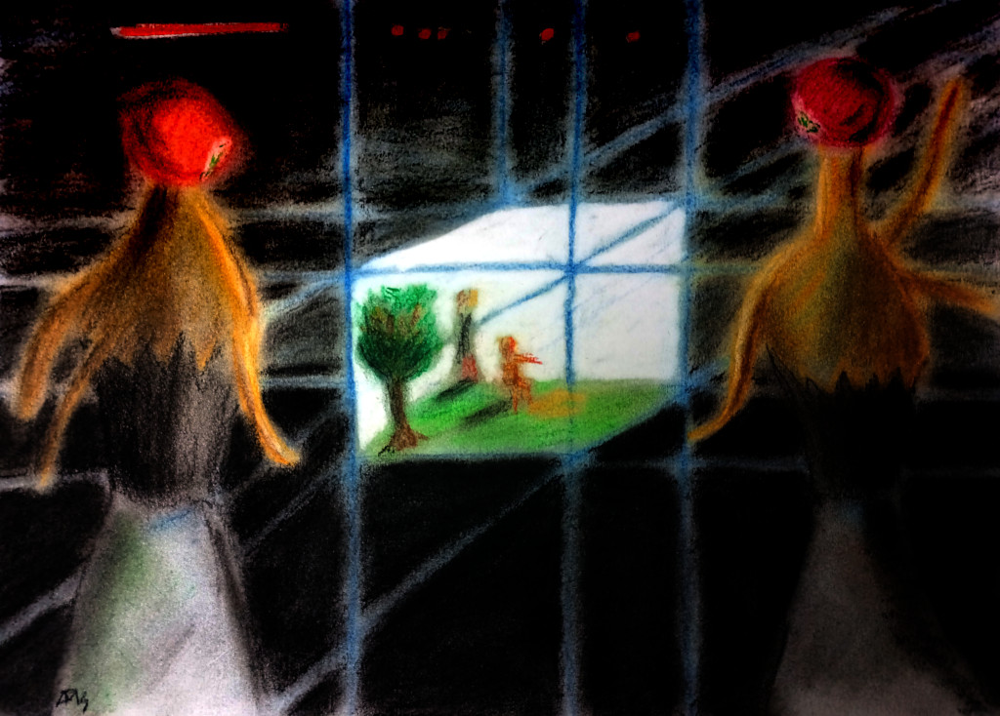

This is the second part of our journey to understand quantum entropy.
In the [first part](/2021/understanding-entropy)
we saw that the physical concept of entropy is basically another name for
"information required to describe a system".
This basic result will be useful in what follows.

## Living Inside a Computer

A few years ago certain celebrities started divulging the idea
(not at all new)
that we are living inside a simulation.
Among them:
Elon Musk,
Neil Degrasse Tyson.

At some points some scientists advanced this wonderful argument:
there can only be one real universe,
but inside it there can be any number of life-like simulations.
Therefore it is much more likely that we are in one of those simulations
than inside the real universe,
just because of probabilities.
After all,
if there are many tickets but only one gets the price,
all things being equal it is much more likely that we don't win the price.
Isn't it just common sense?
As we will see,
all things are not equal.

For the purpose of this article,
the Simulation Hypothesis is the idea that we are living inside a computer simulation,
and the Simulators are hypothetical creatures that are running the simulation where we supposedly reside.

## A Thermodynamical Argument

The Second Law of Thermodynamics states that:

> The entropy of an isolated system cannot decrease;
> it will either stay constant or increase.

As we saw in the 
[first part](/2021/understanding-entropy),
entropy is just another name for information to describe a system.

> If information is always increasing,
> there is no way that a computer can simulate the whole universe.
> No matter how big it is made,
> **at some point any computer will run out of information storage**.

This is the basic idea that proves we are not living in a computer simulation.

### Thermo Tricks

There are many tricks in the simple formulation above of the Second Law.
First, it may apply to an isolated system,
but what happens to an open system?
Its entropy can decrease as long as it is transferred to another open system.
All in all, entropy for the combination of both systems cannot decrease.
The same idea applies recursively to any combination of systems
until we reach the whole universe.

Next, we may ask ourselves:
what if the entropy of the closed system stays constant,
neither decreasing nor increasing?
This doesn't help either:
the entropy of a closed system will only remain constant for a reversible process.
Any transfer of energy done in finite time is irreversible;
only theoretical, infinitely slow processes can be reversible.

### Robustness

Sir Arthur Eddington [stated](https://en.wikipedia.org/wiki/Second_law_of_thermodynamics#Quotations):

> The law that entropy always increases holds,
> I think, the supreme position among the laws of Nature.
> If someone points out to you that your pet theory of the universe is in disagreement with Maxwell's equations
> – then so much the worse for Maxwell's equations.
> If it is found to be contradicted by observation
> – well, these experimentalists do bungle things sometimes.
> But if your theory is found to be against the second law of thermodynamics I can give you no hope;
> there is nothing for it but to collapse in deepest humiliation.

The second law has also been shown to
[hold at cosmic scales](https://www.uab.cat/web/news-detail/does-the-second-law-hold-at-cosmic-scales-1345680342044.html?noticiaid=1345794120443),
that is, to the whole universe.

## What Is a Computer?

So our next line of attack will probably be to redefine what a "computer" is,
so that it can accommodate an always-increasing simulation.

### Turing Machines

When Alan Turing started studying how computers worked in practice,
he came up with an idealized version:
a reading / writing head that could move in either direction
over an infinite roll of tape with 0s and 1s.
Such a machine could store infinite information
so our little Second Law limitation would not be an issue.

The Turing Machine is a brilliant construct for exploring the theoretical limitations of computers:
anything that it cannot do will never be possible on a real computer,
no matter how many exabytes of memory we attach to it.
But the opposite is not true:
Turing Machines can perform infinite computations
and run for as long as we desire,
something that real computers cannot do.

A real computer is by necessity a machine with fixed bounds.
Even if we go to the mythical cloud for our computing needs,
it is still not infinite:
even if we use the total computing power of the world
at [around 4E+15 MIPS](https://incoherency.co.uk/blog/stories/world-computing-power.html),
all the datacenters in the world will be exhausted at some point.
Even a fictional
[Matrioshka brain](https://en.wikipedia.org/wiki/Matrioshka_brain),
powered by the entire energy output of our Sun,
will be exhausted at some point.

We can imagine that the Simulators attach new memory banks to their simulating contraption as needed,
perhaps even as their sole dedication.
Doesn't matter:
at some point they will run out of memory.

### More Powerful Universes

One popular trick is to postulate that the Simulators live in a higher dimensional space than us,
the Simulated.
Our whole universe would just be a lower dimensional slice of their (much cooler) universe,
as an infinite plane would be to us.
It's popular maybe because it sounds cool and it is just hard to disprove.
On the other hand, information will run out in any higher dimension anyway.

As the next step,
we may postulate that the universe of the Simulators
is much more powerful than our own.
As a starter, maybe it has a higher speed of light,
or smaller Planck constant.
Perhaps the fine structure constant there is not 1/137,
but more like 1/1370, or 1/13.
It remains to be seen if such a universe is even possible,
as the constants of our own universe seem perfectly adjusted to make our existence possible.

And maybe the Second Law does not apply there?
In this case information does not accumulate by necessity either,
which means that we can lose information spontaneously,
so it would not help as much as we may think in the beginning.

### Universe Simulates Universe

So what if the whole universe of the Simulators is dedicated to simulating our own?
We are getting way more exotic than in the begging.
Notice that we are moving further and further from the naïve argument
of probability of living in a simulation,
which is that there are more simulated universes than real.
Exotic universes are perhaps possible,
who knows?
Now we have to imagine universes dedicated to simulating other universes.

At this point we may as well wield any of a number of philosophical instruments.
We can start with
[Hitchens's razor](https://en.wikipedia.org/wiki/Hitchens%27s_razor):

> What can be asserted without evidence can also be dismissed without evidence.

Alder's razor,
also known as [Newton's Flaming Laser Sword](https://en.wikipedia.org/wiki/Mike_Alder#Newton's_Flaming_Laser_Sword):

> We should not dispute propositions unless they can be shown by precise logic and/or mathematics to have observable consequences.

The [Sagan standard](https://en.wikipedia.org/wiki/Sagan_standard):

> Extraordinary claims require extraordinary evidence.

[Popper's falsifiability principle](https://en.wikipedia.org/wiki/Falsifiability):

> For a theory to be considered scientific, it must be falsifiable.

[Russell's teapot](https://en.wikipedia.org/wiki/Russell%27s_teapot):

> Nobody can prove that there is not between the Earth and Mars a china teapot revolving in an elliptical orbit,
but nobody thinks this sufficiently likely to be taken into account in practice.

And of course their most venerable ancestor of them all, Occam's razor:

> Entities should not be multiplied beyond necessity.

To be honest we might have started with any of these razors and be done with,
but at this point they apply beautifully:
we have shown that simulating a complete universe requires at least infinite computers,
and then probably exotic universes.
We may as well postulate that our universe is the
[dream of a butterfly](https://en.wikipedia.org/wiki/Zhuangzi_(book)#.22The_Butterfly_Dream.22),
and we will have exactly the same proof (or indeed logic behind it).

## What Is in a Simulation?

Our celebrity interlocutor who is a fan of the Simulation Hypothesis,
being clever and charismatic,
will now turn their celebrated eyes to the other side of the equation:
to bend the concept of simulation so that it fits what an imaginary computer can do.

### Limited Simulation

The first obvious tweaking of the Simulation Hypothesis is that the Simulators may not want to simulate our universe
till we reach the heat death reach their computing limitations at some point:
they just want to get to the interesting parts,
which for us humans is exactly our own period.

This leaves us in an uncomfortable position:
maybe the Simulators think that the really good part was
[the emergence of large structure](https://en.wikipedia.org/wiki/Chronology_of_the_universe#The_Dark_Ages_and_large-scale_structure_emergence)
and they are about to switch our universe off at any moment.
It could well be that they are running a few extra eons just to prove some fine point in their cosmological simulations,
like (let's use our imagination here):

> If we change the fine structure constant from the _real_ 1/138 to 1/137,
> do stellar clusters arise?

They may not even be that interested in intelligent life forms such as our own,
because they have probably seen it all by now.
Almost by definition their intelligence is much higher than our own,
so we will look like funny toys or artifacts to their eyes.

But wait! Perhaps the simulators are watching closely how civilizations evolve around the universe,
to settle some refined bet in a gentleman's club not unlike that one where Phileas Fogg sat with his pals,
only with mixed-gender attendance and much more advanced in all other respects.
They rented some hyper-computing instances on a galactic cloud
and are waiting to see advanced civilizations.
Problem is,
the universe is almost 14 billion years old at this point,
and we are still at the beginning!

Who can tell what wonders may arise in some particularly stable white dwarf
with a planet right in the habitable zone,
which will be there for more than a trillion years?
What if their computing power runs off at this most exciting point?
Will our intrepid betters see all of their efforts blow up in a puff of air
as their galactic credits run out to run the simulation any further?

It is a sad fact of Nature that the Simulators cannot just continue simulating those parts they find interesting,
while lowering the resolution (or even neglecting) other less interesting parts.
Our universe is interconnected:
we can gaze into the skies to see galaxy clusters millions of light-years from our own,
we are pierced every second by neutrinos that come from the wildest corners of the sky,
and instruments like LIGO can detect neutron star mergers where we barely see anything at all.

Again, since we are just entertaining wild speculations,
we can imagine the situation we prefer.
But simulations are not cheap:
in the current state of our technology we can hardly simulate even
[one molecule of protein](https://en.wikipedia.org/wiki/Protein_folding#Computational_studies_of_protein_folding)
with sufficient precision as to know its final shape.
Venturing that some advanced civilization can simulate a complete universe
from start to any random point in the future more advanced than our own age
is again going too far with zero evidence.

### Quantum Computing

By now at least half of my remaining readership is probably screaming at the top of their lungs:

> But it's a **quantum computer**!

When there is a far-fetched hypothesis,
mixing it with a far-fetched technology usually solves the ticket trivially.
After all, qubits (short for quantum bits) are supposed to store much more information than regular bits, right?

We are getting a bit ahead of ourselves in this series,
since I would like to do an entry about quantum computing.
But besides the difficulties with having many qubits running at the same time,
the biggest issue is that the universe is also quantum.
We get no huge boost from using qubits to solve classical problems.
The number of qubits required to simulate our universe would be the number of qubits in it,
and this number is still growing all the time (remember our Second Law).

There is an intriguing (and very remote) possibility:
that decoherence forces our universe to be mostly classical,
and that quantum computing can be applied to accelerate computations of these classical interactions.
The harsh reality is probably that the same conditions that force decoherence in the real world
will force decoherence of our qubits,
so it's a zero sum game.

We are back to making far-fetched suppositions:
that a new computing paradigm will store many qubits in one qubit,
or that the simulators can compress qubits by a factor of a googolplex.
It is still nonsense and should be discarded by our
[philosophical swiss knife](https://en.wikipedia.org/wiki/Philosophical_razor).

### Enter The Matrix

If it's impossible to simulate a complete working universe,
is it possible that we live in a Matrix-like simulation?
In the 1999 film
[The Matrix](https://en.wikipedia.org/wiki/The_Matrix)
there is a simulation created just for us,
limited human creatures,
to live our little lives in a certain portion of time.

A certain version of the computer simulation _could_ be possible:
if it is restarted whenever the person in it dies.
There is nothing unlimited in the life of a person,
so in theory it _could_ be successfully simulated in a limited computer.
But note that this is a much more solipsistic version of the idea.
It is not a simulation of our whole universe;
just of the life of a person.
In fact every person would have to live in separate universes.

The thing starts to complicate if everyone in the Matrix shares the same simulation,
as depicted in the movie.
In this case information starts to accumulate again:
even if one person dies and their information is removed,
some of that information needs to be kept around because other people will remember it.
We will have artifacts from long dead people,
word of mouth or even recordings, that need to be kept around.
Again, information grows uncontrollably,
and after a few generations the system will be expected to collapse.
We can postulate "glitches in the Matrix"
that happen whenever the system needs to erase information to make room for new experiences,
but they would be noticeable to the inhabitants.

Even if we limit ourselves to one generation,
keeping information about the external world coherent would require us to simulate the whole universe.
After all, anyone in the Matrix can take a picture of the galaxies in a certain portion of the sky,
store it somewhere,
then take another a few years later with another telescope and check if they are the same.
It would take a very clever computer to maintain all the relevant information of the universe
so that both pictures are coherent with all physical laws:
they should be mostly the same,
except for the moving of the stars inside and the occasional supernovae.

Then there's the whole plot gap that it is impossible to use humans as batteries:
we will always consume more energy than we generate,
also a consequence of the Second Law by the way.
But let's keep to the simulation aspects of the movie.

Another argument against such a simulation is that it is impossible to do a perfectly coherent simulation:
any simulated laws of Physics are always short of the real deal.
One example is anisotropy:
if we measure the laws of movement in all directions we should be able to tell how the building blocks are aligned,
that is, where the axes of coordinates are.
Some researchers have indeed looked for clues of such a simulation,
finding none.

But the Matrix argument falls short of the Simulation Hypothesis:
we are not simulating a complete universe with people in it,
but instead we need a bunch of living human bodies to plug them in the Matrix.

## Why a Simulation?

If it's so clear that we cannot live in a computer simulation
that any Internet rando with a blog and an elementary grasp of Physics can disprove it,
So why do so many clever people insist that we **must surely live in a simulation**?

I think it is psychologically comforting for people to downplay their existence:
inside a computer simulation it is not so important that our world is cruel,
or unfair,
or just plain weird.
Those are just settings that the Simulators are playing with.

It is not so different from the mechanism that makes some religions comforting:
this world is but a test of our spirits,
the real life will come later in Heaven.

Well, I think it is important to confront the universe
with all its marvel and misery.

### A Mythological Explanation

According to the developer
[Marius Gundersen](https://twitter.com/GundersenMarius/status/1250186936779706375),
referring to Wolfram Physics:

> It follows the millennium old pattern of us explaining our existence using our most advanced technology.
> Ancient people (many places) believed we were created from clay, their most advanced technology
> and we believe we live in a computer simulation, our most advanced technology.
> Everytime between people have attempted to explain the world using their most advanced models or metaphors.
> And so will we in the future.

## Conclusion

The simplistic idea that we live in a computer simulation is plainly wrong:
there is no sane definition of "computer" and "simulation" where our universe can reside.

We will soon continue our journey exploring quantum entropy.

### Acknowledgements

Your name could be here!
Just send a comment or suggestion to the address given below.

