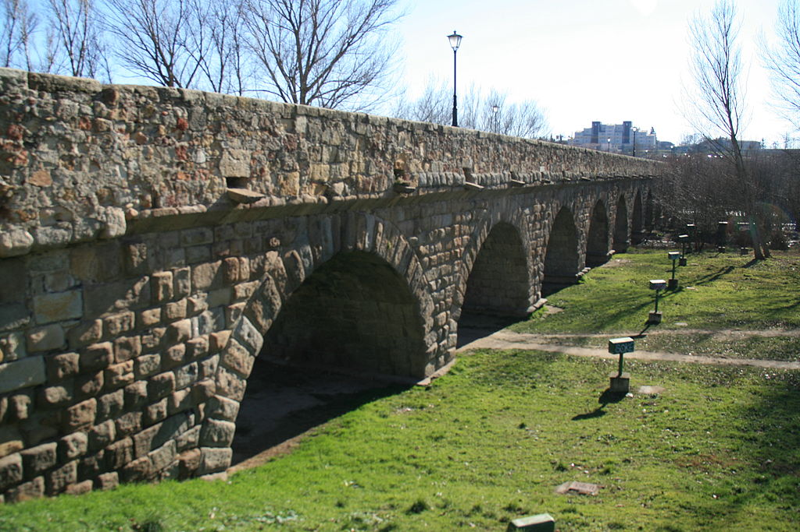

My favourite engineering metaphor is based on the ancient art of building bridges,
of which there are [many types](https://en.wikipedia.org/wiki/List_of_bridge_types).

## 🤠 The Cowboy and the Stream

Suppose you are a cowboy that wants to move some cattle across his property.

There is a small stream of water in the middle (1).
Rather than have the cows wade it,
the cowboy sets a plank of wood across the water (2).
Cows go safely, everyone is happy.

## 📏 The Over-engineered Bridge

The cowboy now finds a wider stream of water.

He thinks to himself:
"This is easy, I will just build a longer plank of wood" (1).
But when his cows try to cross it,
the plank breaks in the middle due to the weight
and the cattle drown (2).

Desperate he asks his friend the engineer for a solution,
who comes up with a very simple yet clever arch bridge design (3):
just one piece of concrete that can be poured elsewhere and set in place.
When the cowboy hears the price, though,
he thinks to himself:
"I can do this!"
So with a lot of effort he builds a bigger, wider plank of wood (4).
The cows take some effort to walk onto it, but it works!

### 🤌 First Moral

Was the arch bridge (3) over-engineered?
It depends;
the huge plank will probably do the job for some time,
but it will not last long and will definitely not resist a flooding.
Perhaps after having to rebuild it three or four times,
the cowboy will go with the engineer's design after all.
For a little bit more perspective, ask yourself:
the Romans built many bridges,
including [this one in Salamanca](https://en.wikipedia.org/wiki/Roman_bridge_of_Salamanca)
with 15 arches which is still standing.
The builders could have done a much simpler job to last only for a couple of centuries.
Were they over-engineering, or just awesome-engineering?

## 🏗️ The Clumsy Bridge

But this was not all! The big challenge is here:
the cowboy realizes that if he could cross the river at its widest point,
almost 40m across,
he would save 1 km on his way home!

Having learned his lesson he builds a thick plank like before (1),
but this time it is not enough:
it breaks and again his cattle drown (2).

He does not want to bother his friend the engineer,
plus he fears the price tag.
So he makes plans to build a really thick plank of wood (3).
He does not really know the amount of wood needed,
so to be sure he goes for a two-meter tall "plank".
There are no tree trunks this tall,
so a more complex structure with many layers is required.
This takes forever and he is not really happy with the result.
Also it is now taller than a cow,
so the cattle need a cumbersome tapered structure at the ends
to be able to climb it.
Meanwhile costs skyrocket due to the insane amounts of wood and labor required.

The engineer comes by and suggests a simple cable-stayed bridge (4),
which would not be a huge investment compared to all the materials already used:
poured concrete and steel cables.
The cowboy, having invested so much effort and time,
tells her that he will go on with his project.

After a couple of months he comes again to the engineer,
utterly defeated while simulating casualness,
and asks for the engineer's help.
It is completed in three weeks,
under budget since she is very cost-conscious,
and it is not really very challenging.

### 🤌 Second Moral

This contrived example tries to illustrate the reality of evolving software:
the techniques that were once appropriate may become a real drag as the system grows.

## 🤔 Conclusion

All tools, just like [physical laws](/2022/understanding-limits),
have their range of application.
The good engineer needs to know and dominate a wide range of techniques,
and be able to switch between them depending on the needs of the project.

### 🙏 Acknowledgements

Thanks to my colleagues,
in particular to
[Jonathan Zimpfer]()
and
[Alfredo López](),
for listening to evolving versions of this same story,
and improving it with their input.
Also to my friend
[Juan Sebastián Villamizán]()
for many interesting hours of discussion around it.
Any errors and poor explanations are my own.

The [cow icon](https://commons.wikimedia.org/wiki/File:Cowicon.svg) was created by
Wikipedia user Abu badali.
The photo of the Roman bridge of Salamanca is by
[Wikipedia user Tamorlan](https://commons.wikimedia.org/wiki/Special:ListFiles/Tamorlan).

