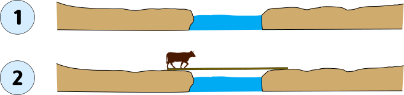
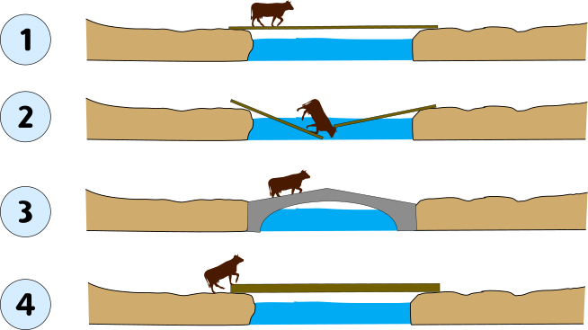

Every few months an article comes out bashing Kubernetes and similar "infrastructure as code" tools,
usually saying that they are only cost-effective at massive scale -- think Google or similar.
The latest was an interesting piece by Jeremy Brown:
[Kubernetes is a red flag signalling premature optimisation](https://www.jeremybrown.tech/8-kubernetes-is-a-red-flag-signalling-premature-optimisation/).
The title says it all,
and if it were not enough the subtitle should do it:

> If your company uses Kubernetes, you are likely expending energy on something that doesn't take you towards your mission.

I used to think like this, but my most recent experience has changed my mind.

I would like to tell you about our experience at
[Hivency](),
where we have used Kubernetes extensively.

[Hivency]()
is an influencer marketing company that was recently acquired by the
[Skeepers group]().

for us for example.
kubernetes migration have been done like 2 year after my arrival i think. so not at the beginning. and it was the logical continuation of what we used at AWS (Elasticbean Stalk, a ready to use solution for managing VM with load balancer).
So not a premature optimization at all.
Against he say in the chapter.

## Users Appreciate Reliability

Did users ask for this?
Your organisation needs engineers to create an impact on the mission.
They have made the decision to run a tools inside kubernetes for the data team. It's a no go for me too, all major cloud have dedicated tools for managing data related stuff. He just show his lack of knowledge here. And honestly if he needed "month" to make it work he is not competent neither.
Did users ask for this?
Before reading anything, this is the typical question that make stop reading in general. Because of course no customer will tell you to use k8s, the ask for performance, security, stability not technology. He his the IT guys, he his in charge to find the solution not the customer.
He acknowledge himself with his "Gucci" metaphor, that at some point switching to k8s will make a real difference, did he say when ? no because he don't know and have strong opinion to not do so.

## Do a Lot More with Less

> Products will have to be built by smaller teams that can deliver business outcomes at an increasingly faster pace.

But this is exactly the purpose of Kubernetes!

He say product have to be built with smaller teams that can deliver fast. I'ts exactly on of the purpose of K8S, yeah if you have a 15GB container who takes 2min to startup K8S is not the good choice. But like all in IT, right tool, right moment, right place.
He acknowledge that company should consider some of the higher-level building blocks available via cloud providers making my previous comment about data pipeline more laughable because he just demonstrate that instead of saying he made bad decision of choosing k8s for this purpose and not cloud providers tools, he reject the fault on the tools, "smashing nail with screwdriver is a premature optimization, dhoooooo" .
His example with Whatsapp is moreover hilarious, they used erlang, so first, enginner in the past knowing erlang was only very good and experienced enginner and he probably don't know what make erlang a so powerfull language for telecom, erlangVM, who, very naively in short, encapsulate every function in his own microVM, interraction between work with message send/receive, function can be update in place without any restart   message will be smoothly reroute, erlangVM take care about mivroVM scalling.
This is just the definition of kubernetes ...... but at language lvl

## Maintaining 

another topic is people needed to maintain, i'm the perfect example where a single guy can manage the cloud infra, k8s and slowly go out of backend dev and after 2-3 year alone starting to see some bottleneck and start to look for another person.
Foot note:
What is his recommendation ? no one
Just a random guy who have not understand what he use and rant on the tools because of his ego
7:04

sorry big post :sweat_smile:
This kind of people irritate me

## Infra as Code

## Things to Improve
New
7:06
for the - you mentionned, it will be the same for every tools i would have used. even when we were in aws with elasticbean stalck i was the only one to touch it. I didn't know it before hivency, i just was the only one who had the faith to read the doc :sweat_smile:

the real problem about that, and it's part of my fault. It's we didn't explain, advocate, etc in depth why k8s, why now, etc. This and the 2 times service split start fail who will had add more sense.
But for a recent exemple. I just was able to split Sidekiq worker in several server with just copy/pasting 5 files and change env variable injected to configure them. And now we can have a better vision of resource consumption and a better scalling for each type of queue.
7:12
it took me 1 hours to do so

## 🌉 Building Bridges

My favourite engineering metaphor is the ancient art of building bridges,
of which there are [many types](https://en.wikipedia.org/wiki/List_of_bridge_types).

Suppose you are a cowboy that wants to move some cattle across their property.
There is a small stream of water in the middle (1).
Rather than have the cows wade it,
the cowboy sets a plank of wood across the water (2).
Cows go safely, everyone is happy.

The cowboy now finds a wider stream of water.
Asking his friend the engineer for a solution,
she comes up with a very simple yet clever arch bridge design (3):
just one piece of concrete that can be poured elsewhere
and set in place.
When the cowboy hears the price, though,
he thinks to himself:
"I can do this using my techniques!"
So with a lot of effort he builds a bigger, wider plank of wood.

## Conclusion

All tools, just like [physical laws](/2022/understanding-limits),
have their range of application.

## Acknowledgements

Thanks to my colleague
[Jonathan Zimpfer]()
for providing most of the ideas
and even the text for this article.
Any errors that remain are my own.

The [cow icon](https://commons.wikimedia.org/wiki/File:Cowicon.svg) was created by
Wikipedia user Abu badali.

