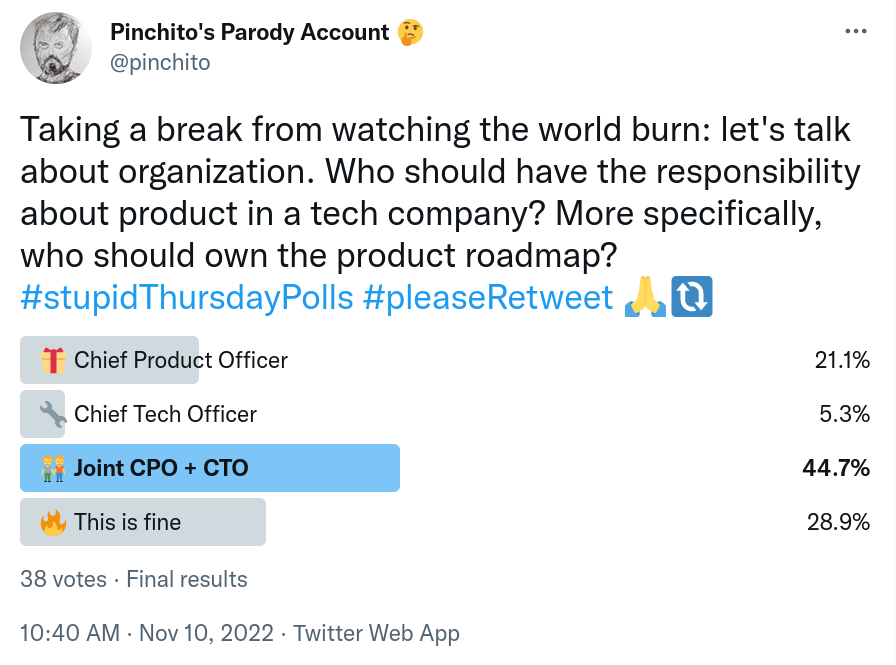

Hace unos días Rafa Serrano, CTO de Civitatis, hizo una pregunta muy interesante en un grupo de WhatsApp para CTOs:

> Venga, me lanzo yo con una sobre organización.
> ¿Cómo encajáis diseño y producto dentro de la organización?
> ¿Dependen del CTO?
> ¿Producto tiene entidad propia y absorbe diseño?

Este asunto de organización de producto me tiene intrigado ya desde hace unos años.
He visto distintos enfoques y he tomado notas sobre cómo funciona cada uno.

## ❓ La pregunta

A efectos de este artículo vamos a considerar la existencia
de un Chief Technology Officer (CTO) y CPO (Chief Product Officer) como puestos abstractos,
no como personas concretas.
Estamos en el ámbito de una empresa tech de producto.

## 🔧 Campo CTO

Rafa Casuso, CTO de ThePower Business School, fue el primero en tomar el guante:

> Yo creo que depende del dominio y de las personas concretas.
> Pero personalmente no me gusta cuando hay CPO y CTO a la par:
> lo que mejor me ha funcionado es tener un único Roadmap de Producto/Tecnología
> y aglutinar ambas dimensiones en la misma área,
> liderando yo mismo tanto Producto como Tecnología.

> No entiendo ya una cosa sin la otra ni con agendas independientes.
> Lo más importante que decide una startup es a qué dedica su equipo de Ingeniería,
> y me cuesta mucho asumir que eso se decida fuera del equipo

Carlos Herrera, CTO de Cabify, expuso su punto de vista:

> Nosotros lo tenemos con CTO y 4 VPs:
> Design, Data, Engineering, Product.
> El roadmap se define por audiencia (tribu).
> Mi rol y el de los 4 VPs se limita a coordinar roadmaps que necesitan varias audiencias.

> Aparte el curro de cada VP es que Cabify sea un sitio donde se hace su disciplina mejor (ingeniería, diseño, data y producto)
> porque entendemos que hacer bien el arte de cada quién es crítico para atraer y mantener contenta a la gente.

Por su parte, Iván Velasco, CTO de Clicars, estuvo también de acuerdo:

> +1, es la forma más fácil de mantener ambas áreas alineadas.
> Del CTO cuelgan el VP of Engineering llevando la rama de ingeniería, y un VP of Product llevando todo producto.
> Esto es lo que me ha funcionado siempre.
> La persona que hace de CTO necesita tener la visión estratégica de dónde se va a ir y alinear al VP de eng con el VP de producto.
> Luego será el VP of Producto quien ya gestione todas las dinámicas de creación de producto y el resto de perfiles.
> En mi opinión un CTO debe tener también visión de producto y de negocio.
> Si no, se me queda cojo.

> Yo lo que he visto funcionando mejor en todas mis experiencias ha sido eso:
> alguien como VP llevando la visión y dinámicas de producto,
> pero liderado por un CTO transversal,
> con fuertes conocimientos técnicos pero también de producto y negocio.
> (Si el CTO no entiende qué es crear producto obviamente no va a funcionar, pero hablamos de otra cosa).

> Así están siempre 100% alineados ingeniería y producto.
> PMs y EMs remarán siempre en el mismo barco;
> cuando haya discrepancias, que las habrá,
> la visión estratégica del CTO ayudará mucho a poner orden entre VP eng VP prod.
> Sin necesidad de elevar una discusión o un debate entre C levels al resto del board, que sería un sinsentido.

> Así que NO a ejecutivos de producto, y un SÍ rotundo a especialistas de producto, en mi opinión.

## 🎁 Campo CPO

Miguel Ángel Fajardo, VP Eng de Clibank, expuso el punto de vista opuesto:

> Yo lo veo al revés, un CTO no está preparado como un CPO para hacer un producto estelar
> (a no ser que sea un producto para desarrolladores o algo así).
> La mentalidad y la formación es diferente, aunque haya areas de intersección.
> Y obviamente diseño cae dentro de producto.

Leo Antolí siguió con el tema:

> Simplificando mucho: calidad externa es que el producto no tenga bugs,
> haga lo que necesiten los usuarios, etc.
> Calidad interna es que el producto sea fácil de evolucionar para cumplir requisitos futuros
> y que necesite poco mantenimiento y operaciones.
> Creo que es tan malo que el producto técnicamente sea un desastre y se tarde una eternidad para evolucionarlo,
> como que sea una maravilla técnica que nadie necesite ni use.
> Entonces el que producto o ingeniería sea "más fuerte" creo que va a hacer que un lado pese más y no sea ideal;
> creo que normalmente habrá una cierta tensión entre avanzar rápido y bien (por simplificarlo).
> Dependerán de cada caso pero para un producto no para técnicos pienso más como Miguel Ángel:
> la visión de producto la veo un poco más importante.
> Aunque lo ideal sería que estén al mismo nivel y se entiendan bien.

Por su parte Rafa Serrano, quien había lanzado la pregunta,
expuso los problemas de tener al cargo de CTO liderando el producto:

> Muy buenos apuntes, muchas gracias a todos.
> Sinceramente, ahora mismo yo me balanceo entre ambos esquemas dependiendo del día 🥴.
> Nuestro contexto: somos un ecommerce y nos consideramos por encima de todo una empresa tecnológica;
> estamos en plena fase de scale-up y no tenemos una verdadera cultura de producto,
> sino un parche entre CEO+CTO+líderes de líneas de negocio que hasta ahora nos ha servido.
> Pero empiezan a saltarle las costuras y esto lleva asociado que no todas las funciones tienen un owner.
> Por eso estamos en el punto de ver para dónde tiramos;
> hacen falta especialistas, pero no tengo tan claro a día de hoy quién debe liderarlos.
> Si hay roles CPO+CTO obviamente la agenda debe ser común, pero eso de que lo mejor es CTO a solas...
> Por esa regla incluso podría llegar al límite que también es la propia agenda del CEO y otras áreas,
> por eso no tengo tan claro que el coordinador deba ser necesariamente el CTO (o la T es de todopoderoso? 😅)

### 🗳️ La encuesta

El 10 de noviembre publiqué [esta encuesta](https://twitter.com/pinchito/status/1590640555989487616) en Twitter:

Claramente los 38 encuestados se decantaron más por la opción de CPO.
Y tiene sentido, ¿no?
Si estamos construyendo un producto tecnológico,
la parte de producto debe pesar tanto como la tecnológica.

## 🗣️ Mi opinión

Hemos venido aquí a este blog a mojarnos, y no a soltar tibiezas.
En mi experiencia, tener CTO y CPO a la misma altura es una fuente constante de problemas.

### 🪖 Trabajo en squads

Hoy día lo normal es trabajar en escuadrones (squads) integrados,
con roles de desarrollo frontend y backend, QA, team lead e incluso data science;
y también product manager, product owner y product designer.
Esta organización está de moda por un motivo:
resulta sencillo y efectivo tener un equipo integrado donde todo el mundo rema en la misma dirección.

Pero hay un problema:
si separamos CTO y CPO, parte del equipo va a colgar de una pata (producto del CPO)
y el resto de otra (devs, QAs, data... del CTO).
¡Es una receta para el desastre!
¿Cómo se puede organizar un equipo donde hay dos jefes diferentes?

¿Quién resuelve los problemas del squad?
Si hay un conflicto al desarrollar una feature,
el CTO y el CPO tendrán que sentarse a hablar.
Mientras que con un mando integrado sería la team lead quien resuelva los problemas internos.

### 📓 Agendas

Cuando la responsabilidad la llevan conjuntamente CPO + CTO,
tendremos dos agendas diferentes que habrá que reconciliar,
y eso sólo lo puede hacer el CEO;
con lo que delegamos la responsabilidad final de qué se desarrolla al CEO,
que es quien la delegó inicialmente en estos dos puestos 🤔

Estoy con Rafa Casuso y con Iván:
en mi experiencia, la responsabilidad de producto debe estar completamente
bajo las competencias del CTO que es quien construye:
no tiene sentido ingeniería sin producto ni producto sin ingeniería.

### 🏭 La factoría de features

También podríamos pensar que fuera el CPO quien llevara el cotarro,
pero todos sabemos lo que pasa cuando producto manda:
todo son features y cero inversión en plataforma.
La deuda técnica se acumula sin cesar, y finalmente obtenemos una maraña que hay que rehacer desde cero.

Si preguntamos a alguien de producto si vale la pena invertir en plataforma o es mejor añadir nuevas features,
las features ganarán siempre.
Y si preguntamos a la gente de negocio no habrá ninguna duda.
El departamento de desarrollo se convierte en una factoría de features
donde se parchea sin ningún pudor para seguir construyendo para la siguiente feature de la lista,
sin pararse a mejorar la experiencia del equipo dev.

En mi experiencia esta situación siempre lleva a plataformas inmantenibles y deudas técnicas impagables:
[_builds_ de una hora](https://engineering.linkedin.com/blog/2018/07/how-we-improved-build-time-by-400-percent),
plataformas complejísimas,
y cero inversión en tecnología.
Sólo alguien que entienda la parte tecnológica va a dedicar el esfuerzo estratégico a mejorar el entorno de desarrollo.

### 💥 Conflictos

Yo tampoco creo que el CTO deba ser todopoderoso, pero sí ser el responsable del roadmap. Esto no significa necesariamente tomar las decisiones sobre qué se va a hacer: las más estratégicas se fijan normalmente en el comité ejecutivo. Pero sí responder de la ejecución. Para dar un ejemplo de lo que eso significa: si hay algún problema entregando una feature, el CTO debería responder; mientras que si hay CTO+CPO es muy posible que se echen la culpa mutuamente: la feature no estaba bien definida vs sí lo estaba pero no fue bien ejecutada. Estas discusiones eternas para mí muestran una disfunción en el equipo, y no deberían salir del squad; el team lead debería presentar un frente común para centrarse en lo importante: cómo hacemos que la siguiente vez salga mejor.

Le doy de nuevo la palabra a Iván que lo expresó de forma impecable:

> Tal cuál. Cuando todo va bien, la empresa creciendo viento en popa, pan para todos, baja presión...
> el CTO y el CPO se pueden llevar bien. Hoy para ti, mañana para mí.

> Cuando las cosas se complican, ya sea por malos momentos de mercado,
retrasos o sobre costes en entregas importantes, un competidor fuerte que va más rápido que tú...
> Ojito, los cuchillos empiezan a llover y se percibe claramente
> cómo dentro del mismo squad ingeniería y producto se echan la pelota entre sí.
> Eso NO tiene sentido, pero pasa, porque somos seres humanos
> y cuesta asumir las responsabilidades cuando la decisión tomada no ha sido del todo tuya.

> Si cortas la bicefalia cortas el problema.
> El CTO sería el responsable de empujar al equipo en su conjunto.
> Y si va mal la ejecución, o las decisiones estratégicas de producto han sido mal tomadas,
> la responsabilidad está clara y no hay debates.

### 👓 Visión de producto

Partiendo de aquí, ¿qué pasa si hay un CTO sin visión de producto?
Pues que la estrategia va a sufrir.
Creo que se puede apoyar bastante en un VP de producto o similar,
pero es esencial que un CTO sepa qué se va a construir, aparte de cómo.
Luego ya quedará a nivel de equipo cómo se implementa,
y en este punto los roles de producto en cada squad serán esenciales.
Pero lo que no se puede empujar a nivel de squad
es la responsabilidad de marcar un roadmap para la empresa o de decidir en qué trabajar.

Yo personalmente esto lo he probado como CTO de Hivency,
trabajando con "impact teams" a los que se les asignó un KPI que tenían que mejorar,
a instancias del CPO.
Los resultados fueron muy decepcionantes.

Según la gente de producto no le dimos suficiente tiempo al experimento,
aunque en mi opinión seis meses debería ser de sobra para mover la aguja.
Los KPIs que intentábamos mejorar eran churn y growth, bastante básicos.
Pero yo creo que no funcionó porque los intentos de mejorar KPIs tienen que ser estratégicos, no tácticos;
deben venir de arriba abajo.
Cosas del tipo "añadir features gordas" o "ajustar precios"
pueden tener mucho más peso que arreglar unos cuantos bugs o hacer mejoras incrementales.

De nuevo Iván puntualiza:

> Tener a un CTO que lleva la responsabilidad de producto
> no quiere decir que el CTO deba estar en todo o saber de todo.
> Necesita dominar el _big picture_ de todas sus patas,
> pero quien va a gestionar producto es el VP de producto
> y quien va a gestionar la estructura de ingeniería es el VP de ingeniería.
> El rol más importante del CTO, desde mi experiencia,
> es tratar de que el **producto tecnológico** (ojo que puse las dos palabras juntas)
> que se cree en la compañía esté lo más alineado posible
a la estrategia y necesidades reales que tiene dicha compañía.
> Además de comerse toda la capa de política con otros _C-levels_
> para asegurar que sus equipos tengan el menor ruido posible y se centre en lo que deben centrarse: en crear valor.

## Conclusiones

En mi modesta opinión vivimos en una burbuja de ejecutivos de producto;
lo que se necesita en este ámbito es especialistas.
Y esto hablando siempre de empresas de base tecnológica, claro;
en otros sectores no tengo experiencia.

También se necesita que 

### 🙏 Agradecimientos

Muchas gracias a Rafa Serrano,
Rafa Casuso,
Iván Velasco
por dejarme usar sus palabras.

