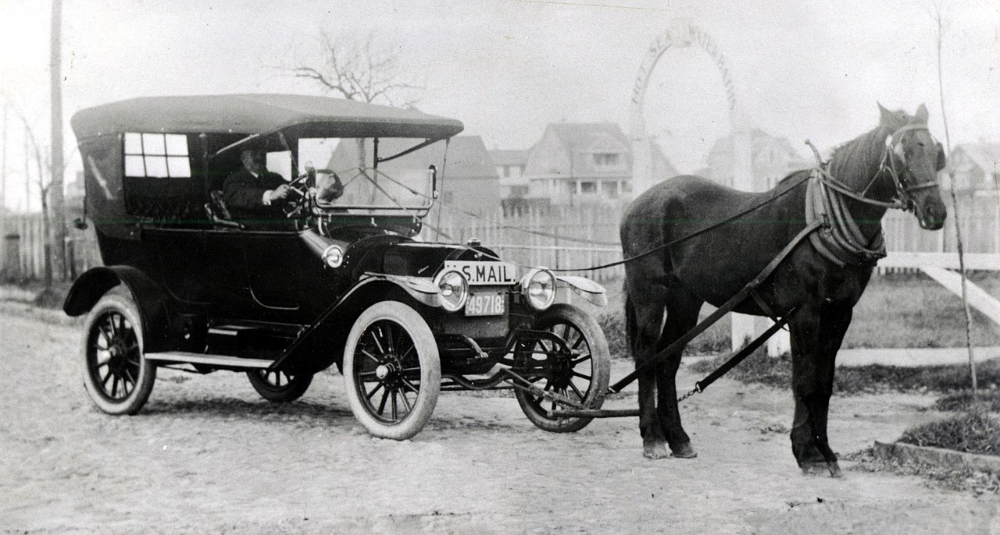

After studying the most important works of
[Albert Einstein](/2021/understanding-einstein)
we can wonder about how well his discoveries apply to the real world.
Is there a limit to the application of special relativity,
general relativity, quantum mechanics?
This road will prove quite fruitful since it can help us look at
some of the big mysteries of the universe under a new light.

## 🪅 Breaking Physical Laws

Let's start with a few interesting examples of physical laws and how they break down.

### 🌡️ Newton's Less Famous Law

Kids at secondary school learn about Newton's laws of motion:
three very simple principles that explain a lot of things.
But let us first look at another, simpler law.

Newton also studied many other things;
and in fact his eponymous law was about the speed with which objects cool,
also known as
[Newton's law of cooling](https://en.wikipedia.org/wiki/Newton%27s_law_of_cooling).
It states that:

> the rate at which a body cools in an environment is directly proportional
> to the difference of temperatures between the body and the environment.

So if the outside temperature is 20 C,
a body at 220 C will cool twice as fast as another at 120 C.
It's simple, it's elegant,
and it's not terribly accurate:
the Wikipedia article explains a few corrections
when the temperature difference is large,
or when there is a lot of radiative heat.

This law is also not terribly interesting,
in that it does not follow from any intrinsic principles of the universe,
and it does not explain any other phenomena outside cooling.
But **inside its range of application** it can give us an idea of how things cool in simple conditions:
the temperature of a cooling object will converge to that of its environment
following an exponential decrease.

### 🌌 Newton's Eternal World

After Newton published his laws of motion
[in 1687](https://en.wikipedia.org/wiki/Philosophi%C3%A6_Naturalis_Principia_Mathematica),
so many aspects of the world were suddenly understandable:
from apples falling from a tree to the orbit of the Moon around the Earth,
including interesting things like bullets penetrating sandbags.

Newton's vision of the world was consistent with his religious views:
the universe would be, like God, immutable and eternal.
Gravity would hold things together in an infinite space.

After Newton there were many interesting developments in Physics,
like the reformulation as Lagrangians, Hamiltonians
and later physical fields;
a proper theory of optics
and finally the discovery of the laws of electromagnetism.
But, important as they were,
these advances were just extensions and improvements of Newton's laws.

It was not until the end of the 19th century,
200 years later,
that his amazing building started to show cracks in the foundations.
Up until this point everyone assumed that Newton's laws applied to everything,
from the smallest particles to the largest structures in the galaxy.
Everyone was wrong.

### ⚛️ The New Quantum World

We have already seen how it was pricipally
[the works of Albert Einstein](/2021/understanding-einstein)
that created new laws where Newton's broke down,
along with a few pioneers.

In the smallest scales Einstein assumed that light was made of little particles called photons,
which carried an amount of energy proportional to their wavelength;
something that could not be derived from classical electromagnetism.
Later advances in
[quantume mechanics](/2021/understanding-quantum-mechanics)
would give a very different picture from Newton's,
with particles behaving like waves
and going across potential wells that would scare their bigger cousins.

The limit for classical behaviour is not entirely clear,
but it is at some point above an atom and below a living cell.
We now know that many of the behaviours of proteins are quantum in nature,
and the same applies to electronics circuits.

### ⚡ High Speeds

This was not all:
Newton's laws of motion didn't hold water either for
[ever-increasing speeds](/2019/high-speeds).
The limit in this instance is clear and well defined:
there is a maximum speed in the universe,
and as objects get close to it their mass increases,
making them harder to accelerate.
This speed of light is approximately 300000 km/s,
so relativistic effects are negligible in everyday life.

The philosophical effects were devastating.
No longer there was an eternal and immutable universe,
even if Einstein wanted to reinstate it using his cosmological constant.

### 🌞 High Masses

The jewel of the crown was not safe either:
Newton's law of gravitation would be the next to be demolished by Einstein.

## 🛑 Limits to the New Limits

Does it make sense to expect that the new laws would apply universally?

### ♾️ Shy Singularities

General relativity has been really successful.
Even today, more than a century after its inception,
general relativity continues to be validated against rival theories:
first it was direct black hole imaging using radiotelescopes,
and then the detection of gravitational waves
which had been predicted by Einstein himself
(and then recanted, but
[that is another story](https://www.americanscientist.org/article/the-secret-history-of-gravitational-waves).

But it is not perfect.
For one thing, it predicts singularities:
weird solutions to the field equations that break space-time,
with an infinite slope.
Any such predictions in any other theory would have probably been discarded.

Physicists like taking everything to the extreme,
and it makes lots of sense because it's the way to check the limits of a law.
But sometimes they forget that every law has limits.

When Schwarzchild started looking for weird solutions to general relativity
he found that there was a point at which light could not escape any longer.
But also there were these weird solutions that broke space-time:
the equations yielded a "singularity",
a point where matter gathered with infinite slope.

X postulated that the universe didn't like showing a naked singularity,
and thus they were hidden behind a Schwarzchild horizon.
We have been so lucky to be able to image a large black hole,
or to be more precise its event horizon.

Does it make sense to expect that Einstein's equations will be valid all the way,
or should we look for another theory that will be valid at these extreme concentrations of matter?
We do not know,
and it is not terribly important since we are not going to be able to play with these tremendous forces
any time soon.
Furthermore, despite what films like
[Interestellar]()
try to show us,
it is impossible to study a singularity from beyond the event horizon.

But we should at least show some humility,
and admit that we don't know a lot about what happens beyond stellar collapses.

### ⚫ Dark Matters

There is another extreme at which general relativity is not a good fit for observations,
and you have probably heard about it as the basis for "dark matter"
or perhaps even "dark energy".
In fact, Newton's gravitational law does not hold in these circumstances either.
Gravity at large scales does not behave as we would expect it to:
instead of being proportional to 1/r^2,
it suddenly becomes proportional to 1/r.
In large galaxy clusters it looks as if it was reaching much further than it should.

This is only visible at really large scales,
bigger than our galaxy.
Astronomers invented "dark matter" to make up for the lack of stuff.
After their success it is no wonder that other astronomers invented
"dark energy" when there was another anomaly in the large structure of the universe.

I think it is much more reasonable to admit that
general relativity may not apply at the limit of large scales.
There have been many attempts at creating modified gravity laws that worked at large scales,
known collectively as MOND.
The dark matter proponents have subjected all these corrections to unreasonable requirements
such as being able to explain observations of the cosmic microwave background radiation.

It would be good to have a way to select just one correct alternative for MOND,
but it would not necessarily teach us anything new about our universe
beyond a nice correct formula.
It would be even better to have a theoretical background that predicted MOND on its own.

### 🔬 Quantum Limits

On the quantum front there have been many improvements
to the original crude measurements of the atom,
like Feynman's quantum electrodynamics
which was essentially a quantum formulation of the classical laws of electromagnetism.
Later came quantum chromodynamics to explain
the terribly intense forces in the interior of the atomic nucleus.

String theory was supposed to explain phenomena at smaller scales,
and in fact it should be the foundation for quantum mechanics.
But after many decades it has failed to show any progress in our understanding of the quantum world.
It is not clear that we need anything beyond what quantum mechanics has to offer
in the smallest scales.
At the same time it would be a bit arrogant to expect this theory to be just right
at all scales.
Even the known limitations of the Planck length is a bit too optimistic.

### 🔦 Speed of Light

There is one aspect of the new physics that has been challenged many many times
but which every time comes out victorious and reinforced:
the constant speed of light,
which is also the maximum possible speed in the universe.

In 2012 a colleague at a previous job asked me what I thought about the discovery
of a signal that travelled faster than light at CERN.
Apparently having 99 scientists signing the paper was a guarantee of good science,
something which I highly doubted.
And lo and behold,
some months later the anomaly was correctly diagnosed as a faulty computer connection.

Am I so clever as to have guessed the correct option,
or too arrogant to recognize that there might be a limit here that will prove wrong too?
In fact there is a joke among physicists about betting against the speed of light.

The maximum speed of light applies perfectly well to quantum mechanics:
in 1932? Paul Dirac came out with a new version of Schrödinger's wave equation.
In fact this new Dirac's equation is much more symmetric and nicer than Schrödinger's,
but we still use the old one at low speeds because it is simpler.
Again it's a matter of limits.

Special relativity works also well with all the latest theories,
at least to those that work.

So, as far as we know right now,
**special relativity is the only fundamental truth**.
Of course this situation might change at any point.

### 🔀 Decoherence

But to me it is much more interesting to explore the frontiers
between the quantum and classical worlds.
What happens when a quantum particle becomes classical?

## Conclusion

We will soon continue our trip to understand quantum entropy.

