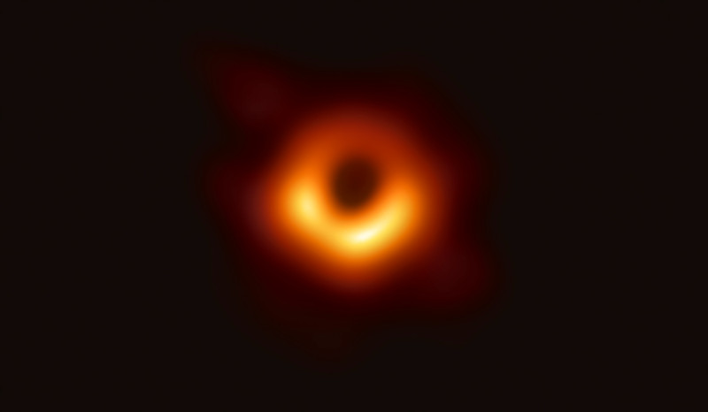

The most important works of
[Albert Einstein](/2021/understanding-einstein)
happened when classical laws were showing their limits,
and gave birth to 20th century theories:
special relativity, general relativity, quantum mechanics.

After more than a century of development,
have we also reached the limits for these new theories?
A short dive into the applicability of modern physics
will bring us clues that may help us understand black holes,
dark matter and some other theories about poorly illuminated things.

## 🔨 How to Break a Classical Law

We will start with an easy example.

### 🌡️ Newton's Less Famous Law

Newton studied many things during his lifetime.
[Newton's law of cooling](https://en.wikipedia.org/wiki/Newton%27s_law_of_cooling)
appropriately studies how stuff cools down,
and in modern terms it states that:

> the rate at which a body cools in an environment is directly proportional
> to the difference of temperatures between the body and the environment.

So if the outside temperature is 20 C,
a body at 220 C will cool twice as fast as another at 120 C.
It's simple, it's elegant,
and it's not terribly accurate:
the Wikipedia article explains a few corrections when the temperature difference is large,
or when there is a lot of radiative heat.

This law is also not terribly interesting,
in that it does not follow from any intrinsic principles of the universe.
But it shows quite dramatically how it can be useful:
**inside its range of application**,
the temperature of a cooling object will converge to that of its environment
following an exponential decrease.
Outside this range the law is useless.

The most important lesson that we can extract from this example is of humility:
laws should always come with application ranges,
as an instruction manual.

### 🌌 Newton's Eternal World

Let's move on to more substantial matters (pun intended?).
Kids at secondary school learn about
[Newton's laws of motion](https://en.wikipedia.org/wiki/Newton%27s_laws_of_motion),
three very simple principles:

* objects in motion remain in motion when no forces are applied,
* when a force is applied on an object it will feel an acceleration inversely proportional to its mass,
* for every force applied there is an equal and opposite reaction.

Together with
[his law of universal gravitation](https://en.wikipedia.org/wiki/Newton%27s_law_of_universal_gravitation),
they explain a lot of things.
After Newton published his
[_Principia mathematica_ in 1687](https://en.wikipedia.org/wiki/Philosophi%C3%A6_Naturalis_Principia_Mathematica),
so many aspects of the world were suddenly understandable:
from apples falling from a tree to the orbit of the Moon around the Earth,
including interesting things like bullets penetrating into sandbags.

Newton's vision of the world was consistent with his religious views:
the universe would be, like God, immutable and eternal.
Gravity would hold things together in an infinite space.

After Newton there were many interesting developments in Physics:
the reformulation as Lagrangians, Hamiltonians
and later physical fields;
a proper theory of optics,
and finally the discovery of the laws of electromagnetism.
But, important as they were,
these advances were fully compatible with Newton's world view.

It was not until the end of the 19th century,
200 years later,
that his amazing building started to show cracks in the foundations.
Up until this point everyone assumed that Newton's laws applied to everything,
from the smallest particles to the largest structures in the galaxy.
Everyone was wrong.

### ⚛️ The New Quantum World

We have already seen how
[the works of Albert Einstein](/2021/understanding-einstein),
were instrumental in creating new laws where the classical world broke down,
along with many other brave pioneers.

In the smallest scales Einstein assumed that light was made of little particles called photons,
which carried an amount of energy proportional to their wavelength;
something that could not be derived from classical electromagnetism.
Later advances in
[quantum mechanics](/2021/understanding-quantum-mechanics)
would give a very different picture from Newton's,
with particles behaving like waves
and crossing impossible potential wells in mysterious ways.

The limit for classical behaviour is not entirely clear,
but at some point bigger than an atom yet smaller than a living cell we need to use quantum mechanics,
or equations don't work.
We now know that many of the behaviours of proteins are quantum in nature,
and the same applies to electronics circuits.
Our modern world is literally shaped by our knowledge of quantum mechanics.

### ⚡ High Speeds

This was not all:
Newton's laws of motion didn't hold water either for
[ever-increasing speeds](/2019/high-speeds).
We have already seen how
[Einstein came up with relativity](/2021/understanding-einstein)
based on the fundamental idea that the speed of light was the maximum possible speed in the universe.
This set a clear and well defined validity limit for classical physics:
as an object gets close to this max speed its mass increases,
making it harder to accelerate.
It is easy to compute this correction for any speed.

Since the speed of light is approximately 300000 km/s,
relativistic effects are negligible in everyday life.
But they are relevant for
[GPS satellites](https://physicscentral.com/explore/writers/will.cfm)
since they move at 4 km/s,
and would result in huge inaccuracies if they were not taken into account.
Relativistic equations have been proven correct
time and time again,
and play a huge part in accelerators where particles can achieve
[99.9999991% of the speed of light](https://www.symmetrymagazine.org/article/inside-the-large-hadron-collider).

### 🌞 High Masses

The jewel of the old crown was not safe either:
Newton's law of gravitation would be the next to be demolished by Einstein.
As successful as it had been to predict everything from the fall of an apple to the orbit of the Moon,
it reached the limits of its application even within the solar system,
since nobody had been able to explain
[the precession of Mercury](https://en.wikipedia.org/wiki/Tests_of_general_relativity).

Einstein created his
[general relativity](https://en.wikipedia.org/wiki/Theory_of_general_relativity)
considering that gravity was indistinguishable from any other acceleration.
The consequences were really interesting:
even light had to bend around massive objects.
The philosophical effects were devastating.
No longer there was an eternal and immutable universe.
At some point Einstein wanted to reinstate this nice static picture using the cosmological constant,
in what he called
[his biggest blunder](https://physicstoday.scitation.org/do/10.1063/PT.6.3.20181030a/full/).
It was useless; the
[Big Bang](https://en.wikipedia.org/wiki/Big_Bang)
would soon win hearts and minds,
with its ever-changing universe.

## 🛑 Limits to the New Limits

Does it make sense to expect that the new laws would apply universally?

### ♾️ Shy Singularities

General relativity has been really successful.
Even today, more than a century after its inception,
general relativity continues to be validated against rival theories.
GPS satellites have
[corrections for general relativity](https://physicscentral.com/explore/writers/will.cfm)
since they feel less gravity than we do on Earth.
In the past few years we have seen black hole imaging using radiotelescopes,
and then the detection of gravitational waves
which had been predicted by Einstein himself
(and then recanted, but
[that is a story for another time](https://www.americanscientist.org/article/the-secret-history-of-gravitational-waves)).

But general relativity is not perfect.
Physicists like taking everything to the extreme,
and it makes lots of sense because it's the way to check the limits of a law.
But sometimes they forget that every law has limits.
When people started looking for interesting solutions to the equations of general relativity
they found that there was a point at which light could not escape any longer.
These weird solutions [broke space-time](https://en.wikipedia.org/wiki/Black_hole#General_relativity):
the equations yielded a "singularity",
a point where matter gathered with infinite slope.
Any such predictions in any other theory would have probably been discarded;
in general relativity they were just the start of a fruitful discussion.

In 1969 Roger Penrose postulated that the universe didn't like showing a naked singularity,
in what is now called
[cosmic censorship hypothesis](https://plato.stanford.edu/entries/spacetime-singularities/#NakeSingCosmCensHypoInde);
therefore black holes were hidden behind a
[Schwarzchild horizon](https://en.wikipedia.org/wiki/Schwarzschild_radius)
into which we cannot ever look.
In the 21st century we have been so lucky as to take a picture of a large black hole,
or more precisely of its event horizon.
It was exactly as predicted!

Does it make sense to expect that Einstein's equations will be valid all the way,
or should we look for another theory that will be valid at these extreme concentrations of matter?
We do not know,
and it is not terribly important since we are not going to be able to play with these tremendous forces
any time soon.
Furthermore, despite what films like
[Interestellar (2014)](https://www.imdb.com/title/tt0816692/)
tell us,
it is impossible to study a singularity from beyond the event horizon.
Even
[gravitational waves](https://en.wikipedia.org/wiki/Gravitational_wave)
as recently detected can only tell us how black holes behaved from the outside.

But we can at least show some humility,
and admit that we don't know a lot about what happens beyond giant stellar collapses.
Perhaps general relativity is not valid at all inside the black hole horizon;
it is very possible that in that last bit some other exotic theory of matter may take over
and avoid the singularity.
This possibility is however seldom mentioned at all,
perhaps because black holes are just more flashy.

### ⚫ Dark Matters

There is another extreme at which general relativity is not a good fit for observations,
and you have probably heard about it as the basis for "dark matter"
or perhaps even "dark energy".
In fact, Newton's gravitational law does not hold in these circumstances either.
Gravity at large scales does not behave as we would expect it to:
instead of being proportional to 1/r^2,
it suddenly becomes proportional to 1/r.
In large galaxy clusters it looks as if it was reaching much further than it should.

This is only visible at really large scales,
bigger than our galaxy.
Astronomers invented "dark matter" to make up for the lack of stuff.
After their success it is no wonder that other astronomers invented
"dark energy" when there was another anomaly in the large structure of the universe.

I think it is much more reasonable to admit that
general relativity may not apply at the limit of large scales.
There have been many attempts at creating modified gravity laws that worked at large scales,
known collectively as MOND.
The dark matter proponents have subjected all these corrections to unreasonable requirements
such as being able to explain observations of the cosmic microwave background radiation.

It would be good to have a way to select just one correct alternative for MOND,
but it would not necessarily teach us anything new about our universe
beyond a nice correct formula.
It would be even better to have a theoretical background that predicted MOND on its own.

### 🔦 Speed of Light

What about the **crown jewels of the new physics**?
Special relativity has been challenged many, many times,
but every time it comes out victorious and reinforced:
the speed of light is still the maximum possible speed in the universe.

A little anecdote can illustrate the strength of this conviction among physicists.
In 2012 a colleague at a previous job asked me what I thought about the discovery
of a signal that travelled faster than light at CERN.
Apparently having 99 scientists signing the paper was a guarantee of good science,
something which I highly doubted.
I was of course not alone in this intuition,
nor especially prescient;
special relativity is just the safest bet.
And lo and behold,
some months later the anomaly was correctly diagnosed as a faulty computer connection.

Am I so clever as to have guessed the correct option,
or too arrogant to recognize that there might be a limit here that will prove wrong too?
In fact there is a joke among physicists about betting against the speed of light.

Special relativity works also well with all the latest theories,
at least to those that work.
So, as far as we know right now,
**special relativity is the only fundamental truth**.
But only because it has been adapted to changing conditions.
Of course this situation might change at any point;
such are the mysterious ways of science.

### 🔬 Quantum Limits

On the quantum front there have been many improvements
to the original crude measurements of the atom,
like Feynman's quantum electrodynamics
which was essentially a quantum formulation of the classical laws of electromagnetism.
Later came quantum chromodynamics to explain
the terribly intense forces in the interior of the atomic nucleus.

The maximum speed of light applies perfectly well to quantum mechanics:
in 1928 Paul Dirac came out with a
[relativistic version of Schrödinger's wave equation](https://en.wikipedia.org/wiki/Dirac_equation).
In fact this new Dirac's equation is much more symmetric and nicer than Schrödinger's,
but we still use the old one at low speeds because it is simpler.
Again it's a matter of limits.

String theory was supposed to explain phenomena at smaller scales,
and in fact it should be the foundation for quantum mechanics.
But after many decades it has failed to show any progress in our understanding of the quantum world.
It is not clear that we need anything beyond what quantum mechanics has to offer
in the smallest scales.
At the same time it would be a bit arrogant to expect this theory to be just right
at all scales.
Even the known limitations of the Planck length is a bit too optimistic.

### 🔀 Decoherence

But to me it is much more interesting to explore the frontiers
between the quantum and classical worlds.
What happens when a quantum particle becomes classical?

This is exactly what Feynman and other great physicists were
[thinking about during the 50s](https://arxiv.org/pdf/0804.3348.pdf).
It lies at the heart of
[quantum decoherence](https://en.wikipedia.org/wiki/Quantum_decoherence),
which hasn't given all of its secrets away yet.
But it is a long story for another moment.

## Conclusion

Black holes are often referred to as singularities,
which is just an extrapolation of our current knowledge with no basis in experiment.
We will soon continue our trip to understand quantum entropy.

