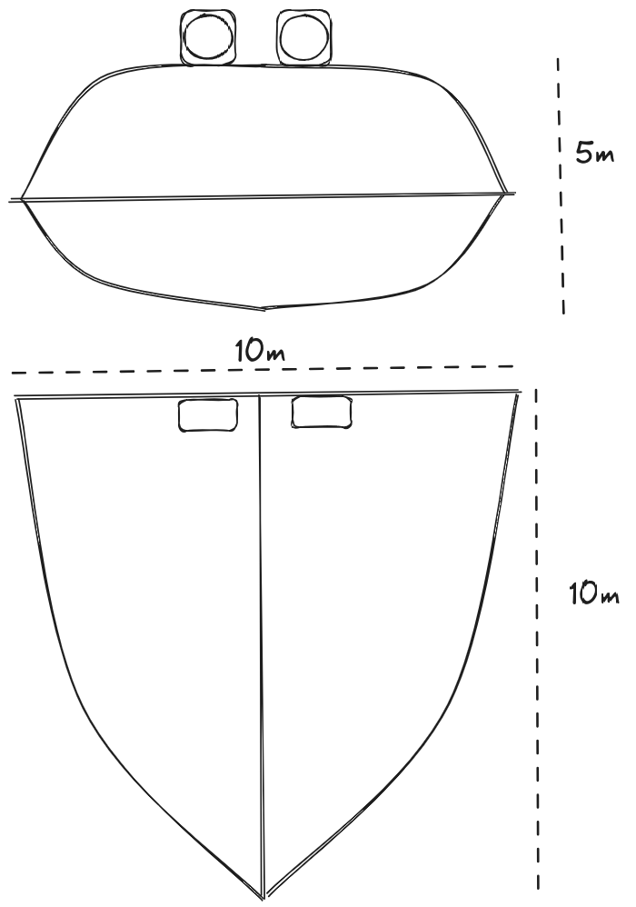

From the beginning of time people have wanted to fly.
Nowadays there are a multitude of flying machines,
from regular airline planes to helicopters and more recently drones.
And sometimes even blimps and ballons may appear like relics from the past.
Sadly, the amazing flying ships that appear in the movies of Hideo Miyazaki have not materialized yet:
they hover endlessly and never seem to have to touch down for fuel.

Down in the real world, some people have also dreamt of air ships that stay in the air forever,
both for their inspiring qualities and for practical reasons like scientific missions or broadband service.
There are some promising approaches that are on the brink of permanent flight.
In this article we will explore the _avis æterna_,
a novel approach that might be able to one day fulfill the dream.


# 💡 The Idea

The time is ripe for a drone that can stay aloft indefinitely.
The designs that hold all current
[flight endurance records](https://en.wikipedia.org/wiki/Flight_endurance_record)
are a fixed wing airplane with solar panels during the day,
and batteries to store the energy at night.
There is a clear tradeoff that centers around the size of the batteries:
too big and it will require a lot of energy to fly,
too small and they will not last all night.
We are just waiting for sufficiently efficient solar panels and light enough batteries.

But other approaches can be explored.
[Atmospheric balloons](https://en.wikipedia.org/wiki/Weather_balloon) are known to stay aloft for days and even weeks.
We could build a plane which is made lighter by hydrogen,
which can also be used as fuel storage:
instead of being weighed down by batteries
it could be filled with hydrogen which makes it lighter.
Not lighter than air, but sufficiently lighter that it is easy to stay up.
Even better, hydrogen can be extracted directly from the air!

Now, I am not an industrial engineer:
I studied Physics and have been working with computers for a couple of decades.
But I like to explore if a concept is at least feasible from a physical point of view,
and if the technology is there yet or requires further developments.
You may remember my previous attemps at a
[space launcher](http://pinchito.es/2018/building-space-launcher)
or [helping the climate change crisis with trees](http://pinchito.es/2023/climate-change-trees).
In this article I will do some [Fermi estimations](/2023/climate-change-solutions#fermi-estimation)
to check if the parameters are at least in the right ballpark.
Don't expect detailed plans or a bill of materials though;
this part will have to be undertaken by an enterprising soul
with a lot more practical knowledge than I may have or hope to acquire.
So let's explore the idea together from our comfy armchairs!

## 😶‍🌫️ Inspiration

The albatross is an amazing bird:
it only ever touches ground to mate on some remote island.
It is not clear if it ever rests in the sea where it is vulnerable,
but it seems that it can do everything in flight,
like [feeding and even sleeping](https://en.wikipedia.org/wiki/Albatross#Morphology_and_flight).

.](pics/avis-aeterna-albatross.jpg "An albatross or large bird similar to a seagull hovering over the blue sea.")

The Wikipedia article for [flight endurance record](https://en.wikipedia.org/wiki/Flight_endurance_record)
clearly separates records for airplanes (64 days), balloons (19 days) and airships (11 days).
So why not combine the three categories?

Hydrogen storage has the advantage that it can make our avis æterna lighter and easier to keep aloft.
No longer do we need to support its full weight with lift produced by its wings.
Since hydrogen gas has around
[7% of the density of air](https://www1.eere.energy.gov/hydrogenandfuelcells/tech_validation/pdfs/fcm01r0.pdf),
a hydrogen chamber will make the avis lighter.
But not necessarily lighter than air, which would make it an
[aerostat](https://en.wikipedia.org/wiki/Aerostat).
In fact, the avis may be able to control its weight by expanding its hydrogen chamber.
I would think of it as the [swim bladder](https://en.wikipedia.org/wiki/Swim_bladder) of fish,
which allows them to control their buoyancy in water.

## 🔥 Hydrogen? Are You Sure?

When mixing hydrogen and aviation we immediately get the
[Hindenburg effect](https://www.chemistryworld.com/news/the-legacy-of-the-hindenburg-disaster/3007067.article):
people remember images of the 1937 catastrophe.

.](pics/avis-aeterna-hindenburg.gif "Animated GIF in black and white of the Hindenburg Zeppelin burning to the ground.")

Let's delve deeper into this accident.
First, [only 35 of the 97 people aboard died](https://en.wikipedia.org/wiki/Hindenburg_disaster),
which is surprising given the magnitude of the fire.
Then there are suspicions that the materials of the enclosure
were at least partly responsible for the quick fire;
the thermite theory has been
[thoroughly debunked by experts](https://spot.colorado.edu/~dziadeck/zf/LZ129fire2005jan12.pdf).
Nonetheless the [Mythbusters in S04Ep3](https://www.youtube.com/watch?v=HVV7olFdg5I)
did some suggestive experiments that gave a substantive role to the coating of the enclosure.

In any case, hydrogen is now safer to use than at any other time in history.
We should be open to experiment again with that awesome, fully renewable gas.
Especially when no people are in danger!
The avis æterna will be fully autonomous,
which should also be good training for crewed hydrogen planes.

## 📝 Previous Designs

Airbus is the current record holder with its [Zephyr series](https://en.wikipedia.org/wiki/Airbus_Zephyr).
It has been flying non-stop for 64 days,
until a stratospheric current out of nowhere took it down.

Even Facebook did an experimental plane once with the idea of bringing Internet connectivity to the unwashed masses,
the [Facebook Aquila](https://en.wikipedia.org/wiki/Facebook_Aquila),
as can be seen in [this video](https://www.youtube.com/watch?v=D8Tm6tQdZ2I).

With this kind of electric design the problem lies in the weight of the batteries,
needed to keep the plane flying at night.
Holding more charge means more weight,
which drives up the requirements.

# 🧑‍💻 The Design

The basic idea is to have a hybrid of plane, airship and balloon.
It is to be filled with hydrogen gas H₂ at atmospheric pressure,
which will lift some but not all of its own weight;
leaving a portion of its total to be supported by lift as it moves forward.

## 🪽 Flying Wing

The concept of a 
[flying wing](https://en.wikipedia.org/wiki/Flying_wing)
has been around for a while.
Some people think that it is
[the future of air travel](https://hackaday.com/2021/08/08/from-tube-and-wing-to-just-wing-the-future-of-airliners/),
with its more efficient design.

A flying wing also has more internal storage than a classic plane.
The mostly flat top surface is ideal for placing light-weight solar panels,
which provide electricity for its operation.
We are envisioning a rather bulky aircraft similar to the design below,
given suitable aerodynamics.
This is a reference design which is 10 meters long and wide and stands 5 meters high.



## 🛫 Buoyancy and Lift

Remember that this design doesn't need to be as aerodynamic as a regular plane:
it only has to generate enough lift when flying to compensate a small part of its entire weight,
since a considerable portion will be sustained by buoyancy.

At sea level
[air weighs around 1.3 kg/m³](https://www.earthdata.nasa.gov/topics/atmosphere/atmospheric-pressure/air-mass-dens),
while [hydrogen weighs 70 g/m³](https://genh2hydrogen.com/blog/defining-hydrogen-from-a-to-z-3/);
providing a good 1.2 kg of buoyancy per cubic meter of stored hydrogen.

Hydrogen gas can be very easily extracted from water using electrolysis.
It is also very possible, although not as easy,
to extract water from air:
just condensing atmospheric water vapor,
which can be done using an
[atmospheric water generator](https://en.wikipedia.org/wiki/Atmospheric_water_generator).
There are many possible mechanisms;
a suitable light-weight design should be used,
which might take advantage of air passing through the two big fans at the top that give propulsion.

## ⚡ Power and Propulsion

Speaking of which, these two [propellers](https://en.wikipedia.org/wiki/Propeller_%28aeronautics%29)
have to move the plane forward.
How are they activated?
Primarily they use energy from the solar panels on top,
which can be lightweight cells such as
[those used in the Zephyr](https://www.prnewswire.com/news-releases/microlink-devices-powers-successful-stratospheric-flight-of-airbus-defence-and-space-zephyr-s-haps-solar-aircraft-300732214.html).

Some way of storing electricity for the night must be provided,
if we are to stay aloft.
There are several possibilities:

* Carry along some measure of batteries,
just as existing designs.
This is not the preferred choice because they are heavy and bulky.
* Just float: store enough hydrogen so that the avis becomes buoyant in the atmosphere.
The frame can expand with the gas.
Another possibility which would allow a rigid body is to store water as ballast during the day,
and release it at sunset.
This is a low cost solution that can be good enough.
* Use part of the stored H₂ as fuel for a [hydrogen cell](https://en.wikipedia.org/wiki/Fuel_cell).
This is the preferred solution,
but requires to develop fuel cells which are both light and efficient enough.
The avis can store extra hydrogen during the day,
which will increase its internal pressure (or volume) enough to have some reserves.

## 💪 Challenges

There are some areas which may require advancing the state of the art.

### 💧 Extracting Hydrogen from Air

The core of our design is storing hydrogen molecules.
How can we lay our hands on those sweet H₂ molecules?
We have set our hopes on
[atmospheric water generators](https://en.wikipedia.org/wiki/Atmospheric_water_generator),
but these are currently heavy and waste a lot of power.

Since oxygen is much denser than hydrogen,
water is only
[1/9 hydrogen in weight](https://chem.libretexts.org/Ancillary_Materials/Exemplars_and_Case_Studies/Exemplars/Biology/Atomic_Weights_and_Water).
Therefore each kg of H₂ requires 9 kg of H₂O.
It is not feasible to carry this much water onboard,
except as ballast.

This becomes especially problematic in dry areas and as we raise higher in the atmosphere.
We have the advantage that we are passing a lot of air through our propeller fans already,
which can help collect water with a bit of temperature gradient.
So there is at least hope.

### 🎈 Manipulating Hydrogen

Hydrogen gas (H₂) is notably hard to contain:
there will be leaks everywhere no matter what we use to contain it.
Therefore it needs to be replenished in flight, as we have seen.

Gas should be as close to atmospheric pressure as possible,
to prevent even worse leaks.
The enclosure may be elastic to hold a variable amount of gas,
or it might be rigid.

Any leaks become really problematic in the presence of electrical sparks,
which must be contained as much as possible.
For instance [St. Elmo's fire](https://en.wikipedia.org/wiki/St._Elmo%27s_fire)
is suspected in the Hindenburg disaster.
Also, air leaks inside the enclosure will mix the H₂ with O₂ and turn the insides into a ticking bomb.

### 🛩️ Propulsion

Propellers are [light and efficient](https://en.wikipedia.org/wiki/Propeller_%28aeronautics%29),
so they should not be an issue as long as we have enough power.
Moving forward should not be too hard.

Control surfaces are required to direct flight to any desired direction,
and to regulate height efficiently.
This will be a challenge to the external design;
any clumsy attempts from my part will just highlight the defficiencies.

Moving parts should be avoided for a really perpetual flying machine.
Some kind of [ionic wind](https://en.wikipedia.org/wiki/Ion_wind)
might be explored as an alternative means of propulsion with less maintenance and longer endurance.

### ⛰️ Conquering Heights

The [Airbus Zephyr](https://www.airbus.com/en/products-services/defence/uas/uas-solutions/zephyr)
is a stratopheric plane: it flies at above 20 km (70k ft).
And so it is for most of the competition.

There are a lot of advantages for flying high:

* Good weather: no storms in the stratosphere.
* Clear skies: no commercial flights.

But for the avis æterna design it is a serious disadvantage:

* Less weight of the displaced air means less lift: at 15 km high the atmosphere is
[6 times less dense](https://www.engineeringtoolbox.com/standard-atmosphere-d_604.html)
than at sea level.
* Less water vapor to harvest water (and hydrogen) from:
it can be really scarce in the [troposphere](https://en.wikipedia.org/wiki/Troposphere).

Luckily the [cube-square law](https://en.wikipedia.org/wiki/Square%E2%80%93cube_law)
is on our side:
in principle we only need to scale the design up to have enough buoyancy at any height.
The water vapor issue remains a problem though,
and may have to be tackled gradually.

# 📏 Some Numbers

Let's do some [Fermi estimations](/2023/climate-change-solutions#fermi-estimation)
to verify if the idea is feasible, at least in principle:
we estimate the order of magnitude of each value and see if they make sense together.

Remember that our reference design is 10m long.
The [cube-square law](https://en.wikipedia.org/wiki/Square%E2%80%93cube_law)
means that we can scale our design up and down,
changing the compromises.
Weight will in general play in our favor for bigger versions:
volume grows with l³ while surface grows with l²,
so our design will behave better as we make it bigger.

## 🛫 Lift Revisited

The total holding volume would be length by width by height,
multiplied by some factor `f` that depends on the actual shape:

```
V = f × l × w × h.
```

If the shape was a simple box the factor would be 1;
let us suppose that it is somehow shaped like a drop of water.
For a sphere the factor is around .523, or really close to one half,
so we can go with `f=½`.
In our case the width and length are similar and the height is around the length,
so we get:

```
V ≈ l³/4.
```

With a reference length of 10m we get:

```
V ≈ 250 m³.
```

How much weight can it lift?
A cubic meter of air weighs around [1.3 kg](https://www.earthdata.nasa.gov/topics/atmosphere/atmospheric-pressure/air-mass-density),
while if filled with hydrogen it drops to [70 grams](https://genh2hydrogen.com/blog/defining-hydrogen-from-a-to-z-3/).
Therefore every cubic meter will provide a lift of about 1.2 kg.
Total lift `L` when full of hydrogen will be:

```
L ≈ V × 1.2 kg/m³.
```

In our reference length of 10m:

```
L ≈ 250 × 1.2 kg ≈ 300 kg.
```

## ⚖️ Weight Revisited

The total weight can be computed as a factor of size,
considering how the structure is constructed.
It is interesting to note that,
as in the blimps of old,
the interior of the avis can be completely empty:
we only need to consider its surface if it's rigid enough to self-sustain.
The total surface area `A` can be roughly computed as top, bottom and back of the wing.
If we follow the CyberTruck school of industrial design we can mock our structure as a low-polygon version,
as follows:
two triangles on top and bottom,
and a diamond at the back.


For our crude Fermi estimation we don't even need such sophistication:
the top and bottom structures can just be approximated by one triangle each,
and we will be within a factor 2 of the true value.
The back rhomboid is easy: just half the area of the rectangle.
On top of this we add 50% for safety:

```
A = A(top) + A(bottom) + A(back)
≈ 1.5 × (2 × l × w / 2 + w × h / 2)
≈ 1.5 × w × (l + h / 2).
```

Again with our 10m version:

```
A = 1.5 × 10 × (10 + 5 / 2) m²
≈ 187 m².
```

Now the thickness and density of the material are tricky:
it needs to self-sustain but also to withstand air currents.
For a good approximation within the realm of possibility let's look at
[ultralight aviation](https://en.wikipedia.org/wiki/Ultralight_aviation):
in [this paper](https://www.academia.edu/download/59306166/141_Design20190518-103303-1n8ai2h.pdf) 
we find a wing with an area of 14 m² and a weight of 50 kg,
or an areal density of 3.5 kg/m².
If we extrapolate to our area:

```
W ≈ 3.5 kg/m² × 187 m² ≈ 700 kg.
```

We can consider this number as an upper limit since an ultralight plane has to withstand much bigger forces than the avis.
For a lower limit we can turn to the more experimental
[Sandlin GOAT](https://www.nestofdragons.net/rigid-wings-overview/non-footlaunch-listing/goat/)
with a wing area of 16 m and weight of 16 kg for a much more reasonable areal density of 1 kg/m².
This would give us:

```
W ≈ 1 kg/m² × 187 m² ≈ 200 kg.
```

This weight could be self-supported by the lift,
with 100 kg to spare for the payload.

## 🔋 Solar Power

Solar power will depend on the top area of the wing `A(top)`,
and the areal power of the solar cells used.
We can very roughly approximate the top area as a triangle:

```
A(top) ≈ l × w / 2 ≈ l² / 2.
```

The Zephyr uses [MicroLink arrays](https://www.prnewswire.com/news-releases/microlink-devices-powers-successful-stratospheric-flight-of-airbus-defence-and-space-zephyr-s-haps-solar-aircraft-300732214.html)
with a yield "greater than 350 W/m²".
If the top surface is completely filled with solar cells this gives:

```
P = 350 W / m² × A(top)
≈ 350 W/m² / (l² / 2).
```

So for instance with `l=10m` we get:

```
P ≈ 350 W/m² × 50 m² ≈ 17.5 kW.
```

Again MicroLink says that their specific power is "more than 1500 W/kg",
so the total weight of the solar cells would be:

```
W(solar) ≈ 17.5 kW / (1500 W/kg)
≈ 12 kg.
```

I would say this is very reasonable for a full solar panel cover.
It needs to be able to power up both the propellers and the hydrogen generator.

### 🫧 Hydrogen Generation

First we have to extract water from the atmosphere,
then we need to convert it to pure hydrogen gas.
At atmospheric pressure hydrogen weighs 70 grams per m3, as we saw above;
the full weight of hydrogen for the complete interior of the avis `W(H₂)` will be:

```
W(H₂) = V × 70 g/m3.
```

For our reference 10m length:

```
W(H₂) = 250 m3 × 70 g/m3
= 17.5 kg.
```

How much water do we really need?
[About 18 times more](https://chem.libretexts.org/Ancillary_Materials/Exemplars_and_Case_Studies/Exemplars/Biology/Atomic_Weights_and_Water).
In our case:

```
W(water) = 18 × W(H₂)
≈ 18 × 17.5 kg ≈ 315 kg.
```

Now that is a lot of water!
We can extract water from thin air as we need it,
using an
[atmospheric water generator](https://en.wikipedia.org/wiki/Atmospheric_water_generator).
But these things are huge and costly.
Just for the sake of argument,
let's look at
[this device](https://time.com/75612/atmospheric-water-generator-watergen/).
Generating one liter of water (around a kg) takes 310 watt-hours,
so for each kg of hydrogen it would take 18 times more:

```
P(kg) ≈ 18 × 310 Wh ≈ 5.5 kWh.
```

Next we need to extract the hydrogen from the water.
The [industrial efficiency](https://en.wikipedia.org/wiki/Electrolysis_of_water#Industrial_output)
using electrical energy is at around 55 kWh per kg of hydrogen generated.
Adding the 5 kWh to extract the water first from the atmosphere
we get 60 kWH per kg of hydrogen.

In our reference 10m design we computed that we can count on 17.5 kW from the solar cells,
so we can generate one kg of hydrogen every 3.5 hours.
As we saw above filling its 250 m3 volume would take 17.5 kg at atmospheric pressure,
and could be filled in ~60 hours of continuous operation.

In reality part of the power will be directed to the propellers.
It remains to be seen if such a rate of hydrogen generation is enough to replenish any leaks.

# 🤔 Conclusion

Dreaming outside your area of expertise has brought about endless innovations,
and in fact is the main source of inquiry into those areas where there are no experts yet.
Plus, it is cheap and fun!

In this case, several advancements in different areas can be joined together to make a powerful new invention:
an airship that does not need to touch ground,
which is heavier than air (but that uses partial buoyancy to stay aloft),
and which can still do it whenever it needs to.

The [golden age of airships](https://www.youtube.com/watch?v=ZjBgEkbnX2Ia)
may be in our future,
and there are so many possibilities that only redoing old concepts,
and not exploring alternative designs, would be really sad.

## 🙏 Acknowledgements

Thanks to Carlos Santisteban for so many fruitful discussions.

