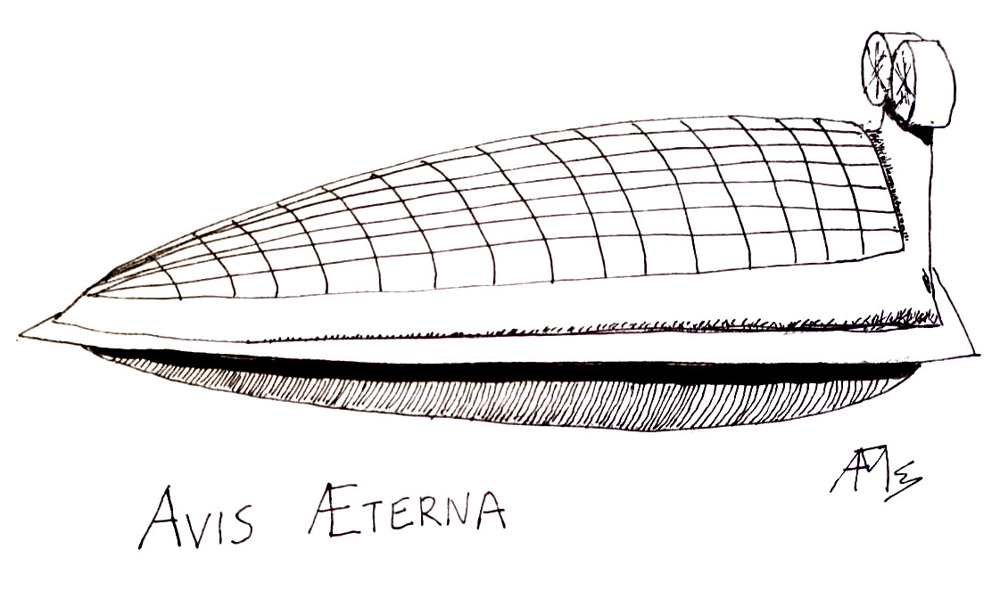
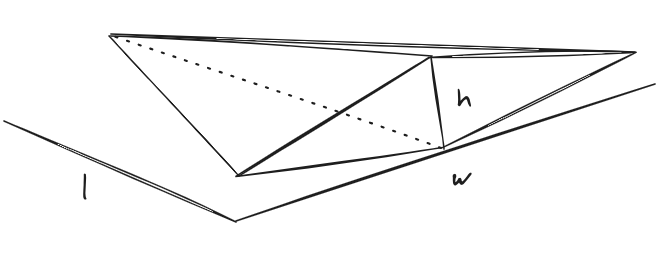

From the beginning of time people have wanted to fly.
Nowadays there are a multitude of flying machines,
from regular airline planes to helicopters and now drones.
And sometimes some blimps and ballons may appear like relics from the past.
But the amazing flying ships that appear in Miyazaki's movies have not materialized.
They never seem to have to touch down for fuel.

Some people have dreamt of air ships that stay in the air forever,
both for their inspiring qualities and for practical reasons like scientific missions or broadband service.
There are some promising approaches that are on the brink of permanent flight.
In this article we will explore the _avis æterna_,
a novel approach that might be able to fulfill the dream.



# 💡 The Idea

The time is ripe for a drone that can stay aloft indefinitely.
The common designs are a fixed wing airplane with solar panels during the day,
and batteries to store the energy at night.
There is a clear tradeoff that centers around the size of the batteries:
too big and it will require a lot of energy to fly,
too small and they will not last all night.
We are just waiting for sufficiently efficient solar panels and light enough batteries.

But other approaches can be explored.
[Atmospheric balloons](https://en.wikipedia.org/wiki/Weather_balloon) are known to stay aloft for days and even weeks.
We could build a plane which is made lighter by hydrogen,
which can also be used as fuel storage:
instead of being weighed down by batteries
it could be filled with hydrogen which makes it lighter.
Not lighter than air, but sufficiently lighter that it is easier to stay up.

Now, I am not an industrial engineer:
I studied physics and have been working with computers for a couple of decades.
But I like to explore if a concept is at least feasible from a physical point of view,
and if the technology is at least there.
In this article I will do some [Fermi estimations](/2023/climate-change-solutions#fermi-estimation)
to check if the parameters are at least in the right ballpark.
But don't expect detailed plans or a bill of materials;
this part will have to be undertaken by an enterprising soul with a lot more practical knowledge than I may have or hope to acquire.
So let's explore the idea together!

## Inspiration

The albatross is an amazing bird:
it only ever touches ground to mate on some remote island.
It is not clear if it ever rests in the sea where it is vulnerable,
but it seems that it can do everything in flight,
like [feeding and even sleeping](https://en.wikipedia.org/wiki/Albatross#Morphology_and_flight).

## Is It a Bird? Is It a Plane?

The Wikipedia article for [flight endurance record](https://en.wikipedia.org/wiki/Flight_endurance_record)
clearly separates records for airplanes (64 days), balloons (19 days) and airships (11 days).
So why not combine the three categories?

Hydrogen storage has the advantage that it can make our avis æterna lighter and easier to keep aloft.
No longer do we need to support its full weight with lift produced by its wings.
Since hydrogen gas has around
[7% of the density of air](https://www1.eere.energy.gov/hydrogenandfuelcells/tech_validation/pdfs/fcm01r0.pdf),
a hydrogen chamber will make the avis lighter.
But not necessarily lighter than air, which would make it an
[aerostat](https://en.wikipedia.org/wiki/Aerostat).
In fact, the avis can control its weight by expanding its hydrogen chamber.

I would think of it as the [swim bladder](https://en.wikipedia.org/wiki/Swim_bladder) of fish,
which allows them to control their buoyancy in water.

## 📝 Previous Designs

Facebook did an experimental plane once with the idea of bringing Internet connectivity to the unwashed masses.
[video](https://www.youtube.com/watch?v=D8Tm6tQdZ2I).

Airbus is the current record holder.

## Applications

# The Design

The idea

## Flying Wing

https://hackaday.com/2021/08/08/from-tube-and-wing-to-just-wing-the-future-of-airliners/
https://en.wikipedia.org/wiki/Flying_wing

## Challenges

### Extracting Hydrogen from Air

The core of our design is storing hydrogen molecules.

How can we lay our hands on those sweet H₂ molecules?

### Manipulating Hydrogen

### Propulsion

### Conquering Heights

The [Airbus Zephyr](https://www.airbus.com/en/products-services/defence/uas/uas-solutions/zephyr)
is a stratopheric plane: it flies at above 20 km (70k ft).
And so on for most of the competition.

There are a lot of advantages for flying high:
* Good weather: no storms in the stratosphere.
* Clear skies: no commercial flights.

But for the 

## 📏 Some Numbers

Let's do some Fermi estimations to see if the idea is feasible:
estimate the order of magnitude of each value and see if they match.

The total holding volume would be length by width by height,
multiplied by some factor `f` that depends on the actual shape:

```
V = f × l × w × h.
```

If the shape was a simple box the factor would be 1;
let us suppose that it is somehow shaped like a drop of water.
For a sphere the factor is around .523, or really close to one half,
so we can go with `f=½`.
Furthermore we can suppose that the width is similar to the length,
and that the height is around half the length. So we get:

```
V ~ l³/4.
```

With a sample length of 10m we get:

```
V ~ 250 m³.
```

How much weight can it lift?
A cubic meter of air weighs around [1.3 kg](https://www.earthdata.nasa.gov/topics/atmosphere/atmospheric-pressure/air-mass-density),
while if filled with hydrogen it drops to [70 grams](https://genh2hydrogen.com/blog/defining-hydrogen-from-a-to-z-3/).
Therefore every cubic meter will provide a lift of about 1.2 kg.
Total lift `L` when full of hydrogen will be:

```
L ~ V × 1.2 kg/m³
```

In our sample length of 10m:

```
L ~ 250 * 1.2 kg ~ 300 kg.
``` 

The total weight can be computed as a factor of size,
considering how the structure is constructed.
It is interesting to note that,
as in the blimps of old,
the interior of the avis can be completely empty:
we only need to consider its surface if it's rigid enough to self-sustain.
The total surface area `A` can be roughly computed as top, bottom and back of the wing.
If we follow the CyberTruck school of industrial design we can mock our structure as a low-polygon version,
as follows:
two triangles on top and bottom,
and a diamond at the back.



For our crude Fermi estimation we don't even need such sophistication:
the top and bottom structures can just be approximated by one triangle each,
and we will be within a factor 2 of the true value.
The back rhomboid is easy: just half the area of the rectangle.
On top of this we add 50% for safety:

```
A = A(top) + A(bottom) + A(back)
  ~ 1.5 * (2 * l * w / 2 + w * h / 2)
  ~ 1.5 * w * (l + h / 2).
```

Again with our 10m version:

```
A = 1.5 * 10 * (10 + 5 / 2) m² ~ 187 m².
```

Now the thickness and density of the material are tricky:
it needs to self-sustain but also to withstand air currents.
For a good approximation within the realm of possibility let's look at
[ultralight aviation](https://en.wikipedia.org/wiki/Ultralight_aviation):
in [this paper](https://www.academia.edu/download/59306166/141_Design20190518-103303-1n8ai2h.pdf) 
we find a wing with an area of 14 m² and a weight of 50 kg,
or an areal density of 3.5 kg/m².
If we extrapolate to our area:

```
W ~ 3.5 kg/m² * 187 m² ~ 700 kg.
```

We can consider this number as an upper limit since an ultralight plane has to withstand much bigger forces than the avis.
For a lower limit we can turn to the more experimental
[Sandlin GOAT](https://www.nestofdragons.net/rigid-wings-overview/non-footlaunch-listing/goat/)
with a wing area of 16 m and weight of 16 kg for a much more reasonable areal density of 1 kg/m².
This would give us:

```
W ~ 1 kg/m² * 187 m² ~ 200 kg.
```

This weight could be self-supported by the lift,
with 100 kg to spare for the payload.

Solar power will depend on the top area of the wing `A(top)`,
and the areal power of the solar cells used.
We can very roughly approximate the top area as a triangle:

```
A(top) ≈ l * w / 2 ≈ l² / 2.
```

The Zephyr uses [MicroLink arrays](https://www.prnewswire.com/news-releases/microlink-devices-powers-successful-stratospheric-flight-of-airbus-defence-and-space-zephyr-s-haps-solar-aircraft-300732214.html)
with a yield "greater than 350 W/m²".
If the top surface is completely filled with solar cells this gives:

```
P = 350 W / m² * A(top) ~ 350 W/m² / (l² / 2).
```

So for instance with `l=10m` we get:

```
P ~ 350 W/m² * 50 m² ~ 17.5 kW.
```

Again MicroLink says that their specific power is more than 1500 W/kg,
so the total weight of the solar cells would be:

```
W(solar) ~ 17.5 kW / (1500 W/kg) ~ 12 kg.
```

I would say this is very reasonable.

### Hydrogen Generation

First we have to extract water from the atmosphere,
then we need to convert it to pure hydrogen gas.
At atmospheric pressure hydrogen weighs 70 grams per m3, as we saw above;
the full weight of hydrogen for the complete interior of the avis `W(h2)` will be:

```
W(h2) = V * 70 g/m3.
```

For our sample 10m length:

```
W(h2) = 250 m3 * 70 g/m3 = 17.5 kg.
```

How much water do we really need?
[About 18 times more](https://chem.libretexts.org/Ancillary_Materials/Exemplars_and_Case_Studies/Exemplars/Biology/Atomic_Weights_and_Water).
In our case:

```
W(water) = 18 * W(h2) ~ 18 * 17.5 kg ~ 315 kg.
```

Now that is a lot of water!
We can extract water from thin air as we need it,
using an
[atmospheric water generator](https://en.wikipedia.org/wiki/Atmospheric_water_generator).
But these things are huge and costly.
Just for the sake of argument,
let's look at
[this device](https://time.com/75612/atmospheric-water-generator-watergen/).
Generating one liter of water (around a kg) takes 310 watt-hours,
so for each kg of hydrogen it would take 18 times more:

```
P(kg) ~ 18 * 310 Wh ~ 5.5 kWh.
```

Next we need to extract the hydrogen from the water.
The [industrial efficiency](https://en.wikipedia.org/wiki/Electrolysis_of_water#Industrial_output)
using electrical energy is at around 55 kWh per kg of hydrogen generated.
Adding the 5 kWh to extract the water first from the atmosphere
we get 60 kWH per kg of hydrogen.

In our standard 10m design we computed that we can count on 17.5 kW from the solar cells,
so we can generate one kg of hydrogen every 3.5 hours.
As we saw above filling its 250 m3 volume would take 17.5 kg at atmospheric pressure,
and could be filled in ~ 60 hours of continuous operation.

# 🤔 Conclusion


## 🙏 Acknowledgements

Thanks to Carlos Santisteban for so many fruitful discussions.

