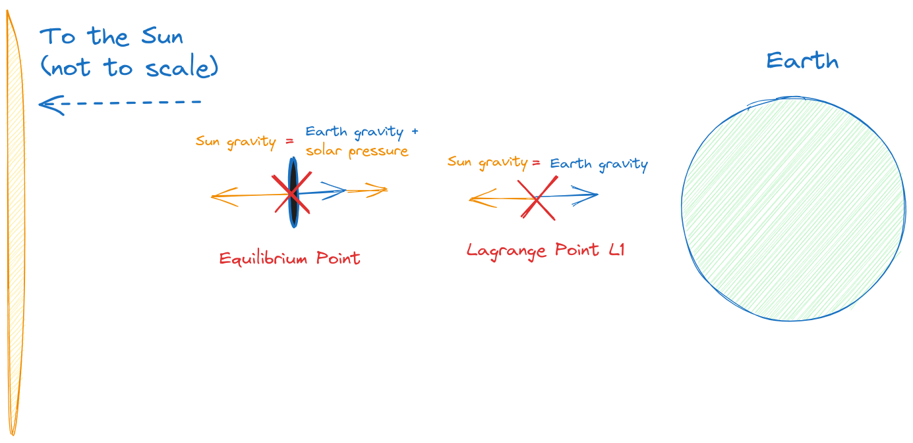
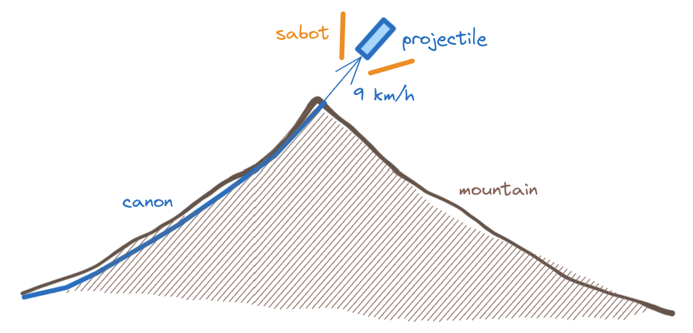

Climate change is upon us,
and we want to [do something about it](/2023/climate-change-solutions).
We already saw that we could
[plant some trees](/2023/climate-change-trees)
or install [mirrors on your roof](/2023/climate-change-roofs).
Are we only going to present boring low-tech ideas?

# 🛰️ Send Screens to Space

Let's now go for the most egregious of the ideas presented here,
and also the most entertaining.
How about sending a giant shade to the sky between the Earth and the Sun?
This might seem like a little kid's idea of how to cool the Earth;
but real astronomers and physicists have entertained the idea.

Roger Angel published a [fascinating paper back in 2006](https://www.pnas.org/doi/full/10.1073/pnas.0608163103),
complete with cost analysis of the project.
You can read about this "giant space umbrella"
on the [BBC](https://www.bbc.com/future/article/20160425-how-a-giant-space-umbrella-could-stop-global-warming),
although I encourage you to go the original article
because the scale of it is really mindblowing.
Total cost would be a few trillion dollars:
considerable, but worth it if we are saving the planet from an impending catastrophe.
For comparison, the whole Apollo program that put several people on the Moon
cost [around 200 billion dollars](https://christopherrcooper.com/apollo-program-cost-return-investment/) in today's money.

Angel gives a new twist to the giant space umbrella.
Instead of sending one big structure,
he proposes sending trillions of small screens to the
[L1 Langrange point](https://en.wikipedia.org/wiki/Lagrange_point),
which is at equilibrium between the Sun and the Earth.
They would need complex mechanisms to stay in place,
and guiding mechanisms to direct them as needed to increase or decrease the effect.
They would not be seen from Earth since they would sit at a large area roughly comparable to the section of the Earth;
we would just feel less heat than usual.
How much less heat?
Let's estimate it!

## ⚡ Efficiency

We will try to replicate the computations on the paper with our own Fermi estimations,
and then check out how we did.

As always, we will divide the problem into simpler parts:
the number of screens `n(screens)` and
the area of each screen `A(screen)`
will combine to the total area of sunlight blocked `A(screens)`,
considering negligible overlap between them:

    A(screens) ≈ n(screens) × A(screen).

If we consider that sun rays are basically parallel at the L1 point,
the proportion of sunlight blocked `p(screens)` will equal the area of the screens divided by the disc of the Earth,
`A(screens)/A(disc)`,
multiplied by a constant factor that reprensents the average opacity of each screen: `o(screen)`:

    p(screens) = p(screen) × A(screens) / A(disc).

Finally we estimate the temperature difference caused by the screens.
Luckily, we already did the estimation for our
[mirror roofs](/2023/climate-change-roofs)!
The decrease in temperature will be grossly equal to the proportion of sunlight blocked we just computed,
multiplied by the current temperature of the Earth `T(Earth)`.
In equations:

    ΔT(screens) ≈ T(Earth) × p(screens).

We can expect approximately a 3 degree Celsius reduction in temperature for every 1% of sunlight we block.

Now we will take the same approach as when [planting trees](/2023/climate-change-trees):
instead of computing the effect for a given set of screens,
we start with the desired temperature change,
and work out how many screens of a given area we need.

### 🥶 Expected Cooling

Our friend Roger Angel sets a target reduction of 1.88 K in temperature.
We will start with 3 kelvins (or equivalently, 3 degrees Celsius) and work back from there:

    ΔT(screens) = 3 K.

Then:

    p(screens) ≈ ΔT(screens) / T(Earth) ≈ 3 K / 300 K ≈ 1%.

So we need to block one percent of the radiation coming from the Sun.
This amount will probably not be noticeable from the Earth without sophisticated apparatus,
so it should not have a big effect on people or on life on our planet.

### 🕶️ Number of Screens

Now let us see how many flying screens we need.
First let's find out the area covered by the screens.
As we saw above:

    p(screens) = o(screen) × A(screens) / A(disc),

therefore:

    A(screens) = p(screens) * A(disc) / o(screen).

The area equals the proportion of sunlight blocked by the screens multiplied by the disc of the Earth
and divided by the opacity of each screen.
Therefore we can start by estimating the opacity of each screen `o(screen)`.
The proportion of sunlight blocked will depend on where the screens are installed.
We can consider that the L1 point is much closer to Earth than to the Sun,
so that the rays of light are almost parallel.
Still, some shade will be lost since it will not be a perfect block,
and some light will be diffused back to Earth.
Let's estimate that each screen will stop half the energy coming to Earth:

    o(screen) = 1/2.

We also need to know the area of the disc of the Earth,
just our old friend π (_pi_) multiplied by the square of the radius:

    A(disc) = π × R(Earth)^2 ≈ π × (6300 km)^2 ≈ 100 × 10^6 km².

Approximately 100 million square kilometers.
We are ready now to compute the total area covered by the screens:

    A(screens) ≈ 1% * 100 * 10^6 km² / ½ ≈ 2 * 10^6 km².

Total area is approximately 2 million square kilometers.
If every flying screen has an area `A(screen)` of 1 square meter:

    n(screens) = A(screens) / A(screen) ≈ 2 * 10^6 km² / (1 m²) ≈ 2 * 10^12.

So we need 2 trillion flying space robots.
Not bad!

## 🧮 How Did We Do?

Now is the time to check the numbers in the original article:
it specifies 16 trillion flying space robots,
each with an area of 1 square meter.
We however estimated 2 trillion, or almost 10 times smaller.
Within one order of magnitude, but barely!
Where did we go wrong?

### ☀️ Radiation Pressure

We overlooked one important effect:
if our screens are opaque as we have considered,
the trapped light would make them fly away quite fast from the L1 point due to radiation pressure,
being directly exposed to sunlight.
This is without even considering the possibility that the screens would melt due to the absorbed heat.
We could try to use reflective surfaces,
but then the push from all those photons being reflected would be even more significant.
In any case our screens would need to be further away from the L1 point to be more or less stable.

How much more far away do we need to place them?
Perhaps twice or three times further away from the Earth,
making them less effective at blocking sunlight.

Another solution is to make the screens thicker,
which increases the weight over the practical limit.
Our friend Roger Angel takes this effect into account,
and proposes transparent screens that just deflect light only so slightly.
This increases the area required to around 5 million square kilometers,
approximately three times as much as we estimated.

In fact, an updated version of the scheme
[by Borgue and Hein](https://www.sciencedirect.com/science/article/abs/pii/S0094576522006762)
seems to be OK with sending much less stuff up there,
but the article is paywalled so I cannot say exactly how much area they are covering.

### 🌡️ Reduction of Temperature

Our favorite article also cites a
[study by Govindasamy and Caldeira](https://agupubs.onlinelibrary.wiley.com/doi/pdfdirect/10.1029/1999GL006086)
which estimates that a 1.8 K decrease in temperature would require a reduction in solar flux of 1.8%,
not 0.6% as we estimated.
I'm not sure which is the correct factor here;
some of the projects mentioned in Wikipedia as
[space sunshades](https://en.wikipedia.org/wiki/Space_sunshade)
seem to be closer to our estimate.
I have not found a clear answer in the literature either after a quick look.

I'm under the impression that this point requires complex modelling to get a clear answer.
The correct amount of reduction needed is probably between our 0.6% and Angel's 1.8%,
so perhaps our Fermi estimate was not so far off.
Let us use a compromise value of 5 trillion screens from now on.

## 😎 The Screens

We come to another interesting point:
the design of the screens themselves.
Angel sets a target weight of one gram for them,
increased a bit for navigation and communication.

### 🏭 Building the Screens

We might as well face first the issue of manufacturing such small sun screens themselves,
or "flyers" as our visionary astronomer calls them.
He concedes that there are big engineering challenges in the building of a 1 square meter space flyer that weighs a few grams,
is an autonomous spacecraft and can be controlled from a bigger space station.

.](pics/climate-change-car.jpg "A small sun shade installed on the window of a car. It has lots of small holes and diverts a high proportion of incoming sunlight.")

The price tag is not going to be cheap.
Also the economies of scale are inimaginable right now,
so it makes no sense estimating a unit price for the screens.
We can just imagine that we will need thousands of factories and millions of production lines
cranking out billions of screens day and night:
if we built one million of screens per second it would take us 50 years to manufacture 5 trillion screens.

But if the health of our planet is at stake,
we should definitely face these challenges!
This is after all how engineering moves ahead:
by tackling big challenges.
After all, who would have thought 20 years ago that by 2023
we would have a 6-meter wide space telescope orbiting the L2 Lagrange point
that can view infrared light from the earliest galaxies?

### ☄️ Sending Stuff Up There

Speaking of which, we come to the most interesting part:
how can we send 5 trillion sun screens up in the sky?
The answer is: space cannon.

Angel wants to build a huge space launcher,
also called space cannon or Gauss gun in the literature;
when using it to launch projectiles also called
[mass driver](https://en.wikipedia.org/wiki/Mass_driver).
In essence it is just a big tunnel with many magnetic coils so that a projectile is accelerated using electromagnetic forces.

Luckily we have already explored [how to build a space launcher](/2018/building-space-launcher)
a few years ago,
so we only need to go over the basics.
It is a long tunnel surrounded by magnetic coils that are charged with electric currents,
and that propel a projectile when discharged.
These projectiles will leave the tunnel at a speed that can be close to escape velocity (11 km/s),
so they will leave our planet straight away;
or they may still need a small push by an integrated rocket.

The design in his article is 2 kilometer long.
I think this is too ambitious, and my own design calls for a 28 km long tunnel,
but he probably knows better.
If we can accelerate above 150g,
and if the material of the armature can withstand the magnetic pressure,
then a shorter design will of course be cheaper and more feasible.
But keep in mind that a longer tunnel built on a mountain skips a large part of our atmosphere,
and also reduces drag on the exiting projectile.

There are other design parameters which are surprising:
a projectile of just three tons and with an exit velocity of more than 12 km/s.
It might heat too fast while inside the tunnel,
plus the heating of travelling through the atmosphere at such high speeds might melt it down,
especially if it exits the tunnel at low altitude where the atmosphere is still dense.
I contend that a 10-ton projectile can use some of that extra mass
to hold a rocket that can take the payload to low Earth orbit (LEO).
My proposed exit velocity of 9 km/s does not require a lot of further acceleration.

In any case the concept is too cool to not be done:
a big gun launching satellites to space!
Many simulations and scale models will have to be built to validate any proposed designs,
and to fine-tune the working parameters.

## 💊 Side Effects

Are there any downsides to this megalomaniac project?
As could be expected, yes.
For instance [this article](https://phys.org/news/2022-12-climate-block-sun-lightweight-solar.html)
cites a reduction in rainfall of 5%, although I don't see any sources that justify it.

We can also ask where are we going to get the electricty to throw so much stuff to space.
I will not estimate the amount of energy necessary because my head is already hurting,
but it's **a lot**.
Ideally we will generate it using renewable sources, or nuclear energy,
with very limited carbon emissions.

A more philosophical disadvantage is that just reducing sunlight might make us want to contaminate even more,
once we have dodged the worst effects of climate change,
instead of going back to more sustainable energy sources.
This needs to be very clear: blocking sunlight is a stopgap measure,
not a permanent fix.
Excess CO₂ in the atmosphere has serious chemical consequences apart from trapping heat.

# 🤔 Conclusion

In this installment we have explored an outlandish concept:
while in [planting trees](/2023/climate-change-trees) we saw a very doable (if ambitious) project,
and in [mirror roofs](/2023/climate-change-roofs) a more experimental approach,
here we are dealing with many technologies that have still to be invented.
There is no guarantee that the project will give fruits in time or within budget.

Still, it is worth investigating in new directions that expand our engineering and technology,
especially when the health of our wonderful planet is at stake.
Isn't something like carbon capture more promising?
Not really; we already have plants and algae that can remove CO₂ from the atmosphere,
and they work beautifully.
There is also the perils of the [Jevons paradox](https://en.m.wikipedia.org/wiki/Jevons_paradox):
we keep burning stuff just because someone else will take care of the side effects.
Not a good long-term strategy.

Being able to cover the Sun partially can give us some temporary relief
from the worst of the temperature changes that are to come,
and can give us a promising start in the field of planet engineering.
Keep in mind that it will be at most a temporary mitigation strategy
to avoid making the planet inhabitable.
The only valid long term solution must include:

* stop burning fossil fuels and turn to renewable and nuclear energy,
* and remove excess CO₂ from the atmosphere using [trees](/2023/climate-change-trees) and algae.

## Acknowledgements

Thanks to [Juan Luis](https://social.juanlu.space/@astrojuanlu) for the mention of
the [Jevons paradox](https://en.m.wikipedia.org/wiki/Jevons_paradox).

# ⏭️ To Be Continued

This is the fourth part of the series about climate change:

* Part 1: [🥵 Some Solutions to Climate Change](/2023/climate-change-solutions),
* Part 2: [🌲 Climate Change: Planting Trees](/2023/climate-change-trees),
* Part 3: [🪩 Climate Change: Mirror Roofs.](/2023/climate-change-roofs),
* Part 4: 🛰️  Climate Change: Space Screens.

To be continued!

