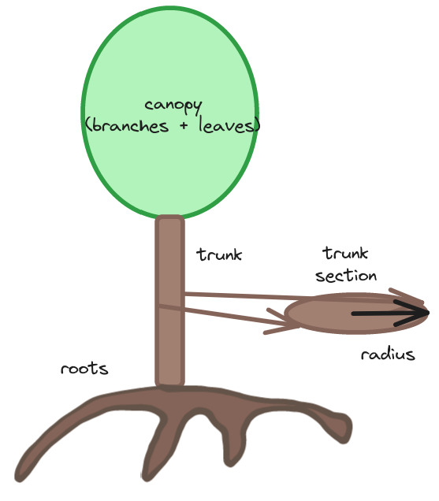

.](pics/climate-change-temperatures.svg "Temperatures are rising already. World map comparing average temperatures 1956-1976 with 2011-2021 and going with the lower intervals: -0.5C in a small portion of the Anctartic, 0 in the South seas and near Iceland, +0.2 in 1/3 of the oceans, +0.5 in most of the remaining oceans, +1 in most land areas, +2 in the Arctic.")

The world is overheating.
This is not opinion, this is a fact that can be measured by satellites.
You don't even need high tech:
it can be verified by anyone with
[thermometers and old notebooks](https://en.wikipedia.org/wiki/Instrumental_temperature_record).

What can we do about it, and should we do anything?
It is too easy to be paralized by the possible consequences and just leave the responsibility to someone else.
But there are solutions that can be implemented in the next decades.
Public perception is always the first step to solving public problems.
We will analyze here a few options that can help mitigate or even reverse the worst part of the incoming crisis.

# 🌡️ Is It Real?

First we would have to agree on the causes,
and as you may know there is a huge debate in our polarized society.
Not in scientific circles though.
Some 35 years ago I read
[Asimov's Guide to Science](https://en.wikipedia.org/wiki/The_Intelligent_Man%27s_Guide_to_Science)
by the great Isaac Asimov, probably the 1972 or 1984 Spanish edition.
When describing the Earth's atmosphere he had these words:

> Carbon dioxide absorbs infrared radiation rather strongly. This means that when there are appreciable amounts of it in the atmosphere, it tends to block the escape of heat at night from the sun-warmed earth. The result is that heat accumulates. On the other hand, when the carbon dioxide content of the atmosphere falls, the earth steadily cools.

> If the current concentration of carbon dioxide in the air should double (from 0.03 per cent of the air to 0.06 per cent) that small change would suffice to raise the earth’s over-all temperature by three degrees and would bring about the complete and quick melting of the continental glaciers. If the carbon dioxide dropped to half the present amount, the temperature would drop sufficiently to bring the glaciers down to New York City again.

> Whatever the cause of the ice ages may have been, it seems now that man himself may be changing the climate in store for the future. The American physicist Gilbert N. Plass has suggested that we may be seeing the last of the ice ages, because the furnaces of civilization are loading the atmosphere with carbon dioxide. A hundred million chimneys are ceaselessly pouring carbon dioxide into the air; the total amount is about six billion tons a year 200 times the quantity coming from volcanoes. Plass pointed out that since 1900 the carbon dioxide content of our atmosphere has increased about 10 per cent. This addition to the earth’s “greenhouse” shield against the escape of heat, he calculated, should raise the average temperature by about 1.1 degrees C. per century. During the first half of the twentieth century the average temperature has indeed risen at this rate [...]

These quotes come straight from the [1960 edition](https://archive.org/details/intelligentmansg0000unse/page/120/mode/2up),
and in later editions they are very similar.
Human-caused global warming is not a new theory invented by George Soros;
it is just a trivial extrapolation.
If we look at the concentration of carbon dioxide in the atmosphere as measured in the Mauna Loa observatory,
far from all sources of industrial contamination,
the trend could not be more worrying.

.](pics/climate-change-dioxide.gif "Data from the Mauna Loa Observatory: concentration in parts per million was ~310 in 1960, ~340 in 1985 and ~380 in 2010.")

It is highly likely that lowering CO₂ would help alleviate global warming
and other effects of climate change.
So let us see if we humans can do something about it
using some engineering and a great deal of ingenuity.

# 🧑‍🔬 Some Solutions

Right now there is no single solution to climate change,
and probably we will have to use many of them if we are to survive our own trap.

Now, before we start, let's be clear.
The first measure to mitigate climate change should be to **stop burning stuff**;
until we do, everything we do to mitigate the effects of carbon dioxide in the atmosphere
will be made more difficult by the incoming gasses.
But even if we stopped tomorrow and switched to 100% green energy
(a mix of solar, wind, hydro and nuclear)
there's the little matter of what we do with all the carbon dioxide already in the atmosphere.

We will review some solutions that can be found in the literature,
and even some that anyone can think of,
ranking them from more pedestrian to wildly out there.
We will try to understand how much they help,
and also if they have any side effects.

## 🎚️ Fermi Estimation

To gauge the impact of each solution we will use a method attributed to Enrico Fermi:
[Fermi estimation](https://what-if.xkcd.com/84/).
The great physicist said that he could estimate any physical problem in a napkin by a factor of one order of magnitude,
that is: his answer would not be exact but should be between 10 times and one tenth of the correct solution.
It is legendary his measurement of the energy of the first atomic bomb by dropping pieces of paper
as it detonated and measuring their displacement in the air.

The method as we will apply it is simply to take an approximate estimation for each value,
within an order of magnitude (between 10 times and 1/10th),
and combine them in simple ways (basically addition, subtraction, multiplication and division).
The solution will tend to the real value as long as errors are more or less distributed uniformly,
i.e. sometimes we are above, some times we are below.

We will try to do the same with the ideas below to see if they would help.
We don't need complicated climate models to get a rough idea of each method;
even if we are off by 100% we will know if our solution should more or less work.
Of course, we should go with the complicated models before investing real money in the idea.
Also it is a good idea to check with independent sources whenever possible.
But this process of estimation is a big part of the fun!

Let's begin.

## 🌲 Lots of Trees

The first solution can be a bit disappointing:
planting lots of trees.
I am sure you were looking for clever carbon-capture devices
that could turn the tide and suck all that carbon out of the skies,
using modern technology.
Problem is, none of it works properly.

Meanwhile Mother Nature has created these wonderful machines
that have evolved during millions of years to become better at basically one thing:
convert CO₂ to carbon in their trunks.
In the process they also generate sugars, create seeds and deter hungry animals,
but these are secondary interests.

Just how many trees can we realistically plant in the world?
Many areas are already covered in forests; others are deserts.
Of the remaining areas, many are used for growing food;
there are also cities and roads.
We can of course plant trees in many of these places:
as hedges of fields,
in our streets,
even as vertical gardens in buildings.

Some studies (e.g.
[this one]())
say that a trillion (10^12) trees are feasible.
Note: throughout the article I'm using US billions (10^9, or a thousand millions)
and trillions (10^12, or a million millions).

The publications
[CNN](https://edition.cnn.com/2019/04/17/world/trillion-trees-climate-change-intl-scn/index.html).
[decade](https://www.independent.co.uk/climate-change/news/forests-climate-change-co2-greenhouse-gases-trillion-trees-global-warming-a8782071.html)
when in reality it could wipe out all the excess carbon.
I suspect that the difference stems from the confusion between
tons of CO₂ and tons of carbon.

[Trillion trees](https://trilliontrees.org/).
[Trillion trees](https://www.plant-for-the-planet.org/trillion-trees/).
[World Economic Forum](https://www.weforum.org/agenda/2020/01/one-trillion-trees-world-economic-forum-launches-plan-to-help-nature-and-the-climate/).

Another very interesting possibility is using algae,
which are more efficient because they already have all the water necessary in their surroundings.
These techniques are very likely more difficult to implement than just planting trees,
and can have other side effects.
So we will focus on trees.

### ⚡ Efficiency

We will divide the problem into three simpler steps:
find out total excess carbon in the atmosphere `T(C)`,
how much carbon each tree can absorb `m(C)`,
and the number of trees `N(trees)`.
Our problem will be solved when we plant enough trees to absorb all of the excess carbon in our atmosphere,
in equations:

    T(C) = m(C) × N(trees),

or solving for number of trees:

    N(trees) = T(C) / m(C).

That's it!
Problem solved, Earth saved.

#### 🛢️ Total Excess Carbon

First let's estimate the total amount of excess carbon in the atmosphere.
If we look at the [data from Statista](https://www.statista.com/statistics/276629/global-co2-emissions/),
there is a more or less steady linear increase from about 1943 to 2021.
(Yes, emissions are still increasing.)
Latest numbers are 37 billion metric tons of CO₂.
Say we have a completely linear graph from 1940 to 2020 (80 years),
the total of carbon emissions would be something like the number of years multiplied by the midpoint:

    T ≈ 80 × 40 / 2 GtCO₂ ≈ 1600 GtCO₂.

Remember, for now we don't have to get an exact number,
just a rough estimation,
so we can round our numbers to make them easier to deal with.
Let's convert to the international system,
remembering that the prefix _giga_ means 10^9 and a ton is just a million grams:

    T(CO₂) ≈ 1.6 × 1000 × 10^9 × 10^6 g ≈ 1.6 × 10^18 g.

How much carbon is that exactly?
A molecule of CO₂ has one atom of carbon (C) with atomic weight 12 and two O's each with atomic 16;
the total portion of carbon is thus 12/(12+16+16) ≈ 27%:

    T(C) ≈ 0.27 × 1.6 × 10^18 g ≈ 0.4 × 10^18 g.

So a little bit under half a million million million grams.
The official name is "half an exagram",
although we can call it more familiarly "half a teraton",
which has more punch.
Some part of that has by now been absorbed by the oceans and other natural processes,
but most of it remains there.
Good! We are getting there.

#### 💎 Carbon per Tree

Now let's estimate how much carbon can we store in a tree.
Let's assume an average 4 meter tall tree, with a trunk radius of 25 cm;
this gives us a volume of:

    V ≈ π × 0.25 × 0.25 × 4 m³ ≈ 0.75 m³.

How much does each tree weigh?
Wood has a density similar to water (some woods float, others don't),
which is 1 kg per liter (a cube with sides of 10 cm), so our average tree trunk will weigh:

    m(tree) = d × V ≈ 1 kg / 0.001 m³ × 0.75 m³ ≈ 750 kg.

But the tree also has branches and leaves and roots;
we can estimate that the trunk is just half the total weight,
which is probably
[not that far off](https://www.researchgate.net/figure/Proportion-of-the-tree-biomass-from-the-trunk-the-branch-the-leaf-and-the-root-in_fig12_299376027).

Therefore we will have twice as much mass in the whole tree as in the trunk:
around 1.5 metric tons.
But only around
[half of the tree](https://web.extension.illinois.edu/askextension/thisQuestion.cfm?ThreadID=19549&catID=192&AskSiteID=87)
will be carbon,
so we will stick to 750 kg of carbon per tree,
close to a metric ton,
or a bit under a million grams:

    m(C) ≈ 0.75 × 10^6 g.

How close are we to official estimations?
Well, taking Spain as an example:
there are [seven billion trees](https://www.uab.cat/web/newsroom/news-detail/spain-has-close-to-seven-billion-trees-1345668003610.html?noticiaid=1345689513075),
which together store [422 million metric tons of carbon](https://rainforests.mongabay.com/deforestation/2000/Spain.htm);
each tree will hold

    m(C)' = 422 * 10^6 mt / 7 * 10^9 = 0.060.

Around 60 kg per tree, below an order of magnitude.
Keep in mind that every tree above 75 mm of diameter is counted in the above inventory,
while we are considering mature 4 meter tall trees.

#### 🌳 Number of Trees

Finally, can we plant enough trees?

As we saw at the beginning,
to remove all excess carbon from the atmosphere we need a grand total of:

    N(trees) = T(C) / m(C) ≈ 0.4 × 10^18 g / 0.75 × 10^6 g ≈ 0.5 × 10^12.

Or around half a trillion trees.
Is this possible at all?

Many studies have looked at this question.
We will just do our own Fermi estimation.

Let's take first Spain as an example.
With a [total area](https://en.wikipedia.org/wiki/Spain)
of roughly half a million square kilometers
it has a good forest cover of
[over 30%](https://rainforests.mongabay.com/deforestation/2000/Spain.htm);
another ~30% is [arable lands](https://prepsoil.eu/soil-threats-in-eu/agricultural-land-in-spain);
the rest is pastures, mountains, cities, roads and arid lands.

Let us suppose we can cover this 30% with trees every 10 meters.
(A bit [dense but not uncommon](https://hort.ifas.ufl.edu/woody/spacing.shtml).)
After all, according to legend [Strabo wrote](https://earth.org/deforestation-in-spain/)
that a squirrel could cross Spain from Gibraltar to the Pyrennes without touching the ground.
A grid of trees spaced 10 meters would yield 100 × 100 = 10000 trees per square kilometer.

 trees lining a street in Madrid.")

The total for Spain would be:

    N(Spain) = 30% × A(Spain) × n(km²) ≈ 30% × 500000 × 10000 ≈ 1.5 × 10^9.

We could plant a little over a billion trees.
How much carbon is that?

    T(Spain) = N(Spain) * m(Spain) ≈ 1.5 * 10^9 * 0.75 mt,

equivalent to around 1 gigaton of carbon.
Again, let us check with official sources if our estimations are off the mark.
Spain's forests contain [422 million metric tons of carbon](422 million metric tons of carbon)
in 36% of the surface;
it seems ambitious to store 1 gigaton in the remaining 30%.
But not all is lost!
According to the [Copernicus project](https://land.copernicus.eu/global/sites/cgls.vito.be/files/use-cases/CGLOPS_UC_AgrestaSCoop_I1.00.pdf),
Spanish forests store overall around 2.5 gigatons of carbon;
four times more below the ground than in the trees themselves.

Now let us replicate our reforestation project to the whole world.
Total land area is around
[150 million km²](https://www.cia.gov/the-world-factbook/static/6c4d9b9a41b27707b6720720df7161d6/Physical_World.pdf);
using the same proportion we would get:

    N(world) = 30% × A(world) × n(km²) ≈ 30% × 150 × 10^6 × 10^4 ≈ 0.45 × 10^12.

Almost exactly our half a trillion trees!
Very roughly our project should be feasible.

As we saw above, each tree trunks would have a volume of around 1.5 m³.
All these trees would make up a cube with sides of approximately 9 km:

    V(world) = N(world) * V(tree) ≈ 0.5 × 10^12 * 1.5 m³ = 0.75 * 10^12 m³ ≈ (9 km)³.

[Project Drawdown](https://drawdown.org/solutions/table-of-solutions)
has a number of projects related to forests,
[tree plantations](https://drawdown.org/solutions/tree-plantations-on-degraded-land)
accounting for 22 gigatons of CO₂.

### 💊 Side Effects

The side effects of planting a lot of trees are generally very nice:
having a lot of trees.
They cool the surroundings,
help fixate the ground and provide a living environment for other creatures.
In cities they lower the temperature of a street by at least five degrees in summer.

There's the matter of albedo (or proportion of sunlight reflected):
trees are generally darker than rock,
and therefore can negate some of the benefits of carbon capture by absorbing heat.
But this is a 

Also, what do we do with all that carbon once it is stored in trees?
If we just leave it there then there is a limit to the carbon taken from the atmosphere;
and it might burn at some point getting us back to the starting point.
What can we do with a cube of side 9 km?
One possible extension of the program might be to mow down trees from time to time and dispose of them,
for example by burying them or throwing them into the sea.
It might be a challenge to find trenches deep enough to bury so much wood though.

The [Mariana Trench](https://en.wikipedia.org/wiki/Mariana_Trench)
is 11 km deep,
so maybe we can dump a teraton of wood down there?
To be fair it would not be nice to the existing ecosystems;
there are bacteria and even fascinating
[giant amoeba](https://www.latimes.com/archives/blogs/nation-now/story/2011-10-26/giant-amoeba-found-in-mariana-trench-6-6-miles-beneath-the-sea)
10 cm big.
But we are trying to prevent a giant ecological catastrophe here,
so all things considered it may be worth it.
The trench is about 2550 km long so not everything needs to go into the deepest point.

Maybe we can even convert them into furniture and store them in our homes!
With [2 billion households in the world](https://en.wikipedia.org/wiki/List_of_countries_by_number_of_households),
storing half a metric ton of carbon per house would clear around one gigaton of carbon.
Not much, but every bit helps.
There are many things that we can do with cheap wood.
Perhaps the world would start using more for construction,
[like in the US](https://www.thehousedesigners.com/articles/how-many-trees-does-it-take-to-build-a-house.asp).
I'm sure I'm not alone in wanting to have more things built of this noble material.

## 🪩 Mirror Roofs

Our second solution involves a little bit of creativity.
Since the Earth is heated mainly by the Sun,
why not divert some of that heat back to space?

Instead of installing dark roofs,
like roofing tars,
we may use a reflective cover.
Apart from cooling the building itself,
it will send those pesky infrared radiations back to space where they belong.
It doesn't even need to be a proper mirror,
just some kind of surface that reflects light in the infrared spectrum.
We don't need an expensive [gold foil](https://webb.nasa.gov/content/observatory/ote/mirrors/index.html);
just [aluminium foil](https://osb.westfraser.com/wp-content/uploads/2017/05/The-Physics-of-Foil.pdf)
is a good mirror for infrared light.

.](pics/climate-change-mirrors.jpg "A building made with lots of shiny mirror surfaces on the outside.")

Getting an international agreement for roof mirrors would probably not be easy.

### ⚡ Efficiency

Let us estimate how much would roof mirrors affect the Earth's temperature.
Again, we divide the problem into simpler estimations:
how much area of mirrors we can place on buildings `A(mirror)`,
what percentage of the Earth surface we can cover `p(mirror)`,
and how much would they affect the temperature of the planet
`ΔT(mirror)`,
where the capital delta `Δ` represents the difference.

#### 🪞 How Many Mirrors

Each person on Earth occupies perhaps 10 square meters of space.
In cities it is much less (since we live in buildings);
in villages it is likely bigger.
But we also use offices and malls,
community buildings and stadiums,
museums and palaces;
so this estimate is very likely on the low side;
all in all we might use perhaps 100 m².
How many square meters of roofs do we use?
Let's say it is equivalent to 100 square meters.

7 billion people will occupy 700 billion square meters.
But what really interests us is the % of total surface.
Converting to square kilometers:

    1 km² = 1000000 m²,
    A(buildings) ≈ 700 * 10^9 m² * 1 km² / 10^6 m² = 700 000 km².

Given that the Earth has
[500 million km²](https://www.cia.gov/the-world-factbook/static/6c4d9b9a41b27707b6720720df7161d6/Physical_World.pdf)
including the oceans,
we have at our disposal well below 1% of the total surface of the planet.

    p(buildings) ≈  700 000 km² / 500 000 000 km² ≈ 0.14%.

This doesn't seem enough.
We have to turn to other sources:
perhaps consider all human-made structures.
Add roads and other pavimented surfaces and we can perhaps push it to 0.20%.

Let us check this estimate with independent data.
According to NASA urban regions cover
[0.2% of the Earth's land surface](https://www.nasa.gov/vision/earth/environment/urban_effects.html).
According to the
[Food and Agriculture Organization of the UN](https://www.fao.org/uploads/media/glc-share-doc.pdf),
artificial surfaces cover 0.6% of the land surface.
For the total surface we have to multiply by the proportion of land surface,
or 150 / 500 million square km:

    p(artificial) ≈ 0.6% * 150 / 500 ≈ 0.18%.

Our prediction was not bad at all!

#### 🥶 Expected Cooling

How much would 0.2% of mirror surfaces affect our temperature?
A very rough first estimate is based on this idea:
apart from internal geothermal energy,
the Earth gets most of its heat from the Sun,
most of it from infrared light.
To begin with let us say that we can reflect half the heat out to space.
Our little project would reflect 0.1% of the heat.

To ease our task we will work in Kelvin degrees (or kelvins),
which are degrees above absolute zero.
This [answer from StackExchange](https://earthscience.stackexchange.com/questions/9210/what-is-the-current-equilibrium-surface-temperature-of-earth-i-e-without-the-s)
calculates that the Earth's temperature would drop to 35 K without our Sun.
Right now it is around 300 K,
so we can assume that the Earth gets around 300 K from the Sun,
and it is linear:
reducing sun heat by 1% would cool the Earth by 3 K (or 3 C).

If we reflect 0.1% of the heat we might decrease the temperature by 0.3 degrees.
Not a lot.
So this little project is perhaps not worth the hassle,
at least globally.

### 💊 Side Effects

The nice part of this project is that infrared mirrors on roofs
would help [cool our buildings](https://www.architecturaldigest.com/story/mirror-on-roof-renovation),
reducing the need for air conditioning.
The same is true for [windows](https://www.sciencedaily.com/releases/2016/08/160825152054.htm)
by the way.
Whole cities might also be cooler this way.
Even for cold countries this effect would be welcome in summer.

Can we do better?
How about lining the Sahara with mirrors?
What about other deserts?
Maintenance would be horrible!
But what we can do is install reflective roofs on crops that are sensitive to heat.

There have been recent trials of combining
[solar panels with agriculture farms](https://www.fastcompany.com/90861486/agrivoltaics-crops-under-solar-panels-good-for-panels),
with excellent results.
[Crop yields are improved](https://www.wired.com/story/growing-crops-under-solar-panels-now-theres-a-bright-idea/)
by the combination.
We can also combine
[solar panels with mirrors](https://theconversation.com/can-mirrors-boost-solar-panel-output-and-help-overcome-trumps-tariffs-90663)
which increase their efficiency,
plus also reflect unused sunlight back to space.
Combined with agriculture farms they might cover vast expanses of land,
not just the puny 0.18% of the surface of the planet that we could muster only with buildings.
Imagine 3% of the world surface devoted to crops + solar power,
reflecting any excess heat back to space.
Now that would be a game changer!

## 🛰️ Space Screens

Let's now go for the most egregious of the ideas presented here,
and also the most entertaining.
How about sending a giant shade to the sky between the Earth and the Sun?
This might seem like a little kid's idea of how to cool the Earth.
But real astronomers and physicists have entertained the idea.

Roger Angel published a [fascinating paper back in 2016](https://www.pnas.org/doi/full/10.1073/pnas.0608163103),
complete with cost analysis of the project.
You can read about this "giant space umbrella"
on the [BBC](https://www.bbc.com/future/article/20160425-how-a-giant-space-umbrella-could-stop-global-warming),
although I encourage you to go the original article.
Total cost would be a few trillion dollars:
considerable, but worth it if we are saving the planet from the catastrophe.

Instead of sending one big structure,
Angel proposes sending many trillions of small screens to the
[L1 Langrange point](https://en.wikipedia.org/wiki/Lagrange_point),
which is at equilibrium between the Sun and the Earth.
They would need complex mechanisms to stay in place,
and to be able to direct them as needed to increase or decrease the effect.
They would not be seen from Earth since they would sit at a large area roughly comparable to the section of the Earth;
we would just feel less heat than usual.
How much less heat?
Let's estimate it!

### ⚡ Efficiency

We will try to replicate the computations on the paper
with our Fermi estimation,
and then check out how we did.

As before, we will divide the problem into simpler parts:
the number of screens `n(screens)` and
the area of each screen `A(screen)`
will combine to the total area of sunlight blocked `A(total)`:
`A(total) = n(screens) * A(screens)`.
Then the proportion of sunlight blocked will depend on point where they are installed.
and the expected cooling: 
We will suppose that each screen blocks a large part of the radiation collected.

We can also consider that the L1 point is much closer to Earth than to the Sun,
so that the rays of light are almost parallel.
Still, some shade will be lost since it will not be a perfect block;
let's say we stop half the rays coming to Earth.
The proportion of sunlight blocked will be equal to half area of the screens divided by the section of the planet,
`r(Earth)`.
In equations:

    p(total) = ½ A(total) / [π * r(Earth)^2].

Finally we will compute the expected cooling as we did above.

#### 🕶️ Area of the shade

The article specifies 16 trillion flying space robots,
each with an area of 1 square meter:

    A(total) = n(screens) * A(screen) ≈ 16 * 10^12 * 1 m² = 16 * 10^6 km².

The disc of the Earth is:

    A(Earth) = π * R(Earth)^2 ≈ π * (6300 km)^2 ≈ 100 * 10^6 km².

So approximately 100 million square kilometers.
(Why is it different from the 500 million square kilometers we had before?
Note that in the last chapter we were measuring the surface of the globe;
now we want the area of the section of the globe, substantially smaller.)

What proportion is that of the Earth?
Easy to calculate remembering that we only block half the sunlight:

    p(total) = ½ 16 * 10^6 km² / [100 * 10^6 km²] = 0.8%.

Therefore a bit under 1%; let's go with that.

#### 🥶 Expected Cooling

Luckily, we already did the computations above!
We can expect a 3 degree (Celsius or Kelvin)
reduction in temperature for every 1% of sunlight we block.

Our estimation is that we can lower the temperature of Earth by 3 degrees with our little project.
Angel comes up with a figure of a 1.8% reduction in solar flux,
and cites a reduction of 1.88 K in temperature.
So we were well within our order of magnitude!

### ☄️ Sending Stuff Up There

Now we come to the most interesting part:
how can we send a 100 square kilometer shade up in the sky?
The answer is: space cannon.

Luckily we have already explored [how to build a space launcher](/2018/building-space-launcher)
a few years ago,
so we only need to go over the basics.

Angel wants to build a 2 km space launcher
(also called space cannon or Gauss gun in the literature).
I think this is too ambitious;
my own design is 28 km long.
But he probably knows better;
if we can accelerate above 150g,
and if the material of the armature can support the magnetic pressure,
then a shorter design will of course be cheaper and more feasible.
The concept is cool anyway:
a big gun launching satellites to space!

.](pics/climate-change-car.jpg "A small sun shade installed on the window of a car. It has lots of small holes and diverts a high proportion of incoming sunlight.")

There is also the small issue of manufacturing the small sun screens themselves,
or "flyers" as Angel calls them.
He concedes that there are big engineering challenges in the building of a 1 gram,
1 square meter space flyer that is an autonomous spacecraft and can be controlled from a bigger space station.
But if the health of our planet is at stake,
we should definitely face them!
Also, this is how engineering moves ahead:
by tackling big challenges.
After all, who would have thought 20 years ago that by 2023
we would have a huge 6 meter wide space telescope orbiting the L2 Lagrange point
that can view infrared light from the earliest galaxies?

## My Contribution

What do I intend to do?
For starters, stop paying attention to those "carbon capture" supposedly high-tech projects,
which I think are just lame attempts at fixing our problems with technology,
when better solutions are right there in front of us.
I may of course be wrong.

It is possible to fix our climate, but it will not be easy.
The problem is getting bigger every year,
so we really need to act now.
A concerted effort by every government in the planet will be necessary.
I sincerely hope that we spring to action before the situation is too severe.

I strongly believe that we should _immediately_:
* switch to low-carbon energy sources,
* start building nuclear power stations right away,
* electrify transport urgently and switch to low-emissions construction techniques,
* use the list of
[CO₂ emissions per capita](https://en.wikipedia.org/wiki/List_of_countries_by_carbon_dioxide_emissions_per_capita)
as a hall of shame,
* raise sactions against the worst polluters.

In short, treat it as the worldwide emergency that it is now,
and as the impending catastrophe that we may have upon us in a few decades.

But first we need to convince everyone in the planet of the danger.
In this regard, the quick changes in climate that we are witnessing right now can be a mixed blessing,
as they are opening the eyes of many climate denialists.
Making everyone participate of the challenges involved in turning the tide
can perhaps help the general population to understand the huge efforts involved.
The reversal of so many decades of reckless carbonization will involve sacrifices for everyone on the planet;
probably changing our way of life, perhaps sacrifice some sacred cows.
We need to be ready.

## 🤔 Conclusion

Climate change is upon us;
every year we are breaking temperature records,
and previously cool areas are becoming unbearable in summer.
Taking carbon out of the atmosphere will help alleviate the most severe effects.
We can start doing it right now,
with low tech projects such as planting trees everywhere.

We can also get creative,
like with mirror rooftop installations.

### 🙏 Acknowledgements

I have learned a lot speaking about these issues with many friends,
including Juan Villamizar y Juan Searle.

