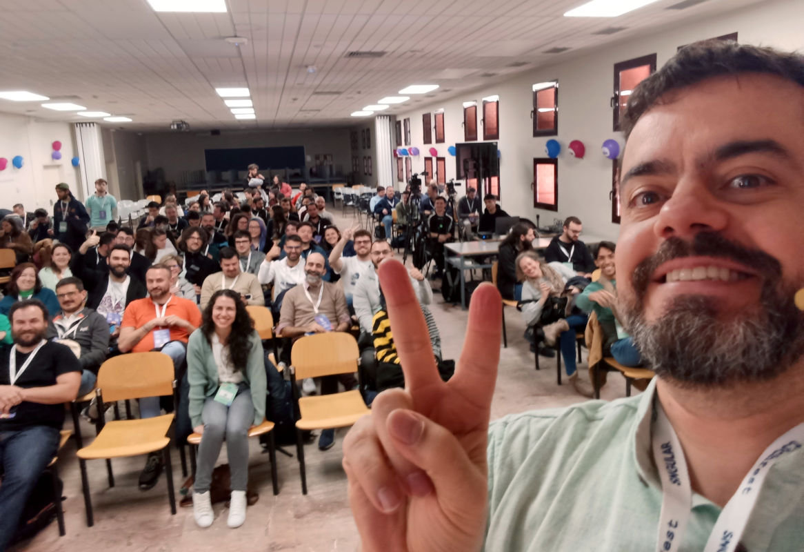
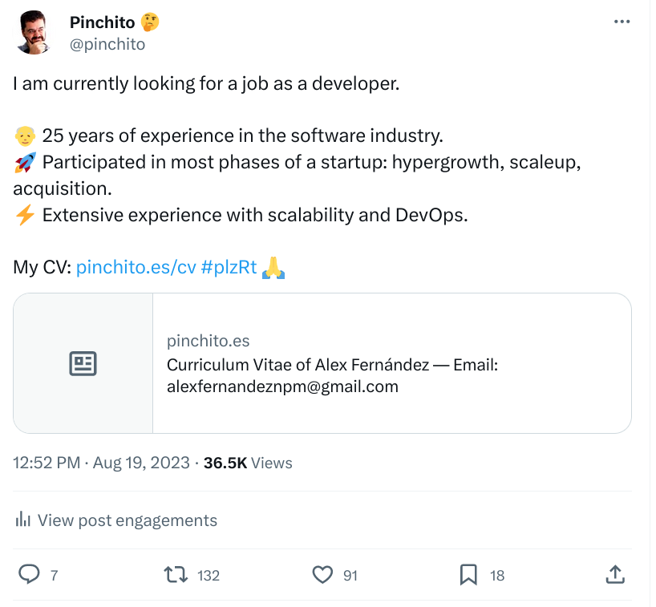
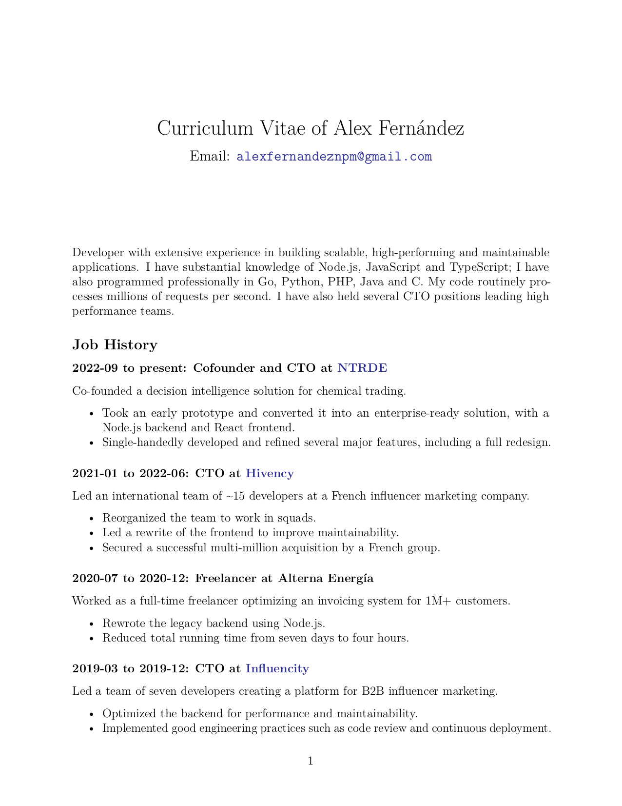
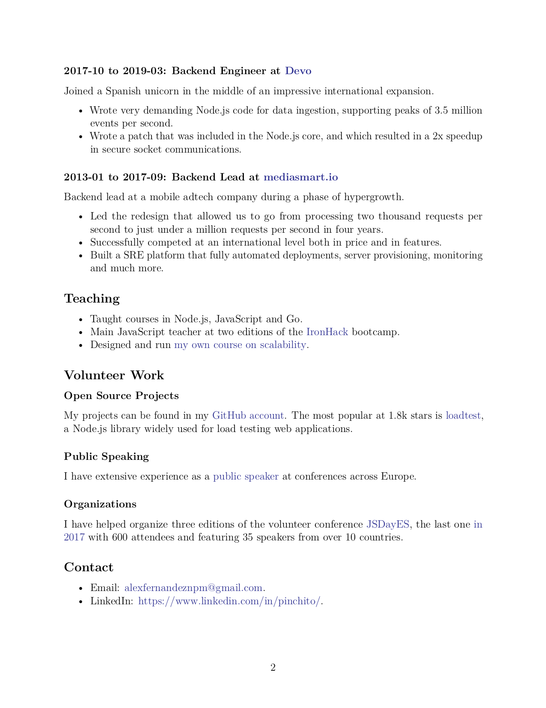
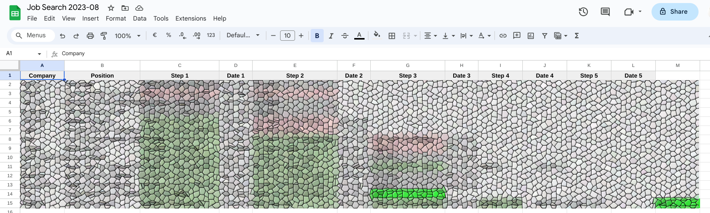
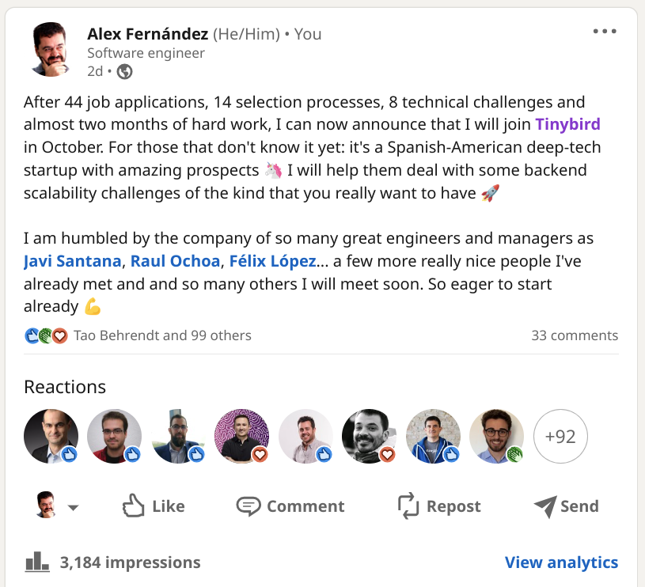
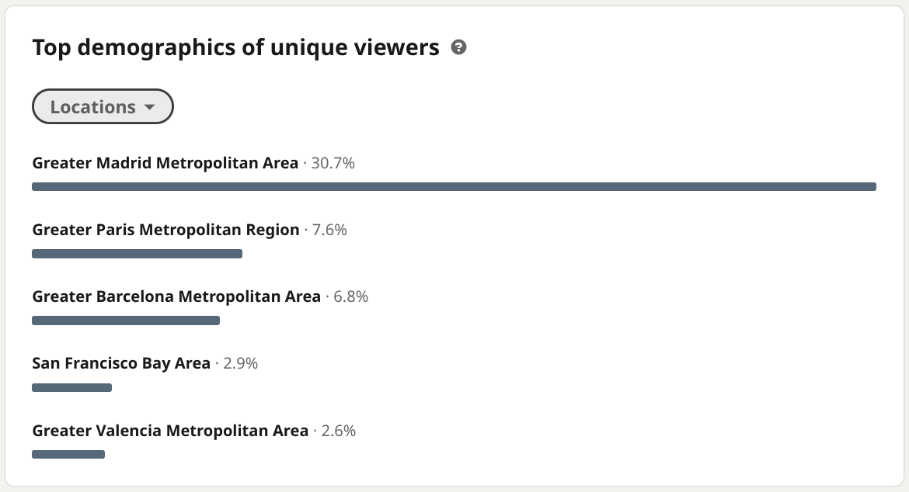

These are turbulent times when many workers are losing their jobs;
I was recently in this situation myself.
Some people have asked for advice in their job search;
I am writing this article to explain the lessons I learned.
My focus is on software developer jobs in technical companies,
but most of the lessons should be extensible to any jobs in the tech sector.



# 🔍 The Job Search

The whole process from first application to accepting an offer took roughly 7 weeks.
All in all I sent out 44 job applications.
I was rejected 15 times;
on my side I canceled 11 processes,
and another 17 applications are still pending as far as I know
(I am not holding my breath).
This leaves us with the one offer that I finally accepted.

Now for the detail of the 14 selection processes where I actually participated:
overall I did 25 various interviews with recruiters, technical people and managers.
I got 8 technical challenges and was accepted for three positions,
of which I accepted the offer from Tinybird.

## 📝 Lessons Learned

The following lessons were impinged on my brain and I should remember them.

1. Referrals work much better than cold applications.
1. Participate in the community for better exposure.
1. Have a clean, to the point CV.
1. Keep a spreadsheet with all job applications including every human interaction.
1. Try to meet your future team.
1. Take-away assignments always take longer than they state.
1. Train like crazy for the jobs you are looking for.
1. Learn from your mistakes and move on.
1. Decisions are always subjective; but they should take objective facts into consideration.
1. Always take care of the people that referred you.
1. Looking for a job is stressful.

We will now see each in context.

## 👷 Yes, but What Job?

It was roughly one year after joining NTRDE full time in September 2022;
we had not got the financing we were looking for.
My now ex-partners and I decided to split,
so I had to find a proper job.

For the last four years I have been working as a CTO,
thinking that I would be able to have more influence this way.
But honestly I missed technical work a lot,
as I had discovered this last year being a fullstack CTO,
which means I did everything from product sketches to programming to speaking with investors.
Therefore I was ready to look for a job as software engineer, individual contributor,
no management responsibilities.
As [Charity Majors likes to say](https://charity.wtf/2017/05/11/the-engineer-manager-pendulum/),
the best managers are those that have engineered, but also the best engineers are those that have managed.
I was ready to go back to sweet coding, baby!

## 📰 Publication

At one point my job search was not looking good:
26 applications and only two interviews which were both failures.
(I also did a take-home assignment which later resulted in an offer.)

I decided to do a publication on Twitter (sorry, I refuse to call it X).
Even in its sunset years the blue bird had a surprise for me:
my [job search tweet](https://twitter.com/pinchito/status/1692852099002827040)
had 36.5k views as of 2023-09-28. It was probably my post with more retweets ever: 132 no less,
plus 91 likes and 7 replies.
Total engagement is 0.6% in case you have ever worked in marketing,
computed as all interactions divided by impressions;
not too shabby for Twitter.



This tweet got me 8 referrals,
in fact for some of the most interesting job offers I would get.
Just from the replies you can see DataDog, RevenueCat and TrustYou,
and a few more were waiting for me in private messages.
Even companies that had rejected me when I cold-applied before would now give me an interview.
Which brings us to our first lesson:

**Ask for referrals: they work much better than cold applications.**

Sometimes the people that refer you get some economic compensation;
it is only fair that both parts benefit from the referral.
In any case, be grateful with people, even if you don't get the job.

A [similar toot on Mastodon](https://mastodon.social/@pinchito/110915846714273313)
had shorter legs, but still got 15 retoots and one like.

I was lucky to get so much exposure,
but it is also good to be known in your sector.
I have been a Meetup organizer for 10 years,
have organized several conferences
and try to give talks regularly.
When people see you around a lot they tend to infer that you are particularly clever,
which is nice (if not necessarily true as in this case).
Yes, it is often uncomfortable to get out of your house in the evening to go to a meetup,
or to write a conference proposal;
but these efforts may prove useful later.

**Participate in the community: it gives you exposure that will be useful when job searching.**

## 💼 CV

The _curriculum vitae_ or resume is not something you write and then send 1000 times,
or at least it should not be;
I read about a [guy in NY](https://blog.pragmaticengineer.com/a-senior-engineer-em-job-search-story/)
who updated his resume daily.

I used to keep separate PDF and [online](https://pinchito.es/cv) CVs,
but I took the time to unify both.
Technical details: it is generated from markdown as PDF using [pandoc](https://pandoc.org/MANUAL.html),
using the very nice class `scrartcl`.

```
pandoc -V urlcolor:Blue -V documentclass:scrartcl -V geometry:margin=1in -s permanent/cv.md -o permanent/cv-alex-fernandez.pdf
```

One of the companies where I applied required sending them a CV with two pages max,
a single font and no pictures.
I thought it was a really good idea so I crafted this shortened version using markdown and pandoc,
and sent it to most US companies.



I have removed all the experience that is less pertinent from both CVs,
more aggressively from the shortened two-pager;
a link to [my LinkedIn page](https://www.linkedin.com/in/pinchito/) is available
should a recruiter need to account for every month of my career.



I also wrote many custom variations of the CV as needed;
sometimes sites asked for text-only versions or sometimes just a cover letter highlighting my experience.
The more effort you take for your application, the more likely it is that it will be considered.

**Write a simple lean CV and update it as needed.**

## 📋 Selection Processes

Now we come to the most demanding part:
all those selection processes.
If you are like me you will send a lot of applications,
and then not remember which is which.
Not all of them are kind enough to send you an email acknowledgement,
and many will not bother to ever write to you to let you know that the process is closed.
So it will fall on your side to keep track of all of them.

I kept a Google spreadsheet with two tabs.
The first one is a list of all applications with company, title in the offer,
where I found it, salary offered (if present), date applied and status.
Under "reason" I listed why I was rejected or why I canceled the processes:
"did not end lines with semicolons", "we should see other people".
Under "source" I kept track of who referred me to it if applicable;
remember that human interactions are your most important asset.

|Company|Title|Source|Salary|Sent|Status|Reason|
|-------|-----|------|------|----|------|------|
|StartupCo|Ninja|himalayas|?|2023-09-29|<span style="background: #ffffcc">Pending</span>||
|BigCorp|Minion|Manfred|$50k|2023-09-29|<span style="background: #ffcccc">Rejected</span>||
|ScaleupCo|Manager|referral PT|$80k|2023-09-29|<span style="background: #ccffcc">In progress</span>||

The second tab is a list of "processes" with every step along the way,
color-coded for my convenience.
This one I did reorder as I moved along the processes,
so I could clearly see the funnel as in the image below.
Remember that human interactions are the most important part,
so be sure to write down who interviewed you and when.



Perhaps you can build some fancy automation so that the first sheet is automatically updated when you write on the second;
for my needs it was enough to keep everything updated by hand.
A simple tool that works tends to be better than a fancy system that is never built
(and this is a bonus lesson).

**Keep a spreadsheet with all job applications,
their state and every human interaction.**

### 🗣️ Interviews

I am not going to teach you anything new about doing interviews,
so I will not even try.
Just keep in mind that there are 
technical interviews,
human resources (or values) interviews,
and team interviews.

**If at all possible, try to meet your future team.**
With big companies sometimes you don't even know what team you will be assigned at when you join,
so it's not always possible.

If I get the opportunity I like to ask any technical employees I meet two simple questions:
what do you like best about working at the company,
and what do you like the least?
It can give you a quick idea of how it is to work there,
but keep in mind that it can be a sensitive issue and they may not feel at liberty to answer,
especially if a manager or HR person is also present.
That can also be significant in itself.

## 🔩 Technical Challenges

Selection processes often include technical challenges:
some are take-away assignments while others are online sessions.
I don't have a preference for one or the other,
and it doesn't matter because naturally you don't get to choose;
but they require different preparation.

### 📜 Take-away Assignments

In this kind of technical challenge you have to solve a programming problem on your own:
you get the problem statement and perhaps some skeleton code,
and you have to find a solution.
Some are more open: you have to code everything including tests.
Others are more limited in scope: you get a set of tests and have to solve for those.

There are many online places where you can practice:
[LeetCode](https://leetcode.com/),
[HackerRank](https://www.hackerrank.com/dashboard) and so on.
I am particularly fond of the french site [CodinGame](https://www.codingame.com/home),
makers of [CoderPad](https://coderpad.io/) which is used by some well known companies:
it has a lot of interesting challenges that you can solve for practice.

When you get the assignments they sometimes come with a time estimation, e.g.:

> This exercise should take you no more than 2 hours.

My advice is: don't pay any attention to that estimation, they always take significantly longer.
Perhaps if you are a super-fast coder you will be able to do it in the assigned time,
but a good rule of thumb is twice as long.
Be also sure to write down any limitations in your solution.
Write, write like crazy.

**Take-away assignments always take longer than they state.**

In my case a couple of assignments were rejected because of weird reasons:
I did not include unit tests
or did not format my code using `prettier`.
I am torn here:
on one hand I want to pass all technical challenges,
but on the other I'm not sure I want to work for a company
where you are evaluated by how many unit tests you write or if you format your code according to never stated guidelines.
(In case you are wondering,
I always include plenty of integration tests,
which should be enough for a toy project like this;
and my code was formatted with different options than the reviewer liked.)

### 🎭 Online Sessions

In an online technical challenge you will have a call with an interviewer,
who will ask you to solve some problems right away.
The format can be used for programming exercises,
system design questions, and so on.

It can be really stressful to have someone feeding you instructions,
as if they are examining you (which they are).
Some companies will approach the exercise as a "pair programming session",
where you can ask the interviewer for help or perhaps look things up online.
It is advised to communicate a lot with this person as if this was a real pair programming session:
explain what you are about to do,
ask them for their opinion,
tell them about your doubts and hopes in life.

A resource which helped me a lot deal with the stress is
[Clash of Code](https://www.codingame.com/multiplayer/clashofcode) by CodinGame,
where you have online challenges that you have to solve with a time limit.
They help you focus quickly on a problem,
and practice for speed.

A category of questions that may come up for senior developer positions is "system design":
how would you design an Instagram clone, or a Twitter clone, or a URL shortener?
They are very interesting problems where you have to consider ballpark estimations,
scalability and design decisions.
Again there is a ton of resources for this kind of challenge,
so be sure to watch some videos, read some articles, and practice like crazy!
Just to start you can check out
[how to design a TinyURL clone](https://www.designgurus.io/course-play/grokking-the-system-design-interview/doc/638c0b5dac93e7ae59a1af6b).

, redirect(short). Diagram contains a key-value database.")

### 🧑‍🎓 Preparation

Many big companies will ask you to brush up your skills on algorithms, data structures
and big O notation.
You may be asking yourself:
why do companies ask about abstract algorithms and not about concrete problems in their product space?
Now put yourself in the role of an examiner:
do you want to select only candidates that know about marketing,
or car sharing, or retail, or whatever your company does?
Or would you prefer to choose a level playing field where anyone can participate?
True, many bootcamps and even more traditional schools don't teach you algorithms or data structures;
but there are thousands of resources online that you can use on your own.
As a starting point,
this [HackerRank playlist](https://www.youtube.com/playlist?list=PLX6IKgS15Ue02WDPRCmYKuZicQHit9kFt)
has many interesting videos that will help you with the basics.

If you can do some more specific preparation then go for it!
For some well-known companies there is no shortage of pages that will help you prepare for the interviews;
some companies are also nice enough to give you resources that will guide you.
For instance for Datadog:
on [algodaily](https://algodaily.com/companies/datadog)
you get a list of problems specific for them, some unlocked.

**Train like crazy for the jobs you are looking for.**

Is it worth it to prepare for weeks or months for an interview?
Of course it is!
After all, people study for years for a public examination to get a position as civil servant,
like the dreaded "Oposiciones a funcionario" in Spain.
So, are you going to shy away from a couple of months of study
for a better paid, more rewarding technical position?
My advice is: train all that you can for the jobs that you really want.

The more you train the easier it becomes.
But some companies will reject you due to multiple factors.
Sometimes it is hard to even know why you were rejected;
here too having a contact inside the company may help you.
I was lucky to get a half-hour feedback session on one of the processes,
which helped me learn what went wrong.
And I always took all the feedback I could get from interviewers.

**Learn from your mistakes and move on.**

## ⚖️ Decision

Hopefully at some point you will start getting offers,
of the kind on a PDF with real money on it.
You may even get several offers and have to pick up one.
How can you make such a life-changing decision?

In my case I got three offers,
and had some other ongoing processes,
when I decided to go with Tinybird.
Why? I took into account a few factors:
company, position, tech stack, salary, conditions (like remote work) and stability.

Some brands are quite flashy on your CV:
not necessarily FAANG, but top tier companies will help your career in the future.
Then there are conditions like remote work.
And of course a good salary never hurts.
Tinybird is a great company with amazing prospects,
growing like crazy and with really interesting scalability challenges.
They offer remote work, competitive salaries,
plus I was able to meet the team I will join.
Combine this with top notch management and I was sold.
But for me, what made me go for it was to imagine where I could see myself working happily in five years.

**Decisions are always subjective; but they should take objective facts into consideration.**

Before canceling the other offers and ongoing processes I asked my contacts how should I proceed so they did not look bad.
They were all cool with the fact that I would be choosing a different option.

**Always take care of the people that referred you.**

## 📢 Announcement



I announced my decision on LinkedIn, and the
[post](https://www.linkedin.com/feed/update/urn:li:activity:7112739360587866112/)
had got 3184 impressions as of 2023-09-29, with 100 reactions and 33 comments.
Engagement was (100+33)/3184 = 4.2% in case you are wondering,
computed as (reactions + comments) / impressions.
I have no clue if that is good or bad on LinkedIn, but in general it looks nice!



On [Twitter](https://twitter.com/pinchito/status/1706973464186229076)
it did even better: as of 2023-09-29,
19k impressions, 7 retweets, 20 replies and 202 likes!
My most liked post ever.
Engagement was (7+20+202)/19k = 1.2%.
Did I tell you that engagement on Twitter sucks?
Anything more than 1% is excellent!

On [Mastodon](https://mastodon.social/@pinchito/111136692859351246)
I got one retoot and 4 likes.

It is humbling to think that more than 20 thousand people learned about my processes.
The community helped me a lot to find interesting offers,
and this article is a way of paying back with my experience so others can perhaps learn from it.

# 🤔 Conclusion

**Looking for a job is stressful.**

The process of searching for a job can be really stressful.
Don't despair: you don't need to find seven jobs, one is enough.
If what you are doing doesn't yield results,
change your methods.

Good luck in your search!
If I can help you in any way,
[let me know](mailto:alexfernandeznpm@gmail.com).
Looking forward to referring many of you to Tinybird 😉

## 🙏 Acknowledgements

Thanks to Dionisio Cortés, Jesús Leganés, Álvaro Moya and Alison Davey for reviewing the article.
And eternal thanks to Álex, Roberto, César, Ane, Mark, Jesús, Abel, Eduardo, Adrián and Javi
for their respective referrals.
I owe you one! 🥂

