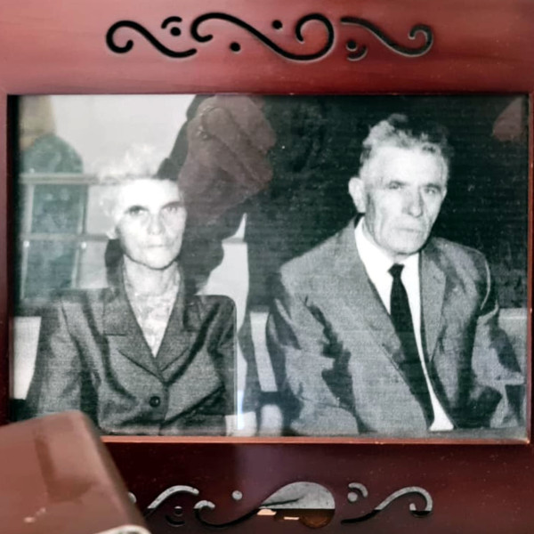

Cuando los conquistadores españoles llegaron a Lima descubrieron unas construcciones maravillosas,
hechas con piedras gigantescas tan bien ensambladas que entre ellas no cabía el filo de una espada.
A mi padre le encantaba contar esta anécdota,
como testimonio de la grandeza de los pueblos conquistados de América.

Fernando Fernández vivió toda su vida con unas convicciones férreas:
tenía muy claro su lugar en el mundo.
Hoy quiero rendirle un homenaje donde resaltar algunas ideas importantes que he aprendido de él.

## El origen

Las Alpujarras son un paraje muy peculiar:
están a la misma distancia de la costa subtropical de Motril que de las cumbres alpinas de Sierra Nevada.
En estas alturas estaban antaño las únicas nieves perpetuas importantes de la península,
aunque [extinguidas desde los años 90](https://wastemagazine.es/sierranevada-nievesperpetuas.htm) por el cambio climático.

[Bubión](https://es.wikipedia.org/wiki/Bubi%C3%B3n)
en 1934 no debía de ser un sitio muy acogedor.
El pueblo quedaba incomunicado por la nieve hasta dos meses al año,
y durante este durísimo invierno si dejabas un vasito de agua en la mesita de noche,
encontrabas un bloque de hielo por la mañana.
Hoy día sólo podemos imaginar cómo podía ser la vida entonces:
en diciembre hacer acopio de todo lo necesario hasta que a principios de marzo llegara el deshielo
y terminara la incomunicación forzosa.
Por otra parte debía ser un sitio bullicioso y lleno de niños,
cerca de su [máximo histórico](https://datacommons.org/place/wikidataId/Q554265/) de 800 habitantes en 1950.
Allí fue donde nació Fernando Fernández Montero,
primogénito de la familia,
durante uno de estos durísimos meses de aislamiento.

Mi abuelo Miguel bajaba todos los días en mulo el barranco del Poqueira
para volver a subir a su modesto cortijo por la otra cara de la montaña,
donde le arrancaba a algunos bancales en pendiente un sustento para su familia.
Se podía pensar que era una vida humilde,
pero eran de los afortunados del pueblo:
al fin y al cabo tenían terreno propio y una casa amplia en la plaza del pueblo.
En un par de años comenzaría la atroz guerra civil española,
cuando mi abuela tuvo que huir por los montes con sus niños pequeños
al llegar al pueblo los de algún bando,
no importa para el caso cuál fuera.
Viendo el gran número de niños nacidos en esta época convulsa,
incluyendo a mi señor padre y mis cuatro tíos paternos,
resulta curioso cómo la natalidad en España
[apenas se resintió](https://www.fbbva.es/wp-content/uploads/2017/05/dat/cuadernos_FBBVA_51espana_web.pdf)
ni de la guerra civil ni de la terrible postguerra.
Hoy día parece que el mínimo contratiempo económico se lleva al traste una tasa de nacimientos ya en caída libre.

## Su carrera

Fernando tuvo la oportunidad de estudiar bachillerato en Granada,
y después ayudó a sus cuatro hermanos a salir del pueblo.
Tras terminar la carrera de Derecho con un expediente académico brillante,
se apuntó a unas oposiciones que le permitieran ganarse la vida rápidamente,
donde sacó plaza con nota a la primera.

Poco después se casó con mi madre y empezaron a tener hijos.
No está claro que a mi progenitor le gustara especialmente tanto niño,
pero era su deber para la sociedad y cumplió lo mejor que supo:
cinco varones en total que casi volvemos loca a mi sufrida madre.
Durante un tiempo ella caminaba por las calles de Almería con un bebé en la barriga,
otro en el carrito y un niño pequeño de la mano (yo mismo);
cuando llegaba a casa le esperaban otros dos.

Al entrar en la diputación de Almería como subsecretario también cumplió su papel a la perfección,
y se jubiló allí como secretario general muchos años después.
Hizo varios trabajos que fueron pioneros y todavía hoy marcan las líneas de la administración local,
Amaba y admiraba las herramientas de su trabajo:
del Código Civil decía que era una obra maestra de su época,
y acumulaba tomos infumables de Administración Local como si fueran tesoros.

No tuve muchos puntos de contacto con mi padre durante la adolescencia,
donde el conflicto generacional se hizo patente sobre todo con mis hermanos mayores:
él no entendía que no quisierámos hacer el servicio militar como era lo debido.
Al terminar de estudiar empecé a trabajar, y nuestra relación mejoró bastante.
Recuerdo con especial cariño cuando allá por 2005 me leí la asombrosa
"Historia de la guerra del Peloponeso" de Tucídides,
y después le regalé un ejemplar por su cumpleaños,
sabiendo su pasión por la historia;
desde entonces comentábamos aspectos que nos llamaban la atención.

## Otras culturas

Este libro nunca dejará de asombrarme por múltiples motivos.
Uno de los personajes más fascinantes es
[Alcibíades](https://es.wikipedia.org/wiki/Alcib%C3%ADades).
Nacido en Atenas, jugó un papel destacado en su ataque a la confederación del Peloponeso.
Tras promover la desastrosa expedición a Siracusa fue desterrado,
y se fue a Esparta donde contribuyó a la guerra desde el otro bando.
Más tarde fue desterrado de nuevo a Persia, donde fue consejero del sátrapa Tisafernes.
En algún momento consiguió volver a Atenas donde de nuevo tuvo una actuación discutible,
por la que fue desterrado de allí una segunda vez.
A falta de nuevos bandos donde malmeter pasó a Frigia donde murió en la ignominia.
Tucídides no es clemente con este chaquetero que siempre miró por su propio interés.

Padre siempre refería las palabras de Alcibíades, creo que de otra obra,
cuando le preguntó al sátrapa persa por qué allí las mujeres no salían a la calle;
no como en Atenas donde hacían vida en público.
Este choque de culturas le llamaba la atención.
Es probable que no fuera la persona más progresista del mundo,
pero en su momento defendió la transición democrática como un gran avance.

Hablando de culturas, a mi padre le encantaba recorrer mundo, y lo hizo a conciencia.
A principios de los años 60 recibió un destino en Guinea Ecuatorial,
la última colonia española;
allí jugaría un papel importante durante su transición a una democracia moderna,
como secretario general de la asamblea.
Dos años después tuvieron que huir de allí cuando
[Francisco Macías Nguema](https://es.wikipedia.org/wiki/Francisco_Mac%C3%ADas_Nguema)
tomó el poder y destruyó la naciente democracia.
Este infernal personaje más tarde se autodesignaría como "marxista-hitleriano"
(ni siquiera es broma)
y llevaría a su país a la más abyecta ruina.
Se puede decir con tranquilidad que la extinta legación española no le tenía demasiada simpatía.

En los años 80 Fernando formó parte de la cooperación española para la reforma de la constitución de Honduras.
Poco después fue socio fundador de la Unión Iberoamericana de Municipalistas,
con la que visitó casi todos los países de Latinoamérica
donde ayudó a modernizar las administraciones locales.

Hoy día se le consideraría racista, como a la mayoría de su generación.
No deja de ser asombroso para una persona nacida antes de la Guerra Civil, sin embargo,
que contara que dos de las personas más inteligentes que conoció fueran africanos.
O que llamara "mi hermano colombiano" a Gustavo,
la persona que le acompañó en sus paseos durante sus últimos años.

## Convicciones

Mi Pápar era un gran admirador de Stendhal, de Beethoven, de Mozart;
un católico convencido que iba a misa todos los domingos que podía.
Estuvo trabajando hasta los 70 años,
y nos pagó los estudios universitarios a los cinco con un solo sueldo.
(También era un gran fan de Chiquito de la Calzada,
como habréis intuido por el principio de este párrafo.)

Cuando se reunía con sus amigos era normalmente con las familias respectivas,
y hablaban de temas serios: política, economía…
No se permitía salir de farra con los amigotes ni tener _hobbies_ caros.
Sus aficiones eran jugar al tenis, leer el diario ABC y estudiar derecho administrativo.
En su funeral tuve la oportunidad de hablar con su amigo Antonio Bonilla, alcalde de Vícar,
con el que se fue de viaje cuando eran jóvenes;
se pasaron el camino hablando de filosofía y de música clásica.

¿Cómo consiguió Fernando unas convicciones tan férreas?
¿Cómo pudo vivir con las contradicciones inherentes a la religión católica,
a la democracia, o al capitalismo?
Qué narices, todo en la vida es contradicción,
incluyendo el lenguaje mismo.
La filosofía hegeliana que tanto le interesaba no oculta el conflicto de ideas;
más bien lo pone en el centro del proceso dialéctico.

Tengo que suponer que era tan feliz con su familia y su posición en el mundo que no necesitaba más;
pero también que se cerraba a plantearse otras opciones,
para bien o para mal.
Al igual que se negaba a reconocer en sí mismo la enfermedad o incluso la decadencia física propia de la edad.
Puede que en parte fuera su carácter alpujarreño,
brusco y poco inclinado a la introspección.
(Según un amigo muy cercano suyo,
Fernando era la persona menos introspectiva que conocía.)
Pero sin duda también por una concepción del deber muy distinta a la que hoy tenemos.

De hecho, la idea misma del sacrificio propio
(por tu familia, por los demás, por la humanidad en su conjunto)
nos resulta hoy completamente ajena en esta sociedad en la que vivimos tan orientada al egoísmo:
sé feliz, date un capricho, quiérete mucho, tú lo vales.
Podría ser buena idea volver a pensar en sacrificar al menos parte de nuestro bienestar por los demás.
Ahora bien, ¿cuenta como sacrificio si lo haces a gusto?
¿Y si ni siquiera te planteas si debes hacerlo o no?

## Conclusión

Me pregunto si mi padre se planteó alguna vez otra carrera, otra vida,
otra forma de hacer las cosas.
Según mi madre sólo una vez dijo que le habría gustado ser militar, por carácter;
pero que no lo hizo porque las condiciones eran bastante peores.

En sus últimos años, se detenía al pasear cada vez que veía una planta miserable en el pavimento de la calle.
Se maravillaba de que la vida encontraba una forma de salir adelante,
incluso en las condiciones más adversas.
Pensando en sus palabras hice el dibujo de abajo para un concurso de pintura rápida.
Ahora lo tengo colgado en mi habitación,
y me acuerdo de estos momentos cada vez que lo miro.

Estoy convencido de que nuestra sociedad ha llegado más lejos gracias a personas como él
que han conseguido salir de las situaciones más adversas,
y que han dedicado su vida a trabajar por los demás;
y confío en que a los que vengan no se les olvidará este espíritu de sacrificio.
En todo caso Fernando Fernández Montero vivió una vida sin fisuras,
como los muros de Sacsahuamán.

### Agradecimientos

Gracias a mis padres por dedicar su vida al bienestar de su familia.
Gracias a Concha Rodríguez por la foto de la portada.
Gracias a Rodrigo Fernández por el retoque de la foto de los abuelos y por los comentarios.

