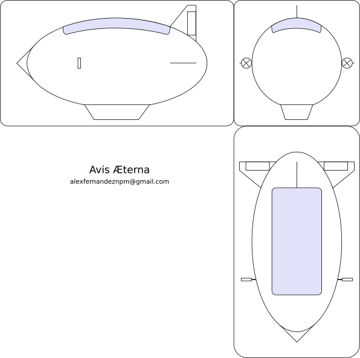

The worlds of airships and of drones are really interesting on their own,
but have a suspiciously lean intersection.
I am currently in the process of designing and building an airship drone
(or drone airship):
a flying machine that can stay aloft for a long time, perhaps indefinitely.

# The Project

This is a very interesting project because it touches many different areas:
from papiroflexia to avionics software.

## MVP: Minimum Volant Prototype

Building a 100 meter long dirigible is not a project for an amateur.
As sizes get smaller they become more attainable.
So, how small can we get and still have a working drone?

With airships weight is always the primary concern:
if they are to float in the air,
the weight of the ship must be exactly balanced with the equivalent volume of air.
Density of air is approximately 1.2 kg/m3;
once we choose a shape we can scale it up and down by simply following the
[law of squares and cubes](https://en.wikipedia.org/wiki/Square%E2%80%93cube_law).

.](pics/aves-ellipsoid.png "3D rendering of an ellipsoid, a stretched sphere or the shape of a rugby ball.")

We will reuse the shape from the [Aves Æternæ article](https://pinchito.es/2024/aves-aeternae):
an ellipsoid with a major axis twice the minor axis.
The size of the major axis will determine the weight of the structure:

|major axis|weight|
|---|---|
| 10 m | 150 kg |
| 4 m | 9.6 kg |
| 2 m | 1.2 kg |
| 1 m | 150 g |
| 50 cm | 19 g |

As you can see the weight quickly becomes impractical for a drone:
it is very much impossible with the current state of the art to build a 50 cm dirigible,
since total weight would have to be under 20 grams.
We would need a few grams left to include any kind of electronics:
even a paltry [Arduino nano](https://store.arduino.cc/products/arduino-nano)
weighs in at 5 grams.
What can we do with the remaining 15 grams?

The [surface of the ellipsoid](https://planetcalc.com/149/) would be approximately 0.34 m2,
and covering it up with just one layer of 20 microns ligthweight material (1.2 density)
would be 8 grams.
(For comparison, the lightest vegetable bags at a supermarket are 40~50 microns thick.)
Really hard to fit in there a couple of motors, propellers, battery and control surfaces;
not to speak about some kind of structure, plus about one gram of hydrogen.
Believe me, I've tried.

It makes no sense to remain at these scales when a bigger prototype is easier to build.
Let's go up a notch.
Is it possible to build a 1-meter long dirigible and keep within the 150 gram budget?
This is our current project,
the _avis minima_:
the smallest practical airship drone that is still capable of flight.
Just as tech companies build an MVP, or _minimum viable prototype_,
we face the construction of this _minimum volant prototype_.

## Autonomous Flight

The concept of drone used to mean UAV or "unmanned aerial vehicle",
and include a complete fly-by-wire system of autonomous flight.
However radio-control or RC drones have become quite popular,
negating the autonomous nature of the previous models.

Our ambition is to have a completely self-reliant drone that is able to set course.
It will only receive instructions on where to go,
and decide its own flight plan.
We are immensely helped by the buoyant nature of the avis minima.
Aircraft have [three principal axes](https://en.wikipedia.org/wiki/Aircraft_principal_axes):
yaw, pitch and roll.
We only have to set yaw, since we will in principle not change altitude nor roll.

The electronics have thus to manage avionics and navigation,
and some way of communication:
at least be able to set objectives.
We have chosen the [Arduino nano BLE](https://docs.arduino.cc/hardware/nano-33-ble/)
as the brains of the operation,
since it is small, light (~5 grams) and comes packed with sensors:

- 3-axis accelerometers,
- 3-axis gyroscopes,
- and 3-axis magnetometers.

It is actually possible to build an inertial navigation system (INS) with these 9-axis sensors.
Such a system is capable of inferring the position and orientation at any point,
without any external information.
But they are noisy and imprecise.

Ideally we will use GPS for navigation,
although modules are heavy (I have not seen anything under ~15g) and slow.
Many people recommend having GPS for slow positioning,
and filling in for the short term with an INS.

## Power

In the [original article from 2023](https://pinchito.es/2023/avis-aeterna)
I explored the principles of long-lasting flight:
a properly configured drone might be able to fly for weeks if not months.
The avis minima prototype is not so ambitious:
I would be happy to see it fly for a few hours.
We will have time to prolong flight time with bigger models.

Luckily Lithium ion polymer (or LiPo) batteries are small and lightweight.
The drone industry has here once again come to our rescue:
there are in the market of all sizes and denominations.
But we will go a different way:
drone batteries are optimized for output,
while in our case we hardly require a quick energy discharge.

A 500 mAh powerbank is all we need.
They even come with a nice facility: the ability to charge using USB.
This also has allowed us to power up the Arduino nano directly from the USB port.
Luckily there are also highly convenient, half-gram voltage converters
from the 3.7 V of the LiPo battery to the 3.3 V required by the Arduino.

The target power of the avis minima is 1 Watt.
Energy consumption from the Arduino nano is minimal at 10 mA and 3.3 V (0.033 Watt),
and can even be lowered by disabling the onboard LED.
Most of the 1W will go to the propellers.
A 500 mAh battery at 3.7 V will [yield 1.85 Watt-hour](https://www.rapidtables.com/calc/electric/mah-to-wh-calculator.html),
so it will be able to power the avis for almost two hours straight.

There's one trick up our sleeve:
lightweight solar panels that can be installed in place of stabilizers,
and that yield a lot of power (3.5 W nominal) at 6 grams.
These panels should be able to power the propellers directly.
If we can leave the battery only to power the Arduino nano,
it will be able of 50+ hours of operation.

## Outer Hull

Fans of papiroflexia will be happy with this section.
The outer surface is 1.34 square meters.
To cover it we need a lightweight and yet sturdy material,
such as... maybe paper?

Sadly even office paper is 80 gsm (grams per square meter),
so covering our 1.34 m2 would weigh us down by 107g.
But what if we can find something lighter and stronger?

I created a prototype with humble oven paper from the kitchen supply section of the supermarket.
At 40 gsm it is quite sturdy,
but with the necessary glue it grew up to 50 gsm,
for a total of 67 grams.
Luckily Asian paper manufacturers have created wonders of human ingenuity:
Japanese unryu paper can be found at 20 gsm which is sturdier than regular paper.
I am partial to manila paper, sourced from a local shop,
which at 19 gsm is even lighter and quite sturdy.

The paper has to be cut properly so that it will generate an ellipsoid.
I found [this video](xxx) of an ingenious lady building a paper sphere,
with each segment being a sinusoid.
Sadly ellipsoids are quite intractable mathematically;
I created this script to generate the proper shape that, once folded,
generates an ellipsoid.
Each segment is approximately 10 cm wide and 62 cm long,
and has indentations to glue it to its neighbours.
Each four segments join together to form a quarter half-shape,
so we need 32 in total for the whole shape.

I have done some prototypes with scissors and they are a huge pain to cut.
Luckily I now have access to a laser cutter which makes short work of the segments.

After gluing together the segments they form two half-spheroids,
that have to be joined together with the structure inside.
Finally, a coating of acrylic spray gives it a water-resistant finish.

## Structure

The structure is made up of a series of joints at the edges,
linked together by carbon fiber strips.
The two motors and the gondola are attached to these joints.

The gondola will house Arduino nano, battery and a power converter
from the battery's 3.7 V to the Arduino's 3.3 V,
which is a very simple and lightweight 0.6 g circuit.

As to the carbon fiber structure,
we need 8 strips 62 cm long, and 4 strips 40 cm long,
for a total of 656 cm.
I have tried with 3x0.3 mm strips.
They just weigh 1.1 g/m for a total of 
but they cannot hold the weight of the gondola.
I am currently waiting for 3x0.5 mm and 5x0.5mm;
they weigh a bit more.
Since carbon fiber has density of 1.4 g/cm3,
it is easy to compute linear density:

d = 1.4 g/cm3 * 3 mm * 0.3 mm
= 1.26 g/m.

3x0.5 mm: 2.1 g/m
5x0.5 mm: 3.5 g/m

Weight goes up fast!
We can use the thickest strips only for the bottom segments,
2 meters of them.
Then intermediate strips for the mid segments,
and the thinner strips on top.

## Hydrogen Bag

# 🤔 Conclusion

When downscaling the avis aeterna to one meter long I expected to find multiple roadblocks.
To my surprise it should be possible to build it with current materials and methods!
While it will probably not stay aloft for days or weeks,
it is a nice demonstration of the concept that can be scaled up.

## 🙏 Acknowledgements

Thanks to Carlos Santisteban and Fran Barea for so many fruitful discussions.

