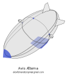

The worlds of airships and of drones are really interesting on their own,
but have a suspiciously lean intersection.
I am currently in the process of designing and building an airship drone
(or drone airship):
a flying machine that can stay aloft for a long time.

# 📓 The Project

This is a very interesting project because it touches many different areas:
from papiroflexia to avionics software.

## 🏗️ MVP: Minimum Volant Prototype

Building a 100 meter long dirigible is not a project for an amateur.
As sizes get smaller they become more attainable.
So, how small can we get and still have a working drone?

With airships weight is always the primary concern:
if they are to float in the air,
the weight of the ship must be exactly balanced with the equivalent volume of air.
Density of air is approximately 1.2 kg/m³;
once we choose a shape we can scale it up and down by simply following the
[law of squares and cubes](https://en.wikipedia.org/wiki/Square%E2%80%93cube_law).

.](pics/aves-ellipsoid.png "3D rendering of an ellipsoid, a stretched sphere or the shape of a rugby ball.")

We will reuse the shape from the [Aves Æternæ article](https://pinchito.es/2024/aves-aeternae):
an ellipsoid with a major axis twice the minor axis.
The size of the major axis will determine the buoyancy of the displaced air,
and thus the weight that we can lift:

|major axis|weight|
|---|---|
| 10 m | 150 kg |
| 4 m | 9.6 kg |
| 2 m | 1.2 kg |
| 1 m | 150 g |
| 50 cm | 19 g |

As you can see the weight quickly becomes impractical for a drone as we go down:
it is very much impossible with the current state of the art to build a 50 cm dirigible
and keep its weight under 20 grams.
We would be hard pushed left to include any kind of electronics:
even a paltry [Arduino nano](https://store.arduino.cc/products/arduino-nano)
weighs in at 5 grams.
What can we do with the remaining 14 grams?

The [surface of the ellipsoid](https://planetcalc.com/149/) would be approximately 0.34 m²,
and covering it up with just one layer of 20 microns ligthweight material (1.2 density)
would be 8 grams.
(For comparison, the lightest vegetable bags at a supermarket are 40~50 microns thick.)
Really hard to fit in the remaining 6 grams a couple of motors, propellers, battery and control surfaces;
not to speak about some kind of structure, plus about one gram of hydrogen.
Believe me, I've tried.

It makes no sense to remain at these scales when a bigger prototype is easier to build.
Let's go up a notch.
Is it possible to build a 1-meter long dirigible and keep within the 150 gram budget?
This is our current project,
the _avis minima_:
the smallest practical airship drone that is still capable of flight.
Just as tech companies build an MVP, or _minimum viable prototype_,
we face the construction of this _minimum volant prototype_.

## 🦾 Autonomous Flight

The concept of drone used to mean UAV or "unmanned aerial vehicle",
and include a complete fly-by-wire system of autonomous flight.
However radio-control or RC drones have become quite popular,
negating the autonomous nature of the previous models.

Our ambition is to have a completely self-reliant drone that is able to set course.
It will only receive instructions on where to go,
and decide its own flight plan.
We are immensely helped by the buoyant nature of the avis minima.
Aircraft have [three principal axes](https://en.wikipedia.org/wiki/Aircraft_principal_axes):
yaw, pitch and roll.
We only have to set yaw, since we will in principle not change altitude nor roll.

The electronics have thus to manage avionics and navigation,
and some way of communication:
at least be able to set objectives.
We have chosen the [Arduino nano BLE](https://docs.arduino.cc/hardware/nano-33-ble/)
as the brains of the operation,
since it is small, light (~5 grams) and comes packed with sensors:

- 3-axis accelerometers,
- 3-axis gyroscopes,
- and 3-axis magnetometers.

It is actually possible to build an inertial navigation system (INS) with these 9-axis sensors.
Such a system is capable of inferring the position and orientation at any point,
without any external information.
But they are noisy and imprecise.

Ideally we will use GPS for navigation,
although modules are heavy (I have not seen anything under ~15g) and slow.
Many people recommend having GPS for slow positioning,
and filling in for the short term with an INS.

## 🔋 Power

In the [original article from 2023](https://pinchito.es/2023/avis-aeterna)
I explored the principles of long-lasting flight:
a properly configured drone might be able to fly for weeks if not months.
The avis minima prototype is not so ambitious:
I would be happy to see it fly for a few hours.
We will have time to prolong flight time with bigger models.

Luckily Lithium ion polymer (or LiPo) batteries are small and lightweight.
The drone industry has here once again come to our rescue:
there are in the market of all sizes and denominations.
But we will go a different way:
drone batteries are optimized for output,
while in our case we hardly require a quick energy discharge.

A 500 mAh powerbank is all we need.
They even come with a nice facility: the ability to charge using USB.
This also has allowed us to power up the Arduino nano directly from the USB port.
Luckily there are also highly convenient, half-gram voltage converters
from the 3.7 V of the LiPo battery to the 3.3 V required by the Arduino.

The target power of the avis minima is 1 Watt.
Energy consumption from the Arduino nano is minimal at 10 mA and 3.3 V (0.033 Watt),
and can even be lowered by disabling the onboard LED.
Most of the 1W will go to the propellers.
A 500 mAh battery at 3.7 V will [yield 1.85 Watt-hour](https://www.rapidtables.com/calc/electric/mah-to-wh-calculator.html),
so it will be able to power the avis for almost two hours straight.

There's one trick up our sleeve:
lightweight solar panels that can be installed in place of stabilizers,
and that yield a lot of power (3.5 W nominal) at 6 grams.
These panels should be able to power the propellers directly.
If we can leave the battery only to power the Arduino nano,
it will be able of 50+ hours of operation.

## 🏮 Outer Hull

Fans of papiroflexia will be happy with this section.
The outer surface is 1.34 square meters.
To cover it we need a lightweight and yet sturdy material,
such as... maybe paper?

Sadly even office paper is 80 gsm (grams per square meter),
so covering our 1.34 m² would weigh us down by 107g.
But what if we can find something lighter and stronger?

I created a prototype with humble oven paper from the kitchen supply section of the supermarket.
At 40 gsm it is quite sturdy,
but with the necessary glue it grew up to 50 gsm,
for a total of 67 grams.
Luckily Asian paper manufacturers have created wonders of human ingenuity:
Japanese unryu paper can be found at 20 gsm which is sturdier than regular paper.
I am partial to manila paper, sourced from a local shop,
which at 19 gsm is even lighter and quite sturdy.

The paper has to be cut properly so that it will generate an ellipsoid.
I found [this video](https://www.youtube.com/watch?v=i3A52m0fgt0) of an ingenious lady building a paper sphere,
with each segment being a sinusoid.
Sadly ellipsoids are quite intractable mathematically;
I created a script using numerical integration to generate the proper shape that, once folded,
generates an ellipsoid.

Each segment is approximately 10 cm wide and 62 cm long,
and has indentations to glue it to its neighbours.
Each four segments join together to form a quarter half-shape,
so we need 32 in total for the whole shape.

I have done some prototypes with scissors and they are a huge pain to cut.
Luckily I now have access to a laser cutter which makes short work of the segments.

After gluing together the segments they form two half-spheroids,
that have to be joined together with the structure inside.
Finally, a coating of acrylic spray gives it a water-resistant finish.

## ❤️‍🔥 Hydrogen Prejudice

We have to fill up the interior with something lighter than air,
and the lightest gas known is hydrogen.
Wait, did you read right?
Doesn't hydrogen, like, burn?
Why not helium?

The answer is threefold: price, convenience and availability.
Helium is at least 100€/m³ in Spain,
and the avis requires 0.131 m³.
It is also a scarce resource and very likely to go up in price,
since it is used for MRI machines which are more valuable than party balloons.

Helium is also twice as heavy as hydrogen;
the avis would have to store 18 instead of 9 grams,
wasting 9 grams of payload.
Hydrogen is famously hard to contain in an envelope but helium is even worse,
as it is a monoatomic molecule.

As to safety: 9 grams of hydrogen is not explosive enough to cause any damage,
and we don't have human passengers anyway.

Allow me to address directly the Hindenburg catastrophe that has been impinged into our collective subsconsious.
The problem with Zeppelins was not with hydrogen but with the rigid design that was so popular.
The great Spanish inventor Torres Quevedo
[designed and patented a line of dirigibles](https://www.torresquevedo.org/LTQ10/images/Dirigible_Journal_TorresQuevedo.pdf)
that ruled the air using hydrogen for 30+ years,
with no accidents except for a couple of war casualties.
Their semi-rigid structure allowed for handling bumps gracefully,
unlike the German, British and Italian competition which all ended in multiple disasters.

Also, as seen on [Mythbusters](https://www.youtube.com/watch?v=vSDmlj-u6QM):
don't paint the envelope in thermite if at all possible.

# Project Details

Now we will go into the nitty gritty details of the project.
These are likely to change as the project moves along.

## Preliminary Tech Specs

While it is quite premature to set in stone every detail of the project,
it is good to have an idea of the main parameters.

|parameter|value|
|---|---|
| major axis | 1 m |
| minor axis | 50 cm |
| volume | 0.131 m³ |
| surface | 1.34 m² |
| weight | 157 g |

Weight is computed based on the volume of air displaced,
using an average air density of 1.2 kg/m³ (sea level, 20 C).
One of the challenges is that this weight can change with temperature, altitude and even atmospheric conditions.

Note that we have around 150 grams to fit in everything:
hydrogen container, outer envelope, structure and propulsion.
We will set up a preliminary "weight budget" of <40 grams for each of these areas.

## 🚁 Propulsion

Let's start with this interesting area:
how to have powered flight below 40 grams.

### 🥏 Propelling

The Arduino nano will control a couple of motors
using motor drivers.
Very [lightweight brushless motors](https://es.aliexpress.com/item/1005001649480303.html) are available:
2g each, as the vendor explicitly shows on the article page.
Propellers under 1g can also be found.

Similarly [lightweight motor drivers](https://es.aliexpress.com/item/1005006099884636.html)
are available that convert the signal from the Arduino to triphasic current required by the brushless motors.

### 🔌 Other Electronics

There are a few other line items in our propulsion budget.
First we need cables to connect the Arduino to the motors,
which will span at least from the gondola to each propeller (~40 cm)
and from the gondola to the servo (~62 cm),
with three cables each (power, ground and signal).
Let's give a few more cm for each cable,
this gives us a total of 5 meters of cable:

L = 3 × 2 × 50 cm + 3 × 70 cm ≈ 5 m.

We need really lightweight cable;
luckily we can use [AWG 32 enameled cables](https://www.amazon.es/dp/B07JBQQR38?th=1),
which are around 0.1 g/m, for half a gram total.

We also need JST connectors to facilitate changing each piece.
We can use 6 sets of JST PH (2 mm) connectors,
weighing around 0.1 g each, for a total of around half a gram.

Lastly we need a [servo motor](https://www.motionrc.eu/products/rotorscale-1g-high-speed-digital-nano-servo-rsh6005-001)
that will pop open the hydrogen bag,
for emergency stops.
We cannot have a rogue drone flying around,
so whenever things go wrong the brains will use this servo to open the bag.

### ⚖️  Propulsion Weight Budget

Let's see if we are within the 40 g budget.

| item | weight |
|---|---|
| Arduino nano | 5 g |
| Two brushless motors | 4 g |
| Two motor drivers | 1 g |
| Two propellers | 1 g |
| Servo | 2 g |
| DC converter | 0.5 g |
| 500 mA battery | 9 g |
| Cables | 0.5 g |
| JST | 0.5 g |
| **Total** | 23.5 g |

We are well below budget!
Just as well, because we will certainly go above in one of the remaining groups.

## 🏮 Outer Hull

As we saw above, we will use 20 gsm paper (manila or unryu)
for maximum lightness;
that is 20 g/m².
We will need a bit over 1.34 m²,
since the different segments will overlap a bit;
let's say 1.40 m².
This means 28 g of paper.

We also need glue to keep it together,
and an outer layer of acrylic spray.
Weight of glued paper tends to go up something like 5 g/m².
Finally spray also increases weight around 5 g/m².
Each material will add around 7 g.

### ⚖️  Hull Weight Budget

Let's see if we are within the 40 g budget.

| item | weight |
|---|---|
| Paper | 28 g |
| Glue | 7 g |
| Acrylic spray | 7 g |
| **Total** | 42 g |

We go a bit above 40 g.

## 🌐 Structure

The structure is made up of a series of joints at the edges,
linked together by carbon fiber strips.
The two motors and the gondola are attached to these joints.

The gondola will house Arduino nano, battery and a power converter
from the battery's 3.7 V to the Arduino's 3.3 V,
which is a very simple and lightweight 0.6 g circuit.

As to the carbon fiber structure,
we need 8 strips 62 cm long, and 4 strips 40 cm long,
for a total of 656 cm.
I have tried with 3x0.3 mm strips.
They just weigh 1.1 g/m for a total of 
but they cannot hold the weight of the gondola.
I am currently waiting for 3x0.5 mm and 5x0.5mm strips;
they weigh a bit more.
Since carbon fiber has density of 1.4 g/cm³,
it is easy to compute linear density:

d = 1.4 g/cm³ × 3 mm × 0.3 mm

- 3 × 0.3 mm: 1.26 g/m
- 3 × 0.5 mm: 2.1 g/m
- 5 × 0.5 mm: 3.5 g/m

Weight goes up fast!
We can use the thickest strips only for the bottom segments,
~2 meters of them: 2 strips with 62 cm and 2 with 40 cm.
Then intermediate strips for the mid segments (4x62cm),
and the thinner strips on top (another 2m).

Note how the four strips holding the gondola at the bottom are the thickest.
It remains to be seen if this structure will be able to hold the weight of the gondola
and the remaining parts such as ailerons,
or it will need crossing reinforcements.

### ⚖️  Structure Weight Budget

Let's see if we are within the 40 g budget.

| item | weight |
|---|---|
| Light strips | 2 × 1.26 g |
| Mid strips | 2.4 × 2.1 g |
| Heavy strips | 2 × 3.5 g |
| Joints | 3.5 g |
| Propeller joints | 1 g |
| Gondola | 10 g |
| Hatch plug | 2 g |
| Wings | 7 g |
| **Total** | 38 g |

Right within budget!

## 🎈 Hydrogen Bag

Now we come to the most delicate and most sketchy of design issues:
how do we store the hydrogen within the avis?
Once again we have less than 40 grams for the whole thing.

### 🛍️ PVA to the Rescue

The best material to contain hydrogen is
[apparently PVA](https://rest.neptune-prod.its.unimelb.edu.au/server/api/core/bitstreams/9a2af3f4-a7c8-467a-ba32-ade    91ba45822/content),
with a [density of 1.2~1.3 g/cm³](https://en.wikipedia.org/wiki/Polyvinyl_alcohol).
For our 1.34 m² a 20 micron bag would therefore represent
32~35 grams.
Let's go on the pessimistic side to account for any extra plastic needed for the bag.

PVA is very used industrially because it is dissolved in water.
So it is possible to buy industrial bags that are used to place contaminated clothes directly in the washing machine.
On the minus side we have better isolate the bag from any outside humidity or the bag will simply dissolve!
I have purchased some but the quality is quite poor: they are full of holes.
They are also square and not elliptical.
I need to learn how to do thermal sealing on the sides,
so there is a lot of way to go here.

The question of the shape is also interesting.
One would think that a double-sided ellipse can be inflated to an ellipsoid,
but [one would be wrong](https://www.math.ucla.edu/~pak/papers/Schlenker7.pdf):
it is apparently a complex mathematical problem.
This will probably have to be numerically integrated too.

### 🫧  Get Hydrogen

We need 9 grams of hydrogen to fill our 0.131 m³,
at 70 g/m³.

Hydrogen availability is not trivial either:
it can be purchased in heavy bottles,
but it has the advantage that it can be generated quite easily via electrolysis.
Actually just put an AA battery in water; those bubbles you see at one end are pure hydrogen!

There are portable generators sold supposedly for medical benefits,
like [this one](https://www.ebay.es/itm/294917973530).
No idea if they are reliable enough.
We need 131 liters so using this method would take around 15 hours;
it would not be fast.

### ⚖️ Hydrogen Bag Weight Budget

We have to include the hydrogen somewhere.

| item | weight |
|---|---|
| PVA bag | 35 g |
| 0.131 m³ of Hydrogen | 9 g |
| **Total** | 44 g |

Here we go a bit over the 40 g budget,
luckily we had some extra grams from the propulsion department.

## ⚖️ Total Weight Budget

The following sum must be below 157 g for the _avis minima_ to fly.

| group | weight |
|---|---|
| Propulsion | 23.5 g |
| Outer hull | 42 g |
| Structure | 38 g |
| Hydrogen Bag | 44 g |
| **Total** | 148 g |

Phew! Right below 157 g.
Does this mean we are above budget?
Not exactly.

### 🌡️ Atmospheric Conditions

Remember when we said that air density varies with atmospheric conditions?
Temperature is the biggest factor here:

| Temperature (C) | Density | Weight |
|---|---|---|
| 0 | 1.3 | 170 |
| 10 |	1.25	| 164 |
| 20 |	1.2	| 157 |
| 30 |	1.16 |	152 |
| 40 |	1.13 |	148 |

So we should be good for temperatures below 40 C (104 F) at sea level.
But if barometric pressure goes down a bit because of bad weather then we are grounded!

That is not all. If we go up air density will go down as well --
according to the [international standard atmosphere](https://www.engineeringtoolbox.com/international-standard-atmosphere-d_985.html),
at 500 m high air density has gone down almost 5%,
and around 9% at 1000 m (3300 feet).
So if you live in the mountains (or in the Spanish _meseta_)
then you may have to lighten your dirigibles a bit more.

In Madrid where I live (657 m) [at 20 C](https://www.omnicalculator.com/physics/air-pressure-at-altitude)
[air density](https://www.omnicalculator.com/physics/air-density) is approx 1.12 kg/m³,
so the avis would have to weigh 148 grams.
Should temperature go to 40 C (as it regularly does every summer)
then density falls to 1.045 kg/m³ and avis weight to 137 g.
We would have to shed 11 additional grams.

Even a bit of humidity will make air lighter.
Airships are really sensitive to atmospheric conditions.

### 📈 Scaling Up

Is there no way to fly in Madrid in summer then?
Luckily another law of nature is on our side:
the already mentioned 
[law of squares and cubes](https://en.wikipedia.org/wiki/Square%E2%80%93cube_law).
Increasing dirigible size by ony 10% would increase the volume by 33%,
while area (and thus hull, structure and bag) would only increase by 21%.
In reality the propulsion system would probably work just as well,
while the structure might need some reinforcing. 
Let us suppose a 21% overall increase;
Weight would presumably only go up from 148 g to 179 g,
while buoyancy would increase from 137 to 182 g.
We would magically gain 45 grams of buoyancy, and be within budget!

Once in the air we can scale the prototype up as much as we want.
Remember that the trilobed design of Torres Quevedo scaled
[well beyond 100 m long](https://www.torresquevedo.org/LTQ10/images/7th_International_AirshipConvention_71192.pdf).
A 2-meter long dirigible would be able to lift 1.2 kg,
allowing for a sizeable payload of sensors (camera, GPS)
and communication equipment (WiFi, 5G);
actually a lightweight mobile phone would carry many of the required components.

# 🤔 Conclusion

When downscaling the avis aeterna to one meter long I expected to find multiple roadblocks.
To my surprise it should be possible to build it with current materials and methods!
While it will probably not stay aloft for days or weeks,
it is a nice demonstration of the concept that can be scaled up.

## 🙏 Acknowledgements

Thanks to Carlos Santisteban and Fran Barea for so many fruitful discussions.

