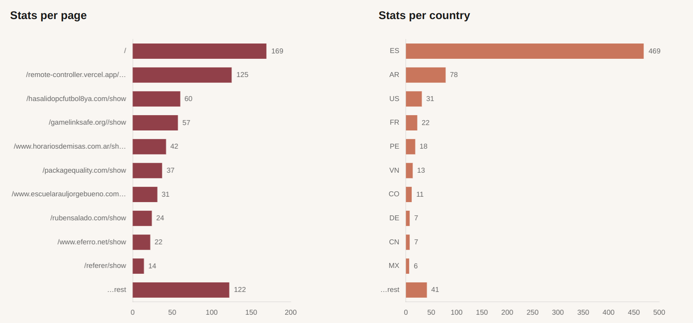

During my bumpy career as CTO and eng director (2019 ~ 2023)
I have often struggled to make the case for better developer tooling.
For me it was a no-brainer:
paying developers a good chunk of money to do the same change 10 times over in different places,
or to wait for automated tests to finish,
seems like a huge waste.

I have focused on improving internal tooling whenever I had the chance,
even devoting some people full time to the task.
But I have often failed to show the value of this investment to (other) company founders:
having devs not work on features is what they really found wasteful.
After all, product features are seen as value;
while internal tooling is at best a necessary evil.

For now I will offer a couple of data points in favor of my position.
Some big tech companies (Google and Meta come to mind)
have the best internal tooling, period;
this is in large part what enables them to be ahead of the competition.
And Joel Spolsky, creator of StackOverflow and Trello,
features tooling in several of the points of his legendary
[Joel Test](https://www.joelonsoftware.com/2000/08/09/the-joel-test-12-steps-to-better-code/),
used to evaluate the quality of a software team.
Specifically point 9 in the list says:

> Do you use the best tools money can buy?

Let me make the argument now in long form,
so hopefully we will all enjoy the benefits of better tooling.

# 💰 The Value of Tools

In many professional areas there are almost religious wars about tooling.
This is even more pronounced in software development,
where the arguments between e.g. proponents of the vim and Emacs text editors have been raging on for years.
And they are probably more than justified.

Our starting point is that the value of the work performed by a professional
is augmented by the tools they use.
A farmer that has to pick potatoes one by one will be 10 times more productive when they use a potato collector,
and again 10 times more when collection is done with a tractor.
The value of their work goes up accordingly.

This is, simply put, why the industrial revolution raised the living standards of people.
When an employee manufactures 10 times more screws the employer has the potential to pay more,
and then this person can go out and spend that money in more valuable goods.
It is true that employers tend to want to keep money for themselves as profit.
But the knowledge required to operate complex machinery also grows,
which is a barrier of entry for other potential employees;
this encourages better salaries for skilled operators.

## Compound Value

The second derivative is that more productive employers have more money to invest in factory tooling,
which in turn improves productivity..
As time goes by the quality of tools goes up,
and this enables the next cycle of investments.
With better tools tolerances and clearances will go down,
which means that the machines built can be more useful.
Precision engineering has allowed us to have millimeter-thick screws
and supersonic airplanes and computers.
The value of good tools thus compounds over time.

Oh, let me tell you about general purpose computers.
In a sense they are the ultimate productivity tools:
they can run random programs to do any tasks and can also be augmented with custom software.
Computers can also drive lots of different hardware,
from weather sensors to industrial printers.

Properly coded programs can indeed control entire production lines.
Now we are not only speaking about increasing productivity for one worker,
but optimizing entire factories.

## 🏒 Exponential Value

Can this process of increasing value accelerate even more?
Have we found the _perpetuum mobile_ of productivity?
Well, up to a point.

Compound interest leads to exponential savings.
We have to assume that there is some limit somewhere:
at some point we cannot optimize a process any longer.
The old dream of a single person running a fully automated factory is still not possible,
and production is just a single aspect of a company.
But when we move to the software industry this limit is even further away.
Companies like Google and Amazon showed us that one sysadmin could first herd a bunch of servers,
then a rack and at some point a whole datacenter.

In my mind, the whole point of software startups, hockey-stick exponential curves and hypergrowth
is precisely that we are building better tools -- for other people or for ourselves.
Sometimes for both, as we will see below when we speak about dog-fooding.
Uber is in a sense just a productivity tool that matches drivers with riders more efficiently;
everything else is financial wizardry to collect the benefits.

Once you are into this frame of mind you will see tools everywhere.
For productivity, financial improvement, for better living or just for entertainment;
any [list of unicorns](https://en.wikipedia.org/wiki/List_of_unicorn_startup_companies)
is just a catalog of efficient tools.
Google transformed a few categories when they offered better tools for search, email and targeted ads;
Apple is the ultimate hardware toolmaker.
And so on.

# 🧰 Taking Care of Tooling

Let us now focus on internal tooling:
after all it's what makes us productive to build the next generation of tools.
If your tools are the same as or worse than what your competition is using,
how do you expect to do better than them?

## 🧑‍🔧 Good Professionals

Some people tend to think that good professionals do their best even with crappy tools.
Sure, just like in the [awesome scene](https://www.youtube.com/watch?v=3Kl0UBS4ZaM)
from the movie [Rush (2013)](https://en.wikipedia.org/wiki/Rush_(2013_film)),
Niki Lauda can run really fast in a Lancia Flavia 2000;
but he will not be winning any F1 championships any time soon in that tin can.

Would you ask a good butcher to slice a lamb leg with a butter knife?
Just as well you might ask a developer to write a web application in a very low-level programming language, like assembler.
In my experience good professionals can recognize and make good use of the best tools;
and they take care of their tooling.

Good tools are not enough though;
you need good professionals to make the best use of them.

## Building Tools

Now if we look at great professionals,
they are able not just to pick great tools and take care of them;
they can also build their own tools.

Knowing [when to build](https://pinchito.es/2016/build-or-not)
is an excellent skill.
Also knowing what to build is important:
[building bridges](https://pinchito.es/2022/building-bridges).

## Tools that Improve Themselves

The ultimate tool that we have is language.
As I have [speculated elsewhere](https://pinchito.es/2017/origins-language)
it must have developed slowly at first as we evolved,
and then exploded in a myriad of words.

But not everyone uses language the same way.
In particular, philosophy and grammar [were born hand in hand](https://pinchito.es/2016/the-amazing-mind).
Grammar is, simply put, language turning on itself:
you can speak about language.
As the great García Calvo used to say:

> Language is the only tool that operates on itself.

And consequently we can use language to improve how we speak.
This is a turning point in our development as tool makers.
Great wordsmiths like Shakespeare have innovated in language:
the Immortal Bard
[created or introduced 1700 words](https://www.shakespeare.org.uk/explore-shakespeare/shakespedia/shakespeares-words/)
for the English language.
While J R R Tolkien created [no less than 15 languages](https://en.wikipedia.org/wiki/Languages_constructed_by_Tolkien)
for his fictitious Middle Earth.

## 🧑‍💻 Software Developer Tools

In the software development realm we are blessed with a multitude of great tools,
thanks to the great developers before us that created them.
There are many code-specific tools: compilers, code checkers (or linters), continuous integration.
Learning to use these tools is essential for a good dev.
Luckily the best tools tend to be free software (open source),
and this means that we don't have to pay for them.

One of the most important tools is the source code manager,
a space that of late has been dominated by [`git`](https://git-scm.com/docs/user-manual).
Created by Linus Torvalds,
one of the greatest developers of our generation,
`git` stores changes as "commits" or incremental modifications.
Care of our toolset in this case includes having a clean `git` history, and clean branches.
A messy piling of commits and branches is always a symptom of careless or incompetent developers.
One of my pet peeves is to always stash commits together every time they are merged
(as pull requests or merge requests),
so that it is easy to find out where a change comes from.
Also remove branches once they are no longer needed.

There are many other crucial tools that ensure our success as devs.
Some like monitoring and alerting can be provided by external companies.
Others like feature flags are basically techniques that should be used 

One of the great tools is [continuous deployment](https://pinchito.es/2012/continuous-deployment):
it allows devs to deploy code to production with every change, many times per day.
It definitely changes the relationship with code:
it is seen as something dynamic that can be fluidly turned into something else.

The best way to ensure that these internal tools are constantly tuned and optimized
is to assign them to a developer,
or even better to a team.
I've seen them neglected because they were everybody's responsibility,
and therefore nobody's.
Over time, platform (or similarly named) teams have taken responsibility for internal tooling.
While they are not working on visible features, these devs will accelerate everyone else.
Their value is therefore not obvious at first, but crucial in the long run.

## 🦾 Code as Tooling

As my friend Luis Medel so carefully explains in his excellent Spanish article
["La martingala del software"](https://luismedel.com/palabras/la-martingala-del-software/),
software is a tool in itself.
And just as any language,
it is a tool that can operate on itself.

Getting the best support for them and lear

A very interesting code tool is testing.
Unit, integration or end-to-end.
Having a running test suite (or CI) should be the second priority of any dev team,
after production.

Over time, the success of software as a paradigm has ensured the rise of infrastructure-as-code,
which essentially means treating basic infrastructure (servers, operating systems, installed programs)
as code with its own repo and tooling.
It is not just different tools,
but a very different framework.
The same has happened, to an extent, to data engineering;
and more of this is sure to happen in the future.

## 🐕‍🦺 Dog Fooding

This curious term comes from the pet food industry,
where apparently some owners insisted on [eating your own dog food](https://en.wikipedia.org/wiki/Eating_your_own_dog_food).
It means that a company that produces a product should use it for everything.
The interesting effect is that developers learn the pain that other users have,
and become so very interested in improving the tool.
Making the tech team aware of customer pains can be laborious
since it's usually mediated by customer representatives and "customer success" teams.

I learned as much when creating my GDPR-compliant privacy-conscious web tracker,
[LibreCounter](https://librecounter.org/).
I used it to see how many people were [visiting the site](https://librecounter.org/librecounter.org/show),
and what they were looking at.
Usually it's developers checking their stats.

# 🤔 Conclusion

Tooling is the ultimate investment for a company.
If you want to differentiate yourself from the competition start with having better tools.

## 🙏 Acknowledgements

I have spoken about tooling with many developers.

