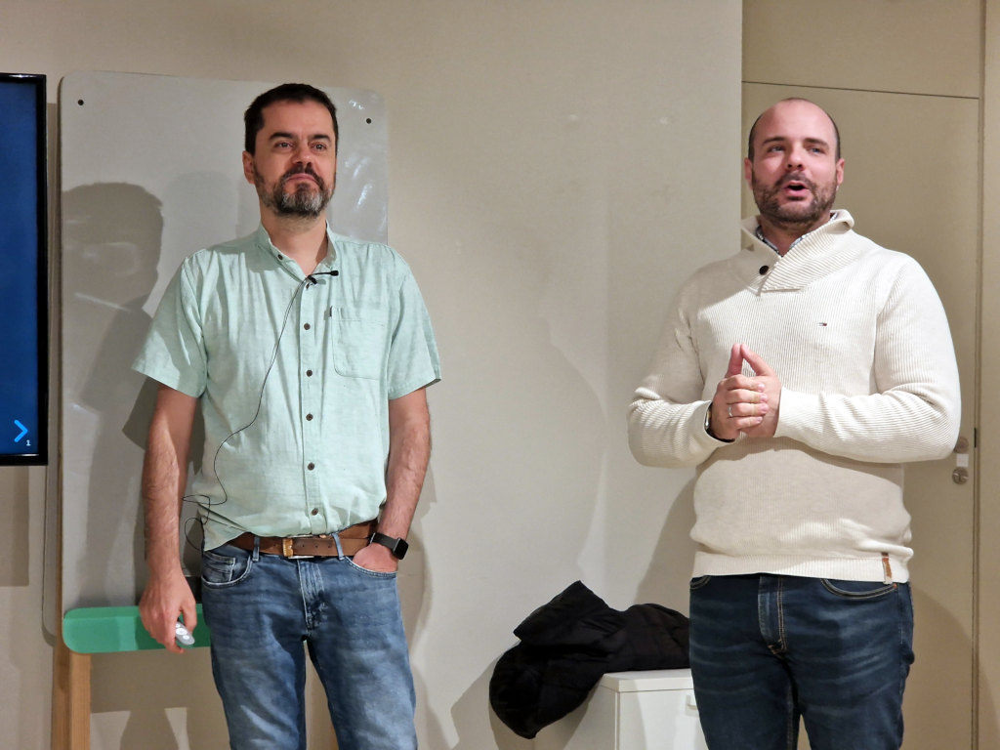

El inicio de año es una buena ocasión para echar la vista atrás sobre el año terminado,
y proponer cambios o mejoras (o simplemente seguir rumbo) para el año que empieza.

## 📋 Repaso de 2023

Antes de nada vamos a repasar los
[objetivos del año pasado](/2023/propositos-2023#objetivos-para-2023)
Tenemos dos categorías, las clásicas de
éxito
y
fracaso.

### 🧑‍🏭 Laboral

> El primer objetivo es **conseguir financiación para Ntrde**,
> para tener un entorno estable durante 18 meses.

Empezamos con un
fracaso
sin paliativos:
tras conseguir esquivar a todos los fondos que querían hundirnos en billetes,
acabé partiendo peras con mis ex-socios.

Por otra parte la cosa no ha ido tan mal:
tras una [agotadora búsqueda](https://pinchito.es/2023/job-search)
encontré trabajo como individual contributor en Tinybird,
cosa que me apetecía bastante.
Así que no me puedo quejar.

### 👐 Comunidad

> En este apartado he vuelto a enviar unas cuantas propuestas,
> y me conformo con **hacer charlas ocasionales**,
> una por trimestre como mínimo.

Lo podemos contar como
éxito a medias:
hice una charla explorando
[qué tal programa la naturaleza](https://t3chfest.es/2023/en/programa/que-tal-programa-la-naturaleza/)
en T3chFest,
hablando sobre programación y código genético.
También he hecho alguna charla en Node.js Madrid
sobre [pruebas de carga con loadtest](https://www.meetup.com/es-ES/node-js-madrid/events/296058888/),

> También me gustaría **seguir escribiendo artículos en éste mi blog personal**.

De nuevo lo contaremos como
he publicado 8 entradas en 2022,
y he conseguido cerrar la [serie sobre bacterias](/2021/bacterias-maquinas).
Ahora amenazo seguir publicando artículos sobre física y biología,
pese a su escasa repercusión tuitera.

### 👐 Comunidad

> me conformo con
> **seguir haciendo eventos de vez en cuando**,
> sea online o presencial o lo que se pueda.

Me temo que en JavaScript beers hemos perdido un poco de fuelle,
básicamente porque no tenemos más gente en la lista para entrevistar.
Pese a eso, lo contaré como
éxito
gracias a la vaguedad del objetivo:
durante la última reunión de [AlmeriaJS](https://www.meetup.com/es-ES/almeriajs/events/290438785/)
me lo pasé muy bien.

> Estaría bien **aumentar mi presencia** en otras plataformas,
> aunque pueda resultar complicado.

Aquí podemos contar con un
fracaso
bastante predecible.
Tengo un podcast pendiente por ahí pero poca cosa más.
También colaboré un poco con Carlos Blé con su nuevo libro
[Código sostenible](https://savvily.es/libros/codigo-sostenible/),
muy interesante y que haríamos bien todos en leer.

### 🎨 Artístico

> Me gustaría **seguir dibujando** bajo la experta tutela de mi profesor online
> [Arturo Martín Burgos](http://www.arturomartinburgos.com/).

Este objetivo ha sido un rotundo
fracaso,
ya que perdí las ganas de seguir dibujando por algún motivo que desconozco.
Creo que algunos lo llaman "inspiración".

> También quiero **presentarme a algún concurso de pintura rápida**.

De nuevo un completo
fracaso.
Este área no ha sido muy afortunada.

### 📊 Resumen

Con tres éxitos
y tres fracasos ha sido un año equilibrado.

## 🎯 Objetivos para 2024

Este año seremos todavía más concisos y parcos.
Los nuevos propósitos aparecen **en negrita**.

### 🧑‍🏭 Laboral

El primer objetivo es **conseguir financiación para Ntrde**,
para tener un entorno estable durante 18 meses.
Se trata de un SaaS vertical para la industria química,
y como tal no es un producto que se pueda hacer en unos meses
ni que pueda levantarse tirando de sus propios cordones.
De ahí que necesitemos levantar una inversión considerable para tener posibilidades de éxito;
el momento no es el mejor, pero haremos lo que podamos.

### 👐 Comunidad

En este apartado he vuelto a enviar unas cuantas propuestas,
y me conformo con **hacer charlas ocasionales**,
una por trimestre como mínimo.

Si te apetece que nos veamos en tu comunidad,
en remoto o en persona,
sólo tienes que decírmelo.

### 🎨 Artístico

Espero volver a tener ¿inspiración? para dibujar,
de paso **probando nuevas técnicas**.
No es que domine las anteriores,
pero siempre está bien variar de vez en cuando.

## 🤔 Conclusión

Este año 2024 sólo tengo tres objetivos.
¿Cuántos saldrán bien?
¡Nos vemos en 2024 para contrastarlo!

