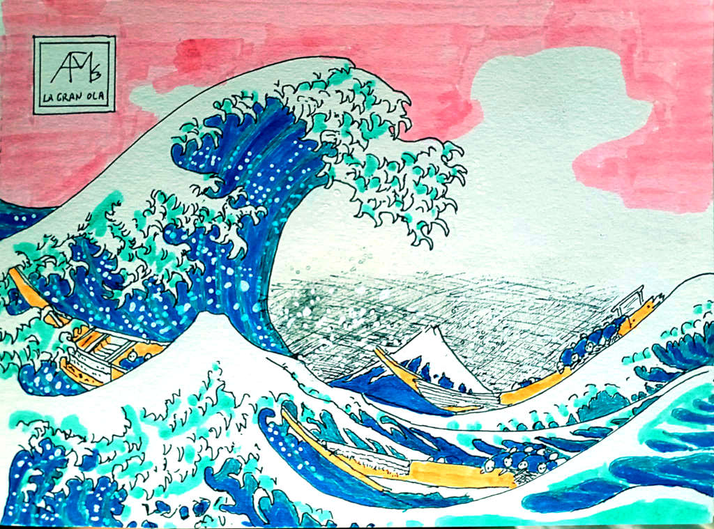
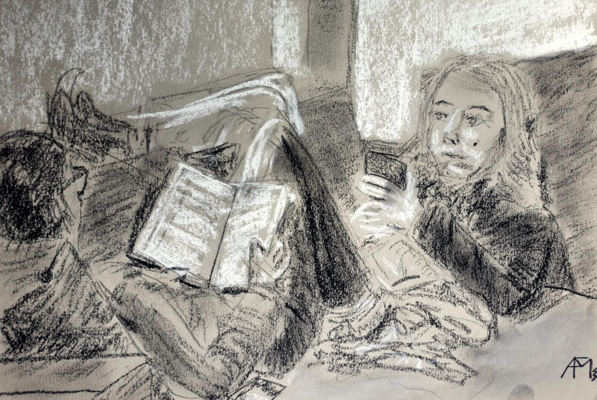

El inicio de año es una buena ocasión para echar la vista atrás sobre el año terminado,
y proponer cambios o mejoras (o simplemente seguir rumbo) para el año que empieza.

## 📋 Repaso de 2023

Antes de nada vamos a repasar los
[objetivos del año pasado](/2023/propositos-2023#objetivos-para-2023)
Tenemos dos categorías, las clásicas de
éxito
y
fracaso.

### 🧑‍🏭 Laboral

> El primer objetivo es **conseguir financiación para Ntrde**,
> para tener un entorno estable durante 18 meses.

Empezamos con un
fracaso
sin paliativos:
tras conseguir esquivar a todos los fondos que querían hundirnos en billetes,
acabé partiendo peras con mis ex-socios.

Por otra parte la cosa no ha ido tan mal:
tras una [agotadora búsqueda](https://pinchito.es/2023/job-search)
encontré trabajo como individual contributor en Tinybird,
cosa que me apetecía bastante.
Así que no me puedo quejar.

### 👐 Comunidad

> En este apartado he vuelto a enviar unas cuantas propuestas,
> y me conformo con **hacer charlas ocasionales**,
> una por trimestre como mínimo.

Lo podemos contar como
éxito a medias:
hice una charla explorando
[qué tal programa la naturaleza](https://t3chfest.es/2023/en/programa/que-tal-programa-la-naturaleza/)
en T3chFest,
hablando sobre programación y código genético.
También he hecho alguna charla en Node.js Madrid
sobre [pruebas de carga con loadtest](https://www.meetup.com/es-ES/node-js-madrid/events/296058888/),
que repetí en [AlmeríaJS hace unos días](https://www.meetup.com/es-ES/almeriajs/events/298010632/).

También he vuelto a hacer una edición actualizada del
[curso de escalabilidad](https://pinchito.es/2020/curso-escalabilidad-2).

Fuera de carta he publicado once artículos en el blog,
que no está nada mal.
Durante el tiempo de la búsqueda de empleo he actualizado
[mi proyecto loadtest](https://github.com/alexfernandez/loadtest),
que falta le hacía.
También pude hacer realidad
[el proyecto de analytics LibreCounter](https://librecounter.org/),
con el que he conseguido quitar todo rastro de Google Analytics de este blog,
y de paso eliminar el pesado aviso de cookies.
Este proyecto está disponible para usar en cualquier web donde se necesiten analíticas básicas.

Sobre redes sociales:
echo mucho de menos mi [Twitter técnico](https://twitter.com/pinchito):
la mayoría de cuentas que seguía se han desinflado,
y falta mucho en [Mastodon](https://mastodon.social/@pinchito)
para llegar al mismo nivel.
No digamos en BlueSky que está flojísimo.
La cosa está tan mal que [LinkedIn](https://www.linkedin.com/in/pinchito/)
empieza a parecer atractivo para contenido técnico.

### 🎨 Artístico

> Espero volver a tener ¿inspiración? para dibujar,
> de paso **probando nuevas técnicas**.
> No es que domine las anteriores,
> pero siempre está bien variar de vez en cuando.

Gracias a los ánimos de mi profesor
[Arturo Martín Burgos](http://www.arturomartinburgos.com/)
he vuelto a hacer dibujos de vez en cuando.
Sobre nuevas técnicas, he estado interpretando dibujos del gran maestro japonés Hokusai,
como en esta versión de La Gran Ola que abre este artículo.

Así que lo contamos como
¡éxito sin palitivos!

### 📊 Resumen

Llegamos al final de 2023 con dos éxitos
y un fracaso, similar a 2022.
Fuera de carta no puedo quejarme:
repasando las fotos del año veo una mañana pilotando un avión en "piloto por un día",
grandes conciertos de Tomatito y Ron Carter,
y reencuentros con bastantes viejos amigos.
En el lado más personal todavía está reciente la
[ausencia de mi padre](https://pinchito.es/2023/una-vida-sin-fisuras).

!](pics/propositos-ferrallas-movidas.jpg "Fran y Carlos ")

## 🎯 Objetivos para 2024

Este año nos propondremos algunos objetivos alcanzables.
Los nuevos propósitos aparecen **en negrita**.

### 🧑‍🏭 Laboral

El primer objetivo es **conseguir financiación para Ntrde**,
para tener un entorno estable durante 18 meses.
Se trata de un SaaS vertical para la industria química,
y como tal no es un producto que se pueda hacer en unos meses
ni que pueda levantarse tirando de sus propios cordones.
De ahí que necesitemos levantar una inversión considerable para tener posibilidades de éxito;
el momento no es el mejor, pero haremos lo que podamos.

### 👐 Comunidad

Tengo ideas para un par de charlas nuevas,
y de nuevo me propongo **dar una charla al trimestre** como mínimo.
Si te gustaría que nos veamos en tu comunidad,
en remoto o en persona,
sólo tienes que decírmelo.

También quiero **sacar adelante los proyectos de software libre**.
En particular, creo que [LibreCounter](https://librecounter.org/)
puede tener bastante recorrido,
y ser útil a distintas comunidades _open source_.

### 🎨 Artístico

Seguir dibujando es 

### 🏃 Esportiú

Tras la lamentable temática sobre Star Wars de la San Silvestre de Almería este año,
espero no dejar el entrenamiento y **correr 5 km todos los fines de semana**.
De esa forma espero que se haga menos cuesta arriba la preparación para el año que viene.

## 🤔 Conclusión

Este año 2024 tengo cinco objetivos.
¿Cuántos conseguiremos sacar adelante?
¡Nos vemos en 2025 para contrastarlo!

