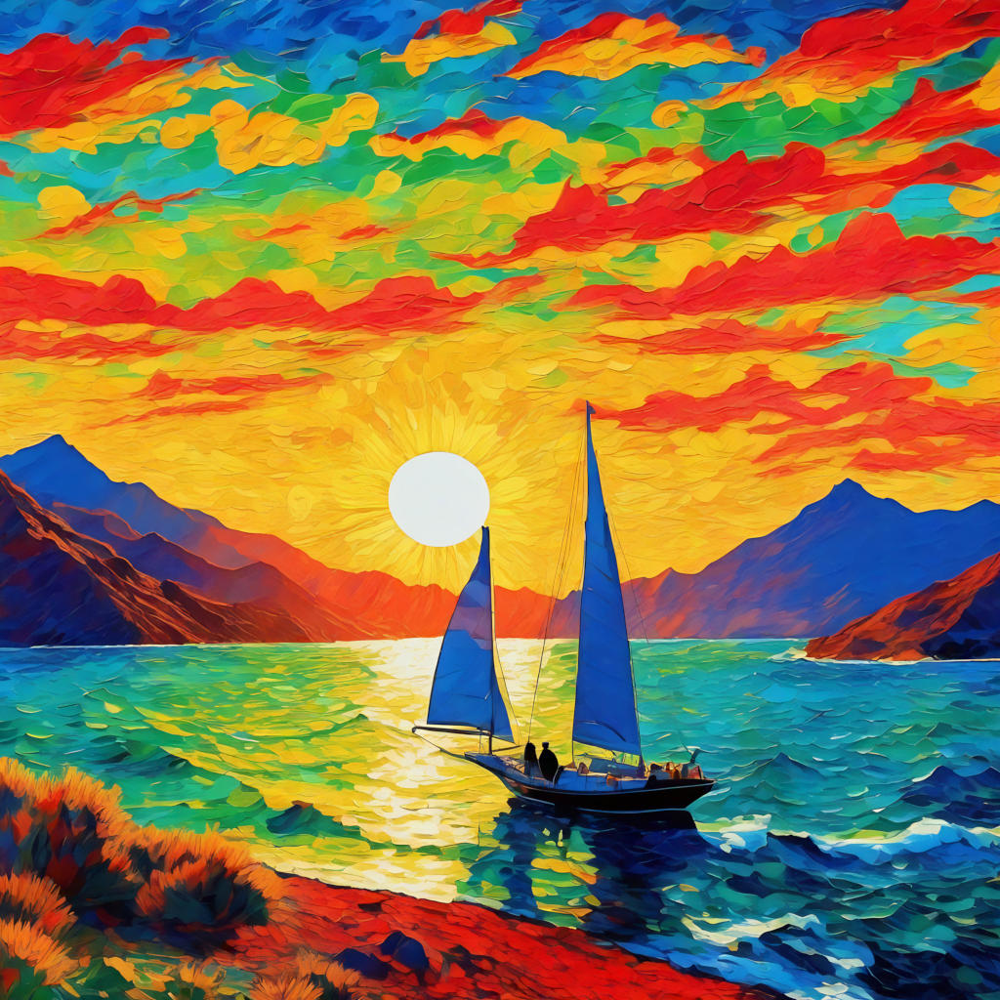

Art in our time may look like a bleak endeavor:
in an era of oversupply and saturation, isn't everything said and done?
And in case it wasn't enough,
armed with artificial intelligence (AI) and large language models (LLMs)
the machines seem to be copying everything well enough;
what place is left for the fledging artist?
There is hope, my human friends!
Read on.

# 📖 A Brief Definition

If you are like me, you may be thinking at this point:
"But, what can be considered art in this day and age?"
Let us start by establishing this working definition:

> Art is any activity that intentionally transmits emotions among humans.

If you don't trust me,
and honestly I cannot see why you should, let's consult other sources.
The Cambridge dictionary defines [art](https://dictionary.cambridge.org/dictionary/english/art) as, among other things:

> the making of objects, images, music, etc. that are beautiful or that express feelings.

while The Britannica Dictionary [says](https://www.britannica.com/dictionary/art):

> something that is created with imagination and skill and that is beautiful or that expresses important ideas or feelings.

Let's go with our simpler statement and see where it takes us.
It is easy to see that acting (as seen in theater and movies) falls under this definition:
practitioners display a range of emotions which, when properly done, will carry over to the audience.
Other forms of art may not rely on direct empathy and therefore they are less immediate,
but they have in common that they stir something inside us.

## Transmitted Emotions

Feelings transmitted by art do not need to be profound:
works that depict still life or daily routines can be awesome.
Sometimes they may just be aesthetically pleasing,
which is certainly a feeling that we share when contemplating them.
These works do not need to be doing anything else.

.](pics/on-art-vieja-friendo-huevos.jpg "An old lady is frying eggs while a boy looks to the side. Deep _chiaroscuro_ in this beautiful painting.")

This aspect of aesthetic pleasure deserves some comment.
While a sunset can be beautiful and generate strong emotions (such as peacefulness, serenity, beauty),
it is not in itself artistic:
there is no transmission of emotions as we are just reacting to Nature.
A depiction of the same sunset in a painting or a photography however becomes artistic,
as those emotions are now transmitted from the person that feels them in the first place to the spectators.
Such second-hand feelings become embedded in those works.

There are also very complex sentiments that can be transmitted using art.
That feeling you get when you are broke and looking at expensive things,
the sensation of being watched over by a benevolent god-like entity that doesn't care about you,
the inexplicable anguish we get when we see something irreparable that isn't even our fault.
Complex story-telling is but one way of transmitting such sophisticated emotions;
some really good works of art can do it with seemingly unrelated elements,
like musical chord sequences or an [assemblage](https://en.wikipedia.org/wiki/Assemblage_(art)).

## Intentionality

A quick note on intention:
in order to qualify as art, the artist has to _want_ to transmit a certain emotion.
If someone is just sad and watching them makes other people feel sad,
or if an artist wants to transmit one thing but then conveys another,
then it falls out of scope.
For instance, a movie director might want to create a work of horror and science fiction,
but accidentally make the audience feel vicarious shame and laugh at it.

.](pics/on-art-plan-9.jpg "Poster for the movie 'Plan 9 from Outer Space', showing the title in bold red letters. Also in red a masculine protagonist and Vampira, a vampire lady. In the background are figher jets, grave diggers and some kind of crazy scientist. Most of these things do not appear in the movie at all, honestly.")

Many human activities make us feel emotions.
For instance a well designed and written software program may fill us with joy.
But when its intent is mainly functional we will not consider it "a work of art".
It is possible to write code with the purpose of making it beautiful,
and in this case we may well consider it artistic.

## Arts and Techniques

Speaking about purpose: the intention of many works of art across history has been simply to be a vehicle so artists can show their craft.
In painting this often goes under the guise of depicting reality.
"Look what awesome drawings I can do", Raffaello seems to be saying in this
stunning study of two male figures he sent to Albrecht Dürer.

.](pics/on-art-raphael-nude-studies.jpg "Studies of two nude male figures drawn in red chalk.")

The text in the drawing, presumably written by Dürer, [actually says](https://e-arthistory5.blogspot.com/2017/10/raphael-and-durer.html) as translated by David Handforth:

> 1515: Raphael of Urbino, who is so highly regarded by the Pope, asserts that he has made this nude drawing and sent it to Albrecht Duerer at Nuernberg in order to demonstrate to him his skill.

Confusingly, the [latin word _ars_](https://en.wiktionary.org/wiki/ars) means: "art, skill, craft, handicraft".
We see this meaning today in phrases as "the art of...",
often used to teach a trade or method which has no relation to any emotions.
Should we also consider this aspect of "art" as "skill"?

We will stick to our definition.
Great art is supposed to not just depict reality,
but convey strong emotions.
Then why are skills important?
Good technique often eases the transmission of feelings.
Acting might be the most basic profession where you can just express a sentiment and rely on empathy,
and reaching across to the audience still requires lots of talent and preparation.
If nothing else, skill is needed to create works of beauty.

# The Miracle of Art

The mere fact that feelings can be transmitted among humans is a miracle.
To the best of my knowledge my mind is a squishy mass enclosed in a bone cage,
that gets all its inputs from a bunch of wet cables.
Can it be that all outside things are just an illusion,
and that I exist in isolation imagining everything else?
This fantasy has been [paradoxically shared since the times of Ancient Greece](https://en.wikipedia.org/wiki/Solipsism#History).
A few centuries later Descartes hypothesized that there might be a
[malicious demon](https://en.wikipedia.org/wiki/Evil_demon) feeding him all perceptions,
to which there was hardly any escape.
The modern version would be that we live in a [computer simulation](https://pinchito.es/2021/understanding-simulation).
In any of these scenarios the transmission of feelings would be nonsensical as there is nobody else to receive them.

 via [Wikimedia](https://commons.wikimedia.org/wiki/File:Human_brain_in_a_vat.jpg).](pics/on-art-brain-in-a-vat.jpg "A human brain in a jar of some yellowish liquidto preserve it, with the legend 'Homo' on top and 'D.694.2' at the bottom.")

Let's suppose that we somehow live in the world that we perceive.
What we observe is that many humans can easily made to react in a similar way to the same stimulus.
At a comedic monologue almost everyone laughs in unison at the same time,
with a comedian's voice as only prompt.
After a good sad movie many people will cry because they can be made to understand the drama.
These are not isolated incidents.

But if we think about it, it is a miracle that this happens at all.
We all have different experiences and backgrounds.
What is sad to some can be enlightening to others.
Even the experience of a color is mediated by different relations between concepts.
As I have explored in [The Amazing Mind](https://pinchito.es/2016/the-amazing-mind#my-blue-and-your-blue),
my "blue" is not your "blue" and they can never be equal:
we don't have the exact same concepts or relationships in our brains.

How can works of art jump the chasm across brains and reach our inner emotions?
We might advance some evolutionary explanation about how shared feelings can be good for our survival as a species,
but this naïve sciency babbling can offer at most some superficial comfort.
I prefer to just marvel at the fact that this happens at all.
Even in our era of hyper-saturation and deep cynicism we still carry open wounds that can sometimes be activated by raw emotions.
For our sake as humans, let us hope it continues to be so.

# Artificial "Art"

Today the field of AI is full of very sophisticated generative models that can create complex images and even videos in seconds.
But are they really artistic?
Our definition makes it clear that any works generated by AI are not really, and can never be, art:
they cannot transmit emotions, as computers cannot be made to have feelings;
at least at this point in time.
Even the most ardent proponents of an AI future cannot get over this basic fact.

LLMs and generative models are at their core just probabilistic generators.
The fact that our emotional machinery can be tricked by them is no wonder,
as they are built to statistically replicate our works of art.
But they are often repetitive, bland and lack depth.
However, humans can refine the input and filter the output of generative models until they find those that are effective in conveying emotion.
It would not be so different from a photographer picking the right perspective and angle to capture a beautiful sunset.

How can modern artists thrive with such faithful generators?
The extrapolation powers of generative models are in fact quite limited.
The challenge can be seen as the creation of works that AI cannot replicate,
either because they are innovative or too far out.

But I will venture to go against the grain:
I believe that innovation is not really the point.
If we stick to principle we can say that the challenge continues to be,
as always has been,
to stir emotions inside people.
And this can be done most effectively when the artist is feeling these emotions.

## Algorithmic Art

A work being generated by a computer does not mean that it cannot transmit feelings.
Artists can use algorithms to find and replicate sequences that create beautiful music, for instance.
They can also create beautiful patterns with a few lines of code,
or with some basic programming.
In these cases it is the person behind the program
(or the controls, or the algorithms)
that is doing the transmission.

, used with permission.](pics/on-art-design.jpg "Spirals in yellow, pink and black overlapping, composed of many thin lines, displaying beautiful moiré patterns.")

The code to generate the figure above can be found [on Casa Cactus](https://generative.casacactus.es/index8.html).
They have also published [a few other experiments](https://generative.casacactus.es/).

# Some Advice

At this point we are ready to extract some lessons.
An artist should always **focus on creating feelings**.
Technique, style, story telling, are all means to an end.
To achieve this you should learn to feel things yourself.
Keep in mind that raw emotions are hard,
and the process of exposing them is even harder.

It doesn't matter that everything has been said 1000 times;
audiences can still feel the anguish when watching a modern performance of
[_Oedipus Rex_](https://en.wikipedia.org/wiki/Oedipus_Rex),
premiered almost 2500 years ago.
Spoilers ahead:
everyone remembers that Oedipus killed his own father and slept with his own mother,
but it is indeed the first preserved thriller.
We follow the crime investigation where he tries to find the killer of his predecessor as king,
only to learn that Oedipus himself was the killer and that the guy was his father.
The theme of the hero that turns out to be the killer is used in (more spoilers)
[these ten movies](https://screenrant.com/great-movies-hero-killer-all-along/):
apparently every generation has to rediscover the story.

.](pics/on-art-oedipus-rex.jpg "A man with bloody eyes is on top of the palace stairs, surrounded by columns. A crowd dressed in tunics is in disarray below. A veritable tragedy.")

A singer that transmits their emotions in a live performance does not need perfect pitch,
autotune or a hundred synthesizers.
On the other hand audiences tend to get bored and require some degree of novelty too,
and there are fashions in art which can make feelings more powerful.
Alternatively, not keeping up with trends can make audiences disengage.

## Result not Process

Established processes to create impactful art are too prone to fall into the mindless formula,
like TV movies or elevator music:
bland feelings at best, poor execution at worst.
Instead you should focus on the result and work backwards from there.
If you have something to express look for the most effective way of achieving it.

There are no cheap emotions,
although there are shortcuts to express them which make them feel cheap.
People like to think they have earned their right to their feelings.
Just putting things out there is not enough:
as we have seen skill and technique are crucial to deliver properly.

## Art and Style

Each artist has their own personal way of creating their works.
It serves as a kind of signature.
Style is not necessarily important for the transmission of feelings, though.
Some artists even make a point of being able to switch their ways freely.

While a personal imprint can be nice, it can also get in the way.
Actors sometimes complain that they are typecast in a kind of role, for instance.
The same can happen to many other artists if they specialize too much.
Artistic coherence is nice, but evolution as an artist may also require modifying your style.

.](pics/on-art-bosch-saint-john.jpg "")

To the point that style is unavoidable, just embrace it.
But it can be worth your time to venture out of your own personality.
For many artists their egos can become a problem:
for some reason, staying in touch with your inner feelings and being able to project them to others
make people believe they are more important than the rest.
Being able to keep your ego within checks is a valuable asset in your career.

## Caveats

I don't have any particular credentials to speak about art,
other than I like to experience and enjoy it.
Sometimes I even create art in my own _dilettante_ fashion, like drawings or music,
never very good to be honest.
I also like thinking hard about things that I find interesting,
and don't think that we should be limited to give our opinion on matters outside our experience.

On the other hand it is usually more interesting to listen to experts.
I just think that in this area the artists themselves are too lost in the process,
and do not try to derive their advice from first principles.
That is why I started with a very simple premise:

> Art is any activity that intentionally transmits emotions among humans.

And worked my way from there.
In any case, take my advice with a grain of salt.

# 🤔 Conclusion

Learn how to transmit feelings.
It is useful in many ways of life;
to artists it is essential.

There is an open question about which venues does the modern artist have to express themselves,
but this piece is already long enough.
This crucial matter will be elucidated in a later article.

## 🙏 Acknowledgements

Thanks to Rafael Molina for access to his works of AI-generated art, in particular the wonderful "Almería 1".

Thanks to Pablo and Mapi from Casa Cactus for letting me use their wonderful computer-generated designs.

Thanks to my daughter Lucía for the inspiration to write this article,
and the many interesting conversations we have had about the topic of art.

Thanks to Arturo Martín Burgos for the many conversations about art,
and for trying so hard to get me to understand abstract paintings.

